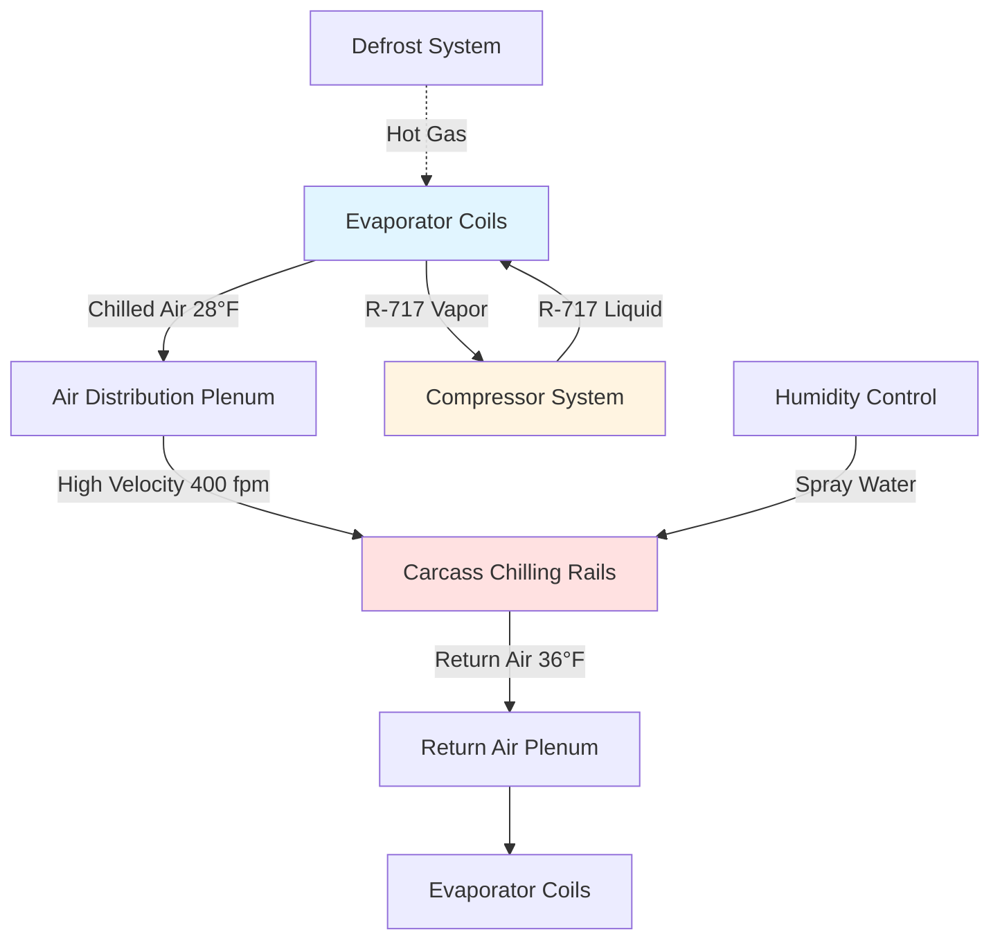

## Overview

Pork chilling represents one of the most thermally demanding processes in meat processing facilities. The rapid removal of animal heat from freshly slaughtered carcasses requires precise temperature control to prevent microbial growth while avoiding quality defects such as cold shortening or excessive moisture loss. The target is to reduce deep tissue temperature from approximately 102°F (39°C) to below 40°F (4.4°C) within 24 hours while maintaining surface temperatures above 32°F (0°C) to prevent freezing.

The refrigeration load consists of three primary components: removal of animal metabolic heat, reduction of sensible heat to chill temperature, and continuous removal of heat infiltration from the facility. A 200-pound (91 kg) pork carcass releases approximately 30,000 BTU (31.6 MJ) during the complete chilling cycle, demanding substantial refrigeration capacity in high-throughput operations.

## Heat Transfer Fundamentals

### Cooling Load Calculation

The total refrigeration load for pork chilling combines multiple heat sources:

$$Q_{total} = Q_{product} + Q_{respiration} + Q_{infiltration} + Q_{equipment} + Q_{personnel}$$

The product cooling load dominates and consists of:

$$Q_{product} = m \cdot c_p \cdot \Delta T + m \cdot h_{respiration}$$

Where:
- m = mass flow rate of product (lb/hr or kg/hr)
- c_p = specific heat of pork (0.70 BTU/lb·°F above freezing)
- ΔT = temperature differential (initial - final)
- h_respiration = residual metabolic heat (typically 15-20 BTU/lb in first 6 hours)

For a facility processing 500 hogs per hour at 200 lb average hot weight:

$$Q_{product} = 500 \times 200 \times 0.70 \times (102-40) + 500 \times 200 \times 18$$

$$Q_{product} = 4,340,000 + 1,800,000 = 6,140,000 \text{ BTU/hr} = 512 \text{ tons}$$

### Heat Transfer Mechanisms

Pork chilling occurs through three simultaneous mechanisms:

**Convection (Dominant):** Heat transfer from carcass surface to circulating air, governed by:

$$q_{conv} = h \cdot A \cdot (T_{surface} - T_{air})$$

The convective heat transfer coefficient (h) for pork carcasses typically ranges from 2-6 BTU/hr·ft²·°F depending on air velocity, with higher values at air speeds above 300 fpm.

**Conduction (Internal):** Heat transfer from muscle core to surface follows Fourier's law:

$$q_{cond} = -k \cdot A \cdot \frac{dT}{dx}$$

Pork thermal conductivity (k) averages 0.30 BTU/hr·ft·°F, creating significant thermal lag between surface and deep tissue temperatures.

**Evaporation (Surface):** Water vapor removal from carcass surface provides supplemental cooling:

$$q_{evap} = \dot{m}_{water} \cdot h_{fg}$$

Where h_fg = 1,050 BTU/lb at typical chilling conditions.

## Chilling Methods Comparison

| Method | Air Temp (°F) | Air Velocity (fpm) | Time to 40°F | Weight Loss | Capital Cost |
|--------|---------------|-------------------|--------------|-------------|--------------|
| Conventional | 28-32 | 50-150 | 18-24 hr | 1.8-2.2% | Baseline |
| Blast Chilling | 20-28 | 300-500 | 12-16 hr | 2.0-2.5% | +25% |
| Spray Chilling | 28-32 | 100-200 | 18-24 hr | 0.5-1.0% | +15% |
| CO₂ Chilling | -109 (surface) | Varies | 2-4 hr | 1.5-2.0% | +60% |

## System Design Configuration

### Evaporator Selection

Chiller evaporators must balance heat removal with humidity control. Key design parameters include:

**Temperature Differential:** TD between refrigerant and air typically ranges from 8-12°F. Smaller TD reduces carcass dehydration but requires larger coil surface area:

$$A_{coil} = \frac{Q}{U \cdot TD}$$

For U = 15 BTU/hr·ft²·°F (forced draft coil) and TD = 10°F:

$$A_{coil} = \frac{6,140,000}{15 \times 10} = 40,933 \text{ ft}^2$$

**Fin Spacing:** Closer fin spacing (4-6 per inch) increases capacity but accelerates frost accumulation, requiring more frequent defrost cycles that interrupt chilling.

**Air Throw:** Distribution systems must deliver uniform air velocity across all carcass positions. Undersized ductwork creates velocity decay:

$$v_2 = v_1 \cdot \frac{A_1}{A_2}$$

## Refrigeration System Requirements

### Compressor Capacity

ASHRAE Refrigeration Handbook recommends oversizing compressor capacity by 15-20% above calculated load to accommodate:
- Peak loads during initial product entry
- Defrost recovery periods
- Ambient temperature extremes
- Future capacity expansion

For the 512-ton calculated load, install 600-650 tons of compression capacity distributed across multiple compressors for operational flexibility.

### Refrigerant Selection

| Refrigerant | Evap Temp (°F) | Discharge Temp (°F) | Efficiency (kW/ton) | Safety Group | Status |
|-------------|----------------|---------------------|---------------------|--------------|--------|
| R-717 (NH₃) | 15 | 185 | 0.75 | B2L | Preferred |
| R-404A | 15 | 165 | 0.95 | A1 | Phasedown |
| R-448A | 15 | 150 | 0.88 | A1 | Acceptable |
| R-744 (CO₂) | 15 | 95 | 0.82 | A1 | Growing |

Ammonia dominates large pork processing facilities due to superior thermodynamic efficiency, zero global warming potential, and leak detection characteristics, despite higher safety requirements.

## Air Distribution Strategy

Proper air circulation prevents temperature stratification and ensures uniform chilling. Design considerations include:

**Air Changes:** Maintain 20-30 air changes per hour in carcass coolers. For a 50,000 ft³ cooler:

$$CFM = \frac{50,000 \times 25}{60} = 20,833 \text{ CFM}$$

**Velocity Profile:** Target 300-500 fpm at carcass level with laminar flow parallel to carcass length. Turbulent cross-flow increases evaporative losses.

**Temperature Uniformity:** Limit temperature variation to ±2°F throughout cooler space. Install measurement points at inlet, center, and discharge locations along rail path.

## Spray Chilling Systems

Spray chilling applies fine water mist to carcass surfaces, utilizing evaporative cooling to reduce weight loss from 2% to below 1% while maintaining equivalent chilling rates. The latent heat of water vaporization (1,050 BTU/lb) provides significant cooling effect.

System design parameters:

- Water temperature: 34-38°F
- Droplet size: 50-150 microns
- Application cycles: 12-20 seconds every 15-30 minutes
- Total water application: 3-5% of carcass weight

Spray chilling increases refrigeration load by approximately 8% due to added moisture but recovers cost through reduced product shrinkage. The net cooling from applied water:

$$Q_{spray} = m_{water} \cdot [c_p \cdot (T_{carcass} - T_{water}) + h_{fg}]$$

## USDA Regulatory Requirements

FSIS regulations (9 CFR 318) mandate specific chilling performance:

- Internal temperature must reach 40°F or below within 24 hours
- Continuous temperature monitoring and recording required
- Carcass spacing minimum 2 inches between sides
- Prevention of condensation drip onto product
- Sanitary design of all product-contact surfaces

## Control System Integration

Modern pork chilling operations employ sophisticated controls:

**Staged Cooling:** Initial blast at 20-25°F for 4-6 hours followed by tempering at 30-34°F reduces cold shortening while maintaining microbial control.

**Variable Frequency Drives:** VFDs on evaporator fans modulate air velocity based on product temperature differential, reducing energy consumption by 20-30% during latter chilling stages.

**Predictive Defrost:** Pressure differential sensors across evaporator coils trigger defrost cycles based on actual frost accumulation rather than fixed time schedules, minimizing production interruption.

## Energy Efficiency Optimization

Chilling energy consumption typically represents 40-50% of total plant refrigeration load. Efficiency improvements include:

- Evaporative condensers reducing condensing temperature by 10-15°F
- Heat recovery from compressor oil cooling and desuperheating
- LED lighting reducing internal heat load by 60% versus fluorescent
- Insulated rapid-roll doors minimizing infiltration during carcass transfer
- Thermal storage systems shifting electrical demand to off-peak periods

The coefficient of performance for well-designed ammonia systems at these operating conditions:

$$COP = \frac{Q_{evap}}{W_{comp}} = \frac{h_1 - h_4}{h_2 - h_1}$$

Typical values range from 3.5-4.2, equivalent to 0.70-0.85 kW/ton.

---

**Related Topics:**
- Beef Chilling Systems
- Blast Freezing Technology
- Ammonia Refrigeration Safety
- Meat Processing Facility Design
- HACCP Temperature Control
