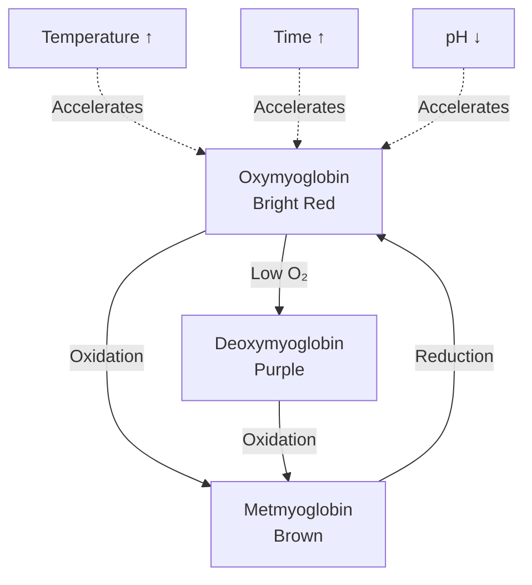
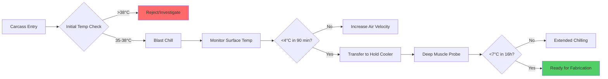

## Overview

Temperature control in pork processing facilities requires more stringent management than many other meat products due to pork's susceptibility to lipid oxidation, color degradation, and rapid bacterial proliferation. The high unsaturated fatty acid content in pork tissue creates unique thermal management challenges that directly impact product safety, shelf life, and quality attributes.

## Bacterial Growth Kinetics and Temperature

Bacterial growth in pork tissue follows predictable exponential kinetics governed by the Arrhenius equation. The generation time for mesophilic pathogens doubles approximately every 10°C temperature increase, making temperature abuse particularly hazardous.

The relationship between temperature and bacterial growth rate is expressed as:

$$
\mu = \mu_{ref} \cdot e^{-\frac{E_a}{R}\left(\frac{1}{T} - \frac{1}{T_{ref}}\right)}
$$

where:
- $\mu$ = specific growth rate (h⁻¹)
- $\mu_{ref}$ = reference growth rate at reference temperature
- $E_a$ = activation energy (typically 60-80 kJ/mol for pathogens)
- $R$ = universal gas constant (8.314 J/mol·K)
- $T$ = absolute temperature (K)
- $T_{ref}$ = reference temperature (K)

This equation demonstrates why maintaining pork between -1°C and 2°C is critical. At 4°C, bacterial growth rates increase by 40-60% compared to 0°C. At 10°C, growth accelerates by a factor of 4-6, creating food safety hazards within hours rather than days.

## Critical Temperature Zones

| Process Stage | Temperature Range | Hold Time | Primary Concern |
|---------------|-------------------|-----------|-----------------|
| Hot carcass entry | 35-38°C | Minutes | Rapid cooling initiation |
| Blast chilling | -2 to 0°C air | 2-4 hours | Surface bacterial load |
| Holding cooler | 0-2°C | 24-48 hours | Deep muscle cooling |
| Fabrication room | 7-10°C | 2-4 hours | Worker comfort/safety |
| Post-fabrication | -1 to 2°C | Variable | Extended storage |
| Distribution | ≤4°C | Days to weeks | Cold chain integrity |

## Lipid Oxidation and Temperature Control

Pork contains 45-60% unsaturated fatty acids, making it highly susceptible to oxidative rancidity. The rate of lipid oxidation follows temperature-dependent kinetics described by the Q₁₀ relationship:

$$
\text{Rate}_2 = \text{Rate}_1 \cdot Q_{10}^{\frac{T_2 - T_1}{10}}
$$

For lipid oxidation in pork, Q₁₀ typically ranges from 2.0 to 2.5, meaning oxidation rates double for every 10°C increase. Maintaining storage temperatures at -1°C versus 4°C reduces oxidation rates by approximately 35%, significantly extending color stability and flavor quality.

## Heat Transfer in Pork Chilling

The cooling process for pork carcasses involves three heat transfer mechanisms operating simultaneously:

### Convective Cooling

Surface convection dominates initial cooling and follows Newton's law of cooling:

$$
q_{conv} = h \cdot A \cdot (T_s - T_{\infty})
$$

where:
- $q_{conv}$ = convective heat transfer rate (W)
- $h$ = convective heat transfer coefficient (10-40 W/m²·K for forced air)
- $A$ = surface area (m²)
- $T_s$ = surface temperature (K)
- $T_{\infty}$ = air temperature (K)

### Conductive Heat Transfer

Internal cooling occurs through conduction following Fourier's law:

$$
q_{cond} = -k \cdot A \cdot \frac{dT}{dx}
$$

Pork tissue thermal conductivity varies with temperature and fat content:
- Lean muscle: 0.41-0.48 W/m·K
- Fat tissue: 0.17-0.21 W/m·K
- Bone: 0.22-0.25 W/m·K

The composite nature of pork carcasses creates complex heat transfer pathways, with fat layers acting as thermal insulators that slow deep muscle cooling.

## Refrigeration Load Calculations

Total refrigeration load for pork processing rooms combines multiple heat sources:

$$
Q_{total} = Q_{product} + Q_{infiltration} + Q_{people} + Q_{equipment} + Q_{lights}
$$

### Product Load

The dominant load component is sensible heat removal from warm carcasses:

$$
Q_{product} = \dot{m} \cdot c_p \cdot \Delta T
$$

For a typical pork carcass (90 kg):
- Specific heat: 3.35 kJ/kg·K (above freezing)
- Temperature reduction: 36°C to 2°C
- Cooling time: 24 hours
- Heat removal rate: 391 W per carcass

Respiratory heat from carcasses continues for 6-8 hours post-mortem, adding approximately 20-30 W per carcass during initial chilling.

## Color Stability Mechanisms

Pork color deteriorates rapidly due to myoglobin oxidation to metmyoglobin. The rate of this conversion is temperature-dependent and accelerates dramatically above 4°C.

Maintaining temperatures below 2°C reduces metmyoglobin formation rates by 50-70% compared to 7°C storage, extending display life from 3-4 days to 7-10 days under retail conditions.

## Storage Temperature Requirements

ASHRAE Handbook recommendations for pork storage align with USDA-FSIS requirements but recognize product variability:

| Product Type | Temperature | Relative Humidity | Storage Life |
|--------------|-------------|-------------------|--------------|
| Fresh pork cuts | -1 to 0°C | 85-90% | 7-12 days |
| Ground pork | -1 to 0°C | 85-90% | 3-5 days |
| Cured pork | 0-2°C | 80-85% | 14-21 days |
| Processed products | 0-4°C | 75-85% | Per formulation |
| Frozen pork | -23 to -18°C | 90-95% | 6-9 months |

## Temperature Monitoring and Control Strategy

Modern pork processing facilities employ multi-tiered temperature control systems:

### Control System Requirements

1. Temperature sensors: RTD probes with ±0.1°C accuracy
2. Data logging: Continuous recording at 5-minute intervals minimum
3. Alarm thresholds: ±1°C from setpoint for 15 minutes
4. Backup systems: Redundant refrigeration capacity of 125%

## Evaporator Selection and Air Distribution

Pork chilling rooms require evaporators designed for high latent loads and controlled air movement. Key design parameters:

**Evaporator Temperature Difference (TD):**
- Blast chilling: 8-12°C TD (aggressive cooling)
- Holding coolers: 4-6°C TD (minimize dehydration)
- Fabrication rooms: 6-8°C TD (balance cooling and humidity)

**Air Velocity Over Product:**
- Initial chilling (0-4 hours): 2.5-4.0 m/s
- Extended chilling (4-24 hours): 0.5-1.5 m/s
- Storage rooms: 0.2-0.5 m/s

Lower air velocities after initial surface chilling reduce weight loss from dehydration while maintaining adequate heat transfer for deep muscle cooling.

## Temperature Abuse Impacts

Even brief temperature excursions create measurable quality degradation. A 2-hour exposure to 15°C during transport can:

- Increase bacterial loads by 0.5-1.0 log CFU/g
- Reduce color display life by 30-40%
- Accelerate lipid oxidation by 3-4 days equivalent aging
- Decrease consumer acceptability scores by 15-25%

The cumulative effect of multiple small temperature abuses throughout the cold chain exceeds the impact of single events, emphasizing the importance of continuous temperature control from slaughter through retail display.

## Psychrometric Considerations

Relative humidity control in pork processing spaces balances competing requirements. High humidity (85-90%) minimizes weight loss but can promote surface bacterial growth and condensation. Low humidity (<75%) increases shrinkage and accelerates color deterioration.

The optimal dew point for pork holding coolers is -2 to 0°C, maintaining the air-to-surface vapor pressure gradient low enough to limit moisture loss while preventing surface frost formation on refrigeration coils that would reduce heat transfer efficiency.

## Energy Efficiency Strategies

Temperature control represents 40-60% of total energy consumption in pork processing facilities. Optimization strategies include:

- Variable speed drive fans matching actual load requirements
- Evaporator pressure regulators maintaining highest acceptable suction pressure
- Heat recovery from compressor discharge for facility hot water
- Thermal mass utilization through strategic product staging
- Demand-based defrost cycles minimizing downtime and energy waste

These strategies maintain critical temperature control while reducing energy intensity from typical 0.35-0.45 kWh/kg to 0.25-0.30 kWh/kg of processed pork.
