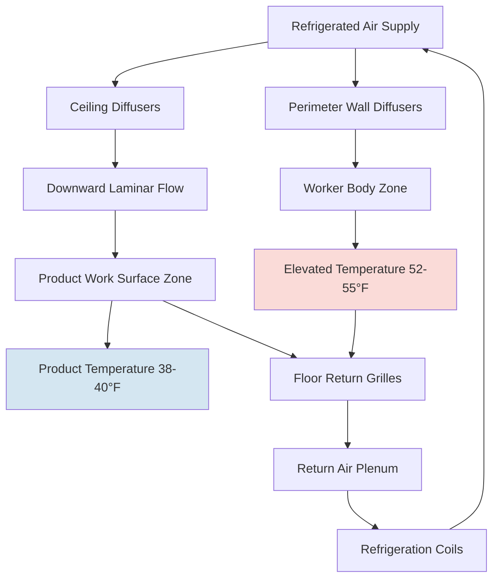
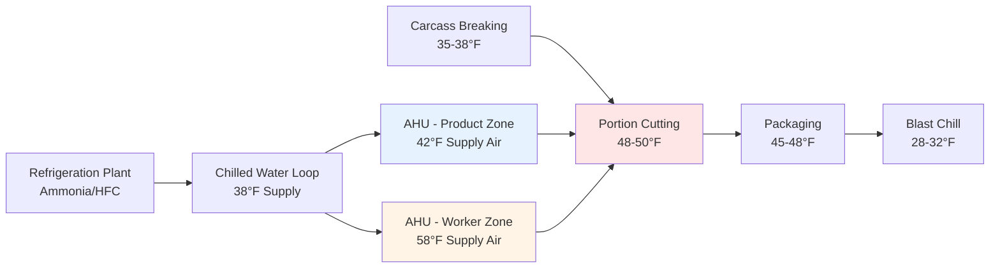

## Overview

Portion cutting rooms present unique HVAC design challenges that balance stringent food safety requirements with worker comfort and productivity. These facilities must maintain temperatures low enough to prevent microbial growth on exposed meat surfaces while remaining warm enough for workers performing detailed manual tasks for extended periods.

The fundamental challenge stems from the conflicting thermal requirements: product safety demands temperatures below 50°F (10°C), while worker comfort typically requires 65-75°F (18-24°C). The design solution involves careful thermal management that creates a controlled microclimate around the product while maintaining acceptable conditions for personnel.

## Temperature Requirements and Control Zones

### USDA FSIS Temperature Standards

USDA FSIS regulations mandate that exposed meat products during processing operations remain at temperatures that prevent pathogen growth. The critical control temperature of 40°F (4.4°C) serves as the benchmark for product safety.

**Temperature compliance framework:**

- **Product surface temperature:** Must not exceed 40°F (4.4°C) for more than 2 hours cumulative time
- **Ambient room temperature:** Typically maintained at 45-50°F (7-10°C)
- **Worker zone temperature:** 50-55°F (10-13°C) achievable through strategic air distribution
- **Equipment temperature:** Cutting tables and conveyors maintained at 38-42°F (3-6°C)

### Heat Load Analysis

The refrigeration load for portion cutting rooms consists of multiple components requiring careful calculation for proper system sizing.

**Total heat load equation:**

$$Q_{total} = Q_{product} + Q_{infiltration} + Q_{occupants} + Q_{equipment} + Q_{lighting} + Q_{transmission}$$

**Product heat load:**

$$Q_{product} = \dot{m}_{product} \times c_p \times (T_{in} - T_{room})$$

Where:
- $\dot{m}_{product}$ = product mass flow rate (lb/hr or kg/hr)
- $c_p$ = specific heat of meat (approximately 0.77 BTU/lb·°F or 3.22 kJ/kg·K above freezing)
- $T_{in}$ = incoming product temperature (typically 34-38°F or 1-3°C)
- $T_{room}$ = room setpoint temperature

**Occupancy heat load:**

Personnel generate significant sensible and latent heat that must be removed. Each worker produces approximately:

$$Q_{occupant} = 450-600 \text{ BTU/hr sensible} + 250-350 \text{ BTU/hr latent}$$

For a cutting room with 20 workers, occupancy alone contributes 14,000-19,000 BTU/hr (4.1-5.6 kW) of cooling load.

## Air Distribution Strategy

Proper air distribution creates thermal zones that protect product integrity while minimizing worker discomfort.

### Design Principles

**Vertical thermal stratification:**

The temperature gradient from ceiling to floor can be utilized beneficially. Cold air supplied from ceiling diffusers descends toward work surfaces, creating a cooler zone at cutting table height (30-36 inches/76-91 cm) while warmer air remains at worker head height (60-72 inches/152-183 cm).

**Air velocity considerations:**

- **Work surface velocity:** 50-75 fpm (0.25-0.38 m/s) to prevent product warming
- **Worker body velocity:** 25-40 fpm (0.13-0.20 m/s) to minimize wind chill
- **Return velocity:** <500 fpm (2.5 m/s) to prevent noise and drafts

The perceived cooling effect on workers follows the wind chill relationship:

$$T_{perceived} = T_{air} - 0.15 \times V_{air}^{0.7}$$

Where $V_{air}$ is in mph. At 50 fpm (0.57 mph), the perceived temperature depression is minimal (<0.5°F).

## System Configuration Comparison

| Configuration | Temperature Control | Energy Efficiency | Worker Comfort | Capital Cost | Maintenance |
|--------------|-------------------|------------------|----------------|--------------|-------------|
| **Single-zone DX** | Moderate | Good | Poor | Low | Low |
| **Dual-zone chilled water** | Excellent | Very good | Good | High | Moderate |
| **Displacement ventilation** | Very good | Excellent | Very good | Very high | Moderate |
| **Overhead radiant cooling** | Good | Good | Excellent | Moderate | Low |
| **Task-area spot cooling** | Excellent | Moderate | Moderate | Moderate | Moderate |

### Single-Zone Direct Expansion System

Traditional approach using packaged rooftop units or split systems with refrigerant coils. The entire room is maintained at a uniform temperature (typically 48-50°F/9-10°C).

**Advantages:**
- Simple installation and controls
- Lower first cost
- Readily available equipment
- Familiar to maintenance personnel

**Limitations:**
- Worker discomfort leads to productivity loss
- Higher personnel clothing requirements
- Difficulty achieving USDA compliance during peak production
- Energy waste cooling entire volume

### Dual-Zone Chilled Water System

Separate air handling units serve product zones and worker zones with independent temperature control.

**Product zone AHU:** Supplies 40-45°F (4-7°C) air at higher velocities to work surfaces

**Worker zone AHU:** Supplies 55-60°F (13-16°C) air at lower velocities to upper room volume

The chilled water system allows precise temperature control through modulating control valves:

$$Q_{coil} = \dot{m}_{water} \times c_{p,water} \times (T_{entering} - T_{leaving})$$

Typical chilled water supply temperature: 38-40°F (3-4°C)

### Displacement Ventilation System

Low-velocity air (30-50 fpm/0.15-0.25 m/s) supplied at floor level rises naturally as it absorbs heat from people and equipment. This creates a cooler breathing zone while maintaining cold conditions at work surfaces.

**Physics principle:**

Buoyancy-driven flow follows the relationship:

$$\Delta P = \rho_{cold} \times g \times h - \rho_{warm} \times g \times h = g \times h \times (\rho_{cold} - \rho_{warm})$$

The density difference drives vertical air movement without mechanical mixing, reducing energy consumption by 20-30% compared to conventional systems.

## Worker Comfort Enhancement

### Personal Protective Equipment Integration

USDA-compliant facilities require specific PPE that affects thermal comfort:

- **Mesh steel gloves:** Provide no insulation
- **Rubber aprons:** Prevent evaporative cooling
- **Hairnets and head coverings:** Increase perceived warmth
- **Rubber boots:** Insulate feet from cold floors

Metabolic heat generation during cutting operations ranges from 300-400 BTU/hr (88-117 W), classified as moderate to heavy work. The combination of low ambient temperature and moderate activity typically results in thermal neutrality when workers wear:

- Insulated coveralls (0.7-1.0 clo)
- Thermal undergarments (0.3-0.5 clo)
- Insulated glove liners under steel mesh (0.2 clo)

### Radiant Heating Supplements

Overhead infrared radiant panels can provide localized heating without affecting air temperature or product safety.

**Radiant heat transfer:**

$$Q_{radiant} = \epsilon \times \sigma \times A \times (T_{source}^4 - T_{receiver}^4)$$

Where:
- $\epsilon$ = emissivity (0.9 for typical panels)
- $\sigma$ = Stefan-Boltzmann constant (5.67×10⁻⁸ W/m²·K⁴)
- $A$ = surface area
- $T$ = absolute temperature (K)

Low-intensity gas-fired or electric radiant panels positioned 10-12 feet (3-3.7 m) above the floor provide warmth to workers' heads and shoulders without warming the product or air temperature significantly.

## Equipment Considerations

### Refrigeration System Selection

**Refrigerant selection criteria:**
- **R-404A:** Traditional choice, being phased out (GWP 3,922)
- **R-448A:** Drop-in replacement (GWP 1,387)
- **R-449A:** Lower GWP alternative (GWP 1,397)
- **Ammonia (R-717):** Industrial standard for large facilities (GWP 0)

**Evaporator coil design:**

Fin spacing must accommodate high moisture loads while maintaining defrost intervals that don't disrupt production:

- **Fin spacing:** 4-6 fins per inch for humid environments
- **Defrost cycles:** Every 6-8 hours using hot gas or electric defrost
- **Drain pan heating:** Prevent ice formation in condensate drains

The evaporator temperature difference (TD) between refrigerant and air affects both capacity and humidity control:

$$TD = T_{air} - T_{refrigerant}$$

Typical TD: 10-12°F (5.6-6.7°C) for adequate moisture removal

### Sanitation-Compatible Design

All HVAC equipment in meat processing areas must comply with USDA sanitation requirements:

**Equipment specifications:**
- Stainless steel construction (300 series minimum)
- Sloped surfaces to prevent water accumulation
- Sealed electrical components (NEMA 4X rating minimum)
- Accessible for daily cleaning
- Resistant to caustic cleaning chemicals (pH 2-12 range)

**Air handling unit requirements:**
- Removable panels for interior cleaning access
- Stainless steel drain pans with continuous slope
- Antimicrobial coil coatings
- Washdown-rated motors and drives

## Process Flow Integration

## Humidity Control

Relative humidity in portion cutting rooms must balance several factors:

**Optimal RH range:** 85-90%

**Psychrometric analysis:**

At 50°F (10°C) and 85% RH:
- Dewpoint temperature: 46.5°F (8.1°C)
- Absolute humidity: 0.0059 lb water/lb dry air (59 grains/lb)

$$\omega = 0.622 \times \frac{P_{vapor}}{P_{atmospheric} - P_{vapor}}$$

High humidity prevents product moisture loss (reducing shrink) but increases surface bacterial growth potential. Low humidity (<75% RH) causes rapid product dehydration and discoloration.

The evaporator coil surface temperature must remain above the dewpoint to avoid excessive dehumidification:

$$T_{coil,surface} > T_{dewpoint} + 2°F$$

## Energy Efficiency Strategies

1. **Heat recovery from refrigeration condensers:** Reject heat can preheat wash water or provide space heating for adjacent areas
2. **Variable speed compressors and fans:** Match capacity to actual load
3. **Night setback:** Raise temperature to 55°F (13°C) during non-production hours
4. **Demand-based ventilation:** Reduce outdoor air during low occupancy
5. **High-efficiency motors:** Premium efficiency (IE3/IE4) for all mechanical equipment

**Energy consumption benchmark:** 15-25 kWh per 1,000 lb (454 kg) of product processed

## Conclusion

Successful portion cutting room refrigeration design requires integrated thermal management that simultaneously addresses food safety, worker comfort, and operational efficiency. The optimal solution typically combines strategic air distribution with supplemental radiant heating and properly selected refrigeration equipment. Compliance with USDA requirements while maintaining productive working conditions demands careful attention to temperature zones, air velocities, and equipment sanitation compatibility.
