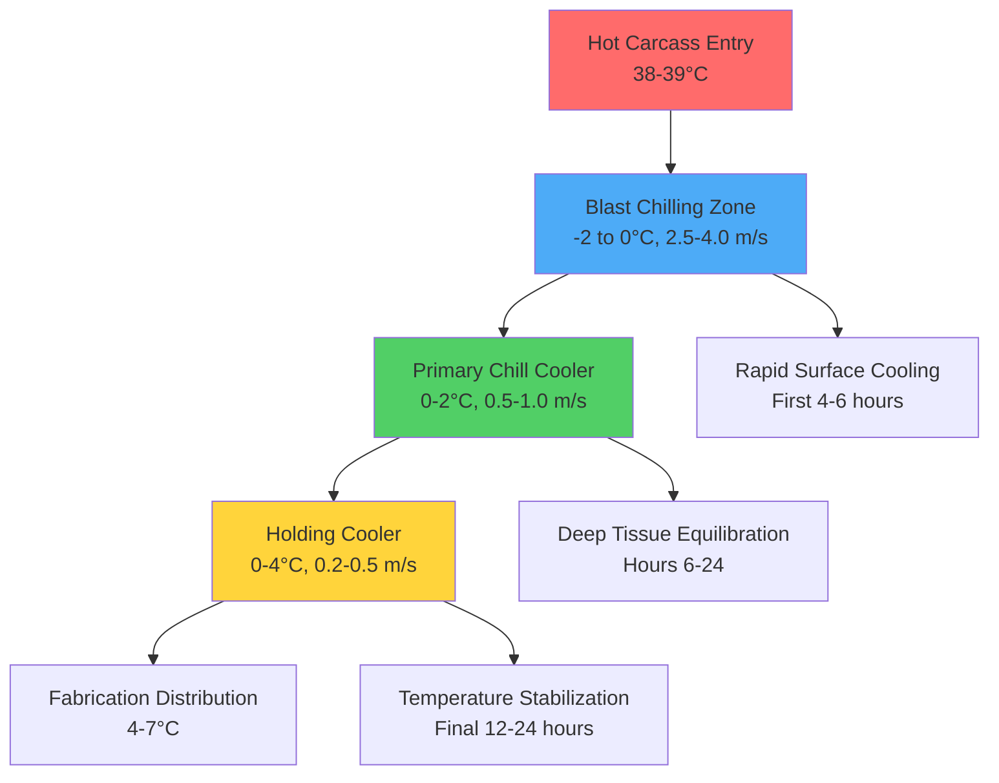
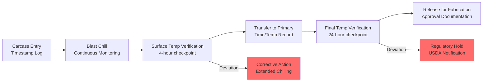

## Overview

Slaughterhouse refrigeration systems represent the most critical temperature control application in meat processing, managing the rapid thermal transition of hot carcasses (38-39°C internal temperature) to safe storage conditions (0-4°C) within strictly regulated timeframes. The physics of this cooling process directly impacts microbial safety, moisture retention, meat quality, and economic yield.

## Hot Carcass Thermal Characteristics

### Initial Heat Load

A freshly slaughtered carcass presents unique thermodynamic challenges compared to conventional refrigeration loads:

**Heat content per carcass:**

$$Q_{total} = m \cdot c_p \cdot \Delta T + Q_{metabolic} + Q_{moisture}$$

Where:
- $m$ = carcass mass (kg)
- $c_p$ = specific heat of meat (3.3-3.6 kJ/kg·K)
- $\Delta T$ = temperature differential (35-37°C)
- $Q_{metabolic}$ = residual metabolic heat generation
- $Q_{moisture}$ = latent heat from surface evaporation

**Typical heat removal requirements:**

| Species | Carcass Mass | Total Heat Load | Chilling Duration |
|---------|--------------|-----------------|-------------------|
| Beef | 300-400 kg | 42,000-56,000 kJ | 24-36 hours |
| Pork | 80-100 kg | 10,000-13,000 kJ | 12-18 hours |
| Lamb | 18-25 kg | 2,200-3,200 kJ | 12-16 hours |
| Veal | 65-90 kg | 8,000-11,500 kJ | 16-20 hours |

### Post-Mortem Heat Generation

For 2-6 hours post-slaughter, biochemical processes continue generating heat through glycolysis and rigor mortis development:

$$Q_{metabolic} = k \cdot m \cdot e^{-t/\tau}$$

Where:
- $k$ = metabolic rate coefficient (0.8-1.2 W/kg initially)
- $t$ = time post-slaughter
- $\tau$ = decay time constant (2-4 hours)

This residual heat generation adds 15-25% to the initial cooling load during the first 4 hours.

## Rapid Chilling Requirements

### USDA-FSIS Temperature Standards

The USDA Food Safety and Inspection Service mandates specific chilling performance criteria per 9 CFR 310.18:

**Beef carcasses (greater than 300 kg):**
- Cool from 38°C to 7°C at surface within 24 hours
- Achieve 4°C at 1-inch depth within 24 hours
- Deep tissue temperature (center) not to exceed 7°C after 36 hours

**Pork carcasses:**
- Cool from 38°C to 4°C within 12 hours
- No specified depth requirements (smaller thermal mass)

**Critical control point:**

$$\frac{dT}{dt}\bigg|_{surface} \geq 1.3 \text{ °C/hour (first 10 hours)}$$

### Chilling System Design

### Heat Transfer Calculations

The convective heat transfer rate from carcass surface governs chilling performance:

$$q = h \cdot A \cdot (T_{surface} - T_{air})$$

Where:
- $h$ = convective heat transfer coefficient (15-35 W/m²·K)
- $A$ = carcass surface area (1.5-3.5 m² depending on species)
- $T_{surface}$ = carcass surface temperature
- $T_{air}$ = refrigerated air temperature

**Air velocity impact on heat transfer coefficient:**

$$h = C \cdot v^{0.8}$$

Where:
- $C$ = constant (10-12 for carcass geometry)
- $v$ = air velocity (m/s)

Doubling air velocity from 1.0 to 2.0 m/s increases heat transfer coefficient by 74%, dramatically accelerating surface cooling.

## Refrigeration System Configuration

### Capacity Requirements

**Peak load calculation for blast chill cooler:**

$$Q_{refrigeration} = Q_{product} + Q_{infiltration} + Q_{equipment} + Q_{lights} + Q_{people}$$

Product load dominates in slaughterhouse applications:

$$Q_{product} = \frac{m_{hourly} \cdot c_p \cdot \Delta T}{3600} + \frac{m_{hourly} \cdot h_{evap} \cdot W_{loss}}{3600}$$

Where:
- $m_{hourly}$ = carcass throughput rate (kg/hr)
- $h_{evap}$ = latent heat of evaporation (2450 kJ/kg)
- $W_{loss}$ = moisture loss factor (0.015-0.025 kg/kg for blast chilling)

**Typical refrigeration loads:**

| Facility Capacity | Blast Chill Load | Primary Chill Load | Holding Cooler Load |
|-------------------|------------------|--------------------|---------------------|
| 50 head/hour beef | 850-1,100 kW | 450-600 kW | 180-250 kW |
| 200 head/hour pork | 950-1,250 kW | 500-680 kW | 200-280 kW |
| 500 head/hour lamb | 480-640 kW | 250-350 kW | 100-150 kW |

### Evaporator Design Specifications

**Blast chill cooler evaporators:**
- Fin spacing: 6-8 mm (wider to prevent frosting)
- Face velocity: 2.5-3.5 m/s
- Evaporator TD: 6-8°C (moderate to balance capacity and humidity)
- Defrost cycle: 3-4 times daily (hot gas or reverse cycle)

**Temperature difference (TD) selection rationale:**

Larger TD (10-12°C) increases capacity but accelerates moisture loss through lower relative humidity:

$$RH = \frac{P_{sat}(T_{evap})}{P_{sat}(T_{air})} \times 100\%$$

Slaughterhouse operations balance rapid cooling against excessive "shrink" (moisture loss), targeting 1.5-2.5% weight loss during chilling.

## Equipment Sanitation Requirements

### Washdown-Rated Construction

All refrigeration equipment in slaughterhouse environments must withstand daily high-pressure, high-temperature cleaning per USDA-FSIS regulations:

**Materials specifications:**
- Evaporator coils: 304 or 316 stainless steel
- Drain pans: Seamless 316 stainless, sloped 2% minimum
- Fan guards: 304 stainless, removable for cleaning
- Electrical enclosures: NEMA 4X rating (IP66 equivalent)
- Fasteners: 316 stainless steel throughout

**Cleanability design principles:**
- No horizontal surfaces that collect debris
- Minimum 6-inch clearance above floor
- Sealed electrical penetrations
- Self-draining configurations
- Removable panels for interior access

### Antimicrobial Surface Treatments

Modern slaughterhouse evaporators incorporate antimicrobial coatings containing silver ions or copper alloys to inhibit bacterial growth between cleaning cycles.

## Temperature Documentation and HACCP Compliance

### Monitoring Requirements

USDA-FSIS requires continuous temperature monitoring with permanent records per 9 CFR 417 (HACCP regulations):

**Critical monitoring points:**
1. Carcass surface temperature (infrared or contact sensors)
2. Air temperature at evaporator return
3. Deep tissue temperature (sample carcasses with inserted probes)
4. Refrigerant saturation temperature

**Data logging specifications:**
- Recording interval: 15 minutes maximum
- Accuracy: ±0.5°C
- Record retention: 1 year minimum
- Alarm thresholds: ±2°C from setpoint

### Process Flow Monitoring

### Deviation Response Protocols

When temperature deviations occur:

1. **Immediate actions:** Identify affected product batch, segregate for extended monitoring
2. **Root cause analysis:** Equipment failure, overloading, ambient conditions
3. **Corrective measures:** Extended chilling time, reduced loading density, equipment repair
4. **Documentation:** Incident report, corrective action verification, USDA inspector notification (if critical limit exceeded)

## Ventilation and Air Quality

Slaughterhouse coolers require controlled air exchange to remove:
- Metabolic CO₂ from residual tissue respiration
- Volatile organic compounds from blood and tissue
- Moisture from evaporative cooling

**Minimum air change rate:** 0.5-1.0 ACH (air changes per hour) in holding coolers, achieved through:
- Controlled infiltration through doorways
- Dedicated makeup air systems in larger facilities
- Positive pressure differentials to prevent contamination

## Energy Efficiency Considerations

**Variable capacity refrigeration:**
Modern slaughterhouse installations use variable-speed screw compressors or tandem reciprocating systems to match fluctuating loads throughout daily production cycles.

**Heat recovery opportunities:**
Hot gas from compressor discharge (60-80°C) can provide:
- Evaporator defrost energy (100% utilization)
- Hot water for cleanup operations (40-50% of total hot water demand)
- Space heating for administrative areas

**Energy intensity benchmarks:**

| Facility Type | Energy Use (kWh/tonne processed) |
|---------------|----------------------------------|
| Beef slaughter | 85-120 kWh/tonne |
| Pork slaughter | 65-95 kWh/tonne |
| Lamb slaughter | 70-100 kWh/tonne |

Efficient operations achieve lower range values through optimized loading schedules, proper maintenance, and heat recovery integration.

## References and Standards

- ASHRAE Handbook - Refrigeration, Chapter 31: Meat Products
- USDA-FSIS 9 CFR Part 310: Post-Mortem Inspection
- USDA-FSIS 9 CFR Part 417: Hazard Analysis and Critical Control Point Systems
- ASHRAE Standard 15: Safety Standard for Refrigeration Systems
- NSF/ANSI Standard 37: Air Curtains for Entranceways in Food and Food Service Establishments
