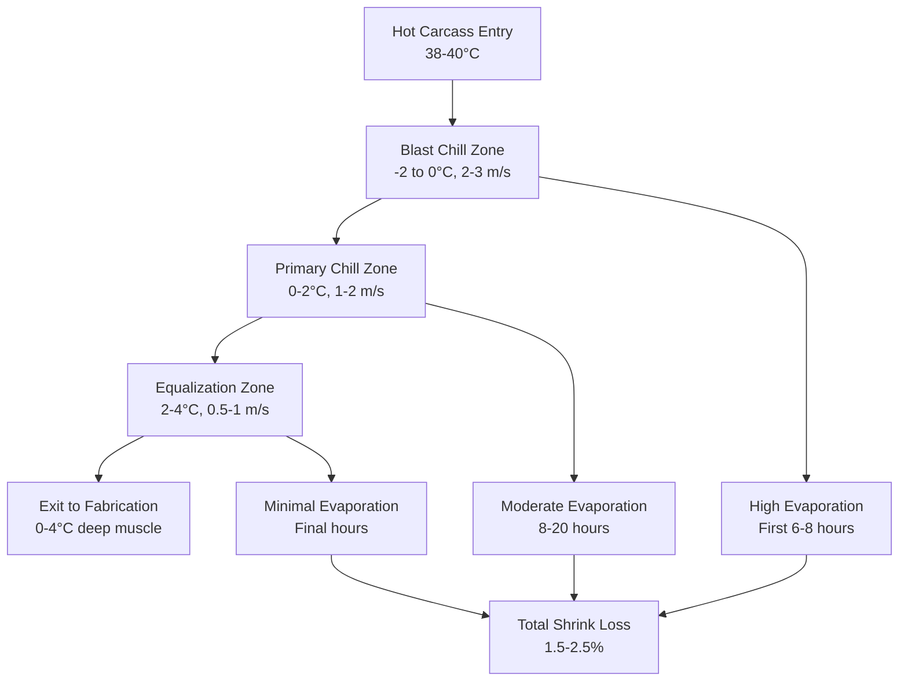
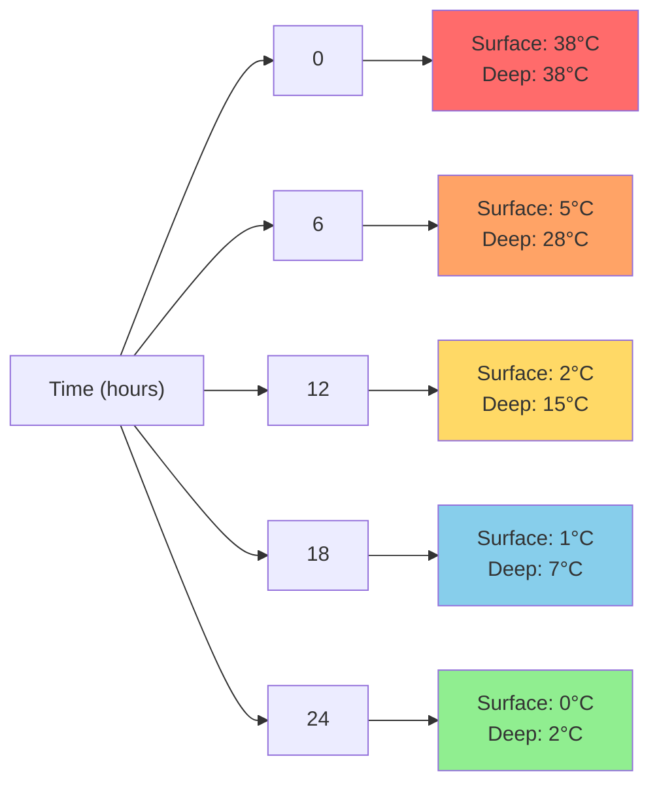

## Fundamental Heat Transfer in Carcass Chilling

Carcass chilling represents the critical first refrigeration step in meat processing, where freshly slaughtered carcasses must be rapidly cooled from approximately 38-40°C (100-104°F) to 0-4°C (32-39°F) to inhibit microbial growth while minimizing moisture loss and maintaining meat quality. The heat removal process follows transient conduction through the carcass combined with convective heat transfer at the surface.

The governing heat transfer equation for carcass cooling:

$$Q = h \cdot A \cdot (T_{surface} - T_{air})$$

where $Q$ is the convective heat transfer rate (W), $h$ is the convective heat transfer coefficient (W/m²·K), $A$ is the carcass surface area (m²), $T_{surface}$ is the carcass surface temperature (K), and $T_{air}$ is the air temperature (K).

The Biot number determines whether the carcass can be treated as a lumped capacitance system or requires consideration of internal temperature gradients:

$$Bi = \frac{h \cdot L_c}{k}$$

where $L_c$ is the characteristic length (thickness/surface area ratio), and $k$ is the thermal conductivity of the meat (approximately 0.45-0.50 W/m·K). For beef carcasses, $Bi > 0.1$, requiring full transient heat conduction analysis.

## Conventional Air Chilling Systems

Air chilling remains the predominant method in North American beef slaughter facilities. Carcasses are hung on overhead rail systems in refrigerated rooms maintained at -2 to 2°C (28-36°F) with air velocities of 1-3 m/s during the initial blast chill phase.

**Chilling Protocols:**

| Species | Initial Temp | Target Temp | Typical Duration | Air Velocity | Air Temperature |
|---------|-------------|-------------|------------------|--------------|-----------------|
| Beef (steer) | 38-40°C | 0-4°C | 24-36 hours | 1.5-2.5 m/s | 0-2°C |
| Beef (heavy) | 38-40°C | 0-4°C | 36-48 hours | 1.0-2.0 m/s | -1-1°C |
| Pork | 38-39°C | 0-4°C | 18-24 hours | 2.0-3.0 m/s | -2-0°C |
| Lamb | 38-40°C | 0-4°C | 12-18 hours | 2.5-3.5 m/s | -1-1°C |

The convective heat transfer coefficient in air chilling depends on air velocity following the empirical relationship:

$$h = C \cdot v^{0.6}$$

where $v$ is air velocity (m/s), and $C$ is a constant (approximately 5.7 for carcass geometry). Higher velocities increase heat transfer but also increase evaporative moisture loss.

## Spray Chilling Technology

Spray chilling intermittently applies fine water mist to the carcass surface during the initial chilling phase, exploiting the latent heat of vaporization to accelerate cooling while reducing shrink loss. USDA FSIS regulations permit spray chilling under 9 CFR 301.2 with specific water quality and application requirements.

The enhanced heat transfer combines sensible cooling plus evaporative cooling:

$$Q_{total} = Q_{convection} + Q_{evaporation}$$

$$Q_{evaporation} = \dot{m}_{water} \cdot h_{fg}$$

where $\dot{m}_{water}$ is the water evaporation rate (kg/s), and $h_{fg}$ is the latent heat of vaporization (approximately 2,450 kJ/kg at 0°C).

**Spray Chilling Parameters:**

- **Spray Cycles:** 12-15 seconds spray / 8-12 minutes dry interval
- **Water Temperature:** 1-4°C (potable, chlorinated to 20-50 ppm)
- **Droplet Size:** 50-150 μm (prevents surface pooling)
- **Application Duration:** First 8-12 hours of chill cycle
- **Shrink Reduction:** 0.5-1.2% compared to conventional air chill

The spray chilling effectiveness factor:

$$\eta_{spray} = \frac{\Delta T_{spray}}{\Delta T_{air}} = 1.3 - 1.6$$

indicating 30-60% faster surface cooling compared to air chilling alone during spray application.

## Temperature Decline Curves

The temperature decline in carcass deep muscle follows an exponential decay pattern described by the lumped capacitance approximation (modified for finite Biot number):

$$\frac{T(t) - T_{air}}{T_0 - T_{air}} = e^{-\frac{t}{\tau}}$$

where $\tau$ is the thermal time constant:

$$\tau = \frac{\rho \cdot c_p \cdot V}{h \cdot A}$$

where $\rho$ is meat density (approximately 1,050 kg/m³), $c_p$ is specific heat (approximately 3,500 J/kg·K above freezing), and $V$ is carcass volume (m³).

For a typical beef carcass (350 kg, surface area 5.2 m²):

$$\tau = \frac{1050 \times 3500 \times 0.333}{15 \times 5.2} \approx 15,700 \text{ seconds} \approx 4.4 \text{ hours}$$

## Combination Chilling Systems

Modern facilities employ combination systems integrating multiple cooling technologies to optimize cooling rate, product quality, and energy efficiency:

**Hybrid Spray-Air System:**
1. **Phase 1 (0-8 hours):** Spray chilling at -1°C air, 2.5 m/s velocity
2. **Phase 2 (8-16 hours):** Air chilling at 0°C, 1.5 m/s velocity
3. **Phase 3 (16-24 hours):** Equalization at 2°C, 0.8 m/s velocity

**Rapid Chill-Hold System:**
1. **Blast Chill (0-4 hours):** -4 to -2°C air, 3-4 m/s, surface freezing acceptable
2. **Tempering Hold (4-6 hours):** 4-6°C air, 0.5 m/s, surface thawing
3. **Final Chill (6-24 hours):** 0-2°C air, 1-2 m/s, equalization

## Microbial Control Through Chilling

USDA FSIS mandates specific cooling rates to prevent microbial proliferation, particularly controlling *Salmonella*, *E. coli* O157:H7, and *Clostridium perfringens* growth. The critical temperature zone for bacterial growth is 10-52°C (50-125°F).

**USDA FSIS Temperature Requirements (9 CFR 318.17):**

- Carcass surface must reach ≤4.4°C (40°F) within 24 hours for beef
- Deep muscle temperature must reach ≤4.4°C (40°F) within 36 hours
- No portion may remain above 10°C (50°F) for more than 12 hours

Bacterial growth rate follows the Arrhenius relationship:

$$k(T) = A \cdot e^{-\frac{E_a}{R \cdot T}}$$

where $k(T)$ is the growth rate constant, $E_a$ is activation energy (typically 60-80 kJ/mol for mesophilic bacteria), $R$ is the gas constant (8.314 J/mol·K), and $T$ is absolute temperature (K).

A 10°C temperature reduction typically reduces bacterial growth rate by a factor of 2-4 (Q₁₀ = 2-4), making rapid chilling essential for food safety.

## Shrink Loss Management

Shrink loss (moisture evaporation) represents both economic loss and quality degradation. The evaporation rate follows:

$$\dot{m}_{evap} = h_m \cdot A \cdot (P_{sat,surface} - P_{air})$$

where $h_m$ is the mass transfer coefficient (m/s), and $P$ represents water vapor partial pressures (Pa). The mass transfer coefficient relates to the heat transfer coefficient through the Lewis number:

$$h_m = \frac{h}{\rho \cdot c_p \cdot Le^{2/3}}$$

where $Le$ (Lewis number) ≈ 1.0 for air-water vapor mixtures.

**Shrink Loss Reduction Strategies:**

| Method | Typical Shrink Loss | Mechanism |
|--------|---------------------|-----------|
| Conventional air chill | 1.8-2.5% | Evaporation only |
| Spray chilling | 1.0-1.5% | Water replacement + evaporative cooling |
| High-humidity air chill | 1.2-1.8% | Reduced vapor pressure gradient |
| Rapid chill-hold | 1.5-2.0% | Shortened exposure time |
| Impermeable bags | 0.2-0.5% | Vapor barrier (specialty applications) |

## Design Considerations

Carcass chilling room capacity must account for peak production rates with adequate spacing for air circulation:

$$\dot{Q}_{total} = \dot{m}_{carcass} \cdot c_p \cdot \Delta T + \dot{m}_{carcass} \cdot f_{shrink} \cdot h_{fg}$$

where $\dot{m}_{carcass}$ is the carcass throughput rate (kg/hr), and $f_{shrink}$ is the fractional shrink loss (typically 0.015-0.025).

For a facility processing 100 beef carcasses per hour (average 350 kg each), cooling from 38°C to 2°C over 24 hours:

$$\dot{Q}_{sensible} = \frac{100 \times 350}{24} \times 3500 \times (38-2) = 1.84 \times 10^7 \text{ W} = 18.4 \text{ MW}$$

$$\dot{Q}_{latent} = \frac{100 \times 350}{24} \times 0.02 \times 2.45 \times 10^6 = 7.1 \times 10^5 \text{ W} = 0.71 \text{ MW}$$

Total refrigeration load ≈ 19.1 MW (5,430 tons), requiring substantial refrigeration plant capacity with proper load distribution across the chilling cycle.

Rail spacing should provide 0.3-0.5 m clearance between carcasses to maintain uniform air circulation and prevent local hot spots that could harbor bacterial growth.
