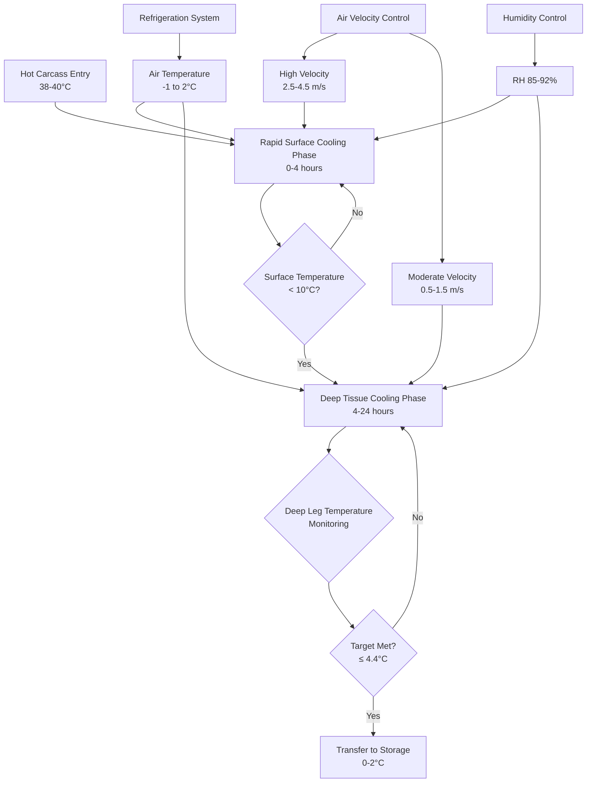

## Overview

Hot carcass chilling represents the most critical refrigeration process in meat processing, where beef, pork, and lamb carcasses must be rapidly cooled from slaughter temperature (38-40°C) to safe storage temperature (0-4°C) within specified timeframes to prevent microbial growth while avoiding quality defects. The USDA Food Safety and Inspection Service (FSIS) establishes mandatory time-temperature requirements based on carcass weight and species to ensure pathogen control, particularly for *Salmonella* and *Escherichia coli* O157:H7.

The chilling process involves complex heat transfer phenomena including convective cooling from refrigerated air, evaporative cooling from surface moisture, and conductive heat transfer through tissue layers. System design must balance rapid surface cooling for microbial safety against controlled deep tissue cooling to prevent cold shortening and maintain meat quality.

## FSIS Time-Temperature Requirements

USDA FSIS regulations 9 CFR 310.18 and 381.66 establish maximum chilling schedules based on carcass weight to limit the time tissues remain in the temperature danger zone (10-54°C) where bacterial multiplication occurs exponentially.

### Beef Carcass Chilling Requirements

FSIS mandates beef carcasses achieve the following temperature decline:

| Carcass Weight | Maximum Chilling Time | Target Deep Tissue Temperature |
|----------------|----------------------|--------------------------------|
| < 27 kg (60 lb) | 16 hours | ≤ 4.4°C (40°F) |
| 27-45 kg (60-100 lb) | 20 hours | ≤ 4.4°C (40°F) |
| 45-68 kg (100-150 lb) | 24 hours | ≤ 4.4°C (40°F) |
| > 68 kg (150 lb) | 36 hours | ≤ 4.4°C (40°F) |

Temperature measurement occurs at the deep leg (round) which represents the thermal center with maximum thermal mass and slowest cooling rate.

### Pork and Lamb Requirements

Pork carcasses must reach ≤ 4.4°C within 24 hours regardless of weight. Lamb carcasses follow similar schedules to beef based on dressed weight, with lighter carcasses requiring 16-hour maximum chilling.

## Heat Transfer Physics in Carcass Chilling

The cooling rate of a beef carcass follows Fourier's law of heat conduction combined with convective boundary conditions, creating a transient heat transfer problem with temperature-dependent thermal properties.

### Temperature Decline Model

The one-dimensional transient heat conduction equation for carcass cooling:

$$\frac{\partial T}{\partial t} = \alpha \frac{\partial^2 T}{\partial x^2}$$

where $\alpha = k/(\rho c_p)$ is thermal diffusivity, $k$ is thermal conductivity (0.41-0.48 W/m·K for beef), $\rho$ is density (1050-1090 kg/m³), and $c_p$ is specific heat (3.22-3.68 kJ/kg·K).

The surface boundary condition includes convective heat transfer:

$$-k\frac{\partial T}{\partial x}\bigg|_{surface} = h(T_{surface} - T_{air}) + h_{evap}$$

where $h$ is the convective heat transfer coefficient (10-25 W/m²·K depending on air velocity) and $h_{evap}$ represents evaporative cooling contribution.

### Cooling Time Estimation

The Biot number determines the temperature distribution character:

$$Bi = \frac{hL_c}{k}$$

where $L_c = V/A$ is the characteristic length (volume-to-surface ratio). For beef carcasses, $Bi$ ranges from 15-35, indicating significant internal temperature gradients during chilling.

The dimensionless center temperature for transient cooling approximates:

$$\frac{T_{center} - T_{air}}{T_{initial} - T_{air}} = C_1 e^{-\lambda_1^2 Fo}$$

where $Fo = \alpha t/L_c^2$ is the Fourier number, and $C_1$ and $\lambda_1$ are constants determined by geometry and Biot number.

For a 300 kg beef carcass with $L_c \approx 0.12$ m, achieving center temperature of 4°C from 38°C initial temperature in 0°C air with $h = 18$ W/m²·K requires approximately 28-32 hours.

## Chilling System Design Requirements

### Refrigeration Capacity Calculations

The total refrigeration load comprises sensible heat removal, metabolic heat, and respiration heat:

$$Q_{total} = Q_{sensible} + Q_{metabolic} + Q_{respiration} + Q_{infiltration}$$

#### Sensible Heat Load

$$Q_{sensible} = \dot{m}_{carcass} \cdot c_p \cdot \Delta T$$

For a facility processing 400 beef carcasses/day at 300 kg average weight over 24-hour chilling:

$$Q_{sensible} = \frac{400 \times 300 \text{ kg}}{24 \text{ hr}} \times 3.5 \frac{\text{kJ}}{\text{kg·K}} \times (38-2)\text{K} = 630 \text{ kW}$$

#### Metabolic Heat Generation

Post-slaughter metabolic heat from continuing biochemical reactions:

$$Q_{metabolic} = m_{carcass} \cdot q_{met}$$

where $q_{met}$ decreases from approximately 5-8 W/kg immediately post-slaughter to < 1 W/kg after 12 hours as enzymatic activity declines.

### Air Distribution Requirements

**Phase 1: Rapid Surface Cooling (0-4 hours)**
- Air temperature: -1 to 0°C
- Air velocity: 2.5-4.5 m/s at carcass surface
- Relative humidity: 88-92%
- Objective: Reduce surface temperature below 10°C within 2-4 hours

**Phase 2: Deep Tissue Cooling (4-24 hours)**
- Air temperature: 0 to 2°C
- Air velocity: 0.5-1.5 m/s
- Relative humidity: 85-90%
- Objective: Achieve deep leg temperature ≤ 4.4°C without excessive surface dehydration

## Bacterial Growth Prevention

Microbial growth rate follows the Arrhenius temperature dependence, with generation time doubling approximately every 10°C temperature decrease.

### Temperature-Growth Relationship

The bacterial growth rate constant:

$$k_{growth} = A \cdot e^{-E_a/(RT)}$$

where $A$ is the frequency factor, $E_a$ is activation energy (typically 50-80 kJ/mol for mesophilic pathogens), $R$ is the gas constant, and $T$ is absolute temperature.

For *Salmonella* and *E. coli*, growth effectively ceases below 7°C, with generation times exceeding 12 hours at 4°C compared to 20-30 minutes at 37°C optimal temperature.

### Critical Time-Temperature Zones

| Temperature Range | Microbial Activity | Maximum Allowable Time |
|------------------|-------------------|------------------------|
| 38-30°C | Rapid growth phase | < 2 hours |
| 30-20°C | Active growth | < 4 hours |
| 20-10°C | Slow growth | < 8 hours |
| 10-4°C | Minimal growth | Extended (24+ hours acceptable) |
| < 4°C | Growth inhibition | Indefinite for chilling |

Surface tissue reaches safe temperatures (< 10°C) within 2-4 hours under proper chilling conditions, while deep tissue requires 16-36 hours depending on carcass size.

## Spray Chilling Systems

Spray chilling applies fine water mist intermittently during the chilling process to exploit evaporative cooling while reducing weight loss from dehydration.

### Evaporative Cooling Contribution

The latent heat of evaporation provides significant additional cooling:

$$Q_{evap} = \dot{m}_{water} \cdot h_{fg}$$

where $h_{fg} = 2450$ kJ/kg at 0°C.

Evaporating 1 kg water removes heat equivalent to cooling 700 kg beef by 1°C. Spray chilling systems apply 2-4% water by carcass weight over 8-12 hours, reducing shrink from typical 2.0-2.5% to 0.5-1.5% while maintaining equivalent cooling rates.

### Spray Cycle Parameters

Typical spray chilling schedule:
- Spray duration: 15-45 seconds
- Cycle interval: 20-40 minutes
- Water temperature: 0.5-2°C
- Droplet size: 50-150 μm
- Application rate: 0.3-0.5 L/carcass per cycle

## Cold Shortening Prevention

Rapid chilling of pre-rigor muscle tissue below 10°C while pH remains above 6.0 causes cold shortening—irreversible muscle fiber contraction reducing tenderness.

### Cold Shortening Mechanism

Rapid temperature decline disrupts sarcoplasmic reticulum calcium regulation, causing uncontrolled calcium release and actin-myosin cross-bridge formation before rigor mortis completes naturally. This produces sarcomere shortening of 40-50% compared to normal 15-20%, creating tough meat.

### Prevention Strategies

**Electrical Stimulation**
Application of 200-600V electrical pulses immediately post-slaughter accelerates pH decline through accelerated glycolysis, allowing safe rapid chilling without cold shortening risk. Muscle pH drops below 6.0 within 4-6 hours rather than typical 12-18 hours.

**Controlled Chilling Profile**
Maintain carcass temperature above 10°C for 8-12 hours post-slaughter until pH drops below 6.0, then implement rapid chilling. This extends total chilling time to 36-48 hours for heavy carcasses.

**Temperature Holding**
For beef, maintain 12-16°C for first 10 hours, then reduce to 0-2°C. This prevents cold shortening while still meeting FSIS time-temperature requirements through staged cooling.

## Temperature Monitoring and Control

FSIS requires continuous monitoring with calibrated instruments accurate to ±0.5°C, with probes positioned at the deep leg thermal center.

### Monitoring Locations

For beef carcasses:
- Primary: Deep round (ham) muscle, geometric center
- Secondary: Loin eye at 12th rib
- Surface: External fat cover over round

Temperature recording at minimum 2-hour intervals with automated alert systems for deviations exceeding ±1°C from target profile.

## Quality Considerations

### Shrink Loss Control

Carcass weight loss during chilling ranges from 1.5-2.5% primarily through evaporative cooling and drip loss. Excessive air velocity or low relative humidity increases shrink:

$$\text{Shrink (%)} = f(RH, v_{air}, t_{chill}, T_{air})$$

Maintaining RH above 85% and limiting air velocity to < 2 m/s after initial surface cooling minimizes economic losses while maintaining microbial safety.

### Bloom Development

Surface color development (bloom) requires oxygen penetration into myoglobin-containing tissues. Adequate air circulation ensures bright cherry-red color for beef rather than purple deoxygenated appearance, important for consumer acceptance.

## System Performance Metrics

| Parameter | Target Range | Measurement Method |
|-----------|--------------|-------------------|
| Deep leg temperature decline rate | 1.2-1.8°C/hour (first 12 hr) | Temperature probes, continuous |
| Surface temperature at 4 hours | < 10°C | IR thermography or surface probes |
| Final deep leg temperature | ≤ 4.4°C | Calibrated thermocouples |
| Weight loss (no spray) | 1.8-2.5% | Scale measurements pre/post |
| Weight loss (with spray) | 0.5-1.5% | Scale measurements pre/post |
| Refrigeration capacity utilization | 70-90% | System monitoring |
| Air temperature uniformity | ±1°C throughout cooler | Multi-point monitoring |

## Conclusion

Hot carcass chilling requires precise refrigeration system design integrating rapid surface cooling for microbial safety, controlled deep tissue cooling for quality preservation, and humidity management for economic yield optimization. FSIS time-temperature requirements establish minimum performance standards, while advanced techniques including spray chilling and electrical stimulation enable enhanced outcomes. Understanding the coupled heat and mass transfer physics governing the chilling process allows engineers to design systems meeting regulatory requirements while optimizing meat quality and processing economics.

