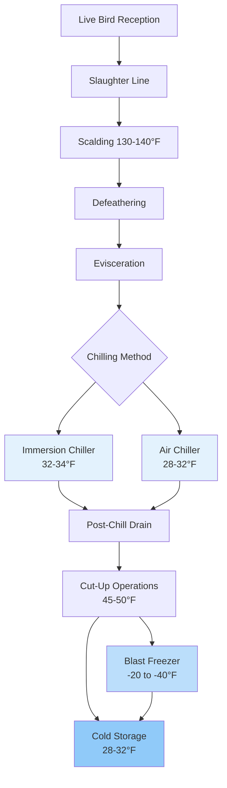

Poultry processing facilities require sophisticated refrigeration systems to maintain product safety and quality throughout slaughter, evisceration, chilling, and storage operations. Temperature control directly impacts bacterial growth rates, moisture retention, and final product quality in these high-throughput environments.

## Processing Temperature Requirements

USDA FSIS regulations mandate specific temperature limits throughout poultry processing. Carcass temperature must not exceed 40°F (4.4°C) at the end of chilling, with continuous monitoring required to ensure compliance. The chilling process must reduce internal carcass temperature from approximately 105°F (40.6°C) post-slaughter to below 40°F within prescribed timeframes.

Temperature reduction follows heat transfer principles governed by Newton's law of cooling:

$$\frac{dT}{dt} = -hA(T - T_{\infty})$$

Where h is the convective heat transfer coefficient (Btu/hr·ft²·°F), A is surface area (ft²), T is carcass temperature (°F), and T_∞ is chilling medium temperature (°F). The coefficient h varies significantly with chilling method, ranging from 15-25 Btu/hr·ft²·°F for air chilling to 150-250 Btu/hr·ft²·°F for immersion chilling.

## Chilling Methods and Refrigeration Systems

### Immersion Chilling

Water immersion chillers dominate North American poultry processing due to speed and efficiency. These systems use counter-flow tanks where birds move through progressively colder water stages. The first stage operates at 50-55°F (10-13°C) for initial cooling, while the final stage maintains 32-34°F (0-1°C) using mechanical refrigeration.

Refrigeration load for immersion chillers consists of:

- Product heat removal (sensible and latent)
- Water temperature maintenance
- Heat gain from warm bird entry
- Makeup water cooling
- Ambient heat infiltration

Total refrigeration capacity required:

$$Q_{total} = Q_{product} + Q_{makeup} + Q_{ambient}$$

$$Q_{product} = \dot{m}_{bird} \times c_p \times \Delta T + \dot{m}_{bird} \times h_{fg} \times x$$

Where $\dot{m}_{bird}$ is bird mass flow rate (lb/hr), $c_p$ is specific heat of poultry (0.78 Btu/lb·°F above freezing), ΔT is temperature change (°F), $h_{fg}$ is latent heat of water absorption (970 Btu/lb), and x is fractional water pickup (typically 0.06-0.08).

### Air Chilling

Air chilling systems use refrigerated air at 28-32°F (-2 to 0°C) flowing at 300-500 fpm across suspended carcasses. This method produces drier birds with no water absorption but requires 2-3 hours versus 30-60 minutes for immersion chilling.

Air chilling refrigeration load calculation:

$$Q_{air} = \dot{m}_{air} \times c_{p,air} \times (T_{out} - T_{in}) + Q_{fan} + Q_{infiltration}$$

Evaporator capacity must handle both sensible cooling and substantial frost accumulation from moisture released by warm carcasses. Defrost cycles operate every 4-6 hours in continuous operations, requiring 120-150% installed capacity to maintain production during defrost.

## Processing Room Cooling Loads

Cut-up and deboning rooms operate at 45-50°F (7-10°C) with 85-90% RH to maintain product quality while providing acceptable working conditions. Refrigeration loads include:

| Load Component | Typical Value | Notes |
|----------------|---------------|-------|
| Product heat removal | 45-55 Btu/lb | From 40°F to room temp |
| Occupancy (metabolic) | 600-800 Btu/person | High activity level |
| Lighting | 2.5-3.5 W/ft² | LED systems lower |
| Equipment motors | 15-25 hp/1000 birds/hr | Saws, conveyors |
| Infiltration | 0.5-1.0 ACH | High traffic areas |
| Transmission | Variable | Insulation dependent |

Processing equipment generates substantial heat from electric motors and friction. A typical deboning line processing 140 birds/minute operates approximately 25-30 hp of motor load, contributing 64,000-76,000 Btu/hr of heat to the space.

## Blast Freezing Operations

Individual Quick Freezing (IQF) systems freeze cut poultry pieces at -20 to -40°F (-29 to -40°C) using high-velocity air (1500-2000 fpm). Freezing time follows Plank's equation for regular shapes:

$$t_f = \frac{\rho L}{T_f - T_m} \left(\frac{Pa}{h} + \frac{Ra^2}{k}\right)$$

Where ρ is density (lb/ft³), L is latent heat (106 Btu/lb for poultry), $T_f$ is freezing medium temperature (°F), $T_m$ is initial freezing point (27°F for poultry), P and R are shape factors, a is thickness (ft), h is surface heat transfer coefficient (Btu/hr·ft²·°F), and k is thermal conductivity (0.9 Btu/hr·ft·°F frozen, 0.3 Btu/hr·ft·°F unfrozen).

Blast freezer refrigeration systems typically use ammonia or CO₂ in forced-draft evaporators with 8-12°F TD (temperature difference between refrigerant and air). Defrost operates on demand using hot gas or electric elements.

## Cold Storage Requirements

Frozen poultry storage maintains -10 to 0°F (-23 to -18°C) per ASHRAE recommendations for 6-12 month storage life. Storage refrigeration load consists primarily of transmission through insulated envelope and infiltration from door openings.

Transmission load calculation:

$$Q_{trans} = U \times A \times \Delta T$$

Where U-value should not exceed 0.04-0.05 Btu/hr·ft²·°F for frozen storage, requiring 6-8 inches of spray polyurethane foam or equivalent R-value insulation.

Fresh poultry storage operates at 28-32°F (-2 to 0°C) with 7-10 day maximum holding time. These spaces require precise temperature control as product freezes below 27°F, causing quality degradation upon thawing.

## Refrigeration System Design

### Ammonia Systems

Large poultry plants (>100,000 birds/day) typically employ centralized ammonia refrigeration with multiple compression stages. A two-stage system operates:

- High stage: 30-40°F SST (saturated suction temperature)
- Low stage: -40°F SST for blast freezers
- Cascade or booster configuration

Ammonia's high latent heat (565 Btu/lb at 0°F) and excellent heat transfer properties provide efficiency advantages in large industrial systems. IIAR standards govern ammonia system design, with IIAR 2 specifying machinery room requirements and safety provisions.

### Comparison of Refrigeration Methods

| System Type | Application | Evaporator Temp | Advantages | Limitations |
|-------------|-------------|-----------------|------------|-------------|
| DX Ammonia | Blast freezing | -40 to -20°F | High efficiency, low cost | Safety requirements |
| Flooded Ammonia | Process cooling | 15-30°F | Superior heat transfer | Complex controls |
| Glycol Secondary | Cut-up rooms | 25-35°F | Reduced refrigerant charge | Pumping penalty |
| CO₂ Cascade | All applications | -60 to 35°F | Low GWP, high efficiency | Higher pressure |

### Defrost Strategy

Evaporator defrost scheduling critically impacts system capacity and energy consumption. Hot gas defrost terminates based on discharge pressure rise indicating ice removal, typically requiring 15-20 minutes per cycle. Electric defrost provides more precise control but adds electrical load.

Defrost frequency depends on evaporator entering air conditions:

$$N_{defrost} = \frac{\dot{m}_{air} \times \omega_{in} - \omega_{out} \times t_{run}}{m_{frost,limit}}$$

Where N is cycles per day, $\dot{m}_{air}$ is air mass flow rate, ω is humidity ratio, $t_{run}$ is hours between defrost, and $m_{frost,limit}$ is maximum acceptable frost accumulation.

## Sanitation Considerations

USDA requires daily washdown of processing areas, exposing refrigeration equipment to high-pressure water and sanitizing chemicals. Equipment specifications include:

- Stainless steel construction (300 series)
- NEMA 4X electrical enclosures
- Sloped surfaces for drainage
- NSF compliance for food zone equipment

Evaporator units installed in processing areas require complete wash-down capability with corrosion-resistant coatings on aluminum fins and special pan treatments to prevent bacterial growth in condensate.

## Energy Efficiency Strategies

Poultry processing refrigeration accounts for 30-40% of total plant energy consumption. Efficiency improvements include:

- Variable speed compressors matching load profiles
- Floating head pressure control (winter operation)
- Heat recovery for scalding and cleanup water
- Economizers on low-temperature systems
- LED lighting in refrigerated spaces
- High-efficiency evaporator fans with ECM motors

Ammonia compressor efficiency varies with compression ratio. The isentropic efficiency relation:

$$\eta_{isen} = \frac{h_{2s} - h_1}{h_2 - h_1}$$

Where $h_{2s}$ is isentropic discharge enthalpy and $h_2$ is actual discharge enthalpy. Modern screw compressors achieve 65-75% isentropic efficiency at design conditions, with performance degrading at off-design compression ratios.

## Code and Standard References

- **ASHRAE Handbook - Refrigeration**: Chapter 31 (Poultry Products)
- **USDA FSIS**: 9 CFR Part 381 (Poultry Products Inspection Regulations)
- **IIAR 2**: Equipment, Design, and Installation of Closed-Circuit Ammonia Mechanical Refrigerating Systems
- **ASHRAE Standard 15**: Safety Standard for Refrigeration Systems
- **NSF/ANSI 37**: Air Conditioning and Refrigerating Equipment

Proper refrigeration system design ensures food safety compliance while optimizing energy consumption in these demanding, high-volume processing environments.
