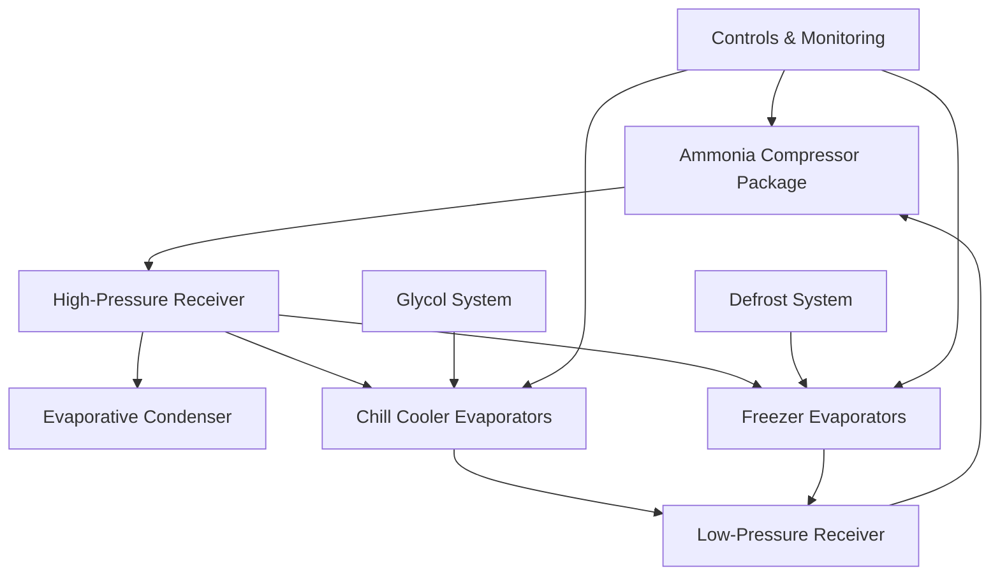

## Overview

Cold storage systems in poultry processing facilities maintain product temperatures within critical ranges to ensure food safety, extend shelf life, and preserve product quality. These systems operate in distinct temperature zones: chill coolers (28-40°F), holding coolers (28-34°F), and freezer storage (-10 to 0°F). Proper refrigeration system design accounts for the high sensible and latent loads generated during product cooling, defrost cycles, and infiltration from frequent door operations.

## Temperature Requirements and Storage Zones

ASHRAE Handbook - Refrigeration establishes temperature specifications for poultry products based on storage duration and processing stage.

### Storage Temperature Classifications

| Storage Type | Temperature Range | Relative Humidity | Application |
|--------------|------------------|-------------------|-------------|
| Chill cooler | 28-40°F (-2 to 4°C) | 85-95% | Fresh poultry holding 1-7 days |
| Holding cooler | 28-34°F (-2 to 1°C) | 90-95% | Pre-distribution staging |
| Blast freezer | -20 to -40°F (-29 to -40°C) | N/A | Rapid freezing operations |
| Freezer storage | -10 to 0°F (-23 to -18°C) | 90-95% | Long-term frozen storage |
| Tempering room | 26-28°F (-3 to -2°C) | 85-90% | Controlled thawing |

Chill coolers receive poultry carcasses at approximately 40-50°F after processing and reduce product temperature to below 40°F within 4 hours per USDA-FSIS regulations. The refrigeration system must extract both sensible heat from the product mass and latent heat from surface moisture evaporation.

## Refrigeration Load Calculations

Total refrigeration load for poultry cold storage comprises product load, transmission load, infiltration load, equipment load, and personnel load.

### Product Cooling Load

The heat removal rate during chilling depends on product mass flow, specific heat, and temperature differential:

$$Q_{product} = \dot{m} \times c_p \times (T_{in} - T_{final})$$

Where:
- $Q_{product}$ = product cooling load (Btu/hr)
- $\dot{m}$ = mass flow rate of poultry (lb/hr)
- $c_p$ = specific heat of poultry (0.80 Btu/lb·°F above freezing, 0.40 Btu/lb·°F below freezing)
- $T_{in}$ = entering product temperature (°F)
- $T_{final}$ = final product temperature (°F)

For a facility processing 5,000 lb/hr of poultry from 50°F to 35°F:

$$Q_{product} = 5,000 \times 0.80 \times (50 - 35) = 60,000 \text{ Btu/hr}$$

### Respiration and Latent Heat

Poultry carcasses release metabolic heat and surface moisture during storage. The latent heat component from moisture evaporation:

$$Q_{latent} = \dot{m}_{water} \times h_{fg}$$

Where $\dot{m}_{water}$ is the evaporation rate (lb/hr) and $h_{fg}$ is the latent heat of vaporization (1,061 Btu/lb at 32°F). Surface evaporation rates range from 0.2-0.5% of product weight per day depending on air velocity and relative humidity.

### Transmission Load Through Envelope

Heat gain through insulated walls, ceiling, and floor:

$$Q_{transmission} = U \times A \times \Delta T$$

Where:
- $U$ = overall heat transfer coefficient (Btu/hr·ft²·°F)
- $A$ = surface area (ft²)
- $\Delta T$ = temperature difference between inside and outside (°F)

Cold storage rooms require insulation values of R-25 to R-35 for walls and R-30 to R-40 for ceilings to minimize transmission loads. Floors on grade require insulation and sub-slab heating to prevent ground freezing.

## System Design Configurations

### Refrigerant Selection

Industrial poultry facilities predominantly use ammonia (R-717) refrigeration systems for cold storage applications. Ammonia provides:

- High latent heat of vaporization (589 Btu/lb at -10°F)
- Excellent heat transfer properties
- Lower operating costs compared to synthetic refrigerants
- Immediate leak detection due to characteristic odor
- Zero global warming potential (GWP = 0)

Secondary loop glycol systems using propylene glycol (-40°F freeze point) distribute cooling to chill coolers while minimizing ammonia charge in occupied areas. The glycol pumps circulate through plate-and-frame heat exchangers cooled by ammonia evaporators.

## Evaporator Design and Air Distribution

Unit coolers in poultry cold storage must handle high latent loads while maintaining uniform air temperature distribution. Design parameters include:

- **Air velocity over product**: 50-100 fpm to minimize moisture loss
- **Evaporator temperature difference (TD)**: 8-12°F for chill coolers, 10-15°F for freezers
- **Fin spacing**: 4-6 fins per inch for above-freezing applications, 3-4 fpi for freezer service
- **Defrost frequency**: Every 6-12 hours for freezer evaporators using hot gas, electric, or water defrost

The evaporator capacity must account for defrost inefficiency and frosting degradation:

$$Q_{evaporator} = \frac{Q_{total}}{1 - t_{defrost}/24}$$

Where $t_{defrost}$ represents total daily defrost time in hours.

## Air Infiltration Control

Infiltration through door openings represents 30-50% of total refrigeration load in high-traffic cold storage facilities. Air exchange rate calculation using the doorway area method:

$$Q_{infiltration} = \rho \times V \times h \times E$$

Where:
- $\rho$ = air density difference (lb/ft³)
- $V$ = door opening volume per unit time (ft³/hr)
- $h$ = enthalpy difference between inside and outside air (Btu/lb)
- $E$ = doorway effectiveness factor (0.5-0.9)

Infiltration mitigation strategies include:
- High-speed roll-up doors with rapid open/close cycles
- Air curtains with 500-1,000 fpm discharge velocity
- Vestibules with staged door openings
- Dock seals and shelters for truck loading areas
- Plastic strip curtains for personnel traffic

## Temperature Monitoring and Controls

Modern cold storage facilities implement distributed control systems with continuous temperature monitoring at multiple zones. Critical control parameters:

- **Temperature stratification**: Maintain ±2°F vertical temperature gradient
- **Refrigerant superheat**: 8-12°F at evaporator outlet
- **Suction pressure control**: Modulate capacity via variable speed drives or hot gas bypass
- **Defrost termination**: Temperature or time-based algorithms

Data logging systems record product temperatures per HACCP requirements, with alarm notification for temperature excursions beyond setpoint tolerances.

## Energy Efficiency Optimization

Reducing specific energy consumption (kWh per ton of refrigeration) involves multiple strategies:

1. **Floating head pressure control**: Reduce condenser pressure during cool ambient conditions
2. **Evaporator pressure optimization**: Raise suction pressure while maintaining product temperature
3. **Variable speed compressor drives**: Match capacity to load fluctuations
4. **LED lighting**: Reduce internal heat gain by 60-70% compared to fluorescent
5. **Economizer cycles**: Improve compressor efficiency through flash gas removal

The coefficient of performance (COP) for ammonia systems in poultry cold storage typically ranges from 2.5-4.0 depending on evaporator and condenser temperatures.

## Conclusion

Effective cold storage refrigeration in poultry processing requires integrated system design addressing product cooling loads, infiltration control, and temperature uniformity. Proper equipment selection, insulation values, and control strategies ensure food safety compliance while minimizing energy consumption. System capacity must account for peak loads during product loading while maintaining stable temperatures during overnight holding periods.
