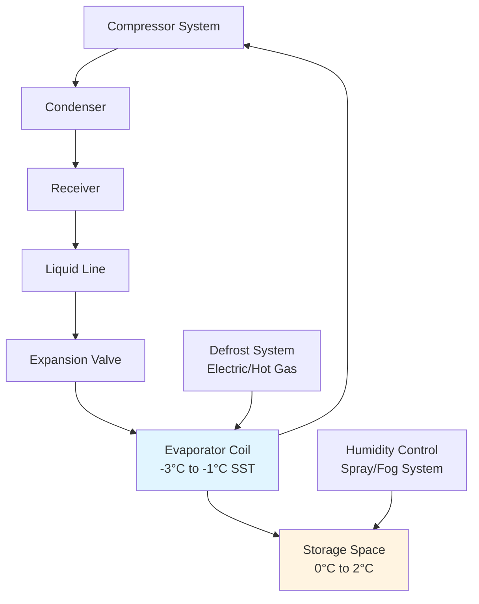

Fresh poultry storage represents one of the most challenging refrigeration applications due to the product's high perishability, significant moisture content, and strict temperature tolerances. The storage environment must balance rapid heat removal with humidity control to prevent both bacterial growth and weight loss through dehydration.

## Temperature Requirements and Thermodynamics

ASHRAE Handbook—Refrigeration recommends storage temperatures between 0°C and 2°C (32°F to 36°F) for standard fresh poultry, with deep-chilled storage at -2°C to 0°C (28°F to 32°F) for extended shelf life. These temperatures inhibit mesophilic bacterial growth while maintaining the unfrozen state of muscle tissue.

The heat removal requirement for poultry entering storage follows:

$$Q_{total} = m \cdot c_p \cdot (T_{initial} - T_{storage}) + Q_{respiration}$$

Where:
- $m$ = mass of poultry (kg)
- $c_p$ = specific heat of poultry, approximately 3.31 kJ/(kg·K) above freezing
- $T_{initial}$ = incoming product temperature, typically 4°C to 7°C post-chill
- $T_{storage}$ = target storage temperature
- $Q_{respiration}$ = metabolic heat generation (minimal in processed poultry)

For a 1000 kg batch cooling from 7°C to 2°C:

$$Q_{total} = 1000 \times 3.31 \times (7-2) = 16,550 \text{ kJ} = 4.60 \text{ kWh}$$

### Storage Duration by Product Type

| Product Type | Temperature (°C) | RH (%) | Maximum Storage (Days) | Spoilage Rate Factor |
|--------------|------------------|--------|------------------------|----------------------|
| Whole birds | 0 to 2 | 85-90 | 7-10 | 1.0× |
| Cut-up parts | 0 to 2 | 85-90 | 3-5 | 2.0× |
| Ground poultry | 0 to 2 | 85-90 | 1-2 | 4.0× |
| Deep-chill whole | -2 to 0 | 90-95 | 14-21 | 0.5× |
| Marinated products | 0 to 2 | 85-90 | 5-7 | 1.5× |

## Refrigeration System Design

Fresh poultry storage facilities typically employ direct expansion (DX) or flooded evaporator systems with temperature difference (TD) between refrigerant and air of 4°C to 6°C. Smaller TD values reduce evaporator coil temperature, minimizing product dehydration.

### Evaporator Selection Criteria

The evaporator must handle both the product load and infiltration loads while maintaining high relative humidity. Key design parameters include:

**Coil face velocity**: 2.0 to 2.5 m/s (400-500 fpm) maximum to prevent excessive air movement that accelerates dehydration

**Fin spacing**: 4 to 6 mm (6-8 fins per inch) to accommodate frost accumulation without rapid airflow degradation

**Defrost frequency**: Every 6 to 8 hours for 20-30 minutes, using electric or hot gas methods

The refrigeration capacity requirement calculation:

$$Q_{evap} = Q_{product} + Q_{transmission} + Q_{infiltration} + Q_{equipment} + Q_{lights} + Q_{people}$$

For a 200 m² storage room with 3 m height:

**Product load** (1000 kg/day, 5°C pulldown):
$$Q_{product} = \frac{1000 \times 3.31 \times 5}{24} = 690 \text{ W}$$

**Transmission load** (U = 0.25 W/m²·K, ΔT = 28°C):
$$Q_{transmission} = 0.25 \times (200 \times 3 \times 2 + 200) \times 28 = 4,620 \text{ W}$$

**Infiltration load** (1.5 air changes/hour, outside air 30°C, 60% RH):
$$Q_{infiltration} = \frac{V \cdot \rho \cdot \Delta h \cdot ACH}{3600} = \frac{600 \times 1.2 \times 45 \times 1.5}{3600} = 11.25 \text{ kW}$$

**Total refrigeration capacity**: Approximately 17 kW with 20% safety factor = 20.4 kW

## Humidity Management

Maintaining 85-90% relative humidity prevents weight loss while avoiding surface condensation that promotes bacterial growth. Poultry loses approximately 0.5-1.0% weight per day when RH drops below 80%.

The water vapor pressure difference drives moisture migration:

$$\dot{m}_{water} = h_m \cdot A \cdot (P_{surface} - P_{air})$$

Where:
- $h_m$ = mass transfer coefficient
- $A$ = product surface area
- $P_{surface}$ = vapor pressure at product surface
- $P_{air}$ = vapor pressure of storage air

Humidity control methods include:

**Evaporator design**: Larger coil surface area with lower TD reduces dehumidification
**Spray systems**: Fine water mist injection (requires potable water)
**Ultrasonic foggers**: 5-10 μm droplets for direct humidity addition
**Wet deck coolers**: Evaporative cooling sections before main evaporator

## Air Distribution and Circulation

Uniform air distribution prevents temperature stratification and localized warm spots that accelerate spoilage. Design air velocity over stacked product should not exceed 0.5 m/s to minimize dehydration while ensuring adequate heat transfer.

Air change rate calculation:

$$ACH = \frac{Q_{sensible}}{V \cdot \rho \cdot c_p \cdot \Delta T}$$

For effective cooling with 8°C temperature differential across the evaporator:

$$ACH = \frac{20,000}{600 \times 1.2 \times 1.006 \times 8} = 3.45 \text{ changes/hour}$$

### Storage Configuration Best Practices

- **Pallet spacing**: Minimum 100 mm (4 in) from walls, 150 mm (6 in) between rows
- **Stack height**: Maximum 2.4 m (8 ft) to maintain air circulation
- **Loading density**: 250-300 kg/m³ maximum for adequate air penetration
- **Temperature monitoring**: Sensors at multiple heights and locations, ±0.5°C accuracy

## Deep-Chill Storage

Super-chilling or deep-chilling maintains product temperature between -2°C and 0°C, where approximately 10-15% of tissue water converts to ice. This partial freezing extends shelf life to 14-21 days without the quality degradation associated with full freezing and thawing.

The latent heat of partial freezing:

$$Q_{latent} = m \cdot f \cdot L_f$$

Where:
- $f$ = fraction of water frozen (0.10 to 0.15)
- $L_f$ = latent heat of fusion for water = 334 kJ/kg

For 1000 kg poultry with 75% moisture content:

$$Q_{latent} = 1000 \times 0.75 \times 0.12 \times 334 = 30,060 \text{ kJ}$$

Deep-chilling requires precise temperature control (±0.5°C) to prevent excessive ice crystal formation that damages cell structure.

## Packaging Considerations

Packaging material selection affects refrigeration system performance through:

**Moisture vapor transmission rate (MVTR)**: Low MVTR films (PVC, PVDC) reduce dehydration but trap purge (liquid loss)
**Oxygen transmission rate (OTR)**: Modified atmosphere packaging (MAP) extends shelf life but requires gas-tight seals
**Thermal conductivity**: Packaging adds thermal resistance, affecting cooling time

Ice pack shipping maintains 0°C during distribution. Ice-to-product ratio typically ranges from 1:3 to 1:5 by weight, depending on transit duration and ambient conditions.

## Control Strategies

Modern fresh poultry storage employs integrated control systems:

- **Staged refrigeration**: Multiple compressor staging based on load
- **Floating suction pressure**: SST optimization during low-load periods
- **Demand defrost**: Time and temperature-based defrost initiation
- **Alarming**: Temperature excursion, equipment failure, humidity deviation
- **Data logging**: HACCP compliance and quality tracking

Proper refrigeration system design and operation for fresh poultry storage maximizes product quality, extends shelf life, and minimizes energy consumption while maintaining food safety standards.