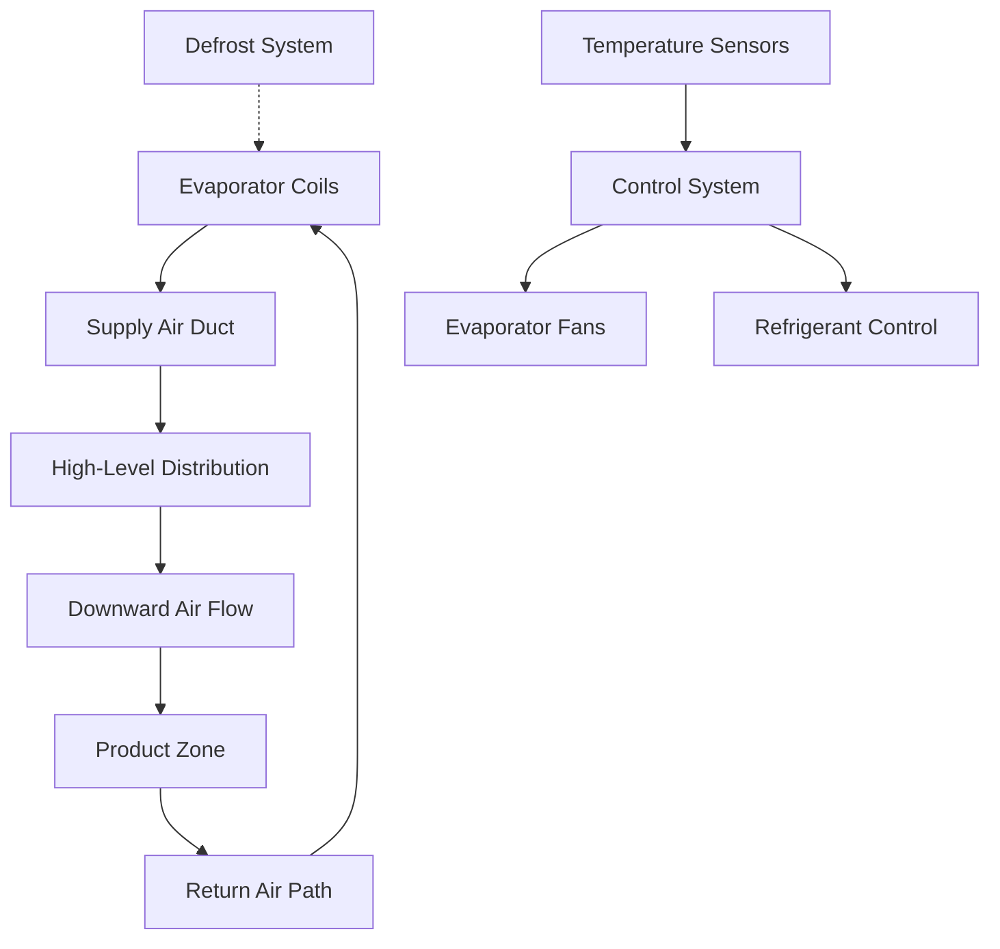
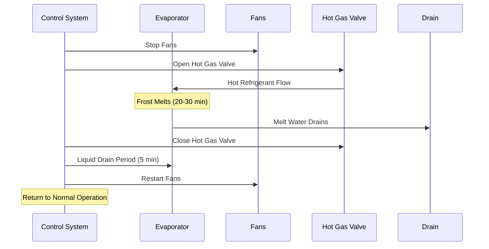

## Storage Temperature Requirements

Frozen poultry storage maintains product quality and extends shelf life through precise temperature control. ASHRAE Refrigeration Handbook recommends storage temperatures of -18°C (0°F) or lower for long-term frozen poultry storage, with -23°C (-10°F) preferred for extended storage periods exceeding six months.

The relationship between storage temperature and product quality degradation follows Arrhenius kinetics. The rate of quality loss doubles approximately every 5-6°C temperature increase above -18°C.

### Temperature Classification

| Storage Type | Temperature Range | Maximum Storage Duration | Quality Retention |
|--------------|-------------------|-------------------------|-------------------|
| Short-term frozen | -15°C to -18°C | 3-6 months | Good |
| Standard frozen | -18°C to -23°C | 6-12 months | Very good |
| Long-term frozen | -23°C to -29°C | 12-24 months | Excellent |
| Ultra-low temperature | Below -29°C | 24+ months | Superior |

## Refrigeration Load Calculations

Total refrigeration load for frozen poultry storage consists of multiple heat gain components that must be quantified for proper system sizing.

### Heat Load Components

The total refrigeration load equation:

$$Q_{total} = Q_{transmission} + Q_{product} + Q_{infiltration} + Q_{equipment} + Q_{personnel}$$

**Transmission Load** through insulated walls, ceiling, and floor:

$$Q_{transmission} = U \cdot A \cdot \Delta T$$

Where U = overall heat transfer coefficient (typically 0.15-0.25 W/m²·K for well-insulated cold storage), A = surface area, ΔT = temperature difference between ambient and storage.

**Product Load** consists of sensible and latent heat removal:

$$Q_{product} = m \cdot [c_p \cdot (T_{in} - T_{storage}) + h_{fg}]$$

For poultry entering at -2°C and freezing to -23°C:
- Specific heat above freezing: 3.52 kJ/kg·K
- Latent heat of fusion: 249 kJ/kg
- Specific heat below freezing: 1.77 kJ/kg·K

**Infiltration Load** from air exchange during door openings represents a significant component in frozen storage. The infiltration heat gain:

$$Q_{infiltration} = \rho \cdot V \cdot f \cdot (h_{outside} - h_{inside})$$

Where ρ = air density, V = room volume, f = air change frequency (typically 0.5-2 changes per day depending on door traffic), h = enthalpy.

## Air Distribution System Design

Proper air circulation maintains uniform temperature distribution while minimizing product dehydration.

### Air Circulation Parameters

| Parameter | Recommended Value | Impact |
|-----------|------------------|---------|
| Air velocity over product | 0.5-1.5 m/s | Quality, dehydration |
| Supply air temperature | -26°C to -29°C | Pull-down capacity |
| Temperature differential | 3-5°C | Humidity maintenance |
| Air changes per hour | 10-20 | Uniformity |

### Evaporator Selection

Evaporator coil design directly affects system performance. Key considerations:

**Fin Spacing**: 6-10 mm fin spacing prevents excessive frost accumulation while maintaining adequate heat transfer surface area. Closer spacing increases capacity but requires more frequent defrost cycles.

**Temperature Differential (TD)**: The difference between evaporating refrigerant temperature and storage air temperature typically ranges from 5-8°C. Lower TD reduces product dehydration but requires larger coil surface area.

The heat transfer relationship:

$$Q = U \cdot A \cdot LMTD \cdot F$$

Where LMTD = logarithmic mean temperature difference, F = correction factor for configuration.

## Defrost System Requirements

Frost accumulation on evaporator coils degrades heat transfer efficiency and must be managed through periodic defrost cycles.

### Defrost Methods Comparison

| Method | Energy Efficiency | Defrost Duration | Storage Impact | Application |
|--------|------------------|------------------|----------------|-------------|
| Hot gas defrost | High | 20-30 minutes | Minimal | Most common |
| Electric defrost | Moderate | 30-45 minutes | Moderate | Small systems |
| Water defrost | Low | 15-25 minutes | Higher | Limited use |
| Off-cycle defrost | Highest | Not applicable | None | Not suitable for -23°C |

### Hot Gas Defrost Design

Hot gas defrost circulates high-pressure, high-temperature refrigerant vapor through evaporator coils. The heat transfer during defrost:

$$Q_{defrost} = \dot{m}_{refrigerant} \cdot (h_{gas,in} - h_{liquid,out})$$

Typical hot gas temperatures: 50-70°C at evaporator inlet.

**Defrost Cycle Frequency** depends on frost accumulation rate, influenced by:
- Door opening frequency and duration
- Air infiltration rate
- Product loading schedule
- Ambient humidity conditions

Standard practice: 2-4 defrost cycles per 24-hour period, each lasting 20-30 minutes.

## Insulation and Vapor Barrier Requirements

Thermal insulation minimizes heat gain and prevents moisture infiltration into insulation layers.

### Insulation Specifications

**Polyurethane Foam Panels**: Most common insulation material with thermal conductivity k = 0.020-0.024 W/m·K.

Required insulation thickness calculation:

$$t = \frac{k \cdot A \cdot \Delta T}{Q_{max}} - \frac{1}{h_{inside}} - \frac{1}{h_{outside}}$$

Typical thicknesses for -23°C storage:
- Walls: 150-200 mm
- Ceiling: 200-250 mm
- Floor: 150-200 mm (with heated floor if ground-supported)

**Vapor Barrier**: Continuous vapor barrier on warm side of insulation prevents moisture migration. Required permeance: less than 0.06 perm (3.5 ng/Pa·s·m²).

## Product Stacking and Air Flow

Proper product arrangement ensures adequate air circulation and uniform temperature distribution.

### Stacking Guidelines

- **Minimum clearances**: 150 mm from walls, 300 mm below ceiling
- **Pallet spacing**: 100-150 mm between pallets
- **Load height**: Maximum 6 m with adequate structural support
- **Air channels**: Maintain 200-300 mm vertical air channels through stacks

**Storage Density**: Typical frozen poultry storage operates at 250-350 kg/m³ effective storage density, accounting for aisles and clearances.

## Energy Efficiency Considerations

Energy consumption in frozen poultry storage represents a significant operational cost.

### Efficiency Measures

| Strategy | Energy Savings | Implementation Cost | Payback Period |
|----------|---------------|---------------------|----------------|
| LED lighting | 50-70% lighting | Low | 1-2 years |
| Variable speed fans | 20-40% fan energy | Moderate | 2-4 years |
| Demand defrost | 10-15% total | Low | 1-3 years |
| Improved insulation | 15-25% total | High | 5-8 years |
| High-efficiency evaporators | 10-20% compressor | Moderate | 3-5 years |

**Coefficient of Performance (COP)** for frozen storage systems:

$$COP = \frac{Q_{evaporator}}{W_{compressor}}$$

Typical COP values: 1.5-2.2 for -23°C evaporating temperature with ammonia refrigerant, lower for HFC refrigerants.

## Safety and Monitoring Systems

Continuous monitoring prevents product loss and ensures worker safety in frozen environments.

**Critical monitoring points**:
- Storage temperature (±0.5°C accuracy)
- Evaporator coil temperature
- Defrost cycle completion
- Door status and alarm
- Refrigerant pressure and level
- Emergency backup power status

**Temperature uniformity mapping**: Conduct quarterly temperature distribution studies to identify warm spots and verify air circulation effectiveness. ASHRAE guidelines recommend maximum temperature variation of ±2°C throughout storage space.

---

*Standards Reference: ASHRAE Refrigeration Handbook, ASHRAE Standard 15 (Safety), International Institute of Ammonia Refrigeration (IIAR) standards for ammonia system design.*
