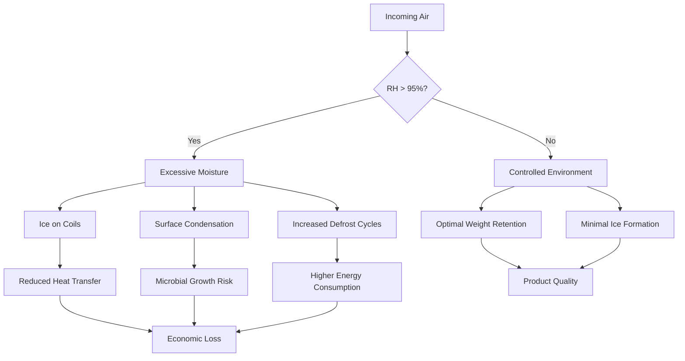
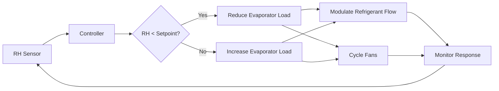

# Humidity Control Importance in Poultry Cold Storage

Precise humidity control in poultry cold storage facilities directly impacts product quality, weight retention, and operational efficiency. The vapor pressure gradient between poultry surface and surrounding air drives moisture migration, requiring calculated control strategies.

## Physical Principles of Moisture Transfer

Moisture transfer from poultry products occurs through diffusion driven by vapor pressure differences. The mass transfer rate follows:

$$\dot{m} = h_m A (P_{sat,surface} - P_{ambient})$$

Where:
- $\dot{m}$ = mass transfer rate (kg/s)
- $h_m$ = mass transfer coefficient (kg/m²·s·Pa)
- $A$ = surface area (m²)
- $P_{sat,surface}$ = saturation pressure at product surface (Pa)
- $P_{ambient}$ = partial pressure of water vapor in air (Pa)

The saturation pressure relationship with temperature follows the Antoine equation:

$$\log_{10}(P_{sat}) = A - \frac{B}{C + T}$$

For water between -30°C and 0°C, typical coefficients are A=8.81, B=1930.7, C=235.0 with pressure in kPa and temperature in °C.

## Weight Loss Mechanisms

Weight loss in stored poultry products results from sublimation (frozen products) or evaporation (chilled products). ASHRAE guidelines specify maintaining relative humidity between 85-95% in poultry coolers and 95-100% in freezers to minimize weight loss.

### Temperature-Humidity Relationships

| Storage Temperature | Target RH | Maximum Weight Loss (%/day) | Primary Concern |
|---------------------|-----------|----------------------------|-----------------|
| -1°C to 0°C (Chill) | 90-95% | 0.15-0.25 | Surface drying |
| -2°C to -4°C (Deep Chill) | 92-97% | 0.10-0.18 | Ice crystal formation |
| -18°C to -23°C (Frozen) | 95-100% | 0.05-0.10 | Freezer burn |
| -29°C to -40°C (Deep Frozen) | 98-100% | 0.02-0.05 | Sublimation |

## Economic Impact of Humidity Control

Weight loss directly affects profitability. For a facility processing 100,000 kg poultry daily with 10-day storage at 0.2% daily weight loss:

$$\text{Daily Loss} = 100{,}000 \text{ kg} \times 0.002 \times 10 \text{ days} = 2{,}000 \text{ kg}$$

At $3.00/kg wholesale value, this represents $6,000 daily loss or $2.19 million annually. Proper humidity control reducing weight loss to 0.1% daily saves $1.095 million annually.

## Ice Formation and Surface Condensation

Excessive humidity creates ice formation on evaporator coils and product surfaces. The frost accumulation rate depends on:

$$\dot{m}_{frost} = \frac{\rho_{air} Q (W_{in} - W_{sat})}{1 + W_{sat}}$$

Where:
- $\rho_{air}$ = air density (kg/m³)
- $Q$ = volumetric air flow rate (m³/s)
- $W_{in}$ = inlet air humidity ratio (kg water/kg dry air)
- $W_{sat}$ = saturation humidity ratio at coil surface temperature

## Microbial Control Through Humidity Management

Relative humidity affects microbial growth rates on poultry surfaces. Water activity ($a_w$) relates to relative humidity:

$$a_w = \frac{P}{P_{sat}} = \frac{RH}{100}$$

Most pathogenic bacteria require $a_w > 0.90$ for growth. At 85% RH ($a_w = 0.85$), bacterial growth becomes negligible, but excessive weight loss occurs. The optimal range of 90-95% RH balances microbial control with moisture retention.

## Humidity Control Strategies

### Evaporator Design Considerations

Coil temperature differential ($\Delta T$) between refrigerant and air affects dehumidification:
- Small $\Delta T$ (3-5°C): Minimal dehumidification, maintains high RH
- Large $\Delta T$ (8-12°C): Significant dehumidification, reduces RH

For poultry storage requiring 92% RH at -1°C, calculate required coil temperature:

At -1°C and 92% RH, dew point ≈ -2.2°C. Using 4°C approach temperature:

$$T_{coil} = T_{dewpoint} - \Delta T = -2.2°C - 4°C = -6.2°C$$

### Air Velocity Impact

High air velocity increases convective heat and mass transfer:

$$h = C \cdot v^{0.8}$$

Where $h$ is the convective coefficient and $v$ is air velocity. Reducing air velocity from 2.5 m/s to 1.5 m/s decreases weight loss by approximately 25-30%.

## Measurement and Control Systems

Accurate humidity measurement requires:

1. **Chilled Mirror Hygrometers**: ±0.1°C dew point accuracy for critical applications
2. **Capacitive Sensors**: ±2% RH accuracy, suitable for general monitoring
3. **Psychrometric Method**: Wet/dry bulb measurements, ±3% RH accuracy

Control strategies include:

## Packaging Considerations

Packaging material selection affects moisture migration:

| Packaging Type | Moisture Vapor Transmission Rate | Application | RH Control Importance |
|----------------|----------------------------------|-------------|----------------------|
| Polyethylene (PE) | 10-15 g/m²/day | Short-term chill | Moderate |
| Polyvinyl Chloride (PVC) | 15-40 g/m²/day | Display packaging | High |
| Vacuum Sealed | <1 g/m²/day | Long-term frozen | Low |
| Unwrapped | N/A (unlimited) | Processing stages | Critical |

## System Integration Requirements

Effective humidity control requires coordinated operation of:

- **Refrigeration System**: Capacity modulation to match sensible and latent loads
- **Evaporator Fan Control**: Variable speed drives for air circulation management
- **Defrost Scheduling**: Frequency optimization based on frost accumulation rates
- **Infiltration Control**: High-speed doors, vestibules, and air curtains
- **Product Loading**: Staged introduction to prevent humidity spikes

ASHRAE Refrigeration Handbook Chapter 31 provides detailed guidance on maintaining optimal conditions for fresh and frozen poultry products, emphasizing that humidity control significantly impacts product quality and economic performance.

## Conclusion

Humidity control in poultry cold storage represents a critical balance between preventing excessive weight loss and avoiding ice formation. The vapor pressure differential drives moisture transfer rates that directly impact product quality and facility economics. Maintaining 90-95% RH in chill storage and 95-100% RH in frozen storage provides optimal conditions while requiring sophisticated control strategies and properly designed refrigeration systems.
