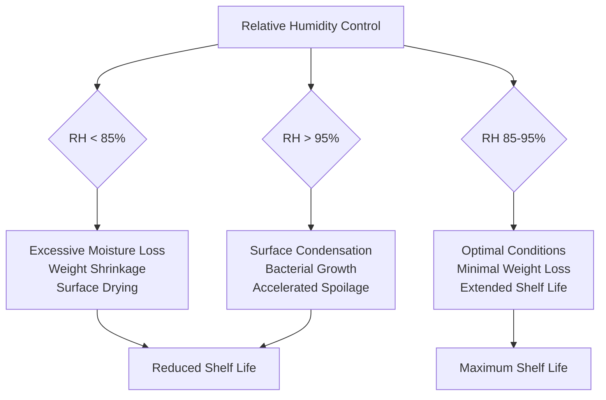
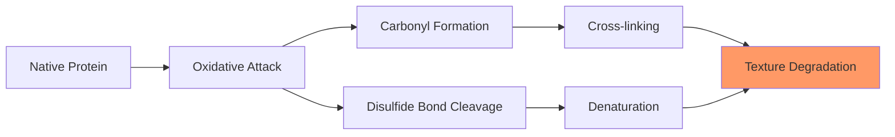

## Overview

Poultry shelf life in cold storage depends on precise control of environmental parameters that govern microbial growth kinetics, biochemical reaction rates, and moisture transfer. The primary factors—temperature, relative humidity, air velocity, and time—interact through thermodynamic and mass transfer principles to determine product quality degradation rates.

## Temperature Effects on Shelf Life

Temperature represents the dominant factor controlling shelf life through its exponential influence on microbial growth and enzymatic activity. The relationship follows the Arrhenius equation for reaction kinetics:

$$k = A \cdot e^{-\frac{E_a}{RT}}$$

Where:
- k = reaction rate constant (day⁻¹)
- A = pre-exponential factor
- E_a = activation energy (J/mol)
- R = universal gas constant (8.314 J/mol·K)
- T = absolute temperature (K)

### Q10 Temperature Coefficient

Microbial growth and spoilage reactions typically exhibit Q10 values between 2 and 3 for poultry, meaning reaction rates double or triple for each 10°C temperature increase:

$$Q_{10} = \left(\frac{k_2}{k_1}\right)^{\frac{10}{T_2-T_1}}$$

| Storage Temperature | Typical Shelf Life | Relative Spoilage Rate |
|---------------------|-------------------|------------------------|
| -2°C to 0°C | 14-21 days | 1.0 (baseline) |
| 2°C to 4°C | 7-14 days | 2.0-2.5 |
| 5°C to 7°C | 3-7 days | 4.0-5.0 |
| 8°C to 10°C | 1-3 days | 8.0-12.0 |

### Temperature Uniformity Requirements

ASHRAE standards specify maximum temperature variation within cold storage spaces:

- Vertical gradient: ≤ 0.5°C per meter of height
- Horizontal variation: ≤ 1.0°C across storage zone
- Time-based fluctuation: ≤ 0.5°C during normal operation

Non-uniform temperature distribution creates localized warm zones where spoilage accelerates exponentially, compromising the entire batch.

## Relative Humidity Control

Water activity (a_w) directly correlates with microbial growth potential and moisture loss rates. The relationship between relative humidity and surface water activity approaches equilibrium:

$$a_w = \frac{RH}{100}$$

### Optimal Humidity Ranges

Fresh poultry requires high relative humidity (85-95%) to minimize weight loss while preventing surface moisture accumulation that promotes bacterial growth.

$$\dot{m}_{loss} = h_m \cdot A \cdot (C_{sat} - C_{\infty})$$

Where:
- ṁ_loss = moisture loss rate (kg/s)
- h_m = convective mass transfer coefficient (m/s)
- A = surface area (m²)
- C_sat = saturation concentration at surface (kg/m³)
- C_∞ = ambient vapor concentration (kg/m³)

## Air Velocity and Heat Transfer

Air velocity affects both heat removal rates and surface moisture evaporation. The convective heat transfer coefficient increases with velocity:

$$h_c = C \cdot v^{0.8}$$

Where:
- h_c = convective heat transfer coefficient (W/m²·K)
- C = empirical constant
- v = air velocity (m/s)

### Recommended Air Velocities

| Storage Configuration | Air Velocity | Purpose |
|----------------------|--------------|---------|
| Initial chilling | 2.0-4.0 m/s | Rapid heat removal |
| Post-chill holding | 0.5-1.0 m/s | Maintain temperature, minimize dehydration |
| Long-term storage | 0.2-0.5 m/s | Prevent stagnation, reduce moisture loss |

Excessive air velocity (> 2.0 m/s in storage) increases evaporative losses without proportional shelf life benefits.

## Microbial Growth Kinetics

Bacterial population growth follows logarithmic kinetics under favorable conditions:

$$N_t = N_0 \cdot e^{\mu t}$$

Where:
- N_t = bacterial population at time t (CFU/g)
- N_0 = initial bacterial load (CFU/g)
- μ = specific growth rate (hour⁻¹)
- t = time (hours)

### Temperature-Dependent Growth Rates

The specific growth rate varies exponentially with temperature according to modified Arrhenius behavior. For *Pseudomonas* species (primary poultry spoilage organisms):

| Temperature (°C) | Generation Time | μ (hour⁻¹) |
|------------------|-----------------|------------|
| 0°C | 24-48 hours | 0.014-0.029 |
| 4°C | 8-12 hours | 0.058-0.087 |
| 10°C | 3-4 hours | 0.173-0.231 |

## Biochemical Degradation Mechanisms

### Lipid Oxidation

Unsaturated fatty acids in poultry lipids undergo autoxidation when exposed to oxygen, producing rancid flavors and warmed-over flavor (WOF):

$$R-H + O_2 \rightarrow ROOH \rightarrow \text{Aldehydes + Ketones}$$

The oxidation rate increases exponentially with temperature and oxygen partial pressure. Storage at temperatures below 0°C significantly reduces oxidation kinetics.

### Protein Oxidation

Protein degradation through oxidative and enzymatic mechanisms alters texture and water-holding capacity:

## Gas Composition Effects

Controlled atmosphere storage extends shelf life through modified gas compositions that inhibit microbial growth and oxidative reactions.

### Modified Atmosphere Packaging (MAP)

Typical gas mixtures for poultry:
- CO₂: 25-35% (bacteriostatic effect)
- O₂: < 1% (prevents oxidation)
- N₂: balance (inert filler)

Carbon dioxide dissolution in tissue moisture creates localized pH reduction:

$$pH_{change} = -\log_{10}\left(1 + \frac{[CO_2]_{dissolved}}{K_a}\right)$$

The bacteriostatic effect of CO₂ extends lag phase duration and reduces maximum specific growth rate (μ_max) for aerobic spoilage organisms.

## Sensory Deterioration Patterns

### Odor Development Sequence

1. **Days 0-3**: Fresh, characteristic poultry odor
2. **Days 4-7**: Neutral to slightly off-odor
3. **Days 8-14**: Sour, acidic notes (at optimal temperature)
4. **Days 15+**: Putrid, sulfurous compounds (H₂S, mercaptans)

Odor development correlates directly with bacterial population reaching 10⁷-10⁸ CFU/g, the threshold for sensory detection.

### Texture Changes

Proteolytic enzyme activity and protein oxidation cause progressive texture softening:

$$\text{Firmness Loss Rate} \propto k_{protease} \cdot e^{-\frac{E_a}{RT}}$$

Maintaining temperature at -2°C to 0°C reduces enzymatic activity by 80-90% compared to 4°C storage.

## Time-Temperature Integration

Cumulative exposure to above-optimal temperatures determines effective shelf life through time-temperature indicators:

$$TTI = \int_0^t k(T) \, dt$$

Where the integration accounts for variable temperature exposure throughout the cold chain. Each degree-hour above optimal temperature reduces remaining shelf life disproportionately.

### Temperature Abuse Effects

| Abuse Scenario | Temperature | Duration | Shelf Life Reduction |
|----------------|-------------|----------|----------------------|
| Minor deviation | 4°C | 4 hours | 10-15% |
| Moderate deviation | 7°C | 2 hours | 20-30% |
| Severe deviation | 10°C | 1 hour | 40-50% |

## Packaging Protection

Barrier properties of packaging materials control oxygen and light transmission rates:

$$J = P \cdot \frac{A \cdot \Delta p}{L}$$

Where:
- J = permeation rate (cm³/s)
- P = permeability coefficient (cm³·cm/cm²·s·cmHg)
- A = surface area (cm²)
- Δp = partial pressure difference (cmHg)
- L = material thickness (cm)

High-barrier films (oxygen transmission rate < 5 cm³/m²·day) effectively double shelf life compared to low-barrier alternatives.

## ASHRAE Design Guidelines

ASHRAE Handbook—Refrigeration specifies design parameters for poultry cold storage:

- Storage temperature: -2°C to 0°C (28-32°F)
- Relative humidity: 90-95%
- Air changes: 20-40 per day minimum
- Product loading: Maximum 250 kg/m³ floor area
- Temperature monitoring: Continuous recording at multiple points

## Practical Implementation

System design must account for all shelf life factors simultaneously:

1. **Precision temperature control**: ±0.5°C through modulating refrigeration capacity
2. **Humidity management**: Humidification systems or high-efficiency evaporator coils with minimal temperature differential
3. **Air distribution**: Uniform velocity fields through computational fluid dynamics optimization
4. **Sanitation protocols**: Regular cleaning to minimize initial microbial loads (N₀)
5. **FIFO inventory management**: First-in-first-out rotation to minimize storage duration

The interaction between these factors creates a complex optimization problem where simultaneous satisfaction of all parameters maximizes shelf life while maintaining energy efficiency and product quality.

## Conclusion

Shelf life maximization requires precise thermodynamic control of temperature, humidity, and air movement while understanding the underlying microbial kinetics and mass transfer phenomena. Temperature remains the primary control variable, but optimization of secondary factors—particularly relative humidity and air velocity—provides additional shelf life extension without energy penalty. Successful cold storage operations integrate these physical principles into coordinated control strategies that maintain product quality from processing through retail distribution.
