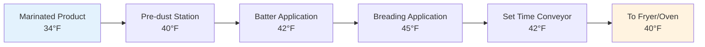
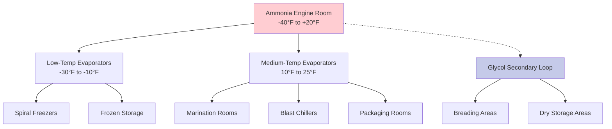

# Further Processing Poultry Refrigeration

Further processing encompasses operations beyond primary chilling: marinating, breading, cooking, freezing, and packaging. Each stage presents distinct refrigeration challenges due to varying heat loads, food safety requirements, and production throughput demands.

## Temperature Requirements by Process Stage

USDA-FSIS mandates strict temperature control throughout further processing to prevent pathogen proliferation, particularly *Salmonella* and *Listeria monocytogenes*.

| Process Stage | Temperature Range | Maximum Hold Time | Critical Control Point |
|---------------|-------------------|-------------------|------------------------|
| Pre-marination holding | 32-38°F (0-3°C) | 2 hours | Pathogen growth prevention |
| Marination | 28-34°F (-2 to 1°C) | 12-24 hours | Salt penetration vs. microbial safety |
| Post-marination drain | 34-38°F (1-3°C) | 1 hour | Surface moisture control |
| Breading line | 38-45°F (3-7°C) | 30 minutes | Batter adhesion optimization |
| Pre-cook holding | 34-40°F (1-4°C) | 1 hour | Preventing premature spoilage |
| Post-cook cooling | 140°F to 40°F in <90 min | N/A | Critical for pathogen control |
| Packaging room | 40-45°F (4-7°C) | Continuous | Condensation prevention |
| Final frozen storage | -10 to 0°F (-23 to -18°C) | Long-term | Quality preservation |

## Marination Room Refrigeration

Marination involves immersing or tumbling poultry in solutions containing salt, phosphates, and flavor compounds. The refrigeration system must maintain temperatures near freezing while managing substantial latent heat loads from open vessels.

### Heat Load Components

Total refrigeration load consists of:

$$Q_{total} = Q_{product} + Q_{infiltration} + Q_{equipment} + Q_{evaporation}$$

Where:
- $Q_{product}$ = Sensible heat removal from incoming poultry
- $Q_{infiltration}$ = Air infiltration from adjoining warmer spaces
- $Q_{equipment}$ = Heat generated by tumblers and conveyors
- $Q_{evaporation}$ = Latent heat from open marinade surfaces

Product cooling load:

$$Q_{product} = \dot{m} \cdot c_p \cdot (T_{in} - T_{final})$$

Where:
- $\dot{m}$ = Mass flow rate of poultry (lb/hr)
- $c_p$ = Specific heat of poultry ≈ 0.79 Btu/(lb·°F) above freezing
- $T_{in}$ = Incoming temperature (typically 38-40°F from primary chill)
- $T_{final}$ = Target marination temperature (32-34°F)

For a production line processing 10,000 lb/hr with 6°F temperature reduction:

$$Q_{product} = 10,000 \times 0.79 \times 6 = 47,400 \text{ Btu/hr}$$

Evaporative load from open marinade tanks contributes significantly:

$$Q_{evap} = \dot{m}_{vapor} \cdot h_{fg}$$

Where $h_{fg}$ = latent heat of vaporization ≈ 1,060 Btu/lb at 32°F.

### Air Distribution Design

Marination rooms require uniform air distribution to prevent stratification and localized warm zones. Design parameters:

- **Air velocity**: 50-150 fpm at working height to minimize draft discomfort for personnel while maintaining temperature uniformity
- **Supply air temperature**: 26-28°F to achieve room temperature of 32-34°F
- **Relative humidity**: 85-90% to reduce product moisture loss
- **Air changes**: 15-25 per hour depending on room geometry and heat load density

## Breading Line Cooling

Breading operations apply batter and coating to marinated products. The area must be cooled sufficiently to maintain product safety while avoiding excessive cooling that compromises batter adhesion.

### Breading Room Design Considerations

**Temperature gradient control**: Gradual temperature increase from 38°F to 45°F optimizes batter viscosity and adhesion. Abrupt temperature changes cause condensation on product surfaces, degrading coating quality.

**Humidity management**: Target 60-70% RH prevents batter drying during set time. Higher humidity causes coating softness; lower humidity produces brittle coatings.

**Equipment heat rejection**: Breading machinery generates 5,000-15,000 Btu/hr depending on motor horsepower. Position supply air diffusers to capture rising heat plumes from equipment.

## Post-Cook Cooling

USDA Appendix B requires cooked poultry cool from 140°F to 40°F within 90 minutes to prevent *Clostridium perfringens* outgrowth. This rapid cooling presents the largest instantaneous refrigeration load in further processing.

### Cooling Rate Calculation

For cooked product mass $m$ cooling from $T_1$ to $T_2$:

$$Q_{cooling} = \frac{m \cdot c_p \cdot (T_1 - T_2)}{\Delta t}$$

For 1,000 lb/hr production with 100°F temperature drop in 1.5 hours:

$$Q_{cooling} = \frac{1,000 \times 0.79 \times 100}{1.5} = 52,667 \text{ Btu/hr}$$

This assumes continuous operation. Peak demand occurs when multiple batches enter simultaneously.

### Cooling Methods Comparison

| Method | Cooling Rate | Floor Space | Energy Use | Capital Cost | Best Application |
|--------|--------------|-------------|------------|--------------|------------------|
| Spiral freezer | 140°F to 40°F in 20-30 min | Compact vertical | High | Very high | High-volume continuous |
| Blast chiller | 140°F to 40°F in 60-90 min | Moderate | Moderate | Moderate | Batch operations |
| Conveyor cooler | 140°F to 40°F in 90-120 min | Large horizontal | Low | Low | Lower-volume continuous |
| Immersion chilling | 140°F to 40°F in 15-25 min | Moderate | Low | Moderate | Products tolerating moisture |

## Blast Chiller Design

Blast chillers use high-velocity cold air (500-1,000 fpm) to maximize convective heat transfer. The convection coefficient increases with air velocity:

$$h = C \cdot v^{0.8}$$

Where $h$ = convection coefficient (Btu/hr·ft²·°F), $v$ = air velocity (fpm), and $C$ = empirical constant depending on product geometry.

Doubling air velocity increases heat transfer by approximately 75%. However, energy consumption for fan operation increases with the cube of velocity, requiring optimization between cooling speed and operating cost.

### Evaporator Selection

Blast chillers require evaporators with:

- **Fin spacing**: 4-6 fins per inch for 0°F to 10°F evaporating temperature
- **Face velocity**: 400-600 fpm to balance heat transfer and pressure drop
- **Defrost cycle**: Hot gas or electric defrost every 4-6 hours
- **Coil material**: Stainless steel or epoxy-coated aluminum for sanitation

Temperature difference (TD) between evaporating refrigerant and supply air typically ranges 10-15°F. Tighter TD improves efficiency but requires larger evaporator coil surface area.

## Packaging Room Climate Control

Packaging operations demand precise temperature and humidity control to prevent condensation on film materials and finished packages.

**Dew point management**: Room air dew point must remain below film surface temperature by minimum 5°F to prevent condensation. For packaging materials at 40°F:

$$T_{dp} < 35°F \text{ (95°F equivalent room condition: 40°F, 45% RH)}$$

**Positive pressurization**: Maintain +0.02 to +0.05 in. w.g. relative to adjacent areas to prevent infiltration of warmer, moisture-laden air.

**Air filtration**: MERV 8 minimum to remove airborne particles that compromise package integrity.

## Refrigeration System Architecture

Further processing facilities typically employ centralized ammonia or cascade systems serving multiple temperature zones through secondary loops or distributed evaporators.

### System Efficiency Optimization

**Floating head pressure control**: Reduce condensing pressure during cool ambient conditions. Each 1°F reduction in condensing temperature decreases compressor energy by approximately 1.5-2%.

**Variable frequency drives**: Install VFDs on compressors and evaporator fans to match capacity with instantaneous load. Potential energy savings of 20-40% compared to constant-speed operation.

**Heat recovery**: Capture compressor discharge heat for hot water generation, facility heating, or cooking processes. Typical COP for heat recovery ranges 3-5.

## Food Safety Integration

ASHRAE Guideline 36 and USDA-FSIS regulations require refrigeration systems integrate with HACCP monitoring:

- **Continuous temperature logging**: Record every CCP with ±1°F accuracy
- **Alarm notification**: Alert personnel when temperature exceeds safe limits
- **Redundancy**: Backup refrigeration capacity or emergency protocols
- **Sanitation compatibility**: Design for washdown, proper drainage, and microbial control

Facility design must facilitate product flow from high-temperature to low-temperature zones without cross-contamination risk, following USDA "high-to-low, raw-to-cooked" separation principles.

## Conclusion

Further processing refrigeration systems must balance conflicting demands: rapid cooling rates for food safety, precise temperature control for quality, energy efficiency for economics, and sanitation requirements for regulatory compliance. Proper system design considering heat load profiles, air distribution, and process integration ensures safe, efficient poultry further processing operations meeting USDA standards and production goals.
