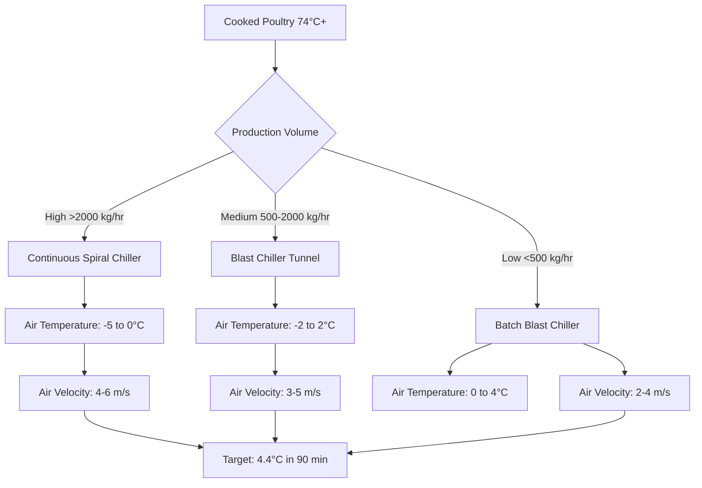

## Overview

Poultry cooking operations generate substantial heat and moisture loads requiring specialized HVAC systems to maintain product safety, worker comfort, and regulatory compliance. Commercial cooking environments demand integrated strategies for heat removal, vapor extraction, contaminant control, and rapid post-cooking cooling.

ASHRAE Handbook—HVAC Applications Chapter 32 (Food Products) provides foundational guidance for food processing environments, while Chapter 34 (Commercial and Industrial Air-Conditioning) addresses high-heat industrial applications.

## Heat Load Calculations

### Sensible Heat from Cooking Equipment

The sensible heat load from cooking equipment depends on equipment type, energy input, and radiation fraction:

$$Q_{sensible} = q_{input} \times F_{usage} \times F_{radiation} \times (1 - F_{latent})$$

Where:
- $Q_{sensible}$ = sensible heat gain (W)
- $q_{input}$ = equipment rated input power (W)
- $F_{usage}$ = usage factor (0.5-1.0 depending on batch vs. continuous)
- $F_{radiation}$ = radiation fraction to space (0.15-0.45)
- $F_{latent}$ = latent heat fraction (0.15-0.35 for poultry cooking)

### Latent Heat from Moisture Release

Poultry releases moisture during cooking through evaporation and drip loss:

$$Q_{latent} = \dot{m}_{evap} \times h_{fg}$$

Where:
- $Q_{latent}$ = latent heat load (W)
- $\dot{m}_{evap}$ = moisture evaporation rate (kg/s)
- $h_{fg}$ = latent heat of vaporization at cooking temperature (≈2257 kJ/kg at 100°C)

Typical moisture loss ranges from 15-25% of raw product weight depending on cooking method and endpoint temperature.

## Cooking Method Comparison

| Cooking Method | Typical Temperature | Moisture Loss | Sensible Heat | Latent Heat | Exhaust CFM per Unit |
|---------------|-------------------|---------------|---------------|-------------|---------------------|
| Oven roasting | 175-205°C | 18-22% | High | Moderate | 800-1200 |
| Deep frying | 165-180°C | 8-12% | Very High | Low | 1000-1500 |
| Steam cooking | 95-105°C | 10-15% | Moderate | Very High | 600-1000 |
| Grilling | 200-260°C | 20-25% | High | Moderate | 1200-1800 |
| Sous vide | 62-74°C | 5-8% | Low | Low | 200-400 |

## Ventilation System Design

### Hood Exhaust Requirements

Commercial cooking hood design follows ASHRAE Standard 154 (Ventilation for Commercial Cooking Operations). Capture velocity requirements depend on hood type and thermal plume characteristics:

$$Q_{exhaust} = V \times A_{face}$$

Where:
- $Q_{exhaust}$ = exhaust flow rate (m³/s)
- $V$ = capture velocity (0.25-0.50 m/s for canopy hoods)
- $A_{face}$ = hood face area (m²)

For high-temperature poultry cooking (grilling, frying), enhanced capture is achieved through:

- Side panels extending 150-300 mm beyond equipment edges
- Hood overhang of 150-300 mm on all open sides
- Minimum 450 mm clearance between cooking surface and hood lip
- Exhaust velocity at hood face: 0.40-0.60 m/s

### Make-Up Air Systems

Replacement air must match exhaust volumes while maintaining space pressurization and temperature control:

$$Q_{makeup} = Q_{exhaust} \times (1 - F_{transfer})$$

Where $F_{transfer}$ represents the fraction of exhaust replaced by transfer air from adjacent spaces (typically 0.05-0.15).

Make-up air delivery strategies:

**Direct discharge systems**: Supply air directly into hood plenum, reducing heating/cooling loads by 30-40%

**Perimeter systems**: Low-velocity diffusers around cooking area periphery (discharge velocity <0.50 m/s)

**Displacement ventilation**: Floor-level supply with thermal stratification, effective for high-ceiling applications

## Post-Cooking Cooling Requirements

### Rapid Chill Protocol

USDA FSIS Appendix B requires cooked poultry products reach 4.4°C within specific timeframes to prevent pathogen growth. The cooling rate depends on product mass and geometry:

$$\frac{T(t) - T_{\infty}}{T_0 - T_{\infty}} = \exp\left(-\frac{hA}{\rho Vc_p}t\right)$$

Where:
- $T(t)$ = product temperature at time $t$ (°C)
- $T_{\infty}$ = cooling medium temperature (°C)
- $T_0$ = initial product temperature (74°C minimum)
- $h$ = convective heat transfer coefficient (W/m²·K)
- $A$ = surface area (m²)
- $\rho$ = product density (kg/m³)
- $V$ = product volume (m³)
- $c_p$ = specific heat capacity (3.5-3.8 kJ/kg·K for cooked poultry)

### Cooling Method Selection

## Space Conditioning Requirements

### Temperature Control

Cooking area temperature targets balance worker comfort with operational efficiency:

- **Active cooking zones**: 20-24°C (maintaining despite 15-20 kW/m² heat density)
- **Post-cook handling**: 10-15°C (slowing microbial growth before packaging)
- **Packaging areas**: 12-16°C (condensation prevention, worker comfort)

### Humidity Management

Relative humidity in cooking areas requires active control:

$$\phi = \frac{p_v}{p_{sat}(T)} \times 100\%$$

Target humidity ranges:
- Cooking zones: 40-55% RH (preventing excessive surface drying)
- Cooling/holding: 75-85% RH (minimizing moisture loss)
- Packaging: 50-60% RH (reducing condensation risk)

Dehumidification loads from steam cooking operations reach 50-80 kg/hr per 1000 kg product throughput. Refrigeration-based dehumidification with heat recovery provides 25-35% energy savings compared to ventilation-only approaches.

## Air Quality Control

### Contaminant Sources

Poultry cooking generates multiple airborne contaminants:

- **Particulate matter**: Fat aerosols, protein particles (0.1-10 μm)
- **Volatile organic compounds**: Aldehydes, ketones from lipid oxidation
- **Combustion products**: CO, CO₂, NOₓ from gas-fired equipment
- **Biological aerosols**: Bacterial fragments, endotoxins

### Filtration Strategy

Multi-stage filtration protects equipment and maintains indoor air quality:

| Stage | Filter Type | Efficiency | Target Contaminant | Pressure Drop |
|-------|------------|-----------|-------------------|---------------|
| Pre-filter | Mesh grease | 60-70% mass | Large droplets >10 μm | 50-100 Pa |
| Secondary | Baffle/cartridge | 85-95% mass | Aerosols 1-10 μm | 150-250 Pa |
| Tertiary | ESP/media | 95-99% mass | Submicron particles | 200-350 Pa |
| Final | MERV 13-14 | 90%+ @ 1 μm | Fine particulates | 200-300 Pa |

Electrostatic precipitators (ESP) in exhaust streams remove 85-95% of submicron grease aerosols while maintaining low pressure drop (150-250 Pa across typical 3 m/s face velocity).

## Energy Recovery Strategies

Exhaust air from cooking operations contains recoverable sensible and latent energy:

$$\varepsilon_{sensible} = \frac{T_{supply,outlet} - T_{supply,inlet}}{T_{exhaust,inlet} - T_{supply,inlet}}$$

Heat recovery technologies applicable to cooking exhaust:

**Run-around coil systems**: Glycol loops transferring heat between exhaust and supply air streams, effectiveness 45-60%, minimal cross-contamination risk

**Plate heat exchangers**: Aluminum or stainless construction with grease-resistant coatings, effectiveness 50-70%, requires frequent cleaning

**Heat pipe exchangers**: Passive transfer through refrigerant-charged tubes, effectiveness 45-55%, excellent reliability for high-grease applications

Typical energy recovery installations achieve 40-60% reduction in makeup air conditioning loads with 2-4 year simple payback in high-volume operations.

## System Integration

### Controls Strategy

Integrated control of cooking area HVAC maintains safety and efficiency:

- **Demand-based ventilation**: Exhaust modulation based on hood temperature or optical smoke detection (20-40% fan energy reduction)
- **Supply/exhaust tracking**: Maintaining -2.5 to -7.5 Pa space pressurization relative to adjacent areas
- **Cooling coordination**: Sequencing post-cook refrigeration with production schedules
- **Temperature interlocks**: Equipment shutdown on zone over-temperature (>30°C for safety)

### Maintenance Considerations

Cooking environment HVAC requires intensive maintenance protocols:

- Hood and duct cleaning: Monthly to quarterly depending on volume
- Grease filter replacement/cleaning: Weekly minimum
- ESP electrode cleaning: Bi-weekly to monthly
- Refrigeration coil cleaning: Monthly (accelerated fouling from airborne grease)
- Makeup air filter changes: Weekly to monthly based on pressure drop monitoring

## Regulatory Compliance

USDA Food Safety and Inspection Service (FSIS) requirements mandate:

- Cooking to minimum internal temperature 74°C (165°F) instantaneous
- Cooling from 54.4°C to 4.4°C within 6 hours for ready-to-eat products
- Environmental monitoring for Listeria in post-cook areas
- Separation of raw and cooked product zones (physical barriers, pressure differentials)

ASHRAE Standard 169 thermal zones inform equipment selection, while local mechanical codes govern exhaust discharge locations and velocities (typically 7.5-10 m/s minimum terminal velocity for grease-laden vapor).
