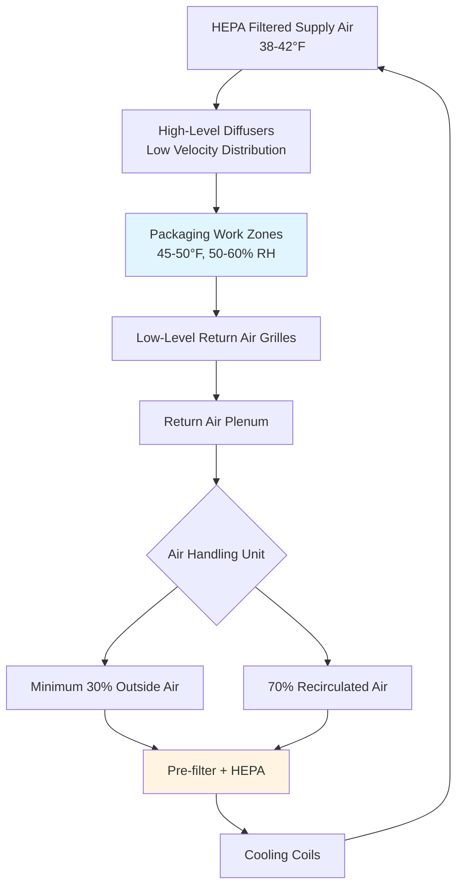

# Packaging and Ready-to-Eat Poultry HVAC Requirements

Packaging and ready-to-eat (RTE) poultry processing areas require the most stringent HVAC controls in food manufacturing facilities. These post-lethality environments must prevent recontamination through precise temperature control, air quality management, and differential pressure cascades while maintaining energy efficiency.

## Thermal Design Requirements

### Temperature and Humidity Control

ASHRAE Handbook - Refrigeration recommends packaging room temperatures between 45-50°F (7-10°C) with relative humidity maintained at 50-60%. The sensible heat ratio (SHR) in these spaces typically ranges from 0.75-0.85 due to moderate latent loads from product moisture and personnel.

The cooling load calculation must account for:

$$Q_{total} = Q_{product} + Q_{equipment} + Q_{lights} + Q_{personnel} + Q_{infiltration} + Q_{ventilation}$$

Where product heat removal dominates:

$$Q_{product} = \dot{m}_{product} \times c_p \times (T_{in} - T_{setpoint}) + \dot{m}_{product} \times h_{fg} \times \Delta\omega$$

For a typical RTE packaging line processing 5,000 lb/hr of cooked product entering at 75°F and cooling to 50°F:

$$Q_{product} = \frac{5000}{60} \times 0.85 \times (75-50) = 1,771 \text{ Btu/min} = 106,250 \text{ Btu/hr}$$

### Air Distribution System Design

Supply air temperatures typically range from 38-42°F to maintain room conditions without creating excessive air velocity over exposed product. Air velocity at work surfaces must not exceed 50 fpm to prevent particle resuspension while maintaining minimum 0.5 fpm to ensure air circulation.

## Air Quality and Filtration

### Multi-Stage Filtration System

RTE packaging areas require HEPA filtration (minimum 99.97% efficiency at 0.3 μm) as the final filtration stage. The complete filtration train includes:

| Filtration Stage | Efficiency | Pressure Drop | Purpose |
|-----------------|------------|---------------|---------|
| Pre-filter (MERV 8) | 70% @ 3.0 μm | 0.2-0.4 in. w.g. | Bulk particulate removal |
| Secondary (MERV 13) | 85% @ 1.0 μm | 0.5-0.8 in. w.g. | Fine dust capture |
| Final (HEPA H13) | 99.97% @ 0.3 μm | 1.0-1.5 in. w.g. | Microbiological control |

Total external static pressure requirements typically range from 3.5-5.0 in. w.g., necessitating high-efficiency plenum fans with VFD control to maintain constant volume despite filter loading.

### Microbial Control Through Air Management

The logarithmic reduction in airborne microbial concentration follows:

$$\frac{C(t)}{C_0} = e^{-\frac{Q \times E}{V} \times t}$$

Where:
- $C(t)$ = concentration at time $t$
- $C_0$ = initial concentration
- $Q$ = airflow rate (CFM)
- $E$ = filter efficiency (0.9997 for HEPA)
- $V$ = room volume (ft³)
- $t$ = time (minutes)

For a 10,000 ft³ packaging room with 10 air changes per hour (ACH):

$$\text{Time to 99% reduction} = \frac{-\ln(0.01) \times V}{Q \times E} = \frac{4.605 \times 10,000}{1,667 \times 0.9997} = 27.6 \text{ minutes}$$

## Differential Pressure Control

### Pressure Cascade Design

RTE packaging rooms must maintain positive pressure relative to adjacent lower-risk areas. USDA FSIS requires documentation of pressure differentials, typically specified as:

| Zone Classification | Pressure Differential | Typical Value |
|-------------------|---------------------|---------------|
| RTE Packaging → Corridor | Positive | +0.03-0.05 in. w.g. |
| Corridor → Raw Processing | Positive | +0.02-0.04 in. w.g. |
| Any Room → Outdoors | Positive | +0.05-0.08 in. w.g. |

The pressure difference is maintained through supply-exhaust balancing:

$$\Delta P = \frac{\rho \times (Q_{supply} - Q_{exhaust})^2}{2 \times A_{leakage}^2 \times C_d^2}$$

Where typical leakage area ratios range from 0.1-0.3% of wall surface area for industrial construction.

### Pressure Monitoring and Alarms

Differential pressure sensors with ±0.001 in. w.g. accuracy must continuously monitor critical boundaries. Control systems should modulate supply fan VFDs to maintain setpoints within ±0.01 in. w.g. Visual magnehelic gauges provide backup indication and USDA inspection verification.

## Ventilation Requirements

### Outside Air Requirements

ASHRAE Standard 62.1 mandates minimum ventilation rates, but RTE facilities typically exceed these minimums for odor control and makeup air:

- Minimum: 0.12 CFM/ft² (based on occupancy and process requirements)
- Typical design: 0.20-0.30 CFM/ft² to accommodate exhaust needs
- Total outside air fraction: 30-50% of supply air

The outside air cooling load in humid climates significantly impacts system capacity:

$$Q_{OA} = 4.5 \times CFM_{OA} \times (h_{outdoor} - h_{supply})$$

For 5,000 CFM of 95°F/75% RH outside air cooled to 40°F supply:

$$Q_{OA} = 4.5 \times 5,000 \times (44.1 - 15.2) = 651,750 \text{ Btu/hr} = 54.3 \text{ tons}$$

## Refrigeration System Configuration

### Dedicated vs. Shared Systems

RTE packaging areas benefit from dedicated refrigeration systems isolated from raw processing to prevent cross-contamination risk through shared condensate or refrigerant systems. Glycol secondary loops provide additional separation when required.

**Comparison of refrigeration approaches:**

| System Type | Advantages | Disadvantages | Typical Application |
|-------------|-----------|---------------|-------------------|
| Direct Expansion | Lower first cost, simpler | Cross-contamination risk | Small facilities (<5,000 ft²) |
| Glycol Secondary | Complete isolation, easier controls | Higher operating cost | Multi-zone facilities |
| Dedicated Chilled Water | Best control, redundancy options | Highest first cost | Large facilities (>20,000 ft²) |

### Evaporator Coil Design

Coil face velocity must not exceed 400 fpm to prevent moisture carryover into HEPA filters. Condensate pans require continuous positive slope (minimum 1/4 in. per foot) with trapped drains terminating outside the RTE zone. Stainless steel construction (304 or 316) is standard for cleanability.

The heat transfer effectiveness for cooling coils in these applications:

$$\varepsilon = \frac{h_{air,in} - h_{air,out}}{h_{air,in} - h_{refrigerant}}$$

Typical effectiveness ranges from 0.65-0.75 for properly sized coils with 4-6 rows.

## Energy Recovery Considerations

Energy recovery between exhaust and outside air streams can reduce operating costs by 25-40%, but must be implemented carefully in RTE environments. Runaround glycol loops or energy recovery wheels with purge sections prevent cross-contamination while recovering sensible and latent energy.

The sensible energy recovery potential:

$$Q_{recovered} = \varepsilon_{HX} \times \dot{m}_{min} \times c_p \times (T_{exhaust} - T_{OA})$$

For a 70% effective heat exchanger with 4,000 CFM airflow and 25°F temperature difference:

$$Q_{recovered} = 0.70 \times 4,000 \times 1.08 \times 25 = 75,600 \text{ Btu/hr} = 6.3 \text{ tons}$$

## Control System Integration

Modern RTE packaging facilities utilize building automation systems (BAS) with:

- Temperature control to ±1°F through PID loops with 30-second update intervals
- Pressure differential control to ±0.01 in. w.g. through supply-exhaust balancing
- Filter differential pressure monitoring with automated alarms at 75% and 100% capacity
- Refrigeration system sequencing to optimize efficiency across varying loads
- Data logging for HACCP compliance and regulatory documentation

The control strategy must prioritize food safety over energy efficiency, with fail-safe modes maintaining positive pressure and minimum ventilation during equipment failures.
