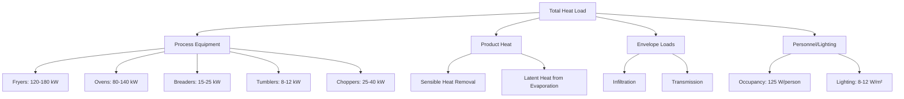
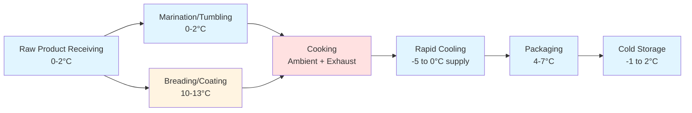

## Overview

Further-processed poultry products require distinct environmental conditions based on product composition, processing method, and microbial safety requirements. HVAC system design must account for the thermal properties of coatings, moisture migration during processing, and heat generation from equipment while maintaining product temperatures below critical growth thresholds for pathogens.

Different product categories—raw breaded, fully cooked, marinated, and seasoned items—present unique challenges in terms of latent heat removal, air velocity control, and temperature stratification management.

## Product Category Temperature Requirements

### Raw Breaded Products

Raw breaded items (nuggets, tenders, patties) must maintain product core temperatures at or below 4°C (40°F) throughout coating application to prevent microbial multiplication and ensure batter adhesion.

**Critical environmental parameters:**

- Breading room air temperature: 10-13°C (50-55°F)
- Relative humidity: 65-75% to prevent batter drying
- Air velocity at product level: 0.15-0.25 m/s (30-50 fpm)
- Product surface temperature during coating: 2-4°C (36-39°F)

The low air velocity requirement prevents coating material displacement while providing adequate convective heat removal. Higher velocities cause uneven coating distribution and excessive product dehydration.

**Heat load from breading operations:**

$$Q_{total} = Q_{product} + Q_{equipment} + Q_{personnel} + Q_{infiltration}$$

Where product heat gain during coating application:

$$Q_{product} = \dot{m} \cdot c_p \cdot \Delta T + \dot{m} \cdot \lambda$$

For breading lines processing 4,500 kg/hr with 25% coating pickup:

- $\dot{m}$ = 1.25 kg/s (product plus coating)
- $c_p$ = 3.52 kJ/(kg·K) (average for breaded poultry)
- $\Delta T$ = temperature rise during processing (typically 1-2°C)
- $\lambda$ = latent heat from moisture evaporation (target minimal)

Equipment heat contribution from breaders, applicators, and conveyors typically adds 45-65 kW for high-capacity lines.

### Fully Cooked Products

Cooked products (grilled strips, roasted pieces, fried items) exit cooking equipment at 74-85°C (165-185°F) internal temperature and require rapid cooling to below 4°C within strict time frames per USDA-FSIS guidelines.

**Cooling rate requirements:**

Products must cool from 54°C to 4°C (130°F to 40°F) within 90 minutes to comply with pathogen growth prevention protocols. This necessitates aggressive refrigeration in spiral freezers or blast chillers.

**Heat removal calculation:**

$$Q_{cooling} = \dot{m} \cdot c_p \cdot (T_{initial} - T_{final}) + \dot{m} \cdot h_{fg} \cdot x_{evap}$$

Where:
- $T_{initial}$ = 75°C (average post-cook temperature)
- $T_{final}$ = 4°C (target storage temperature)
- $h_{fg}$ = 2,260 kJ/kg (latent heat of water vaporization)
- $x_{evap}$ = fraction of moisture evaporated (0.02-0.04)

For a 3,000 kg/hr cooked product line, total refrigeration capacity required approaches 180-220 kW, with evaporator temperatures of -10 to -15°C (14 to 5°F) to achieve adequate temperature differential.

### Marinated and Injected Products

Marination systems introduce brine solutions (3-15% salt concentration) that alter thermal properties and microbial stability. Marinated products must remain at 0-2°C (32-36°F) during tumbling and holding.

**Tumbler room conditions:**

- Air temperature: 4-7°C (39-45°F)
- Relative humidity: 85-90% (prevents surface drying)
- Air changes: 15-20 ACH to remove ethanol vapors from marinades
- Equipment heat gain: 8-12 kW per 500 kg tumbler capacity

Thermal conductivity of marinated meat increases by 15-25% compared to unmarinated product due to higher moisture content and ionic strength, affecting cooling and freezing rates.

### Emulsified Products

Sausages and frankfurters require temperature control during emulsification, stuffing, and linking to maintain protein functionality and prevent fat coalescence. Target emulsion temperature during chopping: -2 to 2°C (28-36°F).

**Processing room requirements:**

- Ambient temperature: 7-10°C (45-50°F)
- Relative humidity: 75-85%
- Bowl chopper heat rejection: 25-40 kW per 300 L capacity
- Stuffer room temperature: 4-7°C (39-45°F)

Mechanical energy input during emulsification converts directly to thermal energy, raising product temperature by 0.8-1.5°C per minute of mixing. Refrigeration systems must compensate for this heat generation to maintain emulsion stability.

## Environmental Control Strategies

### Temperature Stratification Management

Processing rooms with ceiling heights exceeding 4 meters experience significant vertical temperature gradients. Temperature differences of 5-8°C between floor and ceiling levels waste refrigeration capacity and create inconsistent product conditions.

**Destratification approaches:**

| Method | Air Mixing Effectiveness | Energy Impact | Application |
|--------|-------------------------|---------------|-------------|
| Ceiling fans (HVLS) | 65-75% reduction in ΔT | +3-5% fan energy | Large open areas |
| High-velocity jets | 80-90% reduction in ΔT | +8-12% fan energy | Rooms <2,000 m³ |
| Underfloor supply | 85-95% reduction in ΔT | -5-10% cooling energy | New construction |
| Perimeter displacement | 70-80% reduction in ΔT | -2-5% cooling energy | Retrofit applications |

### Humidity Control in Coating Areas

Maintaining 65-75% RH in breading rooms requires precision dehumidification. Excessive humidity (>80%) causes coating clumping and equipment fouling; insufficient humidity (<60%) leads to batter cracking and adhesion failure.

**Moisture balance equation:**

$$\dot{m}_{water,add} = \dot{m}_{infiltration} + \dot{m}_{product} + \dot{m}_{personnel} - \dot{m}_{removal}$$

Dehumidification systems must remove 40-70 kg/hr of moisture in typical breading facilities while reheating supply air to prevent overcooling.

## Equipment Heat Load Contributions

### Cooking Equipment Heat Rejection

Continuous fryers reject 60-70% of burner input as radiant and convective heat to the space. Gas-fired fryers rated at 250 kW input contribute approximately 160 kW to the cooling load, plus an additional 30-40 kW from exhaust hood makeup air sensible heating.

Convection ovens operating at 205°C (400°F) with 100 kW heating capacity typically add 55-70 kW to space cooling loads through insulation losses and door opening cycles.

## Product-Specific Thermal Properties

| Product Type | Specific Heat (kJ/kg·K) | Thermal Conductivity (W/m·K) | Moisture Content (%) | Critical Temperature (°C) |
|--------------|------------------------|------------------------------|---------------------|--------------------------|
| Raw breaded | 3.52 | 0.48 | 62-68 | ≤4 |
| Cooked strips | 3.20 | 0.52 | 58-64 | ≤4 (post-cool) |
| Marinated raw | 3.78 | 0.58 | 72-78 | ≤2 |
| Emulsion (raw) | 3.65 | 0.54 | 65-72 | ≤2 |
| Rotisserie (cooked) | 2.95 | 0.48 | 52-58 | ≤60 (hot hold) |
| Deli sliced | 3.45 | 0.51 | 68-74 | ≤4 |

Thermal property variation affects refrigeration load calculations significantly. A 10% increase in moisture content raises refrigeration requirements by approximately 12-15% due to higher specific heat and latent heat contributions.

## System Design Recommendations

### Refrigeration System Configuration

Multi-evaporator systems with individual temperature control for each processing zone provide optimal flexibility:

- **Breading zone:** Evaporator temperature -5 to 0°C (23-32°F), supply air 10-13°C
- **Cooking zone:** Exhaust ventilation with makeup air conditioning
- **Cooling zone:** Evaporator temperature -10 to -15°C (14-5°F), high air velocity (3-5 m/s)
- **Packaging zone:** Evaporator temperature -2 to 2°C (28-36°F), controlled humidity
- **Emulsification area:** Evaporator temperature -8 to -3°C (18-27°F), supply air 7-10°C

### Air Distribution Design

Product exposure zones require laminar flow patterns with uniform velocity distribution. Supply diffusers should maintain velocity variance within ±10% across the product zone to ensure consistent heat transfer coefficients.

**Recommended air change rates:**

- Breading rooms: 25-35 ACH
- Cooking areas: 40-60 ACH (code-driven by exhaust requirements)
- Cooling tunnels: 60-100 ACH
- Packaging rooms: 20-30 ACH
- Emulsification rooms: 20-28 ACH
- Marination areas: 15-20 ACH

Return air placement at low level (within 0.6 m of floor) in cooling zones captures the coldest, densest air and improves system efficiency by 8-15% compared to ceiling returns.

### Zoning Strategy

Physical separation between temperature zones minimizes cross-contamination of thermal conditions and reduces refrigeration load by 18-25% compared to single-zone designs.

## Compliance and Safety Considerations

ASHRAE Standard 15 governs refrigerant use in food processing facilities. Ammonia systems require machinery room isolation and emergency ventilation meeting IIAR-2 standards. For facilities processing >20,000 kg/day, dual refrigeration systems or emergency backup capacity ensures food safety compliance during equipment failure.

USDA-FSIS requires continuous temperature monitoring with ±0.5°C accuracy in all product contact zones, necessitating calibrated sensors and redundant measurement points at critical control points per HACCP protocols.

Air quality must meet FDA guidelines for airborne particulate levels (<100 particles/m³ >5 μm) in post-cook packaging areas to prevent product contamination.

**Critical control point monitoring:**

- Raw product holding: Temperature every 15 minutes
- Cooking exit: Continuous internal temperature verification
- Cooling phase: Time-temperature recording (90-minute compliance)
- Packaging entry: Product temperature verification ±0.5°C

## Energy Optimization Strategies

Heat recovery from cooking operations provides significant energy savings. Exhaust air from fryers and ovens at 65-95°C can preheat makeup air, reducing heating loads by 40-60% during cold weather operation.

Glycol heat recovery systems capture waste heat from refrigeration condensers (35-45°C) for water heating, sanitation system preheating, and space heating in administrative areas. Energy recovery efficiency reaches 25-35% of total refrigeration rejection heat.

Variable-frequency drives on evaporator fans reduce energy consumption by 30-45% during partial load operation, common during product changeovers and sanitation periods.

## References

- ASHRAE Handbook—Refrigeration, Chapter 31: Food Processing Facilities
- USDA-FSIS: Time-Temperature Tables for Cooking Ready-to-Eat Poultry Products
- ASHRAE Standard 15: Safety Standard for Refrigeration Systems
- IIAR-2: Equipment, Design, and Installation of Closed-Circuit Ammonia Mechanical Refrigerating Systems
- FDA Food Code: Temperature Control Requirements for Potentially Hazardous Foods
