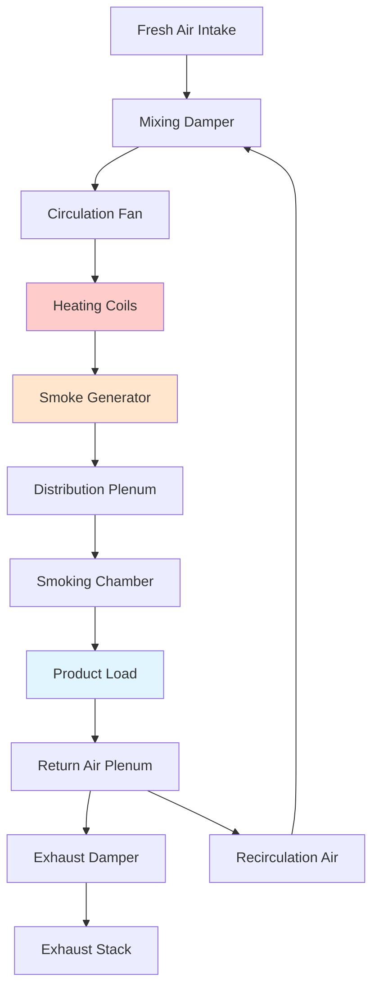

## Overview

Smoking processes in poultry processing require precise environmental control to achieve consistent product quality, food safety, and optimal moisture removal. HVAC systems manage the coupled heat and mass transfer processes that determine smoke penetration, color development, moisture loss, and microbial reduction. The smoking chamber environment balances temperature, relative humidity, smoke density, and air velocity to control both surface drying and internal cooking.

## Smoking Chamber Environmental Requirements

### Temperature Profiles

Poultry smoking typically employs three distinct thermal stages:

**Cold Smoking (68-86°F):** Minimal cooking, primary smoke flavor development, requires precise humidity control to prevent surface condensation while maintaining moisture for smoke adhesion.

**Warm Smoking (86-140°F):** Partial cooking with smoke application, controlled moisture removal initiates pellicle formation, protein denaturation begins affecting smoke particle adhesion.

**Hot Smoking (140-185°F):** Complete thermal processing to safe internal temperature, simultaneous cooking and smoke application, maximum moisture removal rate.

### Humidity Control Fundamentals

The moisture balance in smoking chambers directly affects product yield, texture, and smoke penetration. The psychrometric relationship governing surface moisture:

$$\frac{dm}{dt} = h_m A (P_{sat,surface} - P_{vapor,air})$$

where $h_m$ is the mass transfer coefficient (ft/hr), $A$ is surface area (ft²), $P_{sat,surface}$ is saturation vapor pressure at product surface temperature (psi), and $P_{vapor,air}$ is partial pressure of water vapor in chamber air (psi).

Relative humidity directly controls the vapor pressure gradient. Target humidity ranges:

| Smoking Stage | RH Range | Objective |
|--------------|----------|-----------|
| Initial Drying | 30-50% | Surface moisture removal, pellicle formation |
| Smoke Application | 60-75% | Maintain surface moisture for smoke adhesion |
| Final Cooking | 40-60% | Controlled drying, color development |
| Post-Smoke Cooling | 85-95% | Minimize additional moisture loss |

## Heat Transfer Mechanisms

Heat transfer to poultry products during smoking combines convection, radiation, and conduction components:

$$Q_{total} = Q_{conv} + Q_{rad} + Q_{cond}$$

**Convective Heat Transfer:** Dominant mechanism in forced-air smoking chambers. The convective heat flux:

$$q_{conv} = h_c (T_{air} - T_{surface})$$

where $h_c$ ranges from 8-25 BTU/(hr·ft²·°F) depending on air velocity (100-500 fpm typical).

**Radiative Heat Transfer:** Significant in direct-fired smokehouses where flame and heated surfaces contribute:

$$q_{rad} = \epsilon \sigma (T_{source}^4 - T_{surface}^4)$$

Emissivity $\epsilon$ for poultry surfaces ranges 0.85-0.92. Radiative contribution increases from 15% in cold smoking to 35% in hot smoking operations.

## Smoke Generation and Distribution

### Smoke Production Methods

**Friction Generators:** Hardwood forced against rotating wheel, produces dense smoke at 400-700°F, particles 0.1-1.0 μm diameter, requires 125-250 CFM air supply per generator.

**Smoldering Sawdust:** Traditional method, sawdust smolders at 570-750°F, larger particle distribution (0.5-3.0 μm), intermittent smoke density, minimal air requirement (25-50 CFM).

**Liquid Smoke Atomization:** Atomized liquid smoke in heated air stream (250-350°F), precise density control, uniform distribution, requires compressed air (80-100 psig) and 50-100 CFM carrier air.

### Smoke Distribution System Design

Uniform smoke density throughout the chamber requires controlled air circulation. The mixing effectiveness:

$$\eta_{mix} = \frac{C_{min}}{C_{avg}} \times 100\%$$

where $C_{min}$ is minimum smoke concentration and $C_{avg}$ is average concentration. Target mixing effectiveness exceeds 85% for consistent product quality.

Air circulation rates: 50-150 air changes per hour depending on loading density. Higher circulation improves uniformity but increases surface drying rate.

## Airflow and Circulation Patterns

### Circulation System Design

Forced-air smokehouses employ centrifugal fans circulating air through heating coils and smoke generators. The required fan capacity:

$$CFM = \frac{Chamber\ Volume \times ACH}{60}$$

For a 1,000 ft³ chamber at 100 ACH: CFM = (1,000 × 100)/60 = 1,667 CFM.

Static pressure requirements range 0.5-2.0 in. w.c. depending on coil configuration, product loading, and damper positions.

### Flow Pattern Optimization

Vertical airflow (top-down or bottom-up) provides superior uniformity for rack-hung products compared to horizontal flow. The velocity profile at product height should maintain 100-300 fpm for adequate heat transfer without excessive surface drying.

## Exhaust and Ventilation Control

### Exhaust Rate Determination

Exhaust air removes excess moisture and maintains target humidity. The required exhaust flow based on moisture removal:

$$CFM_{exhaust} = \frac{W_{evap}}{60 \times \rho_{air} \times (W_{sat} - W_{inlet})}$$

where $W_{evap}$ is moisture evaporation rate (lb/hr), $\rho_{air}$ is air density (lb/ft³), $W_{sat}$ is humidity ratio at saturation at chamber temperature (lb water/lb dry air), and $W_{inlet}$ is inlet air humidity ratio (lb water/lb dry air).

Typical exhaust rates: 10-30% of total circulation during active smoking, increased to 40-60% during high-temperature cooking phases.

### Pressure Control

Smoking chambers operate at slight negative pressure (-0.02 to -0.10 in. w.c.) relative to surrounding areas to prevent smoke migration. This requires modulating exhaust dampers based on differential pressure sensors.

## Energy Recovery Considerations

### Heat Recovery from Exhaust

Exhaust air at 140-185°F and high humidity presents heat recovery opportunities. Air-to-air heat exchangers (plate or rotary) recover 50-70% of exhaust energy while preventing cross-contamination.

Recovered energy preheats fresh air makeup, reducing heating coil load:

$$Q_{recovered} = CFM_{exhaust} \times \rho_{air} \times c_p \times \epsilon \times (T_{exhaust} - T_{ambient})$$

where $\epsilon$ is heat exchanger effectiveness (0.50-0.70 typical).

### Condensate Management

High exhaust humidity condenses in ductwork and stacks. Condensate drains require proper slope (¼ in./ft minimum) and trap design to prevent air leakage while draining condensate containing smoke residue and organic compounds.

## Control System Architecture

### Temperature Control Strategy

Multi-stage heating control maintains setpoint during varying load conditions:

1. **Modulating steam/hot water valve** for precise control (±2°F)
2. **Variable frequency drive on circulation fan** affects convective heat transfer coefficient
3. **Fresh air/recirculation damper modulation** provides coarse temperature trimming

### Humidity Control Implementation

Dry-bulb and wet-bulb temperature sensors enable psychrometric calculation of relative humidity. Control loop modulates:

- **Exhaust damper position** (primary control)
- **Steam injection** (rapid humidity increase when needed)
- **Fresh air intake** (humidity reduction)

Response time: 30-90 seconds for ±5% RH adjustment at steady-state temperature.

## Food Safety and USDA Compliance

USDA-FSIS regulations (9 CFR Part 381) mandate specific time-temperature combinations for poultry products. For ready-to-eat smoked poultry:

- Minimum internal temperature: 165°F instantaneous, or
- Time-temperature combinations per Appendix A

HVAC systems must provide uniform heating throughout the chamber with verification through multiple product temperature probes. Temperature uniformity within ±5°F throughout the load ensures all products receive adequate thermal processing.

## Conclusion

Effective HVAC control in poultry smoking operations integrates thermal management, humidity control, smoke distribution, and airflow optimization. Understanding the coupled heat and mass transfer mechanisms enables design of systems that consistently produce safe, high-quality smoked poultry products while maximizing energy efficiency and throughput. Proper sensor placement, control algorithm tuning, and routine calibration ensure long-term performance and regulatory compliance.
