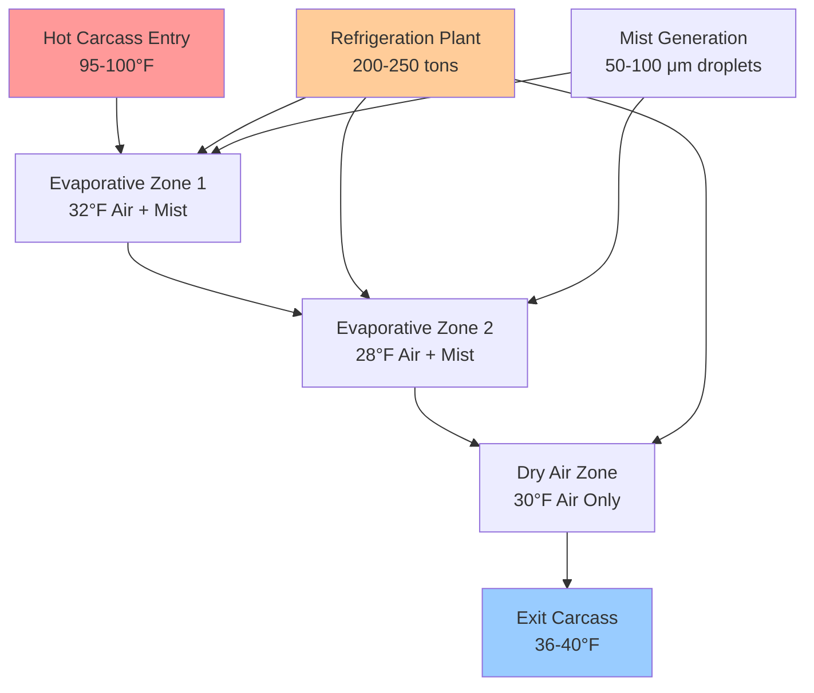
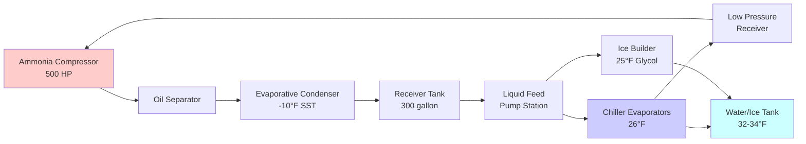
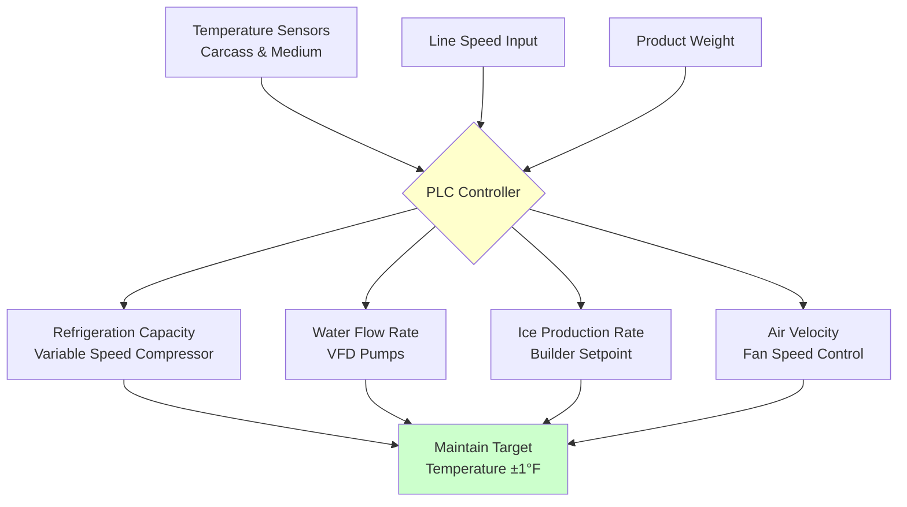

## Overview

Poultry chilling represents the critical thermal transition between slaughter processing (internal temperature 104-107°F) and storage (28-32°F). The chilling process must rapidly reduce carcass temperature to below 40°F within prescribed timeframes while maintaining microbiological safety, product quality, and yield. The thermal dynamics involve simultaneous heat and mass transfer with phase change considerations for both water absorption and ice formation.

## Fundamental Heat Transfer Mechanisms

### Cooling Load Components

The total heat removal requirement encompasses multiple thermal contributions:

$$Q_{total} = Q_{sensible} + Q_{respiration} + Q_{metabolism} + Q_{equipment}$$

For a typical 4.5 lb broiler carcass, the primary sensible cooling load:

$$Q_{sensible} = m \cdot c_p \cdot \Delta T$$

Where:
- m = carcass mass (4.5 lb = 2.04 kg)
- c_p = specific heat of poultry (3.4 kJ/kg·K)
- ΔT = temperature reduction (40°C typical)

$$Q_{sensible} = 2.04 \times 3.4 \times 40 = 277 \text{ kJ per carcass}$$

For a processing line handling 140 birds per minute (8,400 birds/hr), the continuous cooling load:

$$Q_{process} = \frac{277 \times 8400}{3600} = 646 \text{ kW} = 184 \text{ tons refrigeration}$$

### Chilling Rate Dynamics

The cooling rate follows Newton's Law of Cooling modified for convective heat transfer:

$$\frac{dT}{dt} = -h \cdot \frac{A}{m \cdot c_p} \cdot (T - T_{\infty})$$

Where:
- h = convective heat transfer coefficient (W/m²·K)
- A = surface area (m²)
- T∞ = chilling medium temperature

## Immersion Chilling Systems

### Design Principles

Immersion chillers utilize continuous or batch agitated water tanks at 32-34°F. Turbulent water flow enhances heat transfer coefficients to 200-400 W/m²·K, enabling rapid cooling. USDA regulations mandate maximum water absorption of 8% for whole broilers.

**Primary Design Parameters:**

| Parameter | Specification | Basis |
|-----------|--------------|-------|
| Water temperature | 32-34°F | USDA requirement |
| Residence time | 45-60 minutes | Carcass size dependent |
| Water velocity | 4-8 ft/s | Turbulent flow regime |
| Ice addition rate | 15-25% of production weight | Temperature maintenance |
| Water renewal | 0.5-1.0 gal/bird | Sanitation standard |

### Thermal Performance Calculation

For a counterflow immersion chiller with carcass entry at 95°F and exit at 38°F:

$$\Delta T_{lm} = \frac{(T_{in} - T_{w,out}) - (T_{out} - T_{w,in})}{\ln\left(\frac{T_{in} - T_{w,out}}{T_{out} - T_{w,in}}\right)}$$

With water temperatures ranging 32-36°F:

$$\Delta T_{lm} = \frac{(95 - 36) - (38 - 32)}{\ln\left(\frac{59}{6}\right)} = \frac{53}{2.28} = 23.2°F$$

Required heat transfer area per carcass:

$$A = \frac{Q}{h \cdot \Delta T_{lm}} = \frac{277,000 \text{ J}}{300 \text{ W/m²·K} \times 12.9 \text{ K} \times 3600 \text{ s}} = 0.020 \text{ m²}$$

### Ice Production Requirements

Maintaining water temperature requires continuous ice addition. For 8,400 birds/hr with 277 kJ removal per bird:

$$m_{ice} = \frac{Q_{total}}{h_{fusion}} = \frac{646,000 \text{ W}}{334,000 \text{ J/kg}} = 1.93 \text{ kg/s} = 15,300 \text{ lb/hr ice}$$

## Air Chilling Systems

### Operating Characteristics

Air chilling systems use high-velocity refrigerated air (28-32°F) at 500-1000 fpm. Heat transfer coefficients (15-40 W/m²·K) are significantly lower than immersion methods, requiring 90-180 minute residence times.

**Air Chiller Design Specifications:**

| Component | Value | Notes |
|-----------|-------|-------|
| Air temperature | 28-32°F | Evaporator dewpoint 24-26°F |
| Air velocity | 500-1000 fpm | Over carcass surface |
| Relative humidity | 90-95% | Moisture loss control |
| Refrigeration capacity | 1.5-2.0 tons/1000 lb/hr | System dependent |
| Fan power | 0.15-0.25 hp/1000 CFM | Static pressure overcome |

### Heat Transfer Analysis

Convective heat transfer for air flow over suspended carcasses:

$$h = 10.45 - v + 10v^{0.5}$$

For air velocity v = 3 m/s (590 fpm):

$$h = 10.45 - 3 + 10(3)^{0.5} = 24.8 \text{ W/m²·K}$$

Cooling time estimation using lumped capacitance method:

$$t = \frac{m \cdot c_p}{h \cdot A} \ln\left(\frac{T_i - T_{\infty}}{T_f - T_{\infty}}\right)$$

$$t = \frac{2.04 \times 3400}{24.8 \times 0.12} \ln\left(\frac{95 - 30}{40 - 30}\right) = 2331 \times 2.26 = 5268 \text{ s} = 88 \text{ minutes}$$

## Evaporative Air Chilling

### Hybrid System Thermodynamics

Evaporative air chilling introduces fine water mist into chilled air streams, combining sensible and latent heat transfer mechanisms. The evaporative component provides enhanced heat transfer coefficients (40-80 W/m²·K) while limiting water absorption to 2-4%.

### Performance Comparison

| Chilling Method | Time (min) | Yield Loss (%) | Water Use (gal/bird) | Energy (kWh/1000 lb) | Capital Cost |
|-----------------|------------|----------------|----------------------|----------------------|--------------|
| Immersion | 45-60 | -2 to +4 | 0.5-1.0 | 8-12 | Low |
| Air | 90-180 | 1.5-2.5 | 0 | 15-25 | High |
| Evaporative | 60-90 | 0-1.5 | 0.1-0.3 | 10-18 | Medium-High |
| CO₂ Cryogenic | 15-30 | 2.0-3.5 | 0 | 45-65 | Very High |

## Refrigeration System Design

### System Configuration

### Evaporator Selection

For immersion chiller applications, plate-type or shell-and-tube evaporators submerged in ice/water slurry provide optimal heat transfer. Required evaporator capacity:

$$Q_{evap} = Q_{process} \times SF$$

Where SF = safety factor (1.15-1.25):

$$Q_{evap} = 646 \text{ kW} \times 1.2 = 775 \text{ kW} = 220 \text{ tons}$$

Evaporator surface area calculation with overall heat transfer coefficient U = 800 W/m²·K:

$$A_{evap} = \frac{Q_{evap}}{U \cdot \Delta T_{evap}} = \frac{775,000}{800 \times 8} = 121 \text{ m²}$$

## Control Systems and Monitoring

### Critical Control Points

Temperature monitoring per USDA 9 CFR 381.66 requires:

- Carcass core temperature ≤ 40°F within 4 hours post-evisceration
- Maximum 16-hour cumulative time from slaughter to 40°F
- Continuous water temperature recording (immersion systems)
- Air temperature and RH monitoring (air systems)

**Control Strategy:**

## Water Treatment and Sanitation

### Antimicrobial Systems

USDA permits antimicrobial interventions in chiller water:

- Chlorine: 20-50 ppm free available chlorine
- Peracetic acid: 200-2000 ppm
- Chlorine dioxide: 3-5 ppm
- Acidified sodium chlorite: 500-1200 ppm

Water quality parameters affect both food safety and heat transfer efficiency. Suspended solids reduce effective heat transfer coefficients by 10-30%.

## Energy Efficiency Considerations

### Specific Energy Consumption

Benchmark energy performance for various chilling methods:

$$SEC = \frac{E_{total}}{m_{product}}$$

Target values (kWh per 1000 lb throughput):
- Optimized immersion: 8-10 kWh
- Standard immersion: 10-14 kWh
- Air chilling: 15-25 kWh
- Evaporative air: 12-18 kWh

Efficiency improvements through:
- Variable speed compressors (20-35% savings)
- Heat recovery to warm process water (10-15% savings)
- Evaporative condenser optimization (5-10% savings)
- Thermal storage for demand management (load shifting)

## ASHRAE and Regulatory Standards

Key references for poultry chilling system design:

- **ASHRAE Handbook - Refrigeration Chapter 31**: Poultry Products processing and refrigeration requirements
- **USDA 9 CFR 381.66**: Temperatures and chilling procedures
- **USDA 9 CFR 381.93**: Standards for water absorption
- **NSF/ANSI 3**: Commercial spray-type warewashing equipment (water system sanitation)
- **IIAR 2**: Equipment, design, and installation of closed-circuit ammonia mechanical refrigerating systems

## Conclusion

Poultry chilling system design balances thermal performance, microbiological safety, product quality, regulatory compliance, and economic viability. Immersion chilling provides rapid heat removal with lower capital and operating costs but requires substantial water use and treatment. Air chilling eliminates water absorption concerns at the expense of longer residence times and higher energy consumption. Hybrid evaporative systems offer intermediate performance with optimized resource utilization. Proper refrigeration system design, control integration, and sanitation protocols ensure consistent product temperature reduction while meeting USDA requirements and maintaining processing efficiency.
