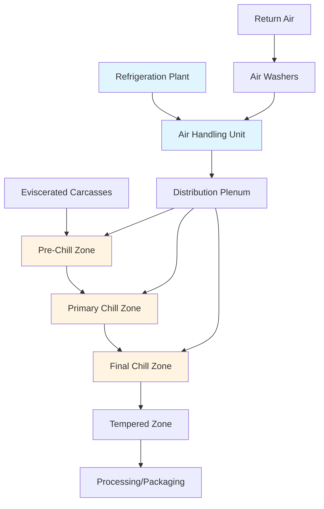
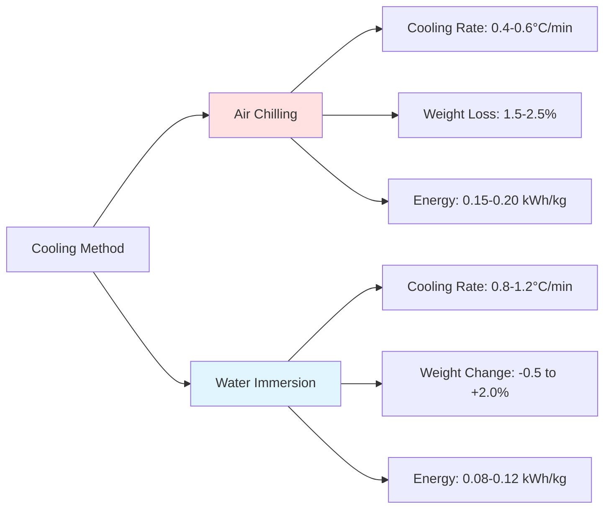

# Air Chilling Systems for Poultry Processing

Air chilling represents an alternative method to immersion chilling for reducing poultry carcass temperature from approximately 38-40°C post-evisceration to 4°C or below within regulatory time limits. This approach utilizes forced convection with refrigerated air to extract heat without water contact, fundamentally altering product characteristics and processing requirements.

## Thermodynamic Principles

The heat removal process in air chilling follows convective heat transfer principles. The rate of cooling depends on the temperature differential between the carcass surface and the chilling air, the convective heat transfer coefficient, and the surface area exposed to airflow.

### Heat Transfer Calculation

The sensible heat removal from a poultry carcass is calculated using:

$$Q = m \cdot c_p \cdot \Delta T$$

Where:
- Q = total heat removal (kJ)
- m = carcass mass (kg)
- c_p = specific heat of poultry (3.3 kJ/kg·K)
- ΔT = temperature change (K)

The convective heat transfer rate is expressed as:

$$\dot{Q} = h \cdot A \cdot (T_s - T_a)$$

Where:
- $\dot{Q}$ = heat transfer rate (W)
- h = convective heat transfer coefficient (10-40 W/m²·K)
- A = surface area (m²)
- T_s = surface temperature (°C)
- T_a = air temperature (°C)

## System Design Components

Air chilling systems consist of several integrated components that work together to achieve rapid, uniform cooling.

### Chilling Chamber Configuration

Air chilling chambers employ multi-zone designs with progressively lower temperatures. The typical configuration includes:

**Zone Temperature Profile:**

| Zone | Air Temperature | Velocity | Residence Time | Purpose |
|------|----------------|----------|----------------|---------|
| Pre-Chill | 2-4°C | 1.5-2.5 m/s | 15-20 min | Surface moisture reduction |
| Primary Chill | -2 to 0°C | 2.5-4.0 m/s | 60-90 min | Core temperature reduction |
| Final Chill | -1 to 1°C | 2.0-3.0 m/s | 30-45 min | Temperature equilibration |
| Tempering | 2-4°C | 1.0-1.5 m/s | 15-25 min | Surface temperature stabilization |

## Air Distribution System

Proper air distribution ensures uniform cooling across all carcasses. The system must deliver consistent velocity and temperature throughout the chilling space.

### Air Velocity Requirements

Air velocity significantly affects the convective heat transfer coefficient. The relationship follows empirical correlations for flow over irregular surfaces:

$$h = C \cdot v^{0.8}$$

Where C is a constant dependent on surface geometry and v is air velocity (m/s). Higher velocities increase heat transfer but also increase fan power consumption and moisture loss from the product.

### Refrigeration Load Calculation

The total refrigeration load includes multiple components:

$$Q_{total} = Q_{product} + Q_{respiration} + Q_{transmission} + Q_{air} + Q_{equipment}$$

**Product Load:**
For a processing line handling 12,000 birds per hour with an average mass of 2.5 kg:

$$Q_{product} = \frac{12000 \times 2.5 \times 3.3 \times (38-4)}{3600} = 935 \text{ kW}$$

This represents the dominant load component in air chilling systems.

## System Performance Characteristics

Air chilling systems exhibit distinct performance characteristics compared to immersion chilling methods.

### Cooling Rate Comparison

### ASHRAE Guidelines

ASHRAE Handbook—Refrigeration Chapter 31 specifies recommended practices for poultry processing refrigeration. Key requirements include:

- Core temperature reduction to 4°C within 4 hours post-slaughter
- Maintenance of carcass surface temperature above -1.5°C to prevent freezing
- Air temperature control within ±1°C to ensure uniform cooling
- Relative humidity maintained at 90-95% to minimize moisture loss

## Equipment Considerations

### Refrigeration System

Air chilling systems typically employ ammonia or low-GWP HFC refrigeration systems operating at evaporator temperatures of -8 to -12°C. The evaporator design must handle high moisture loads from product cooling and provide sufficient capacity for peak demand periods.

**Evaporator Selection Criteria:**

| Parameter | Specification | Rationale |
|-----------|--------------|-----------|
| Fin spacing | 6-8 mm | Prevents frost bridging |
| Face velocity | 2.0-2.5 m/s | Balances capacity and pressure drop |
| TD (air-refrigerant) | 6-8 K | Minimizes air temperature |
| Defrost cycle | Hot gas, 3-4 times/day | Removes accumulated frost |

### Fan Systems

High-efficiency axial fans deliver the required air volume at 100-300 Pa static pressure. Variable frequency drives optimize energy consumption by modulating airflow based on product load and temperature setpoints.

The fan power requirement is calculated as:

$$P_{fan} = \frac{\dot{V} \cdot \Delta p}{\eta_{fan} \cdot \eta_{motor}}$$

Where:
- $\dot{V}$ = volumetric flow rate (m³/s)
- Δp = static pressure (Pa)
- η = efficiency (decimal)

## Energy Efficiency Optimization

Several strategies improve air chilling system efficiency:

1. **Multi-stage cooling**: Progressive temperature reduction reduces peak refrigeration load
2. **Heat recovery**: Extract heat from condensers for facility heating or hot water generation
3. **Variable capacity control**: Match refrigeration capacity to instantaneous load
4. **Air recirculation**: Blend return air with fresh air to reduce conditioning load
5. **Evaporative pre-cooling**: Use direct evaporative cooling in pre-chill zones where moisture addition is acceptable

### Comparative Energy Analysis

Air chilling systems consume 25-40% more energy than immersion systems due to:

- Lower heat transfer coefficient requiring longer residence time
- Additional fan power for air circulation
- Higher refrigeration load from sensible heat removal without evaporative assist

However, elimination of wastewater treatment and water heating requirements partially offset this energy penalty.

## Process Control and Monitoring

Automated control systems regulate air temperature, velocity, and zone timing to maintain consistent product quality. Critical monitoring points include:

- Carcass core temperature at each zone exit
- Air temperature and velocity throughout distribution system
- Refrigeration system suction and discharge pressures
- Fan power consumption and VFD frequency
- Product weight loss through integrated scale systems

Modern installations employ PLC-based control with SCADA visualization, enabling real-time optimization and data logging for HACCP compliance.

## Regulatory and Food Safety Considerations

Air chilling systems must comply with USDA-FSIS regulations requiring continuous temperature monitoring and documentation. The dry surface condition produced by air chilling reduces pathogen survival compared to wet-chill methods, contributing to improved microbiological safety when properly implemented.
