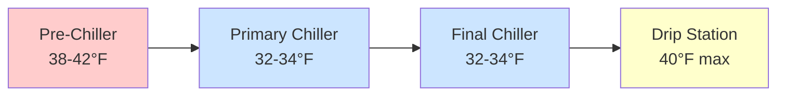

## Fundamentals of Poultry Chilling Temperature Control

Temperature control during poultry chilling represents a critical intersection of food safety, product quality, and energy efficiency. The fundamental objective is to reduce the carcass temperature from approximately 105°F (40.6°C) post-processing to 40°F (4.4°C) or below within specified time limits to prevent microbial growth while minimizing moisture loss and maintaining product quality.

The cooling process follows Newton's Law of Cooling, modified for the complex geometry and variable thermal properties of poultry carcasses:

$$\frac{dT}{dt} = -hA \frac{(T - T_{\infty})}{mc_p}$$

where $h$ is the convective heat transfer coefficient, $A$ is the effective surface area, $T$ is the carcass temperature, $T_{\infty}$ is the chilling medium temperature, $m$ is the mass, and $c_p$ is the specific heat capacity.

## Regulatory Temperature Requirements

USDA-FSIS regulations mandate specific temperature endpoints and time-temperature profiles for poultry chilling operations. The regulations distinguish between different chilling methods and carcass sizes:

| Carcass Weight | Maximum Temperature | Time Limit |
|----------------|-------------------|------------|
| ≤2 lb (0.9 kg) | 40°F (4.4°C) | 4 hours |
| 2-4 lb (0.9-1.8 kg) | 40°F (4.4°C) | 6 hours |
| 4-8 lb (1.8-3.6 kg) | 40°F (4.4°C) | 8 hours |
| >8 lb (3.6 kg) | 40°F (4.4°C) | 8-10 hours |

Air chilling systems must achieve internal temperatures of 40°F or less, while immersion systems must maintain chiller water temperatures between 32-34°F (0-1.1°C) to ensure adequate heat removal rates.

## Immersion Chilling Temperature Control

Immersion chillers utilize ice-water slurries to achieve rapid heat transfer through direct contact between the cooling medium and carcass surface. The temperature control strategy involves three distinct zones:

The pre-chiller removes initial heat load and reduces biological contamination through mechanical washing action. Temperature control maintains 38-42°F to prevent thermal shock while achieving 50-60% of total temperature reduction. The primary and final chillers operate at 32-34°F with residence times calculated using:

$$t_{residence} = \frac{V_{tank} \times occupancy}{Q_{product}}$$

where $V_{tank}$ is tank volume, occupancy is the fraction of volume filled with product, and $Q_{product}$ is the product flow rate in birds per hour.

Ice addition rates must compensate for heat load from incoming product, mechanical agitation, and ambient heat gain:

$$\dot{m}_{ice} = \frac{Q_{product} + Q_{mechanical} + Q_{ambient}}{\lambda_{fusion}}$$

where $\lambda_{fusion}$ is the latent heat of fusion for ice (144 BTU/lb or 335 kJ/kg).

## Air Chilling Temperature Control

Air chilling systems rely on forced convection to remove heat from suspended carcasses. Temperature control requires precise management of air temperature, velocity, and humidity to balance cooling rate against moisture loss.

The cooling rate in air chilling depends on the Biot number, which characterizes the ratio of internal thermal resistance to external convective resistance:

$$Bi = \frac{hL_c}{k}$$

where $L_c$ is the characteristic length (typically half-thickness of breast muscle) and $k$ is the thermal conductivity of poultry tissue (approximately 0.25 BTU/hr·ft·°F or 0.43 W/m·K).

### Multi-Stage Air Chilling Temperature Profile

| Stage | Air Temperature | Air Velocity | Relative Humidity | Duration |
|-------|----------------|--------------|-------------------|----------|
| Stage 1 | 28-30°F (-2 to -1°C) | 800-1000 fpm | 95-98% | 60-90 min |
| Stage 2 | 32-34°F (0-1°C) | 600-800 fpm | 90-95% | 90-120 min |
| Stage 3 | 34-36°F (1-2°C) | 400-600 fpm | 85-90% | 60-90 min |

The initial high-velocity, high-humidity stage prevents surface freezing while maximizing heat removal. Subsequent stages reduce air velocity to minimize moisture loss while completing the cooling process.

## Temperature Monitoring and Control Systems

Modern poultry chilling operations employ multilayered temperature control systems incorporating:

**Distributed Temperature Sensing**: RTD (Resistance Temperature Detector) sensors positioned at strategic locations provide continuous monitoring:
- Incoming product temperature (±0.5°F accuracy)
- Chiller medium temperature at inlet, mid-point, and exit (±0.2°F accuracy)
- Final product core temperature (±0.5°F accuracy)

**Proportional-Integral-Derivative (PID) Control**: Temperature setpoints are maintained through PID algorithms that modulate refrigeration capacity, ice addition rates, or air flow rates. The control output follows:

$$u(t) = K_p e(t) + K_i \int_0^t e(\tau)d\tau + K_d \frac{de(t)}{dt}$$

where $e(t)$ is the error between setpoint and measured temperature, and $K_p$, $K_i$, $K_d$ are the proportional, integral, and derivative gain constants.

**Cascade Control Architecture**: A master controller regulates final product temperature by adjusting setpoints for slave controllers managing refrigeration equipment, ice banks, or variable frequency drives on circulation pumps and fans.

## Heat Transfer Considerations

The overall heat transfer rate in poultry chilling systems is governed by:

$$Q = UA \Delta T_{lm}$$

where $U$ is the overall heat transfer coefficient, $A$ is the effective heat transfer area, and $\Delta T_{lm}$ is the log-mean temperature difference between the carcass and cooling medium.

For immersion chilling, $U$ ranges from 50-80 BTU/hr·ft²·°F (280-450 W/m²·K) depending on agitation intensity. Air chilling systems achieve $U$ values of 15-25 BTU/hr·ft²·°F (85-140 W/m²·K) under typical operating conditions.

The thermal mass of the poultry carcass creates lag in the temperature response, requiring feed-forward control strategies based on product flow rate and incoming temperature to prevent temperature excursions during production rate changes.

## Energy Optimization Strategies

Temperature control strategies directly impact refrigeration load and energy consumption. ASHRAE research indicates that optimal control can reduce specific energy consumption by 20-30% compared to fixed-setpoint operation.

**Variable Setpoint Control**: Adjusting chiller temperature based on real-time product temperature and flow rate minimizes refrigeration load while meeting regulatory endpoints. This strategy reduces average temperature differential, lowering the Carnot efficiency penalty:

$$COP_{actual} = \eta_{Carnot} \times COP_{Carnot} = \eta_{Carnot} \times \frac{T_{evap}}{T_{cond} - T_{evap}}$$

**Thermal Storage Integration**: Ice banks or glycol storage systems shift refrigeration load to off-peak periods, reducing demand charges and enabling operation at more favorable ambient conditions for heat rejection.

**Adaptive Control**: Machine learning algorithms analyze historical data to predict optimal control parameters based on seasonal variations, product mix, and equipment performance degradation, continuously improving temperature control accuracy and energy efficiency.

## Quality and Safety Considerations

Temperature control precision directly impacts both microbial safety and product quality attributes. Excessive cooling rates can cause protein denaturation and increased drip loss, while insufficient cooling permits mesophilic pathogen growth.

The relationship between temperature, time, and microbial growth follows the Arrhenius equation for bacterial kinetics, emphasizing the critical importance of maintaining continuous temperature control throughout the chilling process to ensure both food safety compliance and optimal product quality.

