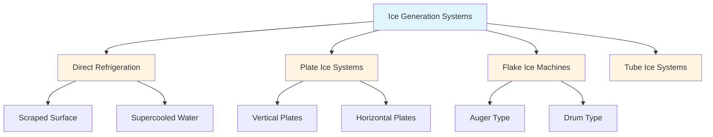
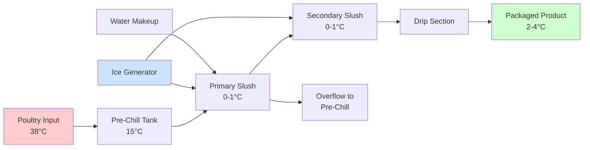

## Overview of Ice Slush Chilling

Ice slush chilling represents an advanced immersion cooling method for poultry processing that combines the rapid heat transfer benefits of water immersion with the enhanced cooling capacity of ice. The system maintains a slurry of ice crystals and water, typically at 0°C to 1°C, providing superior heat transfer rates compared to conventional air-chilling or water-only immersion systems.

The fundamental advantage stems from the latent heat of fusion. As ice melts, it absorbs 334 kJ/kg without temperature increase, providing significantly greater cooling capacity per unit volume than sensible cooling alone. This enables faster product temperature reduction while maintaining excellent surface quality.

## Heat Transfer Fundamentals

The cooling rate in ice slush systems depends on multiple heat transfer mechanisms operating simultaneously. The total heat transfer coefficient combines convective heat transfer from the turbulent slurry flow and the latent heat absorption from ice melting at the product surface.

The heat removal rate from poultry carcasses follows:

$$Q = hA(T_{\text{product}} - T_{\text{slush}}) + m_{\text{ice}}h_{fg}$$

where:
- $Q$ = total heat transfer rate (W)
- $h$ = convective heat transfer coefficient (W/m²·K)
- $A$ = product surface area (m²)
- $T_{\text{product}}$ = carcass temperature (°C)
- $T_{\text{slush}}$ = slush temperature (°C)
- $m_{\text{ice}}$ = ice melting rate (kg/s)
- $h_{fg}$ = latent heat of fusion, 334 kJ/kg

The convective heat transfer coefficient in ice slush systems typically ranges from 500-1200 W/m²·K, substantially higher than air-chilling systems (20-50 W/m²·K) due to the high thermal conductivity and turbulent mixing of the slurry.

## System Design Parameters

### Ice Concentration

Optimal ice concentration balances cooling capacity against slurry fluidity and pumping requirements. ASHRAE recommends ice fractions between 25-40% by mass for poultry applications.

| Ice Concentration | Cooling Capacity | Fluidity | Pumping Power |
|------------------|------------------|----------|---------------|
| 15-25% | Moderate | Excellent | Low |
| 25-35% | High | Good | Moderate |
| 35-45% | Very High | Fair | High |
| >45% | Maximum | Poor | Very High |

The relationship between ice concentration and slurry density:

$$\rho_{\text{slurry}} = \frac{1}{\frac{x}{\rho_{\text{ice}}} + \frac{1-x}{\rho_{\text{water}}}}$$

where $x$ represents the ice mass fraction.

### Temperature Control

Maintaining slush temperature within 0-1°C ensures maximum ice stability while preventing product freezing. Temperature stratification must be minimized through adequate agitation, typically requiring 0.02-0.04 kW per cubic meter of tank volume.

The required refrigeration capacity includes:

$$Q_{\text{ref}} = Q_{\text{product}} + Q_{\text{ambient}} + Q_{\text{makeup}} + Q_{\text{pump}}$$

where product load dominates, calculated from:

$$Q_{\text{product}} = \dot{m}_{\text{poultry}}c_p(T_{\text{initial}} - T_{\text{final}})$$

For poultry with specific heat $c_p$ = 3.3 kJ/kg·K, reducing temperature from 38°C to 4°C requires approximately 112 kJ/kg.

## Ice Generation Methods

### Flake Ice Systems

Flake ice machines produce thin ice crystals (1-2 mm thick) with high surface area to volume ratios, enabling rapid melting and heat absorption. Production capacity ranges from 500-10,000 kg/hr for industrial poultry operations.

The refrigeration efficiency for flake ice production:

$$\text{COP}_{\text{ice}} = \frac{h_{fg}}{W_{\text{comp}}}$$

Typical COP values range from 2.5-3.5 for ammonia-based systems operating with evaporator temperatures at -10°C to -15°C.

### Liquid Ice Systems

Liquid ice or slurry ice systems generate ice crystals directly in a carrier fluid, producing a pumpable mixture that can be distributed throughout the chilling system. These systems use scraped-surface heat exchangers or supercooled water generators.

## Process Flow Configuration

Multi-stage chilling optimizes ice utilization. The primary tank handles the bulk temperature reduction, while the secondary tank provides final cooling and temperature uniformity. Counterflow design maximizes thermal efficiency by exposing the warmest product to used slush and the coolest product to fresh ice slurry.

## Microbiological Considerations

Ice slush chilling provides rapid cooling that minimizes bacterial growth during the critical temperature range of 20-40°C. USDA-FSIS regulations require poultry carcasses reach 4°C or below within specified timeframes to ensure food safety.

The system must maintain water quality through continuous filtration and chlorination. Typical free chlorine levels range from 20-50 ppm to control microbial populations while preventing equipment corrosion.

## Performance Optimization

### Agitation and Flow

Adequate slurry circulation ensures uniform ice distribution and prevents settling. Pump selection must account for the non-Newtonian behavior of ice slurries, with apparent viscosity increasing exponentially above 35% ice concentration.

Flow velocity through chilling tanks typically ranges from 0.3-0.6 m/s, providing sufficient turbulence for heat transfer without damaging product surfaces.

### Energy Efficiency

Ice slush systems achieve energy efficiency through:

- **Thermal storage**: Ice production during off-peak hours reduces peak electrical demand
- **High heat transfer rates**: Shorter residence times reduce tank volumes and water consumption
- **Refrigeration optimization**: Evaporator temperatures of -10°C to -12°C balance ice production rate with compression efficiency

The specific energy consumption for ice slush chilling ranges from 0.15-0.25 kWh per kg of poultry processed, depending on initial product temperature and target final temperature.

## Comparison with Alternative Methods

| Chilling Method | Cooling Rate | Water Use | Yield Loss | Capital Cost |
|----------------|-------------|-----------|------------|--------------|
| Air Chilling | Slow (2-4 hr) | None | 0-2% | High |
| Water Immersion | Fast (30-60 min) | High | 4-12% | Low |
| Ice Slush | Very Fast (20-40 min) | Moderate | 2-6% | Moderate |
| CO₂ Snow | Ultra-Fast (10-15 min) | None | 0-2% | Very High |

Ice slush chilling balances rapid cooling with moderate water absorption, making it suitable for markets where some moisture pickup is acceptable and rapid throughput is essential.

## Maintenance Requirements

Regular maintenance ensures consistent performance:

- **Daily**: Monitor ice concentration, slurry temperature, and chlorine levels
- **Weekly**: Clean overflow screens and inspect pump seals
- **Monthly**: Verify refrigeration system performance and calibrate temperature sensors
- **Quarterly**: Deep clean tanks, inspect ice-making equipment, and check insulation integrity

Proper maintenance maintains heat transfer efficiency and prevents contamination while extending equipment service life to 15-20 years for tanks and 10-15 years for refrigeration components.

## Regulatory Compliance

Ice slush chilling systems must comply with USDA-FSIS regulations for poultry processing, including 9 CFR Part 381. Key requirements include maximum carcass temperature of 4°C, documented HACCP plans, and regular water quality monitoring.

ASHRAE Standard 15 governs refrigeration system safety, while local health codes typically specify sanitation procedures and record-keeping for immersion chilling operations.
