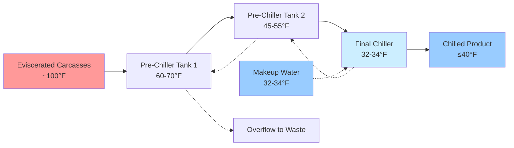
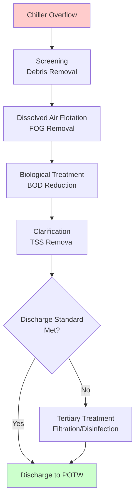

## Overview

Water immersion chilling represents the predominant method for rapidly cooling poultry carcasses from evisceration temperature (approximately 100°F) to storage temperature (below 40°F) in commercial processing facilities. This continuous process combines convective heat transfer with sanitation requirements, achieving cooling rates that prevent bacterial growth while maintaining product quality and yield.

The system operates on countercurrent flow principles, where cold water enters at the discharge end and progressively warms as it flows opposite to carcass movement, maximizing thermal efficiency while meeting USDA Food Safety and Inspection Service (FSIS) regulations for water temperature and chlorine concentration.

## Heat Transfer Mechanisms

### Convective Cooling Analysis

The primary heat removal mechanism combines forced convection from agitator-induced water movement with natural convection from temperature differential. The total heat transfer rate follows:

$$Q = h \cdot A \cdot \Delta T_{lm}$$

Where:
- $Q$ = heat transfer rate (Btu/hr)
- $h$ = overall heat transfer coefficient (15-25 Btu/hr·ft²·°F for immersion chilling)
- $A$ = carcass surface area (typically 1.8-2.2 ft² for broilers)
- $\Delta T_{lm}$ = log mean temperature difference between carcass and water

The log mean temperature difference accounts for varying temperature gradients:

$$\Delta T_{lm} = \frac{(T_{c,in} - T_{w,out}) - (T_{c,out} - T_{w,in})}{\ln\left(\frac{T_{c,in} - T_{w,out}}{T_{c,out} - T_{w,in}}\right)}$$

Where subscripts $c$ and $w$ denote carcass and water, respectively, with $in$ and $out$ indicating entrance and exit conditions.

### Temperature Reduction Profile

Carcass core temperature follows an exponential decay curve described by:

$$T(t) = T_w + (T_0 - T_w) \cdot e^{-kt}$$

Where:
- $T(t)$ = carcass temperature at time $t$ (°F)
- $T_w$ = water temperature (°F)
- $T_0$ = initial carcass temperature (°F)
- $k$ = cooling constant (0.015-0.025 min⁻¹ for agitated immersion)
- $t$ = immersion time (minutes)

USDA FSIS mandates carcass internal temperature reach 40°F or below, typically requiring 45-60 minutes residence time in properly designed chillers.

## Chiller System Design

### Configuration Types

### Tank Sizing Calculations

Chiller volume requirements depend on processing line speed and required residence time:

$$V_{tank} = \frac{n \cdot W_{avg} \cdot t_{res}}{\rho_w \cdot 60}$$

Where:
- $V_{tank}$ = required tank volume (gallons)
- $n$ = birds per minute throughput
- $W_{avg}$ = average carcass weight (lb)
- $t_{res}$ = residence time (minutes)
- $\rho_w$ = water density (8.34 lb/gal at 40°F)

USDA regulations require minimum water-to-carcass ratio of 0.5 gallons per pound for pre-chillers and 1.0 gallon per pound for final chillers.

## Refrigeration Load Calculations

### Total Cooling Requirement

The refrigeration system must remove sensible heat from carcasses, makeup water, and overcome ambient heat gain:

$$Q_{total} = Q_{carcass} + Q_{makeup} + Q_{ambient} + Q_{mechanical}$$

**Carcass sensible heat:**
$$Q_{carcass} = \dot{m}_c \cdot c_p \cdot (T_{in} - T_{out})$$

Where:
- $\dot{m}_c$ = carcass mass flow rate (lb/hr)
- $c_p$ = specific heat of poultry (0.80 Btu/lb·°F above freezing)
- Temperature differential typically 100°F - 38°F = 62°F

**Makeup water cooling:**
$$Q_{makeup} = \dot{m}_w \cdot c_{p,w} \cdot (T_{makeup} - T_{chiller})$$

For a 10,000 bird/hour facility processing 5 lb average birds:
- Carcass load: 50,000 lb/hr × 0.80 Btu/lb·°F × 62°F = 2,480,000 Btu/hr
- Equivalent refrigeration: 2,480,000 ÷ 12,000 ≈ 207 tons minimum

Safety factor of 1.25-1.35 applied for design capacity.

## Water Quality and Circulation

### Chlorination Requirements

USDA FSIS mandates free chlorine concentration between 20-50 ppm in chiller water to control microbial contamination. Chlorine demand increases with:
- Organic load from blood and tissue
- Water temperature (higher temperatures increase decay rate)
- Water pH (optimal effectiveness at pH 6.5-7.5)

Chlorine feed rate calculation:

$$\dot{m}_{Cl_2} = \frac{C_{target} \cdot Q_{makeup}}{1,000,000} \cdot \rho_w \cdot 60 \cdot 24$$

Where $C_{target}$ is target concentration (ppm) and $Q_{makeup}$ is makeup water flow (gpm).

### Countercurrent Flow Dynamics

Water velocity through the chiller must provide adequate agitation without damaging carcasses. Typical design parameters:

| Parameter | Pre-Chiller | Final Chiller |
|-----------|-------------|---------------|
| Water Temperature | 50-65°F | 32-38°F |
| Flow Velocity | 0.5-1.0 ft/s | 0.3-0.6 ft/s |
| Agitator Speed | 20-30 rpm | 15-25 rpm |
| Residence Time | 15-20 min | 30-45 min |
| Overflow Rate | 150-200% | 100-120% |

## System Performance Comparison

| Chilling Method | Capital Cost | Operating Cost | Water Usage | Yield Loss | Microbial Control |
|-----------------|--------------|----------------|-------------|------------|-------------------|
| Water Immersion | Moderate | Low | High (0.5-1.5 gal/lb) | 4-8% gain | Excellent |
| Air Chilling | High | Moderate | Minimal | 0-2% loss | Good |
| Hybrid Systems | High | Moderate | Moderate (0.3-0.5 gal/lb) | 2-4% gain | Excellent |

Water immersion chilling paradoxically increases carcass weight through water absorption, regulated by USDA to maximum 8% of pre-chill weight. This moisture uptake occurs through osmotic pressure gradients and mechanical absorption into muscle tissue.

## Alternative Antimicrobial Systems

### Peracetic Acid (PAA) Applications

PAA offers advantages over chlorine:
- Effective across broader pH range (3.0-8.0)
- No carcinogenic disinfection byproducts
- Lower corrosion potential
- Typical concentration: 200-2000 ppm

**Antimicrobial efficacy:**
$$\log_{10} R = k \cdot C^n \cdot t$$

Where:
- $R$ = microbial reduction ratio
- $C$ = antimicrobial concentration
- $t$ = contact time
- $k, n$ = empirical constants (species-dependent)

### Ozone Integration

Ozone (O₃) provides rapid oxidation with minimal residual concerns:
- Concentration: 1-5 ppm dissolved in water
- Contact time: 30-60 seconds for 2-3 log reduction
- Rapid decomposition to oxygen eliminates chemical residue
- Requires on-site generation from oxygen or air

## Energy Optimization Strategies

### Variable Frequency Drive Applications

Implementing VFDs on agitator motors reduces energy consumption during:
- Low-capacity production periods
- Lighter bird weight processing
- Seasonal temperature variations

Power savings follow affinity laws:
$$\frac{P_2}{P_1} = \left(\frac{N_2}{N_1}\right)^3$$

Where $P$ represents power and $N$ represents rotational speed.

### Heat Recovery Integration

Waste heat from refrigeration condensers can preheat makeup water or provide facility heating, improving overall coefficient of performance (COP):

$$COP_{system} = \frac{Q_{useful}}{W_{compressor}}$$

Recovered condenser heat typically provides 15,000-20,000 Btu/hr per ton of refrigeration at 105-115°F condensing temperature.

## Wastewater Management

### Treatment Requirements

Immersion chilling generates substantial wastewater containing:
- Organic matter (BOD: 800-1200 mg/L)
- Suspended solids (TSS: 400-800 mg/L)
- Fats, oils, and grease (FOG: 150-300 mg/L)
- Residual antimicrobials

**Water usage calculation:**
$$Q_{wastewater} = n \cdot W_{avg} \cdot R_{water}$$

Where:
- $Q_{wastewater}$ = wastewater generation rate (gal/hr)
- $n$ = birds processed per hour
- $W_{avg}$ = average bird weight (lb)
- $R_{water}$ = water-to-carcass ratio (0.5-1.5 gal/lb)

### Treatment Technologies

## Regulatory Compliance

ASHRAE Standard 15 governs refrigeration system safety, while USDA FSIS 9 CFR Part 381 establishes specific requirements:
- Maximum carcass exit temperature: 40°F
- Water-to-carcass ratio minimums
- Antimicrobial concentration ranges (chlorine: 20-50 ppm, PAA: 200-2000 ppm)
- Overflow rates for fecal contamination control
- Temperature monitoring and recording frequency

Modern facilities implement SCADA systems with continuous data logging to demonstrate regulatory compliance and optimize operational efficiency through real-time adjustments to refrigeration capacity, water flow rates, and chemical injection systems.

## System Monitoring and Control

### Critical Control Points

HACCP-based monitoring focuses on:

| Control Point | Parameter | Limit | Monitoring Frequency |
|---------------|-----------|-------|---------------------|
| Pre-Chiller Entry | Water Temperature | ≤60°F | Continuous |
| Final Chiller | Water Temperature | 32-38°F | Continuous |
| Antimicrobial | Chlorine Concentration | 20-50 ppm | Every 4 hours |
| Carcass Exit | Internal Temperature | ≤40°F | Every 1000 birds |
| Residence Time | Dwell Time | ≥60 minutes total | Continuous |

### Automated Control Strategy

Modern systems employ PLC-based control logic:
- Refrigeration capacity modulation based on inlet water temperature
- Chemical injection proportional to makeup water flow
- Agitator speed adjustment maintaining constant water velocity
- Alarm generation for out-of-specification conditions

Temperature control loop maintains chiller setpoint through:
$$\Delta Q_{ref} = K_p \cdot e(t) + K_i \int e(t)dt + K_d \frac{de(t)}{dt}$$

Where $e(t)$ represents deviation from setpoint temperature and $K_p$, $K_i$, $K_d$ are proportional, integral, and derivative gain constants.

## References

- ASHRAE Handbook—Refrigeration, Chapter 31: Food Processing Facilities
- USDA FSIS Compliance Guideline for Controlling Salmonella and Campylobacter in Poultry
- ASHRAE Standard 15: Safety Standard for Refrigeration Systems
- 9 CFR Part 381: Poultry Products Inspection Regulations
