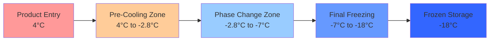

Poultry freezing operations demand specialized refrigeration systems capable of rapidly removing both sensible and latent heat while maintaining product quality. Freezing rate directly impacts ice crystal formation, cell structure preservation, and ultimate product quality. This analysis examines the thermodynamic requirements, equipment selection, and system design parameters for commercial poultry freezing facilities.

## Freezing Physics and Heat Transfer

The freezing process for poultry involves three distinct thermal phases. Initial sensible cooling reduces product temperature from approximately 4°C to the initial freezing point near -2.8°C. The phase change period removes latent heat as water crystallizes, occurring over a temperature range from -2.8°C to -7°C due to the freezing point depression from dissolved proteins and salts. Final sensible cooling continues to the target storage temperature, typically -18°C to -23°C.

Total heat removal per unit mass:

$$Q_{total} = m \cdot c_{p,above} \cdot (T_{initial} - T_{freeze}) + m \cdot h_{fg,eff} + m \cdot c_{p,frozen} \cdot (T_{freeze} - T_{final})$$

Where:
- $c_{p,above}$ = specific heat above freezing ≈ 3.52 kJ/(kg·K)
- $h_{fg,eff}$ = effective latent heat ≈ 235 kJ/kg (70% moisture content)
- $c_{p,frozen}$ = specific heat frozen state ≈ 1.77 kJ/(kg·K)

For a 2.0 kg whole chicken frozen from 4°C to -18°C, total heat removal equals approximately 620 kJ per bird.

## Freezing Rate Considerations

Freezing velocity determines ice crystal size and distribution. Rapid freezing (freezing time < 2 hours) produces small intracellular ice crystals that minimize cell membrane damage. Slow freezing allows extracellular ice formation and osmotic dehydration of cells, degrading texture upon thawing.

Heat transfer rate through the product depends on thermal conductivity, which changes during freezing:

$$q = \frac{k_{eff} \cdot A \cdot (T_{surface} - T_{center})}{L_{characteristic}}$$

Thermal conductivity increases from approximately 0.45 W/(m·K) for unfrozen poultry to 1.65 W/(m·K) when fully frozen. This property change accelerates heat removal as the freezing front progresses inward.

## Freezing System Types

### Blast Freezers

Forced-air blast freezers use high-velocity air (2.5 to 6 m/s) at -30°C to -40°C to maximize convective heat transfer. Products are arranged on racks or carts with spacing to allow airflow around all surfaces. Typical freezing time ranges from 2 to 6 hours depending on product size and air velocity.

Convective heat transfer coefficient:

$$h_{conv} = C \cdot \rho^{0.8} \cdot v^{0.8} \cdot d^{-0.2}$$

Where higher air velocity significantly increases the heat transfer coefficient, reducing freezing time. Blast freezer evaporator coils operate at -35°C to -45°C with multiple refrigerant circuits to maintain capacity as frost accumulates.

### Spiral Freezers

Continuous spiral belt freezers convey product through a cylindrical insulated chamber with counterflow airflow patterns. Products enter at the top, spiral downward on a self-stacking belt, and exit frozen at the bottom. Residence time ranges from 30 to 90 minutes depending on product thickness and belt speed.

Spiral systems offer superior space efficiency with freezing capacity of 2,000 to 8,000 kg/hr in a footprint of 6m × 6m. Evaporator capacity must match product heat load plus infiltration, typically requiring 350 to 500 kW of refrigeration for a 4,000 kg/hr system.

### Cryogenic Freezers

Liquid nitrogen (LN₂) or liquid carbon dioxide (LCO₂) cryogenic freezers achieve extremely rapid freezing through direct contact or spray application. Cryogen vaporization absorbs heat directly from product surfaces:

$$q_{cryo} = \dot{m}_{cryo} \cdot (h_{fg,cryo} + c_{p,vapor} \cdot \Delta T)$$

For liquid nitrogen at -196°C, enthalpy of vaporization equals 199 kJ/kg plus sensible heat gain of nitrogen vapor. Typical consumption ranges from 0.8 to 1.2 kg LN₂ per kg of product frozen, depending on product temperature and target freeze rate.

Cryogenic systems provide freezing times under 15 minutes for portion-sized products, minimizing drip loss and maximizing quality. Operating costs significantly exceed mechanical refrigeration, limiting application to high-value products or production bottlenecks.

## System Design Parameters

| Parameter | Blast Freezer | Spiral Freezer | Cryogenic Tunnel |
|-----------|---------------|----------------|------------------|
| Air/Cryogen Temperature | -35°C to -40°C | -30°C to -35°C | -50°C to -196°C |
| Product Freezing Time | 2-6 hours | 30-90 minutes | 5-15 minutes |
| Air Velocity | 2.5-6 m/s | 1.5-3 m/s | 5-10 m/s |
| Evaporator TD | 8-12 K | 10-15 K | N/A |
| Defrost Cycle | 3-4 per day | 2-3 per day | Not required |
| Typical Capacity | 500-2,000 kg/hr | 2,000-8,000 kg/hr | 500-3,000 kg/hr |
| Energy Cost (relative) | 1.0 | 0.9 | 4.5-6.0 |

## Refrigeration Load Calculations

Total refrigeration capacity requirement per ASHRAE guidelines includes:

**Product Load:**
$$Q_{product} = \frac{\dot{m}_{product} \cdot q_{specific}}{3600}$$

**Transmission Load:**
$$Q_{trans} = U \cdot A \cdot (T_{ambient} - T_{freezer})$$

**Infiltration Load:**
$$Q_{inf} = \frac{n \cdot V \cdot \rho_{air} \cdot \Delta h}{3600}$$

**Equipment Load:**
$$Q_{equip} = P_{fans} + P_{conveyors} + P_{lighting}$$

**Personnel Load:**
$$Q_{personnel} = n_{workers} \cdot q_{person}$$

For a 4,000 kg/hr spiral freezer operating at -35°C with 400 m² surface area and two openings, typical load distribution:
- Product load: 380 kW (75%)
- Transmission: 45 kW (9%)
- Infiltration: 60 kW (12%)
- Equipment: 15 kW (3%)
- Personnel: 5 kW (1%)
- **Total: 505 kW** at -35°C evaporator temperature

## Refrigerant Selection and System Configuration

Ammonia (R-717) remains the dominant refrigerant for large poultry freezing operations due to superior thermodynamic performance, low cost, and zero GWP. Low-temperature applications require two-stage compression with interstage cooling to maintain acceptable discharge temperatures and compression ratios.

For -35°C evaporator and +35°C condensing conditions, single-stage ammonia compression yields a compression ratio of 18:1 with discharge temperatures exceeding 150°C. Two-stage compression reduces the ratio to approximately 4.2:1 per stage with flash intercooling, maintaining discharge temperatures below 100°C and improving volumetric efficiency.

Cascade systems with CO₂ or R-507A low stage and ammonia high stage provide enhanced efficiency for applications below -40°C, though added complexity and cost limit adoption except for cryogenic pre-cooling applications.

## Airflow and Coil Design

Evaporator coils in poultry freezers must provide adequate surface area while minimizing air-side pressure drop. Fin spacing ranges from 4 to 7 mm to balance heat transfer surface with frost accumulation tolerance. Wider spacing reduces defrost frequency but requires larger coil face area.

Required air circulation rate:

$$\dot{V}_{air} = \frac{Q_{refrigeration}}{\rho_{air} \cdot c_{p,air} \cdot \Delta T_{air}}$$

For 500 kW refrigeration capacity with 8 K air temperature rise across the coil, required airflow equals approximately 50,000 m³/hr. Multiple evaporators with dedicated fans provide redundancy and improved air distribution uniformity.

## Defrost Strategies

Frost accumulation on evaporator coils reduces airflow and heat transfer efficiency. Low-temperature freezers require defrost cycles every 6 to 12 hours depending on product moisture content and infiltration rates.

**Hot gas defrost** circulates high-pressure refrigerant vapor through evaporator circuits, providing rapid melting with minimal temperature increase in the freezer space. Defrost duration ranges from 20 to 35 minutes depending on coil size and frost thickness.

**Electric defrost** uses resistance heaters but significantly increases energy consumption and freezer temperature fluctuation. Application is limited to smaller systems or emergency backup.

**Water defrost** rapidly removes frost but requires drainage provisions and increases refrigeration load from condensate heat. Rarely used in poultry freezers due to ice formation concerns.

Proper defrost termination based on coil temperature sensors (typically 10°C to 15°C) prevents excessive energy waste while ensuring complete frost removal.

## Control Strategies and Monitoring

Advanced freezer control systems optimize performance through:

- **Variable frequency drives** on evaporator fans modulating airflow based on product loading
- **Refrigerant liquid level control** maintaining optimal evaporator feed
- **Defrost scheduling optimization** based on actual frost accumulation rather than fixed intervals
- **Product temperature monitoring** with wireless sensors tracking time-temperature profiles
- **Energy management** systems balancing production requirements against power demand charges

ASHRAE Standard 15 provides safety requirements for refrigeration systems. ASHRAE Guideline 3 addresses refrigeration system commissioning and acceptance procedures specific to food processing applications.

## Quality Considerations

Excessive freezing time allows large ice crystal formation, rupturing cell membranes and causing drip loss during thawing. Target freezing time from 0°C to -5°C (zone of maximum ice crystal formation) should not exceed 2 hours for optimal quality.

Packaging before freezing protects product from dehydration and freezer burn. Proper air circulation around packaged products remains necessary, requiring package perforations or spacing to allow heat transfer.

Temperature uniformity throughout the freezer space prevents partial freezing and quality variability. Temperature monitoring at multiple locations with alarms at ±2°C deviation ensures consistent product quality.
