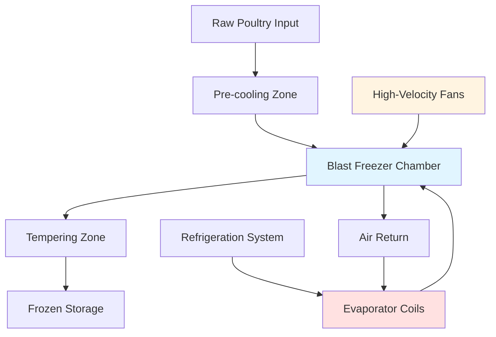

## Fundamentals of Air Blast Freezing

Air blast freezing relies on forced convection heat transfer to remove thermal energy from poultry products. High-velocity refrigerated air flows across the product surface, creating a convective heat transfer coefficient that significantly exceeds natural convection or still-air conditions. This method dominates commercial poultry freezing operations due to equipment flexibility, relatively low capital cost, and ability to freeze both bulk and packaged products.

The effectiveness of air blast freezing depends on three primary parameters: air temperature, air velocity, and product geometry. Typical blast freezer air temperatures range from -30°F to -40°F (-34°C to -40°C), with air velocities between 500-2000 ft/min (2.5-10 m/s). These conditions balance freezing rate requirements against energy consumption and product weight loss.

## Heat Transfer Analysis

The convective heat transfer rate from poultry to air follows Newton's law of cooling:

$$Q = h \cdot A \cdot (T_s - T_a)$$

Where:
- Q = heat transfer rate (Btu/hr or W)
- h = convective heat transfer coefficient (Btu/hr·ft²·°F or W/m²·K)
- A = surface area (ft² or m²)
- T_s = surface temperature (°F or °C)
- T_a = air temperature (°F or °C)

The convective coefficient increases with air velocity according to empirical correlations. For flow across irregular shapes like poultry carcasses:

$$h = C \cdot V^{0.6} \cdot D^{-0.4}$$

Where V represents air velocity and D is characteristic dimension. This relationship demonstrates that doubling air velocity increases the heat transfer coefficient by approximately 50%.

## Freezing Time Calculations

Plank's equation provides first-order approximation for freezing time of poultry products:

$$t_f = \frac{\rho \cdot L_f}{T_f - T_a} \left(\frac{P \cdot a}{h} + \frac{R \cdot a^2}{k}\right)$$

Where:
- t_f = freezing time (hr)
- ρ = density (lb/ft³ or kg/m³)
- L_f = latent heat of fusion (Btu/lb or kJ/kg)
- T_f = initial freezing point (°F or °C)
- a = thickness (ft or m)
- k = thermal conductivity of frozen layer (Btu/hr·ft·°F or W/m·K)
- P, R = shape factors (1/2, 1/8 for infinite slab)

For poultry, typical values include:
- ρ = 65 lb/ft³ (1040 kg/m³)
- L_f = 106 Btu/lb (247 kJ/kg)
- k = 0.85 Btu/hr·ft·°F (1.47 W/m·K)

The equation reveals that freezing time increases with the square of thickness, making product geometry critical to system design.

## Equipment Configuration

### System Components

**Evaporator Coils**: Low-temperature coils operate at -45°F to -50°F (-43°C to -46°C) to achieve required air temperatures. Fin spacing typically ranges from 4-6 fins per inch to minimize frost accumulation while maintaining heat transfer efficiency. ASHRAE Refrigeration Handbook Chapter 29 specifies defrost cycles every 6-12 hours depending on product moisture content.

**Air Distribution**: Axial or centrifugal fans circulate 200-400 CFM per ton of refrigeration (14-28 m³/min per kW). Fan power represents 5-10% of total system energy consumption. Proper air distribution prevents thermal stratification and ensures uniform freezing across all product surfaces.

**Product Loading**: Poultry placement affects air flow patterns. Individual birds hang from overhead rails or rest on wire mesh trays. Spacing between products must allow air circulation—minimum 2 inches (50 mm) between carcasses prevents air flow restriction.

## Operational Parameters Comparison

| Parameter | Continuous Tunnel | Batch Room | Spiral Freezer |
|-----------|------------------|------------|----------------|
| Air Temperature | -35°F to -40°F | -30°F to -35°F | -35°F to -45°F |
| Air Velocity | 1500-2000 fpm | 500-1000 fpm | 1000-1500 fpm |
| Freezing Time (whole bird) | 2-3 hours | 4-6 hours | 2.5-3.5 hours |
| Product Load | High | Medium | Very High |
| Capital Cost | High | Low | Very High |
| Floor Space | Large | Medium | Minimal |
| Energy Efficiency | Good | Fair | Excellent |

## Process Control

Temperature control maintains blast freezer air within ±2°F (±1°C) of setpoint. Capacity control through suction pressure regulation, hot gas bypass, or variable-speed compressors matches cooling capacity to thermal load. As product temperature decreases, refrigeration load drops—effective control prevents excessive compressor cycling.

Product temperature monitoring verifies freezing completion. Core temperature must reach 0°F (-18°C) or lower. Time-temperature integrators or data loggers track thermal history for HACCP compliance and quality assurance.

## Weight Loss Considerations

Moisture evaporation from exposed poultry surfaces causes weight loss (shrinkage) during freezing. The rate follows:

$$\dot{m} = h_m \cdot A \cdot (P_{sat}(T_s) - P_{sat}(T_a) \cdot RH)$$

Where h_m represents mass transfer coefficient and P_sat is saturation pressure at respective temperatures. Typical weight loss ranges from 0.5-2.0% for whole birds, with higher losses for cut-up pieces with greater surface area to mass ratio.

Minimizing weight loss requires:
- Maximum feasible air humidity (limited by frost formation)
- Minimum freezing time (reducing exposure duration)
- Protective packaging (creating vapor barrier)
- Lower air velocities near frozen state

## Energy Efficiency

Total system energy consumption includes:
1. Refrigeration compressor power (70-80%)
2. Evaporator fan power (10-15%)
3. Condenser fan power (5-10%)
4. Defrost energy (3-5%)

Coefficient of performance (COP) for blast freezer systems operating at -40°F evaporator temperature typically ranges from 1.0-1.5. Energy consumption per pound of frozen poultry averages 0.08-0.12 kWh/lb (0.18-0.26 kWh/kg).

Efficiency improvements include:
- Variable-speed drive fans
- Heat recovery from compressor discharge
- Staged freezing (pre-cooling before blast freezing)
- Optimized defrost scheduling

## Design Considerations

System sizing requires accurate thermal load calculation:

$$Q_{total} = Q_{product} + Q_{infiltration} + Q_{equipment} + Q_{defrost}$$

Product load dominates, calculated as mass flow rate multiplied by enthalpy change from initial temperature to final frozen state. ASHRAE Refrigeration Handbook Chapter 20 provides detailed methodology for each load component.

Safety considerations include adequate ventilation for refrigerant leak detection, emergency lighting for power failures, and temperature alarms for product protection. Insulated panels with minimum R-30 (RSI-5.3) reduce heat gain and improve system efficiency.

## References

- ASHRAE Handbook—Refrigeration, Chapter 29: Food Freezing
- ASHRAE Handbook—Refrigeration, Chapter 20: Thermal Properties of Foods
- USDA Food Safety and Inspection Service: Poultry Processing Guidelines
