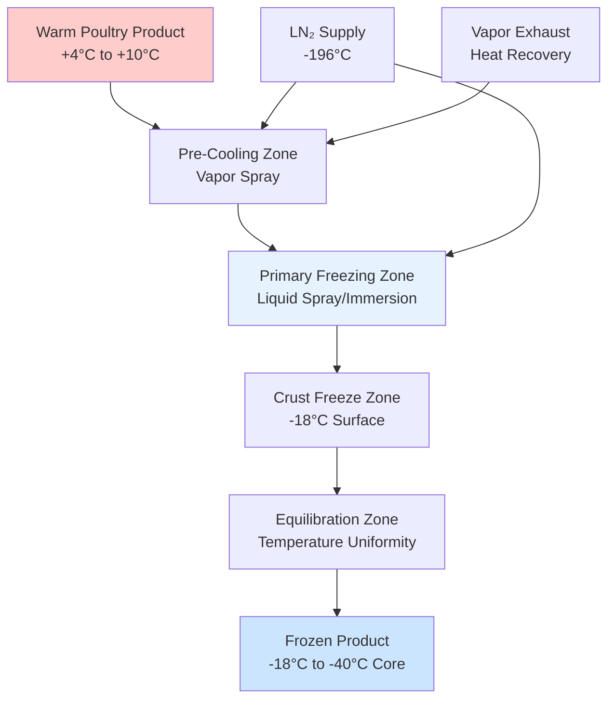
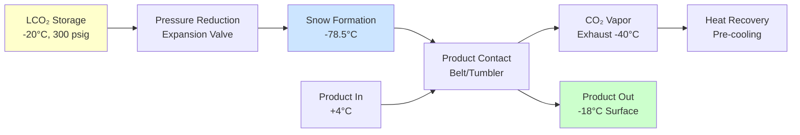

## Overview of Cryogenic Freezing Technology

Cryogenic freezing employs ultra-low temperature refrigerants—liquid nitrogen (LN₂) at -196°C (-321°F) or liquid/solid carbon dioxide at -78.5°C (-109.3°F)—to achieve extremely rapid freezing rates in poultry products. This technology delivers freezing times 5-20 times faster than conventional mechanical refrigeration systems, resulting in superior product quality through the formation of smaller ice crystals that minimize cellular damage.

The fundamental advantage stems from the exceptionally high temperature differential between the cryogenic medium and the product, creating heat flux rates of 10-50 kW/m² compared to 0.5-2 kW/m² in conventional air-blast freezers.

## Heat Transfer Mechanisms

Cryogenic freezing involves three primary heat transfer modes operating simultaneously:

**Convective Heat Transfer** occurs when cryogenic vapor flows across the product surface. The convective heat flux follows:

$$q_{conv} = h \cdot A \cdot (T_{product} - T_{cryo})$$

where h represents the convective heat transfer coefficient (typically 50-200 W/m²·K for LN₂ vapor flow), A is the surface area, and the temperature differential ranges from 200-220 K for nitrogen systems.

**Nucleate Boiling Heat Transfer** dominates when liquid cryogen contacts the product surface directly. The heat flux during nucleate boiling significantly exceeds convection:

$$q_{boiling} = \mu_f \cdot h_{fg} \cdot \left[\frac{g(\rho_f - \rho_g)}{\sigma}\right]^{1/2} \cdot \left[\frac{c_{p,f}(T_s - T_{sat})}{C_{sf} \cdot h_{fg} \cdot Pr_f^n}\right]^3$$

This complex relationship explains why direct liquid impingement systems achieve heat transfer coefficients of 500-2000 W/m²·K.

**Cryogenic Spray Freezing** creates the highest heat transfer rates through fine atomization of liquid cryogen. Droplet sizes of 50-500 μm maximize surface area contact while minimizing cryogen consumption.

## Freezing Time Calculations

The total freezing time for poultry products combines sensible cooling and latent heat removal. For a simplified slab geometry (breast fillets, cutlets):

$$t_{freeze} = \frac{\rho \cdot d}{2h} \left[c_1(T_i - T_f) + L + c_2(T_f - T_{final})\right]$$

where:
- ρ = product density (1050-1100 kg/m³ for poultry)
- d = product thickness (m)
- h = average heat transfer coefficient (W/m²·K)
- c₁ = specific heat above freezing (3.5 kJ/kg·K)
- c₂ = specific heat below freezing (1.8 kJ/kg·K)
- L = latent heat of fusion (250-280 kJ/kg for poultry, 75-80% moisture)
- T_i = initial temperature
- T_f = freezing point (-2°C to -1.5°C)
- T_final = target final temperature

For a 25 mm thick chicken breast with h = 800 W/m²·K (LN₂ spray):

$$t_{freeze} = \frac{1075 \times 0.025}{2 \times 800} \left[3.5(4-(-1.5)) + 265 + 1.8(-1.5-(-18))\right] \approx 180 \text{ seconds}$$

## System Configurations and Equipment

| System Type | Heat Transfer Coefficient | Freezing Rate | LN₂ Efficiency | Best Applications |
|-------------|---------------------------|---------------|----------------|-------------------|
| Immersion/Dip | 1500-2000 W/m²·K | 10-30 min | 0.8-1.2 kg/kg | Individual pieces, IQF |
| Spray Tunnel | 600-1200 W/m²·K | 15-45 min | 0.6-0.9 kg/kg | Continuous processing |
| Cabinet Batch | 400-800 W/m²·K | 30-90 min | 0.5-0.8 kg/kg | Small batches, variety |
| CO₂ Snow | 300-600 W/m²·K | 45-120 min | 1.0-1.5 kg/kg | Surface crust, cost-sensitive |
| Hybrid (Cryo+Mech) | 200-500 W/m²·K | 60-180 min | 0.4-0.6 kg/kg | High volume, economy |

### Liquid Nitrogen Tunnel Systems

Continuous conveyor tunnels represent the most common configuration for high-volume poultry processing. Product travels through sequential zones:

1. **Pre-cooling zone**: Nitrogen vapor from downstream zones cools product from ambient to near-freezing, recovering 30-40% of cryogen cooling capacity
2. **Spray freezing zone**: Multiple spray headers deliver atomized LN₂ at 2-8 bar pressure
3. **Equilibration zone**: Product temperature uniformity achieved through continued vapor exposure

Typical tunnel dimensions: 3-15 m length, 0.6-2.0 m belt width, processing 500-5000 kg/hr.

### Carbon Dioxide Systems

Liquid CO₂ systems operate at -57°C supply temperature (300 psi vapor pressure) and undergo phase transition to solid snow and vapor. The expansion process:

$$\Delta H = m_{CO_2} \cdot h_{sublimation} = m_{CO_2} \times 571 \text{ kJ/kg}$$

CO₂ provides approximately 50% of the cooling capacity of LN₂ per unit mass but costs 40-60% less, making it economical for crust freezing and chilling applications.

## Thermodynamic Efficiency and Cryogen Consumption

The theoretical minimum cryogen consumption derives from energy balance:

$$m_{cryo,min} = \frac{m_{product} \times \Delta H_{product}}{h_{fg,cryo} \times \eta_{recovery}}$$

For poultry freezing from +4°C to -18°C with 78% moisture content:

$$\Delta H_{product} = 3.5 \times 5.5 + 0.78 \times 335 + 1.8 \times 16.5 \approx 309 \text{ kJ/kg}$$

Liquid nitrogen enthalpy available (from -196°C to exhaust at -40°C):

$$h_{available} = 199 \text{ kJ/kg (latent)} + 1.04 \times 156 \text{ kJ/kg (sensible)} \approx 361 \text{ kJ/kg}$$

Theoretical consumption: 309/361 = 0.86 kg LN₂/kg product

Actual consumption ranges from 0.6-1.2 kg/kg depending on:
- Equipment design and insulation quality
- Vapor recovery effectiveness (30-50% recovery typical)
- Product geometry and surface area
- Initial product temperature
- Target final temperature and uniformity requirements

## Product Quality Considerations

Cryogenic freezing delivers measurable quality advantages through rapid ice crystal formation. The critical zone (-1°C to -5°C) where maximum ice crystallization occurs is traversed in 2-5 minutes versus 30-120 minutes for conventional systems.

**Ice Crystal Size**: Cryogenic methods produce crystals averaging 20-50 μm diameter compared to 100-200 μm for air-blast freezing. Smaller crystals reduce cell membrane rupture and minimize drip loss during thawing (typically 2-4% vs 6-10%).

**Surface Dehydration**: The extremely rapid surface freezing (10-30 seconds to crust formation) minimizes moisture migration and weight loss during processing. Total process yield improvement of 1-3% offsets significant cryogen costs.

## Economic Analysis and Operating Costs

| Cost Component | LN₂ System | CO₂ System | Mechanical Blast Freezer |
|----------------|------------|------------|--------------------------|
| Capital Investment | $150-400/kg/hr | $100-250/kg/hr | $200-500/kg/hr |
| Cryogen/Refrigerant Cost | $0.30-0.60/kg product | $0.15-0.30/kg product | $0.05-0.10/kg product |
| Energy Cost | $0.02-0.05/kg | $0.02-0.04/kg | $0.08-0.15/kg |
| Maintenance Cost | $0.01-0.03/kg | $0.01-0.03/kg | $0.04-0.08/kg |
| Labor Cost | $0.03-0.06/kg | $0.03-0.06/kg | $0.05-0.10/kg |
| **Total Operating Cost** | **$0.36-0.74/kg** | **$0.21-0.43/kg** | **$0.22-0.43/kg** |

Cryogenic systems justify higher operating costs through:
- 50-70% reduction in floor space requirements
- 80-90% reduction in freezing time (increased throughput)
- 1-3% yield improvement from reduced dehydration
- Superior product quality commanding premium pricing
- Elimination of ammonia refrigeration system complexity and regulatory burden

## Safety and Regulatory Requirements

ASHRAE Standard 15-2019 classifies nitrogen and CO₂ as Group A1 refrigerants (low toxicity, no flame propagation). However, asphyxiation hazards require:

- Continuous oxygen monitoring with alarms at 19.5% O₂ concentration
- Adequate mechanical ventilation (minimum 0.5 m³/min per kg/hr LN₂ consumption)
- Pressure relief venting sized for maximum credible cryogen release
- Personnel training on cryogenic liquid handling and emergency procedures
- Insulated PPE for maintenance activities (thermal protection to -196°C)

OSHA regulations mandate confined space protocols for tunnel interiors and ventilation systems meeting 29 CFR 1910.146 requirements.

## Integration with Processing Operations

Cryogenic freezers integrate into poultry processing lines after:
- Final washing and antimicrobial treatment
- Drip time reduction (shaking/air knives reduce surface water)
- Product separation for IQF applications
- Portion control and weight verification

Post-freezing operations include automated packaging, metal detection, checkweighing, and transfer to -18°C cold storage. The rapid crust formation allows immediate handling and packaging without product deformation or adhesion issues common in slower freezing methods.
