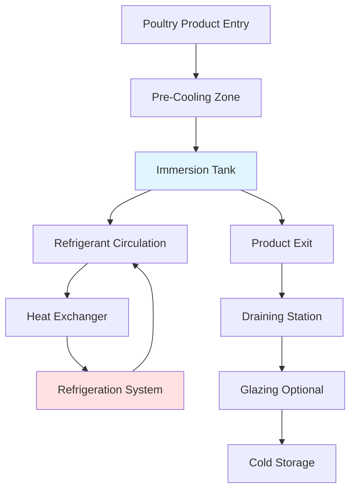
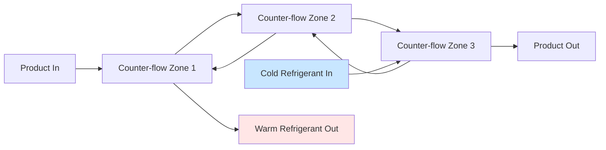

## System Overview

Immersion freezing represents the most rapid method of freezing poultry products by direct contact between the product and a circulating refrigerant medium. The system achieves freezing rates 5-20 times faster than air blast freezing through superior heat transfer coefficients. Product is either submerged or sprayed with refrigerated liquid at temperatures from -18°C to -40°C, depending on the refrigerant medium employed.

The primary advantage lies in the dramatically increased heat transfer coefficient. Where air blast systems achieve h = 25-50 W/m²·K, immersion systems deliver h = 200-2000 W/m²·K, reducing freezing time from hours to minutes for typical poultry portions.

## Heat Transfer Fundamentals

### Convective Heat Transfer

The rate of heat removal from poultry during immersion freezing follows Newton's law of cooling:

$$Q = h \cdot A \cdot (T_s - T_{\infty})$$

Where:
- Q = heat transfer rate (W)
- h = convective heat transfer coefficient (W/m²·K)
- A = product surface area (m²)
- T_s = product surface temperature (°C)
- T_∞ = bulk refrigerant temperature (°C)

The heat transfer coefficient depends on fluid properties, velocity, and geometry according to dimensionless correlations:

$$Nu = C \cdot Re^m \cdot Pr^n$$

For aqueous solutions with forced convection over irregular poultry shapes, typical values yield Nusselt numbers from 100-500, corresponding to h = 500-1500 W/m²·K.

### Freezing Time Prediction

Plank's equation, modified for immersion freezing with surface resistance:

$$t_f = \frac{\rho L}{T_f - T_m} \left( \frac{P \cdot a}{h} + \frac{R \cdot a^2}{k_f} \right)$$

Where:
- t_f = freezing time (s)
- ρ = product density (kg/m³)
- L = latent heat of fusion (334 kJ/kg for water)
- T_f = freezing point (-2°C for poultry)
- T_m = medium temperature (°C)
- a = characteristic dimension (m)
- k_f = thermal conductivity of frozen layer (W/m·K)
- P, R = shape factors (P=1/2, R=1/8 for infinite slab)

## Refrigerant Media Types

### Aqueous Solutions

| Solution Type | Temperature Range | Advantages | Limitations |
|--------------|-------------------|------------|-------------|
| Sodium chloride brine | -18°C to -21°C | Low cost, food-safe | Corrosive, salt penetration |
| Calcium chloride brine | -25°C to -35°C | Lower freeze point | Bitter taste if absorbed |
| Propylene glycol | -30°C to -40°C | Non-toxic, non-corrosive | Higher viscosity, cost |
| Glycerol solutions | -20°C to -30°C | Food-grade, low corrosion | Expensive, high viscosity |

Brine concentration affects freezing point depression according to:

$$\Delta T_f = K_f \cdot m \cdot i$$

Where K_f is the cryoscopic constant, m is molality, and i is the van't Hoff factor.

### Cryogenic Liquids

Liquid nitrogen (LN₂) at -196°C and liquid CO₂ at -78°C provide extreme rapid freezing. Heat transfer coefficients reach 2000 W/m²·K due to nucleate boiling heat transfer mechanisms. These systems are applied for individual quick freezing (IQF) of poultry pieces where ultra-rapid freezing preserves cellular structure.

## Equipment Design Considerations

### Tank Configuration

Immersion tanks range from 2-10 meters in length for continuous systems. Width accommodates product carriers or conveyors, typically 0.8-1.5 meters. Depth maintains 0.3-0.5 meters of liquid above product to ensure complete submersion.

Tank construction uses stainless steel (304 or 316) for corrosion resistance. Insulation thickness of 100-150 mm polyurethane foam maintains thermal efficiency. Bottom slopes 2-3% toward drain points to facilitate cleaning.

### Circulation Systems

Refrigerant circulation velocity of 0.3-0.8 m/s maintains high heat transfer coefficients while preventing excessive product agitation. Centrifugal pumps sized for 20-40 tank volumes per hour provide adequate turnover.

Pump power requirements:

$$P_{pump} = \frac{\dot{V} \cdot \Delta P}{\eta_{pump}}$$

Where typical pressure drops of 50-150 kPa occur across the circulation loop.

### Refrigeration Capacity

Total refrigeration load includes:

1. **Product cooling load** (dominant):
   - Sensible heat removal above freezing
   - Latent heat of fusion
   - Sensible heat removal below freezing

2. **Transmission losses** through insulation (5-10% of product load)

3. **Infiltration** from product entry/exit (2-5%)

4. **Pump heat** addition to refrigerant (3-8%)

Safety factor of 15-20% accounts for peak loading and future capacity.

## System Performance Optimization

### Temperature Control

Refrigerant temperature uniformity within ±1°C throughout the tank ensures consistent product quality. Temperature sensors at inlet, outlet, and mid-tank positions provide feedback to the refrigeration system. Direct expansion (DX) systems respond faster than pumped secondary systems but require more complex control.

### Flow Pattern Design

Counter-flow arrangement maximizes temperature differential and efficiency. Fresh refrigerant contacts nearly-frozen product where heat transfer rates are lowest, while warmer refrigerant pre-cools incoming product.

## Product Quality Considerations

Rapid freezing minimizes ice crystal size, preserving cellular structure and reducing drip loss upon thawing. Ice crystal diameter decreases from 100-150 μm in slow air freezing to 20-40 μm in immersion systems.

Weight gain from absorbed refrigerant (2-4% for aqueous solutions) requires subsequent draining. Retention time of 30-60 seconds on vibrating screens removes surface liquid. Some processors apply this as a controlled glazing process for moisture retention during frozen storage.

## ASHRAE Design Standards

ASHRAE Handbook - Refrigeration (Chapter 29: Food Processing Refrigeration) provides design criteria for immersion freezing systems. Key recommendations include:

- Refrigerant temperature 15-20°C below desired product core temperature
- Minimum circulation velocity 0.3 m/s for adequate convection
- Sanitary design per 3-A Standards for cleanability
- Food-grade materials per FDA regulations

Temperature monitoring per ASHRAE Standard 15 safety requirements and HACCP critical control point documentation ensures product safety and regulatory compliance.

## Energy Efficiency Metrics

Specific energy consumption for immersion freezing:

$$SEC = \frac{E_{total}}{m_{product}}$$

Typical values range from 180-280 kWh per metric ton of poultry frozen, compared to 220-350 kWh/tonne for air blast systems. The reduced freezing time compensates for higher circulation pump energy through decreased compressor run time and reduced transmission losses.

Coefficient of performance for the complete system including pumping:

$$COP_{system} = \frac{Q_{refrigeration}}{W_{compressor} + W_{pumps}}$$

Optimized systems achieve COP values of 1.8-2.5 at typical operating conditions.

## Sanitation and Maintenance

Daily cleaning protocols involve complete refrigerant drainage, hot water rinse (60-70°C), alkaline detergent circulation, acid rinse for mineral deposits, and sanitizer application. Automated clean-in-place (CIP) systems reduce labor and ensure consistency.

Refrigerant replacement occurs when contamination exceeds limits or concentration drops below effective range. Conductivity or refractometer measurements monitor brine strength weekly. Filtration systems remove particulate matter continuously during operation.
