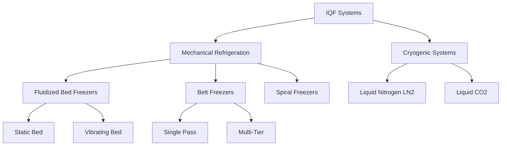
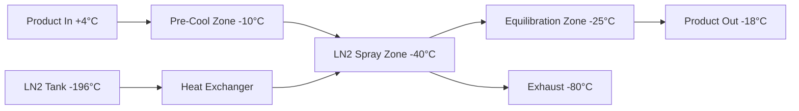

## Overview of IQF Technology

Individual Quick Freezing (IQF) represents the most advanced method for freezing poultry products, producing individually frozen pieces with minimal ice crystal formation and maximum product quality retention. IQF systems freeze small poultry portions (diced chicken, strips, nuggets, wings) at extremely high rates, typically achieving freezing times of 3-15 minutes compared to 2-4 hours for conventional blast freezing.

The fundamental advantage stems from heat transfer physics: smaller product dimensions and higher air velocities generate superior heat transfer coefficients, enabling rapid temperature reduction through the critical zone (-1°C to -5°C) where ice crystal formation occurs.

## Heat Transfer Fundamentals

### Freezing Time Calculation

The modified Plank equation predicts freezing time for irregularly shaped poultry pieces:

$$t_f = \frac{\rho_f \lambda}{T_m - T_a} \left(\frac{P \cdot d}{h} + \frac{R \cdot d^2}{k_f}\right)$$

Where:
- $t_f$ = freezing time (s)
- $\rho_f$ = density of frozen product (950-1050 kg/m³ for poultry)
- $\lambda$ = latent heat of fusion (250-280 kJ/kg for poultry)
- $T_m$ = initial freezing point (-2°C for poultry)
- $T_a$ = air temperature (-30°C to -40°C for IQF)
- $P$, $R$ = shape factors (0.5, 0.125 for spheres)
- $d$ = characteristic dimension (m)
- $h$ = surface heat transfer coefficient (W/m²·K)
- $k_f$ = thermal conductivity of frozen product (1.8-2.0 W/m·K)

### Convective Heat Transfer Coefficient

For IQF systems utilizing high-velocity air:

$$h = \frac{Nu \cdot k_{air}}{d}$$

With Nusselt number for flow over particles:

$$Nu = 2.0 + 0.6 \cdot Re^{0.5} \cdot Pr^{0.33}$$

Reynolds number in IQF fluidized beds typically ranges from 500-5000, producing heat transfer coefficients of 100-250 W/m²·K, compared to 20-40 W/m²·K in conventional blast freezers.

## IQF System Types

### Fluidized Bed Freezers

Fluidized bed systems achieve optimal heat transfer by suspending product pieces in high-velocity cold air streams (5-8 m/s). The air flows upward through a perforated belt, creating a fluidized state where products tumble and separate, ensuring uniform exposure to freezing air.

**Operating Parameters:**
- Air temperature: -35°C to -40°C
- Air velocity: 5-8 m/s at product level
- Bed depth: 50-100 mm
- Residence time: 5-12 minutes
- Product temperature reduction: +4°C to -18°C

The pressure drop across the product bed follows:

$$\Delta P = \frac{(1-\epsilon) \cdot \rho_p \cdot g \cdot L}{\epsilon}$$

Where $\epsilon$ is bed voidage (0.4-0.6) and $L$ is bed depth.

## System Comparison

| System Type | Freezing Rate (mm/h) | Energy (kWh/ton) | Capital Cost | Product Quality | Typical Capacity (kg/h) |
|-------------|---------------------|------------------|--------------|----------------|------------------------|
| Fluidized Bed | 25-50 | 80-120 | High | Excellent | 500-3000 |
| Belt Freezer | 15-30 | 90-130 | Medium | Very Good | 1000-5000 |
| Spiral Freezer | 12-25 | 85-125 | Very High | Good | 2000-8000 |
| LN₂ Cryogenic | 100-200 | 150-250* | Low | Excellent | 200-2000 |
| CO₂ Cryogenic | 80-150 | 140-230* | Low | Excellent | 200-2000 |

*Includes equivalent energy of cryogen production

## Refrigeration Load Calculations

Total refrigeration load for IQF systems:

$$Q_{total} = Q_{product} + Q_{air} + Q_{trans} + Q_{equipment}$$

### Product Load

$$Q_{product} = \dot{m}_p \left[c_{p,above}(T_i - T_m) + \lambda + c_{p,below}(T_m - T_f)\right]$$

For poultry with 75% moisture content:
- $c_{p,above}$ = 3.5 kJ/kg·K (unfrozen)
- $c_{p,below}$ = 1.8 kJ/kg·K (frozen)
- $\lambda$ = 265 kJ/kg

### Air Infiltration Load

$$Q_{air} = \dot{V}_{air} \cdot \rho_{air} \cdot c_{p,air} \cdot \Delta T$$

IQF tunnels with high air recirculation (85-95%) minimize this load compared to open conveyor systems.

## Process Design Considerations

### Air Distribution System

Proper air distribution ensures uniform freezing across the product bed. The perforated belt or floor requires:

- Open area: 40-50% of total surface
- Hole diameter: 6-10 mm
- Velocity through perforations: 10-15 m/s
- Plenum pressure: 500-1000 Pa

### Evaporator Design

Low-temperature evaporators for IQF applications require:

**Refrigerant Selection:**
- Ammonia (R-717): Most common for large systems
- R-404A: Phase-out considerations
- R-448A, R-449A: Low-GWP replacements

**Coil Parameters:**
- TD (temperature difference): 6-8 K
- Evaporating temperature: -42°C to -45°C
- Fin spacing: 6-8 mm (with hot gas defrost)
- Air-side velocity: 2.5-3.5 m/s

### Defrost Systems

IQF evaporators accumulate frost rapidly due to high air circulation rates and low temperatures. Defrost cycle design:

$$t_{defrost} = \frac{m_{frost} \cdot \lambda_{ice} + m_{coil} \cdot c_p \cdot \Delta T}{Q_{defrost}}$$

Hot gas defrost cycles typically occur every 4-8 hours, lasting 15-30 minutes.

## Cryogenic IQF Systems

Liquid nitrogen IQF systems achieve ultra-rapid freezing through direct cryogen contact:

$$Q_{LN2} = \dot{m}_{LN2} \left[\lambda_{vap,LN2} + c_{p,N2}(T_{product} - T_{LN2})\right]$$

With $\lambda_{vap,LN2}$ = 200 kJ/kg at -196°C, cryogenic systems extract heat 50-100 times faster than mechanical refrigeration. The consumption rate typically ranges from 0.8-1.2 kg LN₂ per kg product.

## Quality Control Parameters

### Ice Crystal Size

Freezing rate directly affects ice crystal dimensions:

$$d_{crystal} \propto \frac{1}{\sqrt{N}}$$

Where $N$ is nucleation rate. IQF systems produce crystals of 30-50 μm compared to 100-200 μm in slow freezing, minimizing cellular damage and drip loss upon thawing.

### Dehydration Control

Surface moisture loss during freezing:

$$\frac{dm}{dt} = h_m \cdot A \cdot (P_{sat,surface} - P_{air})$$

Low air temperatures and high relative humidity (>90%) in IQF tunnels minimize weight loss to <0.5% compared to 1-3% in conventional systems.

## Energy Efficiency Optimization

### Variable Speed Fan Control

Adjusting air velocity based on product load:

$$P_{fan} \propto V^3$$

Variable frequency drives reduce fan power consumption by 20-40% during partial load operation.

### Heat Recovery

Reject heat from ammonia condensers (35-40°C) can provide:
- Building heating (winter)
- Hot water for sanitation
- Pre-heating defrost supply air

Recovery efficiency of 40-60% reduces overall energy consumption by 15-25%.

## ASHRAE References

Design guidance per ASHRAE Handbook—Refrigeration:
- Chapter 29: Refrigerated-Facility Design
- Chapter 30: Commercial Freezing Methods
- Chapter 51: Poultry Products

Refrigeration load calculations follow ASHRAE Standard 15 (Safety Standard for Refrigeration Systems) requirements for machinery room ventilation and refrigerant detection.

## Operational Best Practices

**Product Preparation:**
- Uniform piece sizing (±15% dimension variation)
- Surface moisture removal (air knives)
- Pre-cooling to +2°C to +4°C
- Product temperature monitoring (IR sensors)

**System Monitoring:**
- Air temperature profiles (6-10 points along tunnel)
- Product core temperature (sample testing)
- Evaporator pressure drop (frost accumulation indicator)
- Refrigerant superheat (8-12 K target)
- Power consumption trending

**Maintenance Schedule:**
- Daily: Product residue removal, drain cleaning
- Weekly: Belt alignment, bearing inspection
- Monthly: Refrigerant leak testing, insulation inspection
- Quarterly: Fan motor current trending, vibration analysis
- Annual: Evaporator coil cleaning, full system commissioning

IQF technology represents the optimal balance between product quality, throughput, and energy efficiency for high-value poultry products requiring premium freezing performance.
