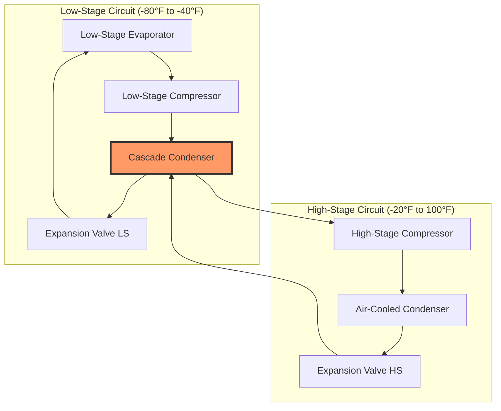

# Industrial Refrigeration Systems

Industrial refrigeration systems serve large-scale cooling applications including cold storage warehouses, food processing plants, chemical manufacturing, ice rinks, and industrial process cooling. These systems differ fundamentally from commercial refrigeration in scale, refrigerant selection, system architecture, and operating pressures.

## System Architectures

Industrial refrigeration employs three primary system configurations, each optimized for specific capacity ranges and application requirements.

### Direct Expansion Systems

Direct expansion (DX) systems evaporate refrigerant directly in the cooling coils. Refrigerant circulates through the evaporator once, with vapor returning to the compressor. DX systems operate at lower first costs but require larger refrigerant charges and more extensive piping networks.

**Key characteristics:**
- Refrigerant charge: 2-4 lb per ton of refrigeration
- Evaporator superheat: 8-12°F at suction line
- Oil return velocity requirements: minimum 700 fpm in vertical risers
- Applicable for loads up to 500 tons per circuit

### Liquid Overfeed Systems

Liquid overfeed systems recirculate refrigerant at ratios of 2:1 to 6:1 (circulated to evaporated). A low-pressure receiver supplies liquid refrigerant to evaporators via gravity or pump circulation. Vapor and unevaporated liquid return to the low-pressure receiver where separation occurs.

The recirculation ratio affects heat transfer performance:

$$q = \dot{m} h_{fg} \eta$$

Where:
- $q$ = refrigeration capacity (Btu/hr)
- $\dot{m}$ = mass flow rate of refrigerant (lb/hr)
- $h_{fg}$ = latent heat of vaporization (Btu/lb)
- $\eta$ = evaporator effectiveness (typically 0.85-0.95)

**Advantages:**
- Reduced superheat in evaporators (2-4°F)
- Improved heat transfer coefficients (15-25% higher than DX)
- Better oil management in large systems
- Lower discharge temperatures at compressors

### Cascade Systems

Cascade systems employ two separate refrigeration circuits operating at different temperature levels. The high-stage system rejects heat from the low-stage condenser. This configuration is essential for applications below -60°F where single-stage compression becomes impractical.

## Refrigerant Selection

Industrial refrigeration predominantly uses ammonia (R-717) and carbon dioxide (R-744) due to thermodynamic efficiency, environmental considerations, and operational economics.

| Property | Ammonia (NH3) | CO2 (R-744) | R-507A |
|----------|---------------|-------------|---------|
| ODP | 0 | 0 | 0 |
| GWP | <1 | 1 | 3,985 |
| Toxicity (ASHRAE 34) | B2L | A1 | A1 |
| Critical Temperature | 270.0°F | 87.8°F | 158.0°F |
| Latent Heat at 0°F | 555 Btu/lb | 118 Btu/lb | 64 Btu/lb |
| Liquid Density at 0°F | 42.1 lb/ft³ | 64.3 lb/ft³ | 83.2 lb/ft³ |
| Operating Pressure at 0°F | 30.4 psia | 304 psia | 71.7 psia |

### Ammonia Systems

Ammonia delivers superior thermodynamic performance with high latent heat and excellent heat transfer properties. The refrigerant operates at moderate pressures (30-250 psia) and provides exceptional energy efficiency.

**Design considerations per ASHRAE 15 and IIAR standards:**
- Machine room requirements for quantities exceeding threshold
- Leak detection systems mandatory in occupied spaces
- Emergency ventilation: minimum 30 air changes per hour
- Pressure relief discharge to atmosphere or approved treatment system
- Personnel protective equipment requirements

### CO2 Refrigeration

Carbon dioxide systems operate in subcritical or transcritical modes. Subcritical systems function below the critical point (87.8°F, 1,070 psia), while transcritical systems exceed critical pressure during heat rejection.

Transcritical CO2 cooling capacity:

$$q = \dot{m} (h_1 - h_4)$$

Where:
- $h_1$ = enthalpy at gas cooler inlet (Btu/lb)
- $h_4$ = enthalpy at evaporator inlet (Btu/lb)

The gas cooler approach temperature significantly impacts system efficiency, with optimal discharge pressures varying based on ambient conditions.

## Compressor Selection

Industrial systems employ reciprocating, screw, and centrifugal compressors based on capacity requirements and operational characteristics.

### Reciprocating Compressors

Reciprocating compressors serve applications from 5 to 500 tons per unit. Multi-cylinder configurations provide capacity control through cylinder unloading.

Volumetric efficiency:

$$\eta_v = 1 + C - C \left(\frac{P_d}{P_s}\right)^{1/n}$$

Where:
- $C$ = clearance volume ratio (typically 0.03-0.06)
- $P_d$ = discharge pressure (psia)
- $P_s$ = suction pressure (psia)
- $n$ = polytropic exponent (1.1-1.3 for ammonia)

### Screw Compressors

Rotary screw compressors dominate industrial applications from 100 to 3,000 tons per unit. Twin-screw designs provide continuous compression with minimal vibration and excellent part-load efficiency through slide valve capacity control.

**Performance characteristics:**
- Pressure ratio capability: up to 20:1 single stage
- Built-in volume ratio: 2.5-5.0 (optimized for application)
- Part-load efficiency: 75-95% at 50% capacity
- Oil injection cooling reduces discharge temperatures

## Heat Rejection Equipment

### Evaporative Condensers

Evaporative condensers combine heat rejection and water evaporation in a single unit. Water sprays over the condenser coil surface while air flows through the wetted media, achieving condensing temperatures 10-15°F above ambient wet-bulb temperature.

Heat rejection capacity:

$$q_c = \dot{m}_r (h_2 - h_3) = \dot{m}_a (h_{a,out} - h_{a,in})$$

Where:
- $\dot{m}_r$ = refrigerant mass flow rate (lb/hr)
- $h_2$ = discharge gas enthalpy (Btu/lb)
- $h_3$ = condensed liquid enthalpy (Btu/lb)
- $\dot{m}_a$ = air mass flow rate (lb/hr)

**Design parameters per ASHRAE 15:**
- Minimum condensing pressure for oil return: 75 psig for ammonia
- Water quality requirements: 500-800 ppm total dissolved solids
- Bleed rate: 0.2-0.5% of recirculation to control mineral concentration
- Freeze protection in winter operation mandatory

### Ammonia Condensers

Shell-and-tube ammonia condensers position refrigerant in the shell with water or glycol in tubes. Horizontal configurations with multiple tube passes optimize heat transfer while maintaining oil drainage.

Overall heat transfer coefficient ranges from 150-300 Btu/hr·ft²·°F depending on refrigerant velocity, tube material, and fouling factors.

## Liquid Refrigerant Pumping

Pumped liquid overfeed systems circulate refrigerant using centrifugal or positive displacement pumps. Proper pump sizing requires analysis of net positive suction head (NPSH) to prevent cavitation.

Required NPSH:

$$NPSH_r = \frac{P_{sat} - P_{vap}}{\rho g} + \frac{v^2}{2g} + z$$

Where:
- $P_{sat}$ = saturation pressure at pumping temperature (lb/ft²)
- $P_{vap}$ = vapor pressure (lb/ft²)
- $\rho$ = liquid density (lb/ft³)
- $g$ = gravitational constant (32.2 ft/s²)
- $v$ = liquid velocity (ft/s)
- $z$ = elevation head (ft)

Ammonia pumps require minimum NPSH of 8-12 ft to ensure reliable operation. Liquid subcooling of 5-10°F at the pump inlet prevents flash gas formation.

## Safety and Code Compliance

Industrial refrigeration systems must comply with ASHRAE 15 (Safety Standard for Refrigeration Systems), IIAR standards, and local codes. Key requirements include:

- Machinery room classification per IBC and IMC
- Refrigerant detection and emergency shutdown systems
- Pressure relief device sizing per ASME Section VIII
- Emergency ventilation interlocked with refrigerant detection
- Personnel training and refrigerant management programs
- Dual pressure relief for vessels over 1.5 ft³ internal volume

Refrigerant quantities trigger specific safety requirements. Systems exceeding 10,000 pounds of ammonia require comprehensive process safety management programs per OSHA 29 CFR 1910.119.

Industrial refrigeration system design integrates thermodynamic analysis, safety compliance, and operational efficiency to deliver reliable large-scale cooling for critical industrial processes.
