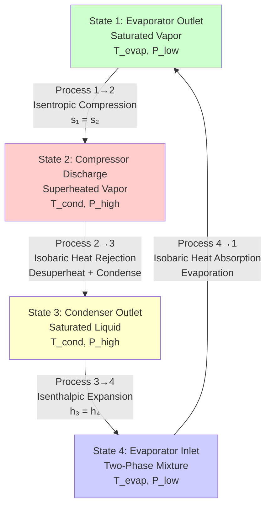
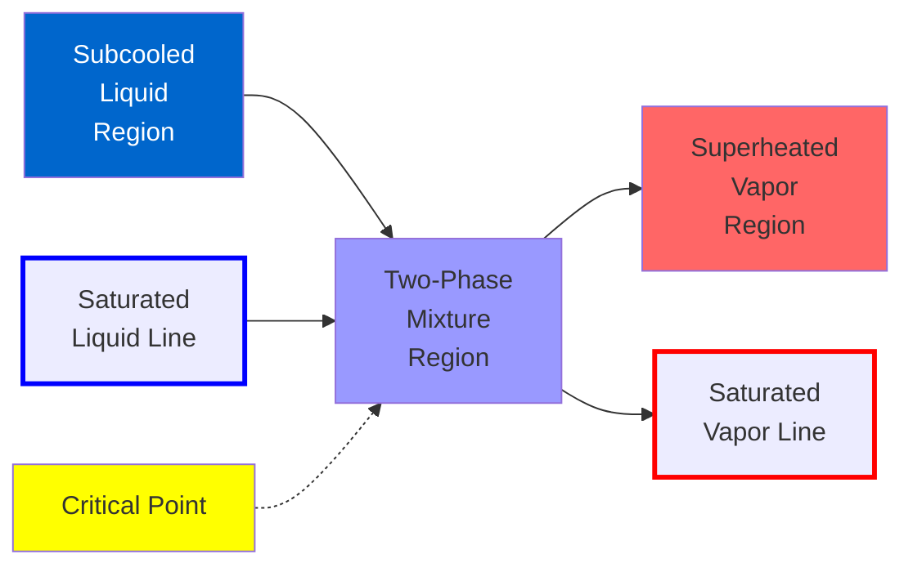
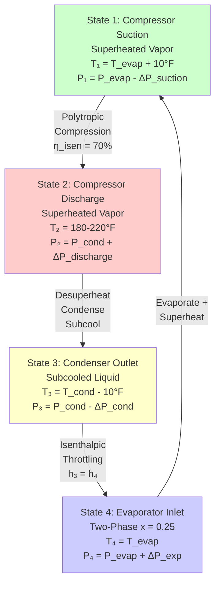
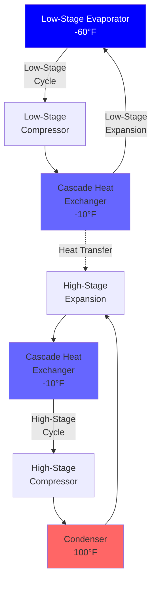

# Vapor-Compression Refrigeration Cycle: Thermodynamic Analysis and Performance Optimization

The vapor-compression refrigeration cycle represents the dominant technology for mechanical refrigeration and air conditioning worldwide. This cycle exploits the thermodynamic properties of refrigerants—specifically their phase-change behavior at practical temperature and pressure levels—to transfer heat from low-temperature spaces to high-temperature sinks. Understanding the fundamental thermodynamics, component interactions, and performance limitations of vapor-compression systems enables engineers to design, optimize, and troubleshoot refrigeration equipment ranging from residential air conditioners to industrial ammonia systems operating at hundreds of tons of capacity.

## Fundamental Thermodynamic Principles

### Reverse Carnot Cycle Foundation

The vapor-compression cycle operates as a reverse heat engine, consuming mechanical work to transfer heat against a temperature gradient. The theoretical maximum efficiency for any refrigeration cycle operating between two thermal reservoirs is given by the Carnot coefficient of performance:

$$COP_{Carnot} = \frac{T_L}{T_H - T_L}$$

Where:
- $T_L$ = absolute temperature of low-temperature reservoir (R or K)
- $T_H$ = absolute temperature of high-temperature reservoir (R or K)

The Carnot COP establishes the thermodynamic limit. Real vapor-compression cycles achieve 40-70% of Carnot COP due to irreversibilities in compression, heat transfer, and expansion processes.

### Second Law Analysis

The second law of thermodynamics dictates that refrigeration requires work input. The entropy generation quantifies irreversibilities:

$$\dot{S}_{gen} = \sum \frac{\dot{Q}}{T} + \dot{m}(s_{out} - s_{in}) \geq 0$$

Minimizing entropy generation through:
- Reducing temperature differences in heat exchangers
- Improving compressor isentropic efficiency
- Minimizing pressure drops in refrigerant piping
- Reducing throttling losses in expansion devices

directly improves cycle efficiency.

## Ideal Vapor-Compression Cycle

The ideal vapor-compression cycle consists of four reversible processes:

### Process 1→2: Isentropic Compression

The compressor raises refrigerant pressure from evaporator to condenser pressure while maintaining constant entropy (ideal):

$$s_2 = s_1$$

Work input per unit mass:

$$w_{comp} = h_2 - h_1$$

For ideal gas refrigerants, the discharge temperature can be approximated:

$$T_2 = T_1 \left(\frac{P_2}{P_1}\right)^{(\gamma-1)/\gamma}$$

Where $\gamma$ = ratio of specific heats ($c_p/c_v$)

The compression ratio fundamentally impacts efficiency:

$$r_p = \frac{P_{cond}}{P_{evap}}$$

Typical compression ratios:
- Air conditioning (R-410A): 2.5-4.0
- Medium-temperature refrigeration (R-404A): 4.0-6.0
- Low-temperature refrigeration (R-404A): 6.0-12.0
- Cascade systems: 3.0-5.0 per stage

### Process 2→3: Isobaric Condensation

The condenser rejects heat at constant pressure through three distinct zones:

**Desuperheating zone (2→2'):**
$$q_{desuperheat} = c_p(T_2 - T_{sat,cond})$$

Typically 10-30% of total condenser heat rejection.

**Condensation zone (2'→3'):**
$$q_{condense} = h_{fg}$$

Where $h_{fg}$ = enthalpy of vaporization at condensing temperature. This represents 60-80% of total heat rejection.

**Subcooling zone (3'→3):**
$$q_{subcool} = c_p(T_{sat,cond} - T_3)$$

Subcooling improves cycle efficiency without penalty. Typically 5-20°F subcooling.

Total condenser heat rejection:
$$q_{cond} = h_2 - h_3$$

### Process 3→4: Isenthalpic Expansion

The expansion device (thermostatic expansion valve, electronic expansion valve, or capillary tube) reduces refrigerant pressure from condenser to evaporator pressure through an irreversible throttling process:

$$h_4 = h_3$$

This process generates entropy:

$$\Delta s_{expansion} = s_4 - s_3 > 0$$

The quality (vapor fraction) at evaporator inlet:

$$x_4 = \frac{h_4 - h_{f,evap}}{h_{fg,evap}}$$

Where:
- $h_{f,evap}$ = saturated liquid enthalpy at evaporator pressure
- $h_{fg,evap}$ = enthalpy of vaporization at evaporator pressure

Typical quality ranges: 0.20-0.40 (20-40% vapor)

Higher quality reduces evaporator effectiveness because the two-phase mixture enters with less sensible cooling capacity.

### Process 4→1: Isobaric Evaporation

The evaporator absorbs heat at constant pressure, converting liquid refrigerant to vapor:

$$q_{evap} = h_1 - h_4$$

This represents the refrigeration effect—the useful cooling delivered by the cycle.

For saturated suction (State 1 = saturated vapor):

$$q_{evap} = h_{g,evap} - h_4$$

Where $h_{g,evap}$ = saturated vapor enthalpy at evaporator pressure.

## Thermodynamic Cycle Diagrams

### Pressure-Enthalpy (P-h) Diagram

The P-h diagram provides the most practical tool for refrigeration cycle analysis. The logarithmic pressure axis and linear enthalpy axis clearly show:

- **Constant temperature lines** (isotherms): Horizontal in two-phase region, curved in superheat/subcool regions
- **Constant entropy lines** (isentropes): Vertical in two-phase region, sloped in superheat region
- **Constant quality lines**: Radiate from critical point through two-phase region
- **Constant specific volume lines**: Used for compressor displacement calculations

**State point location on P-h diagram:**

**State 1** (Compressor suction):
- Located on saturated vapor line (ideal) or in superheated region (practical)
- Pressure = evaporator pressure
- Enthalpy determines refrigeration effect

**State 2** (Compressor discharge):
- Located in superheated vapor region
- Pressure = condenser pressure
- Entropy approximately equals State 1 entropy (moves right and up)

**State 3** (Condenser outlet):
- Located on saturated liquid line (ideal) or in subcooled region (practical)
- Pressure = condenser pressure (constant from State 2)
- Enthalpy determines expansion valve inlet condition

**State 4** (Evaporator inlet):
- Located in two-phase region
- Pressure = evaporator pressure
- Enthalpy equals State 3 enthalpy (horizontal line from State 3)

The P-h diagram allows direct reading of:
- Refrigeration effect: $q_{evap} = h_1 - h_4$ (horizontal distance)
- Compression work: $w_{comp} = h_2 - h_1$ (follows isentrope from State 1)
- Heat rejection: $q_{cond} = h_2 - h_3$ (horizontal distance)

### Temperature-Entropy (T-s) Diagram

The T-s diagram emphasizes thermodynamic efficiency and entropy generation. The area under process curves represents heat transfer:

$$q = \int T \, ds$$

The T-s diagram reveals:
- **Carnot efficiency**: Rectangular cycle area
- **Entropy generation**: Horizontal distance between States 3 and 4 shows throttling irreversibility
- **Heat transfer**: Areas under curves 2→3 (condenser) and 4→1 (evaporator)

**Cycle representation on T-s diagram:**

Process 1→2: Vertical line (ideal isentropic compression) or line sloping right (real compression with entropy generation)

Process 2→3: Curves downward and left as refrigerant cools, condensing at constant temperature, then subcooling

Process 3→4: Horizontal line to the right (entropy increases during irreversible throttling)

Process 4→1: Curves upward and right during evaporation at constant temperature

The enclosed area represents net work input:

$$w_{net} = \oint T \, ds = q_{cond} - q_{evap}$$

## Coefficient of Performance (COP) Analysis

### COP Definitions

**Refrigeration mode COP** (cooling objective):

$$COP_R = \frac{Q_{evap}}{W_{comp}} = \frac{q_{evap}}{w_{comp}} = \frac{h_1 - h_4}{h_2 - h_1}$$

**Heat pump mode COP** (heating objective):

$$COP_{HP} = \frac{Q_{cond}}{W_{comp}} = \frac{q_{cond}}{w_{comp}} = \frac{h_2 - h_3}{h_2 - h_1}$$

**Fundamental relationship:**

$$COP_{HP} = COP_R + 1$$

This relationship derives from energy conservation: $Q_{cond} = Q_{evap} + W_{comp}$

### Energy Efficiency Ratio (EER) and Seasonal EER (SEER)

In the United States, air conditioning efficiency uses EER and SEER rather than COP:

$$EER = \frac{\text{Cooling capacity (Btu/h)}}{\text{Power input (W)}}$$

**Conversion:**
$$EER = COP_R \times 3.412$$

$$SEER = \text{Seasonal cooling (Btu)} / \text{Seasonal power (Wh)}$$

SEER accounts for part-load performance, cyclic losses, and varying outdoor temperatures. Current minimum SEER requirements:
- Residential split systems: SEER 14-15 (regional variation)
- High-efficiency systems: SEER 18-25
- Variable-speed systems: SEER 20-30

### Impact of Operating Temperatures on COP

COP decreases as the temperature lift $(T_{cond} - T_{evap})$ increases:

For refrigeration (cooling) applications:
- **Air conditioning** (95°F outdoor, 45°F evaporator): COP 3.5-5.0
- **Medium-temp refrigeration** (90°F ambient, 20°F evaporator): COP 2.5-3.5
- **Low-temp refrigeration** (90°F ambient, -20°F evaporator): COP 1.5-2.5
- **Ultra-low temp** (90°F ambient, -40°F evaporator): COP 1.0-1.5

For heat pump (heating) applications:
- **Mild climate** (45°F outdoor, 120°F condensing): COP 3.5-4.5
- **Cold climate** (17°F outdoor, 120°F condensing): COP 2.0-3.0
- **Extreme cold** (-5°F outdoor, 120°F condensing): COP 1.5-2.0

## Detailed Component Analysis

### Compressor Thermodynamics and Performance

The compressor drives the refrigeration cycle, consuming the majority of system power. Compressor performance determines overall cycle efficiency.

**Isentropic efficiency:**

$$\eta_{isen} = \frac{h_{2s} - h_1}{h_2 - h_1}$$

Where:
- $h_{2s}$ = ideal discharge enthalpy (isentropic compression from State 1 to $P_2$)
- $h_2$ = actual discharge enthalpy

Typical isentropic efficiencies:
- Reciprocating compressors: 65-75%
- Scroll compressors: 65-75%
- Screw compressors: 70-80%
- Centrifugal compressors: 75-85%

**Volumetric efficiency:**

$$\eta_{vol} = \frac{\dot{m}_r}{(\rho_1 \cdot \dot{V}_{disp})}$$

Where:
- $\dot{m}_r$ = actual mass flow rate (lb/min)
- $\rho_1$ = refrigerant density at suction (lb/ft³)
- $\dot{V}_{disp}$ = compressor displacement volume flow rate (ft³/min)

Volumetric efficiency accounts for:
- Re-expansion of clearance volume gas
- Pressure drop through valves (reciprocating)
- Internal leakage past pistons or scrolls
- Refrigerant heating from motor and compression

Typical volumetric efficiencies: 60-85%

**Compressor displacement calculation:**

$$\dot{V}_{disp} = \frac{Q_{evap}}{\eta_{vol} \cdot \rho_1 \cdot (h_1 - h_4)}$$

This determines the physical compressor size required.

**Compressor power:**

$$W_{comp} = \frac{\dot{m}_r (h_2 - h_1)}{\eta_{mech}}$$

Where $\eta_{mech}$ = mechanical efficiency (95-98%)

**Discharge temperature limits:**

Excessive discharge temperature causes:
- Oil breakdown (> 250-300°F for most oils)
- Refrigerant decomposition
- Valve damage
- Reduced compressor life

Discharge temperature for isentropic compression:

$$T_2 = T_1 \left(\frac{P_2}{P_1}\right)^{(\gamma-1)/\gamma}$$

For real compression with efficiency $\eta_{isen}$:

$$T_2 = T_1 + \frac{T_{2s} - T_1}{\eta_{isen}}$$

### Condenser Heat Transfer Analysis

The condenser rejects cycle heat to the environment through forced or natural convection. Condenser performance directly affects head pressure and cycle efficiency.

**Heat transfer rate:**

$$Q_{cond} = UA \cdot LMTD$$

Where:
- $U$ = overall heat transfer coefficient (Btu/(h·ft²·°F))
- $A$ = heat transfer surface area (ft²)
- $LMTD$ = log mean temperature difference (°F)

**Log mean temperature difference** for counterflow configuration:

$$LMTD = \frac{\Delta T_1 - \Delta T_2}{\ln(\Delta T_1 / \Delta T_2)}$$

Where:
- $\Delta T_1$ = temperature difference at one end
- $\Delta T_2$ = temperature difference at other end

**Condenser approach temperature:**

$$\Delta T_{approach} = T_{cond} - T_{ambient}$$

Typical approach temperatures:
- Air-cooled condensers: 15-30°F
- Water-cooled condensers: 5-15°F
- Evaporative condensers: 10-20°F

Smaller approach requires larger heat transfer area but improves COP by reducing condensing pressure.

**Heat transfer coefficient zones:**

Desuperheating zone (gas cooling):
$$U_{desuperheat} = 5-15 \text{ Btu/(h·ft²·°F)}$$

Condensing zone (phase change):
$$U_{condense} = 100-300 \text{ Btu/(h·ft²·°F)}$$

Subcooling zone (liquid cooling):
$$U_{subcool} = 20-60 \text{ Btu/(h·ft²·°F)}$$

The condensing zone provides the majority of heat transfer due to high $U$ and large temperature driving force.

### Evaporator Heat Transfer Analysis

The evaporator absorbs heat from the refrigerated space or process. Evaporator design affects capacity, dehumidification, and frost formation.

**Heat transfer rate:**

$$Q_{evap} = UA \cdot LMTD$$

**Evaporator temperature difference (TD):**

$$TD = T_{space} - T_{evap}$$

Typical TDs:
- Comfort air conditioning: 15-25°F
- Medium-temperature refrigeration: 10-15°F
- Low-temperature refrigeration: 8-12°F
- Process cooling (brine): 5-10°F

Smaller TD requires larger evaporator but improves COP by raising evaporator pressure.

**Sensible vs. latent cooling:**

In air conditioning, the evaporator provides both sensible cooling (temperature reduction) and latent cooling (dehumidification):

$$Q_{total} = Q_{sensible} + Q_{latent}$$

Sensible heat ratio (SHR):

$$SHR = \frac{Q_{sensible}}{Q_{total}}$$

Typical SHR ranges: 0.65-0.85

Lower SHR (more dehumidification) requires lower evaporator temperature, reducing COP.

**Frost formation:**

When evaporator surface temperature falls below 32°F and air dew point > 32°F, frost accumulates on coil surfaces. Frost increases air-side pressure drop and reduces heat transfer, requiring periodic defrost cycles.

Defrost methods:
- Electric resistance heating
- Hot gas defrost (reverse cycle)
- Water defrost
- Off-cycle defrost (air)

### Expansion Device Analysis

The expansion device meters refrigerant flow and maintains pressure difference between condenser and evaporator.

**Thermostatic Expansion Valve (TXV):**

The TXV modulates refrigerant flow to maintain constant superheat:

$$\Delta T_{superheat} = T_1 - T_{sat,evap}$$

Target superheat: 5-15°F

The TXV balances three pressures:
- Bulb pressure (sensing superheat)
- Evaporator pressure (opposing)
- Spring pressure (adjustable)

**Valve capacity:**

$$\dot{m}_r = C \sqrt{\Delta P \cdot \rho_L}$$

Where:
- $C$ = valve flow coefficient
- $\Delta P$ = pressure drop across valve
- $\rho_L$ = liquid density upstream

**Electronic Expansion Valve (EEV):**

Stepper motor-driven valves controlled by microprocessor enable:
- Precise superheat control (±1°F)
- Adaptive control algorithms
- Integration with variable-speed compressors
- Optimized efficiency across load range

**Capillary Tube:**

Fixed-orifice expansion device for small systems (< 5 tons). Flow rate depends on:
- Tube length and inside diameter
- Pressure difference
- Refrigerant subcooling

Critical capillary tube length:

$$L = f(D, \Delta P, \Delta T_{subcool})$$

Determined empirically or from manufacturer charts.

## Real Vapor-Compression Cycle

Real cycles deviate from the ideal cycle due to practical constraints and irreversibilities:

### Deviations from Ideal Cycle

**1. Compressor suction superheat:**

Actual systems maintain 5-20°F superheat at compressor suction to prevent liquid slugging. This shifts State 1 into the superheated region.

Effect on performance:
- Slight increase in refrigeration effect: $\Delta h_{evap} = c_p \cdot \Delta T_{superheat}$
- Increased compressor discharge temperature
- Reduced compressor volumetric efficiency (lower suction density)
- Net effect: Typically 0-5% COP reduction

**2. Condenser subcooling:**

Subcooling the condensed liquid 5-20°F below saturation temperature increases refrigeration effect without increasing compression work.

Effect on performance:
- Increased refrigeration effect: $\Delta h_{subcool} = c_p \cdot \Delta T_{subcool}$
- Prevents flash gas in liquid line
- Net effect: 2-8% COP improvement per 10°F subcooling

**3. Pressure drops in piping and heat exchangers:**

Friction and acceleration pressure drops occur in:
- Suction line (evaporator outlet to compressor)
- Discharge line (compressor to condenser)
- Liquid line (condenser to expansion valve)

Suction line pressure drop particularly harmful:
- Reduces compressor suction pressure
- Increases compression ratio
- Reduces volumetric efficiency
- Typical penalty: 1-2% COP loss per 1 psi drop

Design limits:
- Suction line: < 2 psi (equivalent to < 1-2°F saturation temperature change)
- Discharge line: < 5 psi
- Liquid line: Any amount acceptable (no phase change)

**4. Non-isentropic compression:**

Real compressors generate entropy due to:
- Friction
- Heat transfer to/from cylinder walls
- Throttling through valves
- Re-expansion of clearance volume

Isentropic efficiency quantifies this deviation: 65-85% typical

**5. Heat transfer to/from surroundings:**

- Suction line heat gain increases superheat, reducing capacity
- Liquid line subcooling can improve performance if intentional
- Compressor shell heat loss/gain affects efficiency

### Practical Cycle Representation

## Refrigerant Properties and Selection

### Thermophysical Properties

Ideal refrigerant properties:
- **High latent heat of vaporization**: Reduces mass flow rate for given capacity
- **Moderate pressure levels**: 30-300 psia operating range avoids vacuum or extremely high pressures
- **High critical temperature**: Ensures condensation at ambient conditions
- **Low specific volume**: Reduces compressor displacement
- **High thermal conductivity**: Improves heat exchanger performance
- **Low viscosity**: Reduces pressure drops

### Environmental Properties

**Ozone Depletion Potential (ODP):**

$$ODP = \frac{\text{Ozone depletion by refrigerant}}{\text{Ozone depletion by R-11}}$$

- CFCs (R-11, R-12): ODP = 0.6-1.0 (banned)
- HCFCs (R-22): ODP = 0.055 (phased out)
- HFCs, HFOs, natural refrigerants: ODP = 0

**Global Warming Potential (GWP):**

$$GWP = \frac{\text{Climate forcing by 1 kg refrigerant over 100 years}}{\text{Climate forcing by 1 kg CO₂ over 100 years}}$$

Current regulatory focus: Kigali Amendment mandates HFC phase-down.

| Refrigerant | Type | ODP | GWP (100-yr) | Applications |
|-------------|------|-----|--------------|--------------|
| **Phased Out** |
| R-12 | CFC | 1.0 | 10,900 | Obsolete (automotive, refrigerators) |
| R-22 | HCFC | 0.055 | 1,810 | Legacy systems (banned new equipment) |
| **Current HFCs** |
| R-134a | HFC | 0 | 1,430 | Automotive AC, chillers, low-temp |
| R-404A | HFC blend | 0 | 3,920 | Commercial refrigeration (being replaced) |
| R-410A | HFC blend | 0 | 2,088 | Residential/commercial AC, heat pumps |
| R-407C | HFC blend | 0 | 1,774 | Retrofit for R-22 in AC |
| **Low-GWP Alternatives** |
| R-32 | HFC | 0 | 675 | Residential AC (Asia, Europe) |
| R-1234yf | HFO | 0 | 4 | Automotive AC |
| R-1234ze | HFO | 0 | 6 | Chillers, foam blowing |
| R-448A | HFC/HFO blend | 0 | 1,387 | R-404A replacement |
| R-449A | HFC/HFO blend | 0 | 1,397 | R-404A replacement |
| R-513A | HFC/HFO blend | 0 | 631 | R-134a replacement |
| **Natural Refrigerants** |
| R-717 (Ammonia) | Natural | 0 | 0 | Industrial refrigeration |
| R-744 (CO₂) | Natural | 0 | 1 | Cascade systems, transcritical |
| R-290 (Propane) | Natural | 0 | 3 | Small appliances (flammable) |
| R-600a (Isobutane) | Natural | 0 | 3 | Domestic refrigerators |

### Refrigerant Selection Criteria

**Air conditioning (comfort cooling):**
- R-410A: Current standard, high efficiency, requires new equipment design (70% higher pressure than R-22)
- R-32: Lower GWP, slightly flammable (A2L), gaining market share
- R-1234yf: Very low GWP, slightly flammable, higher cost

**Commercial refrigeration:**
- R-448A, R-449A: Drop-in replacements for R-404A, 65% lower GWP
- R-744 (CO₂): Zero GWP, requires transcritical cycle or cascade system
- R-290 (Propane): Zero GWP, highly efficient, requires reduced charge (flammable)

**Industrial refrigeration:**
- R-717 (Ammonia): Dominant choice, highest efficiency (COP 4-6), toxic requires safety systems
- R-744 (CO₂) cascade: Low-stage refrigerant in cascade with ammonia

**Chillers:**
- R-134a: Current standard for centrifugal chillers
- R-1234ze: Low-GWP replacement, 10-15% lower efficiency
- R-513A: R-134a replacement, better efficiency than R-1234ze

## Performance Optimization Strategies

### Maximizing Subcooling

Subcooling the liquid refrigerant leaving the condenser directly improves COP:

$$COP_{improved} = \frac{h_1 - h_{3,subcool}}{h_2 - h_1}$$

Methods to increase subcooling:

**1. Dedicated subcooler:**
Additional heat exchanger after main condenser using ambient air or water.

Benefit: 2-5% COP improvement per 10°F subcooling

**2. Suction-line heat exchanger (SLHX):**
Counterflow heat exchanger transferring heat from warm liquid line to cool suction line.

Benefits:
- Subcools liquid refrigerant
- Evaporates any liquid in suction line
- Increases superheat at compressor

Trade-off:
- Increases compressor discharge temperature
- Net benefit depends on refrigerant properties
- Beneficial for: R-22, R-407C, R-290
- Detrimental for: R-410A, R-134a, R-404A

**3. Mechanical subcooling:**
Dedicated refrigeration cycle subcools main cycle liquid line.

Benefit: 5-15% capacity increase and COP improvement

Used in: Large cold storage systems, industrial refrigeration

### Optimizing Superheat Control

Excessive superheat reduces capacity and efficiency:
- Increases compressor discharge temperature
- Reduces mass flow rate (lower suction density)
- Wastes evaporator heat transfer area

Optimal superheat: 5-10°F at evaporator outlet

Methods:
- Electronic expansion valves (EEVs) with precise control
- Evaporator pressure regulators (EPRs)
- Distributor design for uniform refrigerant distribution

### Floating Head Pressure Control

Traditional systems maintain constant high head pressure year-round. Floating head pressure reduces condenser pressure during cool ambient conditions.

**Energy savings mechanism:**
- Lower compression ratio → less compressor work
- Lower discharge temperature → improved compressor efficiency

**Control methods:**
- Fan cycling (on/off control)
- Variable-speed condenser fans
- Condenser water valve modulation

**Limitations:**
- Minimum head pressure required for TXV pressure drop
- Oil return in low-ambient conditions
- Refrigerant migration

Typical savings: 5-20% annual energy consumption

### Variable-Speed Compressors

Variable-frequency drives (VFDs) modulate compressor speed to match cooling load:

**Benefits:**
- Eliminates cycling losses
- Maintains precise temperature control
- Improved part-load efficiency (IEER, SEER)
- Reduced starting current

**Efficiency improvement mechanism:**

At part load, fixed-speed compressors cycle on/off. Cycling penalties include:
- Starting transients
- Oil management
- Migration during off-cycle

Variable-speed operation avoids these penalties.

Part-load efficiency improvement: 15-40% vs. fixed-speed

**Challenges:**
- Higher first cost ($1,000-3,000 for residential systems)
- Inverter reliability
- Harmonic distortion

### Multi-Stage Compression with Intercooling

For large temperature lifts (compression ratio > 8:1), single-stage compression becomes inefficient:

**Problems with high compression ratio:**
- Excessive discharge temperature (> 250°F)
- Poor volumetric efficiency (< 60%)
- Reduced reliability

**Two-stage compression benefits:**
- Reduced discharge temperature: 40-80°F lower
- Improved volumetric efficiency: 15-30% higher
- Better COP: 10-25% improvement

**Optimal intermediate pressure:**

For equal pressure ratios between stages:

$$P_{inter} = \sqrt{P_{evap} \times P_{cond}}$$

**Intercooling methods:**

**Flash intercooling:**
- Simplest configuration
- Flash tank at intermediate pressure
- Saturated vapor to second stage
- Liquid continues to evaporator

**Direct intercooling:**
- Liquid refrigerant injection into intermediate stage
- Cools compressed gas
- Improves efficiency by 5-10% vs. flash intercooling

**Applications:**
- Low-temperature refrigeration (< -20°F)
- Heat pumps in cold climates
- Industrial refrigeration
- CO₂ transcritical systems

### Economizer Cycles

An economizer extracts vapor at intermediate pressure between condenser and evaporator, feeding it to an intermediate port on the compressor.

**Configuration:**
1. Liquid from condenser passes through flash tank or subcooler at intermediate pressure
2. Vapor from flash tank enters compressor at intermediate point
3. Subcooled liquid from flash tank continues to expansion valve

**Benefits:**
- Increased refrigeration effect (more subcooling)
- Reduced compression work per unit capacity
- COP improvement: 5-15%

**Applications:**
- Screw compressors with economizer port
- Scroll compressors with vapor injection
- Two-stage reciprocating systems

## Worked Examples with Detailed Calculations

### Worked Example 1: Complete R-134a Refrigeration Cycle Analysis

**Given:**
- Refrigerant: R-134a
- Evaporator temperature: $T_{evap} = 40°F$
- Condenser temperature: $T_{cond} = 100°F$
- Refrigeration capacity: $Q_{evap} = 10$ tons = 120,000 Btu/h
- Compressor isentropic efficiency: $\eta_{isen} = 75\%$
- Compressor mechanical efficiency: $\eta_{mech} = 95\%$
- Evaporator superheat: $10°F$
- Condenser subcooling: $8°F$
- Suction line pressure drop: $2$ psi
- Discharge line pressure drop: $3$ psi

**Find:**
1. All state point properties (P, T, h, s)
2. COP (refrigeration mode)
3. Compressor power (hp and kW)
4. Mass flow rate (lb/min)
5. Volumetric flow rate at compressor suction (CFM)
6. Condenser heat rejection (Btu/h)
7. Comparison to Carnot COP

**Solution:**

**Step 1: Determine saturation properties**

From R-134a property tables at evaporator temperature ($T_{evap} = 40°F$):
- $P_{sat,40°F} = 51.7$ psia
- $h_{f,40°F} = 26.8$ Btu/lb
- $h_{g,40°F} = 107.5$ Btu/lb
- $h_{fg,40°F} = 80.7$ Btu/lb
- $s_{g,40°F} = 0.2228$ Btu/(lb·°R)
- $v_{g,40°F} = 0.950$ ft³/lb

From R-134a property tables at condenser temperature ($T_{cond} = 100°F$):
- $P_{sat,100°F} = 138.9$ psia
- $h_{f,100°F} = 38.8$ Btu/lb
- $h_{g,100°F} = 116.3$ Btu/lb
- $s_{f,100°F} = 0.0774$ Btu/(lb·°R)
- $s_{g,100°F} = 0.2164$ Btu/(lb·°R)

**Step 2: State 1 (compressor suction with superheat and pressure drop)**

Evaporator outlet temperature:
$$T_{evap,out} = T_{evap} + \Delta T_{superheat} = 40 + 10 = 50°F$$

Compressor suction pressure (accounting for suction line pressure drop):
$$P_1 = P_{sat,40°F} - \Delta P_{suction} = 51.7 - 2.0 = 49.7 \text{ psia}$$

At $T_1 = 50°F$ and $P_1 = 49.7$ psia (superheated vapor):
- $h_1 = 110.0$ Btu/lb (from superheat tables)
- $s_1 = 0.2268$ Btu/(lb·°R)
- $v_1 = 1.000$ ft³/lb

**Step 3: State 2s (isentropic discharge)**

Condenser pressure (before discharge line pressure drop):
$$P_{cond} = P_{sat,100°F} = 138.9 \text{ psia}$$

Compressor discharge pressure:
$$P_2 = P_{cond} + \Delta P_{discharge} = 138.9 + 3.0 = 141.9 \text{ psia}$$

For isentropic compression from State 1 to $P_2$ ($s_{2s} = s_1 = 0.2268$ Btu/(lb·°R)):

At $P_{2s} = 141.9$ psia and $s_{2s} = 0.2268$ Btu/(lb·°R):
- $h_{2s} = 119.8$ Btu/lb (interpolated from superheat tables)
- $T_{2s} = 125°F$

**Step 4: State 2 (actual discharge with compressor inefficiency)**

$$h_2 = h_1 + \frac{h_{2s} - h_1}{\eta_{isen}} = 110.0 + \frac{119.8 - 110.0}{0.75} = 110.0 + 13.1 = 123.1 \text{ Btu/lb}$$

At $P_2 = 141.9$ psia and $h_2 = 123.1$ Btu/lb:
- $T_2 = 144°F$ (from superheat tables)
- $s_2 = 0.2318$ Btu/(lb·°R)

Compression ratio:
$$r_p = \frac{P_2}{P_1} = \frac{141.9}{49.7} = 2.85$$

**Step 5: State 3 (condenser outlet with subcooling)**

Liquid temperature leaving condenser:
$$T_3 = T_{cond} - \Delta T_{subcool} = 100 - 8 = 92°F$$

At $T_3 = 92°F$ and $P_3 = P_{cond} = 138.9$ psia (subcooled liquid):
- $h_3 = 36.3$ Btu/lb (from subcooled liquid tables)
- $s_3 = 0.0743$ Btu/(lb·°R)

Specific heat of liquid R-134a: $c_p \approx 0.34$ Btu/(lb·°F)

Approximate subcooling effect:
$$\Delta h_{subcool} = c_p \times \Delta T_{subcool} = 0.34 \times 8 = 2.7 \text{ Btu/lb}$$

Check: $h_3 = h_{f,100°F} - \Delta h_{subcool} = 38.8 - 2.5 \approx 36.3$ ✓

**Step 6: State 4 (evaporator inlet after expansion)**

Isenthalpic expansion:
$$h_4 = h_3 = 36.3 \text{ Btu/lb}$$

At evaporator pressure $P_4 = P_{sat,40°F} = 51.7$ psia:
- $T_4 = 40°F$ (saturation temperature)
- $s_4 = s_f + x_4 \cdot s_{fg}$

Quality at evaporator inlet:
$$x_4 = \frac{h_4 - h_{f,40°F}}{h_{fg,40°F}} = \frac{36.3 - 26.8}{80.7} = \frac{9.5}{80.7} = 0.118 = 11.8\%$$

$$s_4 = s_f + x_4(s_g - s_f) = 0.0507 + 0.118(0.2228 - 0.0507) = 0.0710 \text{ Btu/(lb·°R)}$$

**Step 7: Calculate mass flow rate**

Refrigeration effect per unit mass:
$$q_{evap} = h_1 - h_4 = 110.0 - 36.3 = 73.7 \text{ Btu/lb}$$

Required mass flow rate:
$$\dot{m}_r = \frac{Q_{evap}}{q_{evap}} = \frac{120,000}{73.7} = 1,628 \text{ lb/h} = 27.1 \text{ lb/min}$$

**Step 8: Calculate compressor power**

Isentropic work per unit mass:
$$w_{isen} = h_{2s} - h_1 = 119.8 - 110.0 = 9.8 \text{ Btu/lb}$$

Actual work per unit mass:
$$w_{comp} = h_2 - h_1 = 123.1 - 110.0 = 13.1 \text{ Btu/lb}$$

Shaft power (accounting for mechanical efficiency):
$$W_{shaft} = \frac{\dot{m}_r \times w_{comp}}{\eta_{mech}} = \frac{1,628 \times 13.1}{0.95} = 22,458 \text{ Btu/h}$$

Convert to horsepower:
$$W_{shaft} = \frac{22,458}{2,545} = 8.82 \text{ hp}$$

Convert to kilowatts:
$$W_{shaft} = 8.82 \times 0.746 = 6.58 \text{ kW}$$

**Step 9: Calculate volumetric flow rate at compressor suction**

$$\dot{V}_1 = \dot{m}_r \times v_1 = 27.1 \times 1.000 = 27.1 \text{ ft³/min (CFM)}$$

**Step 10: Calculate condenser heat rejection**

Heat rejection per unit mass:
$$q_{cond} = h_2 - h_3 = 123.1 - 36.3 = 86.8 \text{ Btu/lb}$$

Total condenser heat rejection:
$$Q_{cond} = \dot{m}_r \times q_{cond} = 1,628 \times 86.8 = 141,290 \text{ Btu/h}$$

Energy balance check:
$$Q_{cond} = Q_{evap} + W_{comp} = 120,000 + (1,628 \times 13.1) = 120,000 + 21,327 = 141,327 \text{ Btu/h}$$ ✓

(Small difference due to rounding)

**Step 11: Calculate COP**

$$COP_R = \frac{Q_{evap}}{W_{comp}} = \frac{q_{evap}}{w_{comp}} = \frac{73.7}{13.1} = 5.63$$

Heat pump COP:
$$COP_{HP} = \frac{Q_{cond}}{W_{comp}} = \frac{q_{cond}}{w_{comp}} = \frac{86.8}{13.1} = 6.63$$

Check relationship:
$$COP_{HP} = COP_R + 1 = 5.63 + 1 = 6.63$$ ✓

**Step 12: Calculate Carnot COP for comparison**

Absolute temperatures:
- $T_L = 40 + 459.67 = 499.67°R$
- $T_H = 100 + 459.67 = 559.67°R$

$$COP_{Carnot} = \frac{T_L}{T_H - T_L} = \frac{499.67}{559.67 - 499.67} = \frac{499.67}{60} = 8.33$$

Carnot efficiency (percentage of ideal):
$$\eta_{Carnot} = \frac{COP_R}{COP_{Carnot}} = \frac{5.63}{8.33} = 67.6\%$$

**Summary of Results:**

| Parameter | Value | Units |
|-----------|-------|-------|
| **State 1** (Compressor Suction) |
| Pressure | 49.7 | psia |
| Temperature | 50 | °F |
| Enthalpy | 110.0 | Btu/lb |
| Entropy | 0.2268 | Btu/(lb·°R) |
| Specific volume | 1.000 | ft³/lb |
| **State 2** (Compressor Discharge) |
| Pressure | 141.9 | psia |
| Temperature | 144 | °F |
| Enthalpy | 123.1 | Btu/lb |
| Entropy | 0.2318 | Btu/(lb·°R) |
| **State 3** (Condenser Outlet) |
| Pressure | 138.9 | psia |
| Temperature | 92 | °F |
| Enthalpy | 36.3 | Btu/lb |
| Entropy | 0.0743 | Btu/(lb·°R) |
| **State 4** (Evaporator Inlet) |
| Pressure | 51.7 | psia |
| Temperature | 40 | °F |
| Enthalpy | 36.3 | Btu/lb |
| Quality | 11.8 | % |
| **Performance Metrics** |
| Refrigeration effect | 73.7 | Btu/lb |
| Compressor work | 13.1 | Btu/lb |
| Heat rejection | 86.8 | Btu/lb |
| Mass flow rate | 1,628 (27.1) | lb/h (lb/min) |
| Volumetric flow rate | 27.1 | CFM |
| Compressor power | 8.82 (6.58) | hp (kW) |
| Condenser heat rejection | 141,290 | Btu/h |
| COP (refrigeration) | 5.63 | - |
| COP (heat pump) | 6.63 | - |
| EER | 19.2 | Btu/(W·h) |
| Carnot COP | 8.33 | - |
| Carnot efficiency | 67.6 | % |
| Compression ratio | 2.85 | - |

**Engineering Insights:**

1. **Subcooling benefit**: The 8°F subcooling increased refrigeration effect by approximately $(36.3 - 38.8)/(110.0 - 38.8) = 3.5\%$ compared to saturated liquid, improving COP proportionally.

2. **Superheat penalty**: The 10°F superheat increased suction specific volume by approximately 5%, reducing volumetric efficiency.

3. **Discharge temperature**: At 144°F, discharge temperature remains well below typical oil breakdown limits (250-300°F), indicating acceptable compression ratio.

4. **Pressure drops**: The 2 psi suction line drop reduced evaporator pressure from 51.7 to 49.7 psia, equivalent to approximately 1.8°F saturation temperature reduction, causing ~2% efficiency penalty.

5. **Low evaporator inlet quality**: The 11.8% quality indicates mostly liquid enters the evaporator, maximizing heat transfer area for evaporation.

6. **Carnot efficiency**: At 67.6%, this cycle performs well compared to typical vapor-compression systems (40-70% of Carnot).

### Worked Example 2: Effect of Subcooling on System Performance

Using the same system as Example 1, compare performance with:
- **Case A**: No subcooling (saturated liquid at condenser outlet)
- **Case B**: 8°F subcooling (original case)
- **Case C**: 15°F subcooling

**Given:**
All other parameters remain identical to Example 1.

**Solution:**

**Case A: No Subcooling**

State 3: Saturated liquid at 100°F
- $h_3 = h_{f,100°F} = 38.8$ Btu/lb

State 4: $h_4 = h_3 = 38.8$ Btu/lb

Refrigeration effect:
$$q_{evap,A} = h_1 - h_4 = 110.0 - 38.8 = 71.2 \text{ Btu/lb}$$

Mass flow rate (for same 120,000 Btu/h capacity):
$$\dot{m}_{r,A} = \frac{120,000}{71.2} = 1,685 \text{ lb/h}$$

Compressor work (unchanged): $w_{comp} = 13.1$ Btu/lb

COP:
$$COP_A = \frac{71.2}{13.1} = 5.44$$

**Case B: 8°F Subcooling** (from Example 1)

- $h_3 = 36.3$ Btu/lb
- $q_{evap,B} = 73.7$ Btu/lb
- $COP_B = 5.63$

**Case C: 15°F Subcooling**

State 3 temperature: $T_3 = 100 - 15 = 85°F$

Enthalpy at 85°F subcooled liquid:
$$h_3 = h_{f,100°F} - c_p \times \Delta T_{subcool} = 38.8 - (0.34 \times 15) = 38.8 - 5.1 = 33.7 \text{ Btu/lb}$$

Refrigeration effect:
$$q_{evap,C} = h_1 - h_4 = 110.0 - 33.7 = 76.3 \text{ Btu/lb}$$

COP:
$$COP_C = \frac{76.3}{13.1} = 5.82$$

**Performance Comparison:**

| Parameter | Case A (No Subcool) | Case B (8°F Subcool) | Case C (15°F Subcool) |
|-----------|-------------|-------------|--------------|
| Subcooling (°F) | 0 | 8 | 15 |
| $h_3$ (Btu/lb) | 38.8 | 36.3 | 33.7 |
| $h_4$ (Btu/lb) | 38.8 | 36.3 | 33.7 |
| Refrig. effect (Btu/lb) | 71.2 | 73.7 | 76.3 |
| Mass flow (lb/h) | 1,685 | 1,628 | 1,572 |
| COP | 5.44 | 5.63 | 5.82 |
| Improvement vs. Case A | - | 3.5% | 7.0% |
| Compressor power (hp) | 9.14 | 8.82 | 8.54 |
| Power savings vs. Case A | - | 3.5% | 6.6% |

**Engineering Insights:**

1. **Linear relationship**: COP improves approximately linearly with subcooling: ~0.47% per °F of subcooling for this cycle.

2. **Reduced mass flow**: Subcooling reduces required refrigerant mass flow rate by 3.4% (8°F) and 6.7% (15°F), reducing pressure drops throughout system.

3. **Compressor power savings**: 8°F subcooling saves 0.32 hp (3.5%), while 15°F subcooling saves 0.60 hp (6.6%).

4. **No penalty**: Unlike superheat, subcooling has no negative effects—it only improves performance. The challenge is achieving subcooling economically.

5. **Implementation**: Achieving 15°F subcooling may require:
   - Oversized condenser (increased first cost)
   - Dedicated subcooler section
   - Suction-line heat exchanger (SLHX)
   - Mechanical subcooling system

### Worked Example 3: Comparison of Refrigerants (R-134a vs. R-410A)

Compare R-134a and R-410A refrigerants for an air conditioning application:
- Evaporator temperature: 45°F
- Condenser temperature: 110°F
- Refrigeration capacity: 36,000 Btu/h (3 tons)
- Isentropic efficiency: 75%
- No superheat or subcooling (ideal cycle)

**Solution:**

**R-134a Analysis:**

Saturation properties:
- At 45°F: $P_{evap} = 57.5$ psia, $h_g = 108.6$ Btu/lb, $s_g = 0.2220$ Btu/(lb·°R)
- At 110°F: $P_{cond} = 169.6$ psia, $h_f = 44.2$ Btu/lb

State 1: $h_1 = 108.6$ Btu/lb, $s_1 = 0.2220$ Btu/(lb·°R)

State 2s (isentropic to 169.6 psia):
- $h_{2s} = 123.5$ Btu/lb

State 2 (actual):
$$h_2 = 108.6 + \frac{123.5 - 108.6}{0.75} = 128.5 \text{ Btu/lb}$$

State 3: $h_3 = 44.2$ Btu/lb

State 4: $h_4 = h_3 = 44.2$ Btu/lb

Refrigeration effect:
$$q_{evap,134a} = 108.6 - 44.2 = 64.4 \text{ Btu/lb}$$

Compressor work:
$$w_{comp,134a} = 128.5 - 108.6 = 19.9 \text{ Btu/lb}$$

COP:
$$COP_{134a} = \frac{64.4}{19.9} = 3.24$$

Mass flow rate:
$$\dot{m}_{r,134a} = \frac{36,000}{64.4} = 559 \text{ lb/h}$$

Compressor power:
$$W_{comp,134a} = \frac{559 \times 19.9}{2,545} = 4.37 \text{ hp}$$

Compression ratio:
$$r_{p,134a} = \frac{169.6}{57.5} = 2.95$$

**R-410A Analysis:**

Saturation properties:
- At 45°F: $P_{evap} = 118.8$ psia, $h_g = 113.2$ Btu/lb, $s_g = 0.2270$ Btu/(lb·°R), $v_g = 0.450$ ft³/lb
- At 110°F: $P_{cond} = 340.5$ psia, $h_f = 50.3$ Btu/lb

State 1: $h_1 = 113.2$ Btu/lb, $s_1 = 0.2270$ Btu/(lb·°R)

State 2s (isentropic to 340.5 psia):
- $h_{2s} = 129.8$ Btu/lb

State 2 (actual):
$$h_2 = 113.2 + \frac{129.8 - 113.2}{0.75} = 135.3 \text{ Btu/lb}$$

State 3: $h_3 = 50.3$ Btu/lb

State 4: $h_4 = h_3 = 50.3$ Btu/lb

Refrigeration effect:
$$q_{evap,410A} = 113.2 - 50.3 = 62.9 \text{ Btu/lb}$$

Compressor work:
$$w_{comp,410A} = 135.3 - 113.2 = 22.1 \text{ Btu/lb}$$

COP:
$$COP_{410A} = \frac{62.9}{22.1} = 2.85$$

Mass flow rate:
$$\dot{m}_{r,410A} = \frac{36,000}{62.9} = 572 \text{ lb/h}$$

Compressor power:
$$W_{comp,410A} = \frac{572 \times 22.1}{2,545} = 4.97 \text{ hp}$$

Compression ratio:
$$r_{p,410A} = \frac{340.5}{118.8} = 2.87$$

**Comparison Table:**

| Parameter | R-134a | R-410A | Difference |
|-----------|--------|--------|------------|
| **Pressures** |
| Evaporator pressure (psia) | 57.5 | 118.8 | +107% |
| Condenser pressure (psia) | 169.6 | 340.5 | +101% |
| Compression ratio | 2.95 | 2.87 | -3% |
| **Thermodynamics** |
| Refrigeration effect (Btu/lb) | 64.4 | 62.9 | -2% |
| Compressor work (Btu/lb) | 19.9 | 22.1 | +11% |
| COP | 3.24 | 2.85 | -12% |
| **Flow Rates** |
| Mass flow rate (lb/h) | 559 | 572 | +2% |
| Specific volume at suction (ft³/lb) | 0.822 | 0.450 | -45% |
| Volumetric flow rate (CFM) | 7.65 | 4.29 | -44% |
| **Power** |
| Compressor power (hp) | 4.37 | 4.97 | +14% |

**Engineering Insights:**

1. **Pressure levels**: R-410A operates at approximately 2× the pressure of R-134a. This requires:
   - Thicker-walled components
   - Higher-pressure compressor designs
   - Different brazing/flaring procedures

2. **Volumetric efficiency advantage**: R-410A's 45% lower specific volume at suction allows smaller compressor displacement for same capacity. Physically smaller compressors reduce cost and improve packaging.

3. **COP disadvantage at high temperature**: At these operating temperatures (110°F condensing), R-134a shows 14% better COP. However:
   - At lower condensing temperatures (95°F), COP difference narrows to 5-8%
   - R-410A's higher density and better heat transfer compensate in real equipment

4. **Heat transfer benefits** (not shown in ideal cycle analysis):
   - R-410A has higher thermal conductivity
   - Better heat transfer coefficients in evaporator and condenser
   - Smaller heat exchangers for same capacity

5. **Application**: R-410A became standard for residential/light commercial AC because:
   - Superior heat transfer → smaller equipment
   - Higher capacity per unit volume
   - Better part-load efficiency with variable-speed compressors
   - Lower GWP than R-22 (though still high at 2,088)

6. **Transition challenges**: Systems designed for R-22 (similar pressures to R-134a) cannot use R-410A without complete redesign due to pressure rating requirements.

## Advanced Cycle Modifications

### Cascade Refrigeration Systems

For ultra-low temperature applications (< -60°F), single-stage vapor compression becomes impractical due to:
- Excessive compression ratios (> 15:1)
- Very high discharge temperatures (> 300°F)
- Poor volumetric efficiency (< 40%)
- Compressor reliability issues

Cascade systems use two separate refrigeration cycles operating at different temperature ranges, coupled through a cascade heat exchanger.

**Configuration:**

**Low-stage cycle:**
- Refrigerant: CO₂, R-508B, or R-23
- Evaporator: -60°F to -100°F
- Condenser: -10°F to -20°F (cascade heat exchanger)

**High-stage cycle:**
- Refrigerant: Ammonia, R-404A, R-507A
- Evaporator: -10°F to -20°F (cascade heat exchanger)
- Condenser: 90°F to 110°F

**Overall COP:**

$$COP_{cascade} = \frac{1}{\frac{1}{COP_{low}} + \frac{1}{COP_{high}}}$$

Typical cascade COP for -60°F evaporator, 95°F condenser: 1.2-1.6

**Applications:**
- Freeze-drying
- Ultra-low temperature freezers
- Pharmaceutical storage
- Cryogenic applications
- Frozen tuna storage (-60°F)

### Transcritical CO₂ Cycles

When CO₂ (R-744) operates above its critical point (87.8°F, 1,071 psia), the cycle becomes transcritical—the high-pressure side operates in the supercritical region where distinct liquid and vapor phases do not exist.

**Unique characteristics:**

1. **Gas cooler replaces condenser**: No phase change occurs; supercritical CO₂ cools sensibly from ~190°F to ~90°F

2. **Pressure-independent temperature**: In supercritical region, temperature and pressure are independent variables

3. **Optimum discharge pressure**: Unlike subcritical cycles, an optimum gas cooler pressure exists that maximizes COP:

$$P_{opt} \approx 2.6 \times T_{gas\ cooler,out} - 0.0185 \times T_{gas\ cooler,out}^2 + C$$

Where temperature in °C and pressure in bar (empirical correlation)

4. **High operating pressures**: Gas cooler operates at 1,200-1,500 psia (vs. 300-500 psia for subcritical)

**Advantages:**
- Zero GWP, zero ODP
- Non-toxic, non-flammable
- Excellent heat transfer properties
- Low viscosity → low pressure drops
- Small pipe diameters

**Disadvantages:**
- Lower COP than HFC systems (10-20% penalty)
- Very high pressures require specialized components
- Limited component availability
- Higher cost

**Applications:**
- European heat pumps
- Automotive AC (replacing R-134a)
- Commercial refrigeration in warm climates
- Heat pump water heaters

### Ejector Expansion Refrigeration

Traditional expansion valves waste the pressure energy through throttling (isenthalpic process generating entropy). Ejector expansion cycles recover some of this energy.

**Ejector operation:**

The ejector uses high-pressure liquid from the condenser (primary flow) to entrain low-pressure vapor from the evaporator (secondary flow), raising the secondary flow pressure before entering the compressor.

**Benefits:**
- Reduced compressor suction pressure
- 5-15% COP improvement
- Increased refrigeration effect

**Challenges:**
- Ejector geometry optimization required for each operating condition
- Limited turndown range
- More complex system

**Applications:**
- Supermarket refrigeration
- Industrial refrigeration
- CO₂ transcritical systems (significant benefit)

## Performance Monitoring and Diagnostics

### Key Performance Indicators

**Superheat:**

$$\Delta T_{superheat} = T_{suction} - T_{sat@P_{suction}}$$

Target: 5-15°F (air conditioning), 4-8°F (refrigeration)

**Low superheat (< 5°F) indicates:**
- Overfeeding expansion valve
- Low heat load
- Compressor liquid flood-back risk

**High superheat (> 20°F) indicates:**
- Underfeeding expansion valve
- Low refrigerant charge
- Expansion valve malfunction
- Restricted refrigerant flow

**Subcooling:**

$$\Delta T_{subcool} = T_{sat@P_{cond}} - T_{liquid\ line}$$

Target: 8-20°F

**Low subcooling (< 5°F) indicates:**
- Low refrigerant charge
- Undersized condenser
- Poor condenser airflow
- High ambient temperature

**High subcooling (> 25°F) indicates:**
- Overcharged system
- Restricted liquid line
- Expansion valve partially closed

**Approach temperatures:**

Condenser approach:
$$\Delta T_{approach,cond} = T_{sat@P_{cond}} - T_{ambient}$$

Evaporator approach (refrigeration):
$$\Delta T_{approach,evap} = T_{space} - T_{sat@P_{evap}}$$

### Common Performance Issues

| Symptom | Possible Causes | Diagnostic Steps |
|---------|----------------|------------------|
| Low capacity | - Low charge - Dirty evaporator - Undersized equipment | Check superheat, subcooling, airflow |
| High power | - Dirty condenser - Overcharged - Non-condensables | Check subcooling, discharge pressure |
| Short cycling | - Oversized equipment - Low charge - Thermostat location | Monitor run time, superheat |
| Icing | - Low airflow - Low charge - Low ambient | Check airflow, superheat, outdoor temp |
| High discharge temp | - High compression ratio - Low suction pressure - Discharge valve leak | Check both pressures, ratio |

## Environmental and Safety Considerations

### Refrigerant Leak Detection and Mitigation

Refrigerant leaks contribute to:
- Direct greenhouse gas emissions (HFCs)
- Ozone depletion (HCFCs)
- Reduced system performance
- Increased energy consumption (indirect emissions)

**Leak detection methods:**

1. **Electronic leak detectors**: Sensitivity to 0.1 oz/year
2. **Ultrasonic detectors**: Detect turbulent gas flow sound
3. **Pressure decay testing**: Quantify leak rate
4. **Bubble solution**: Visual identification

**Leak rate assessment:**

Annual leak rate percentage:
$$\text{Leak rate (\%)} = \frac{\text{Refrigerant added (lb/year)}}{\text{Total charge (lb)}} \times 100\%$$

EPA significant leak threshold:
- Commercial refrigeration: 35% annual leak rate
- Industrial process refrigeration: 35%
- Comfort cooling (> 50 lb charge): 10%

### Safety Classifications (ASHRAE Standard 34)

Refrigerants classified by:
- **Toxicity**: A (low), B (high)
- **Flammability**: 1 (none), 2L (lower), 2 (moderate), 3 (high)

| Class | Toxicity | Flammability | Examples | Applications |
|-------|----------|--------------|----------|--------------|
| A1 | Low | None | R-134a, R-410A, R-744 | All applications |
| A2L | Low | Lower | R-32, R-1234yf, R-1234ze | Residential/commercial with restrictions |
| A2 | Low | Moderate | R-152a | Limited applications |
| A3 | Low | High | R-290, R-600a | Charge limits, outdoor equipment |
| B1 | High | None | R-123 | Chillers with machinery room |
| B2L | High | Lower | R-717 (ammonia) | Industrial (toxic limits apply) |

**Charge limits:**

ASHRAE Standard 15 specifies maximum refrigerant charge based on:
- Safety classification
- Occupied vs. machinery room
- Space volume
- Ventilation rate

Example: A2L refrigerants limited to approximately 4 lb per 1,000 ft³ in occupied spaces.

## Summary and Design Recommendations

The vapor-compression refrigeration cycle achieves practical refrigeration through four fundamental processes: compression, condensation, expansion, and evaporation. Cycle performance depends on:

**Thermodynamic factors:**
- Temperature lift $(T_{cond} - T_{evap})$: Minimize for maximum COP
- Refrigerant properties: Match refrigerant to application temperature range
- Isentropic efficiency: Select high-efficiency compressors (75-85%)

**Design optimization:**
- **Maximize subcooling**: 10-20°F improves COP by 4-8% with no penalty
- **Minimize superheat**: 5-10°F protects compressor while maximizing capacity
- **Reduce pressure drops**: Size piping for < 2 psi suction line drop
- **Floating head pressure**: Reduce condenser pressure during low ambient conditions
- **Variable-speed compressors**: Improve part-load efficiency by 15-40%

**Component selection:**
- **Compressor**: Match type to capacity and refrigerant (reciprocating < 50 hp, scroll < 30 hp, screw > 20 hp, centrifugal > 100 tons)
- **Condenser**: Select approach temperature based on economic optimization (15-25°F air-cooled, 5-10°F water-cooled)
- **Evaporator**: TD selection balances first cost vs. efficiency (10-15°F typical)
- **Expansion device**: EEVs provide 5-15% efficiency improvement vs. TXVs

**Application-specific considerations:**
- **Air conditioning**: R-410A or R-32, floating head pressure, economizer cycles
- **Commercial refrigeration**: R-448A/R-449A (R-404A replacement), parallel rack systems, CO₂ transcritical
- **Industrial refrigeration**: Ammonia (R-717), two-stage compression, mechanical subcooling
- **Heat pumps**: Low-GWP refrigerants (R-32, R-454B), variable-speed, auxiliary heat
- **Ultra-low temperature**: Cascade systems, auto-cascade, or staged compression

**Typical achievable COPs:**
- Air conditioning (95°F ambient, 45°F evap): COP 3.5-5.0
- Medium-temp refrigeration (90°F ambient, 20°F evap): COP 2.5-3.5
- Low-temp refrigeration (90°F ambient, -20°F evap): COP 1.5-2.5
- Heat pump heating (45°F ambient, 120°F cond): COP 3.0-4.5

Modern vapor-compression systems achieve 50-70% of Carnot COP through careful design, component selection, and operational optimization. Understanding the thermodynamic principles enables engineers to design efficient, reliable refrigeration systems that meet capacity requirements while minimizing energy consumption and environmental impact.

---

**Related Technical Guides:**
- [Refrigerant Selection & Properties](/technical-guides/refrigerant-selection-properties/)
- [Compressor Selection & Performance](/technical-guides/compressor-selection-performance/)
- [Refrigeration Cycle Design](/technical-guides/refrigeration-cycle-design/)
- [Thermodynamic Cycles](/technical-guides/thermodynamic-cycles/)
- [Heat Transfer Fundamentals](/technical-guides/heat-transfer-fundamentals/)
- [Psychrometric Fundamentals](/technical-guides/psychrometric-fundamentals/)

**References:**
- ASHRAE Handbook of Refrigeration, Chapter 1: Thermodynamics and Refrigeration Cycles
- ASHRAE Handbook of Refrigeration, Chapter 2: Fluid Flow
- ASHRAE Standard 15: Safety Standard for Refrigeration Systems
- ASHRAE Standard 34: Designation and Safety Classification of Refrigerants
- Stoecker, W.F., Industrial Refrigeration Handbook, McGraw-Hill
- Dossat, R.J., Principles of Refrigeration, 5th Edition, Prentice Hall
- AHRI Standard 540: Performance Rating of Positive Displacement Refrigerant Compressors and Compressor Units
- AHRI Standard 550/590: Performance Rating of Water-Chilling and Heat Pump Water-Heating Packages
- Calm, J.M., The Next Generation of Refrigerants – Historical Review, Considerations, and Outlook, International Journal of Refrigeration
- IIR Handbook on Ice Slurries – Fundamentals and Engineering, International Institute of Refrigeration
