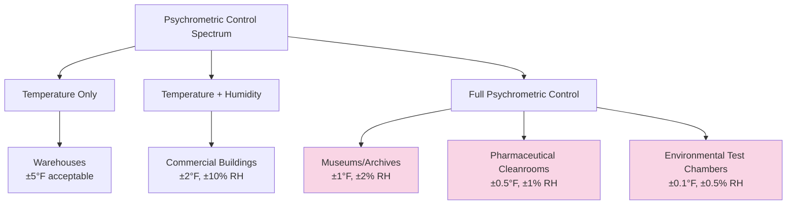
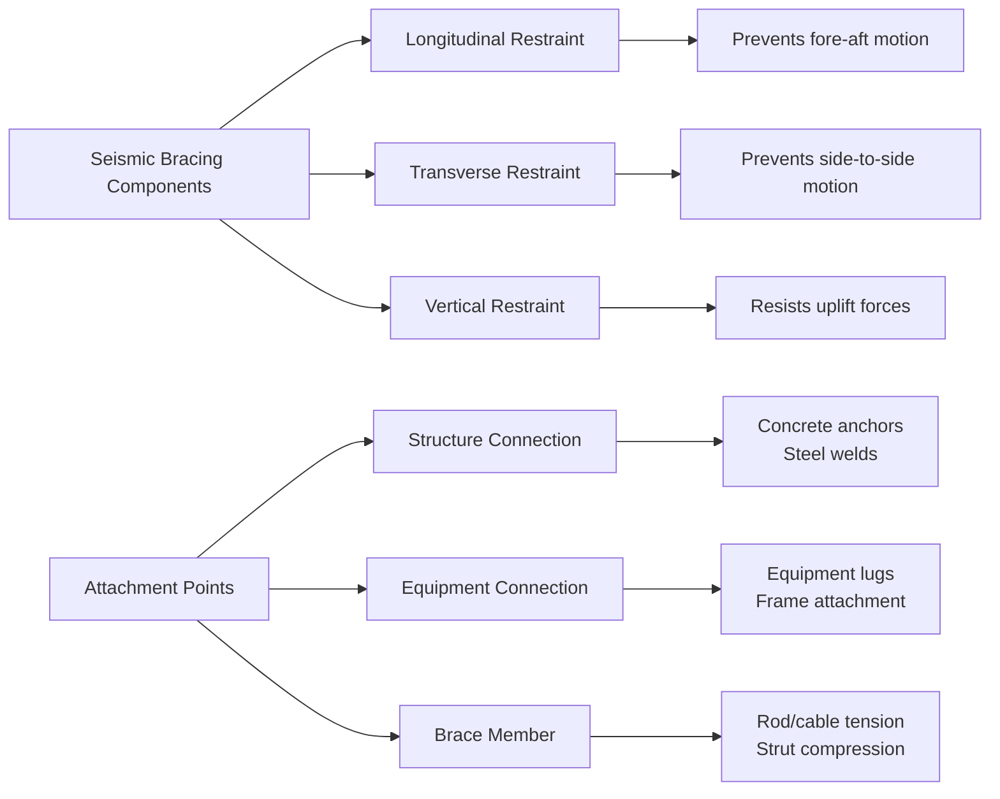

# Specialty Applications & Testing

Specialty HVAC systems extend beyond conventional comfort conditioning to address unique environmental requirements in industrial, transportation, agricultural, and critical infrastructure settings. These applications integrate advanced thermodynamic principles with mission-critical constraints including contamination control, acoustic limitations, seismic resilience, and operational continuity requirements.

## Classification of Specialty Applications

### Mission-Critical Environments

Systems serving environments where failure consequences extend beyond occupant discomfort demand rigorous design, redundancy, and continuous operation capabilities. The fundamental heat and mass transfer equations governing all HVAC systems apply equally to specialty applications, but boundary conditions, load profiles, and performance criteria differ substantially from commercial installations.

**Critical facility categories:**

- **Data centers**: High sensible heat ratios (0.90-0.98), precision temperature control (±1°C), power usage effectiveness (PUE) optimization
- **Healthcare facilities**: Contamination control, pressure cascades, 100% outdoor air in surgical suites, ASHRAE Standard 170 compliance
- **Laboratories**: Fume hood makeup air, constant volume exhaust, chemical vapor handling, biosafety containment
- **Nuclear facilities**: Radiological containment, HEPA filtration trains, emergency ventilation modes, seismic qualification

### Transportation and Mobile Systems

Vehicle-based HVAC systems require compact design, dynamic load response, and operation under varying environmental conditions. Weight, space, and power constraints dominate design decisions.

| Application | Typical Capacity | Key Challenge | Design Standard |
|-------------|------------------|---------------|-----------------|
| Aircraft ECS | 50-150 tons | Weight, altitude variation | SAE AS8040 |
| Rail cars | 8-15 tons/car | Power limitations, door infiltration | IEEE 1628 |
| Ships | 50-5000 tons | Saltwater corrosion, motion stability | SOLAS Ch. II-2 |
| Mass transit buses | 10-20 tons/vehicle | Rapid door cycling, passenger density | APTA PR-M-S-015 |

### Industrial Process Applications

HVAC systems integrated with manufacturing or processing operations where environmental control directly impacts product quality, process efficiency, or worker safety.

**Process-critical applications:**

- **Printing plants**: Humidity control (±2% RH) for paper dimensional stability
- **Textile manufacturing**: Moisture management for fiber processing and static control
- **Agricultural drying**: Psychrometric optimization for crop preservation and energy efficiency
- **Mine ventilation**: Dust control, diesel particulate removal, heat stress mitigation
- **Wood product facilities**: Lumber kilns, plywood pressing, moisture equilibrium control

## Thermodynamic Analysis for Specialty Systems

### Load Calculation Modifications

Standard heat balance methods require modification for specialty applications. The general cooling load equation:

$$Q_{total} = Q_{sensible} + Q_{latent}$$

Where sensible load components include:

$$Q_{sensible} = Q_{conduction} + Q_{solar} + Q_{infiltration,s} + Q_{occupants,s} + Q_{equipment} + Q_{lights}$$

For specialty applications, additional load terms become significant:

$$Q_{specialty} = Q_{process} + Q_{radiation} + Q_{chemical} + Q_{phase-change}$$

**Process loads** dominate in industrial settings. A paper machine operating at 1000 fpm web speed with 8-foot width evaporating moisture at 50 lb/hr generates latent cooling load:

$$Q_{latent} = \dot{m} \times h_{fg} = 50 \, \text{lb/hr} \times 1050 \, \text{Btu/lb} = 52,500 \, \text{Btu/hr}$$

**Radiation loads** in high-temperature environments follow Stefan-Boltzmann relations. For a furnace wall at 800°F radiating to conditioned space at 75°F with emissivity ε = 0.85:

$$q = \sigma \epsilon A (T_1^4 - T_2^4)$$

Where σ = 0.1714×10⁻⁸ Btu/hr·ft²·°R⁴. This requires specialized insulation systems and radiant barriers to prevent excessive cooling loads.

### Psychrometric Control Requirements

Precision environmental control extends beyond simple temperature setpoint maintenance to full psychrometric state control.

Precision humidity control requires dew point control rather than relative humidity control. The moisture removal rate necessary to maintain 45% RH at 72°F when infiltration introduces outdoor air at 95°F, 60% RH:

$$\dot{m}_{moisture} = \rho_{air} \times \dot{V} \times (\omega_{outdoor} - \omega_{indoor})$$

Where humidity ratio ω is calculated from:

$$\omega = 0.622 \frac{P_{vapor}}{P_{barometric} - P_{vapor}}$$

## Performance Testing and Verification

### Testing, Adjusting, and Balancing Protocols

ASHRAE Standard 111 establishes measurement practices for HVAC&R equipment, with enhanced procedures for specialty systems defined in application-specific standards. Testing accuracy requirements scale with system criticality.

**Air flow measurement accuracy requirements:**

| System Type | Accuracy Required | Measurement Method | Standard |
|-------------|-------------------|-------------------|----------|
| General ventilation | ±10% | Pitot traverse | ASHRAE 111 |
| Fume hood exhaust | ±5% | Calibrated stations | ASHRAE 110 |
| Cleanroom supply | ±3% | Flow hood array | ISO 14644-3 |
| Environmental chambers | ±1% | NIST-traceable anemometry | Custom |

**Hydronic balancing tolerances** for flow distribution follow:

$$\text{Flow deviation} = \frac{|Q_{actual} - Q_{design}|}{Q_{design}} \times 100\%$$

Critical systems require ≤5% deviation at all terminals; general systems tolerate ≤10%. Variable flow systems require testing at multiple operating points to verify control valve authority and differential pressure setpoint optimization.

### Functional Performance Testing

Commissioning specialty systems extends beyond static capacity verification to comprehensive operational sequence validation under normal, part-load, and emergency conditions.

**Testing protocol categories:**

1. **Normal operation modes**: Full design conditions, part-load profiles, seasonal variations
2. **Emergency modes**: Power failure response, contamination events, fire scenarios
3. **Transition sequences**: Mode changes, startup/shutdown, seasonal changeover
4. **Alarm responses**: Sensor failures, equipment trips, safety interlocks
5. **Recovery performance**: Return to setpoint following disturbances

Dynamic testing protocols simulate real-world disturbances. For laboratory exhaust systems, fume hood face velocity must recover to setpoint within 30 seconds following hood sash movement per ANSI Z9.5. For cleanrooms, recovery time from ISO class N to specified class following disturbance:

$$t_{recovery} = -\frac{V}{Q} \ln\left(\frac{C_{final} - C_{ambient}}{C_{initial} - C_{ambient}}\right)$$

Where V = room volume, Q = supply airflow, C = particle concentration.

## Environmental Resilience Design

### Seismic Considerations

ASCE 7 classifies HVAC components by Seismic Design Category (SDC A through F) and assigns Importance Factors (Ip) ranging from 1.0 (standard occupancy) to 1.5 (essential facilities). Equipment mounting requires analysis of horizontal and vertical forces.

The seismic design force for component anchorage:

$$F_p = 0.4 a_p S_{DS} W_p \frac{(1 + 2\frac{z}{h})}{(R_p / I_p)}$$

**Where:**
- ap = component amplification factor (1.0-2.5 depending on rigidity)
- SDS = design spectral response acceleration at short periods
- Wp = component operating weight
- z/h = height ratio (component elevation/building height)
- Rp = component response modification factor (1.5-12)
- Ip = component importance factor (1.0-1.5)

Subject to bounds:

$$0.3 S_{DS} I_p W_p \leq F_p \leq 1.6 S_{DS} I_p W_p$$

Equipment in essential facilities (hospitals, emergency operations centers) requires seismic certification testing per ICC-ES AC156. Shake table testing validates performance under design-level seismic events.

**Bracing system design:**

### Flood and Wind Resistance

Equipment located in Special Flood Hazard Areas (SFHA) per FEMA Flood Insurance Rate Maps requires elevation above Base Flood Elevation (BFE) or flood-resistant construction. For critical systems serving essential facilities, minimum freeboard:

$$H_{equipment} = \text{BFE} + 2 \, \text{ft (minimum)}$$

Many jurisdictions require additional freeboard (1-3 feet) for critical infrastructure.

**Wind-driven rain infiltration** for rooftop equipment follows empirical relations:

$$\dot{V}_{infiltration} = C_d \times A_{opening} \times v_{wind}$$

Where Cd = discharge coefficient (0.6-0.8), requiring weather-resistant louvers with ≥98% rain exclusion effectiveness per AMCA 500-L testing.

**Wind uplift forces** on rooftop equipment per ASCE 7:

$$F_{wind} = q_h \times G \times C_p \times A$$

Where:
- qh = velocity pressure at mean roof height
- G = gust effect factor (0.85 for rigid components)
- Cp = pressure coefficient (varies by location and geometry)
- A = projected area normal to wind

## Acoustic and Vibration Control

Sound generation from HVAC equipment requires comprehensive analysis across frequency spectrum. Sound power level relates to sound pressure level:

$$L_W = L_p + 10\log_{10}(S) - 0.5 \, \text{dB}$$

Where S = equipment surface area (m²). Specialty applications impose stringent noise criteria:

**Acoustic performance targets:**

| Application | Noise Criteria | Sound Level | Critical Frequencies |
|-------------|----------------|-------------|---------------------|
| Recording studios | NC-15 to NC-20 | 25-30 dBA | All octave bands |
| Concert halls | RC-25(N) | 30-35 dBA | Low frequency critical |
| Research laboratories | RC-35(N) | 40-45 dBA | Broadband control |
| Private offices | RC-35 to RC-40 | 40-45 dBA | Speech interference |
| Open offices | RC-40 to RC-45 | 45-50 dBA | Masking acceptable |
| Industrial facilities | RC-50 | 55-60 dBA | Hearing protection zones |

**Vibration isolation** prevents structure-borne noise transmission. Natural frequency of isolation system:

$$f_n = \frac{1}{2\pi}\sqrt{\frac{k}{m}} = 3.13\sqrt{\frac{d_{static}}{1}}$$

Where dstatic = static deflection (inches). For isolation efficiency η:

$$\eta = 1 - \frac{1}{1 - \left(\frac{f_e}{f_n}\right)^2}$$

Effective isolation requires fe/fn > 2. For 90% isolation at 30 Hz excitation frequency, natural frequency must be ≤15 Hz, requiring static deflection ≥0.1 inches.

## System Integration Requirements

### Multidisciplinary Coordination

Specialty HVAC systems interface with multiple building systems requiring coordinated design throughout project phases.

**Critical interfaces:**

- **Fire/smoke control**: NFPA 92 smoke management integration, smoke damper coordination, pressurization sequences
- **Emergency power**: NFPA 110 generator capacity for critical loads, load shedding priorities, automatic transfer switches
- **Structural systems**: Equipment loads, seismic bracing attachments, vibration isolation base details, floor loading verification
- **Building automation**: Points lists, protocol compatibility (BACnet, Modbus, OPC), cybersecurity requirements, network architecture
- **Process systems**: Interlock sequences, permissive logic, shutdown protocols, material handling coordination

### Commissioning and Quality Assurance

Comprehensive commissioning ensures specialty systems meet Owner's Project Requirements (OPR) and perform as designed under all operating scenarios.

**Commissioning phases:**

1. **Pre-design**: OPR development, basis of design (BOD) documentation
2. **Design review**: Design narrative verification, calculations review, specifications compliance
3. **Construction**: Submittal review, installation verification, pre-functional checklists
4. **Functional testing**: Integrated system performance, sequence verification, capacity confirmation
5. **Training and documentation**: O&M manuals, operator training, as-built drawings
6. **Post-occupancy**: Seasonal testing, performance trending, continuous commissioning

**Functional test example - Laboratory pressure control:**

Test Procedure:
1. Verify room operates at design negative pressure (-0.02 to -0.05 in. w.c. relative to corridor)
2. Open door to corridor, verify pressure recovers to setpoint within 30 seconds of door closure
3. Simulate supply fan failure, verify exhaust fan shuts down (prevent positive pressurization)
4. Simulate exhaust fan failure, verify alarm notification and backup exhaust activation
5. Verify low flow alarm at fume hood activates at 70 fpm face velocity

**Performance documentation:**

| Test Parameter | Design Value | Measured Value | Pass/Fail | Notes |
|----------------|--------------|----------------|-----------|-------|
| Room pressure | -0.03 in. w.c. | -0.032 in. w.c. | Pass | Stable control |
| Door recovery time | <30 sec | 18 sec | Pass | Acceptable response |
| Supply fan interlock | Fail-safe | Verified | Pass | Exhaust shutdown confirmed |

## Specialized Application Categories

### Healthcare HVAC Systems

ASHRAE Standard 170 establishes ventilation requirements for healthcare facilities. Critical parameters include air change rates, pressure relationships, filtration efficiency, and temperature/humidity ranges.

**Operating room requirements:**
- Minimum 20 ACH total (4 ACH outdoor air)
- Positive pressure +0.01 in. w.c. minimum
- HEPA filtration (99.97% at 0.3 μm)
- Temperature 68-73°F, humidity 20-60% RH
- Unidirectional laminar flow optional for ultra-clean procedures

**Airborne infection isolation rooms:**
- Minimum 12 ACH
- Negative pressure -0.01 in. w.c. minimum relative to corridor
- Exhaust directly outdoors or HEPA filtration before recirculation
- Pressure monitoring with visual/audible alarms

### Cleanroom Technology

ISO 14644 establishes particle concentration limits for cleanroom classification. Airflow rate determination for non-unidirectional (turbulent) cleanrooms:

$$\text{ACH} = \frac{Q}{V} = \frac{C_{recovery}}{t_{recovery}} \times 60$$

Where Crecovery = ln(C0/Ct), the ratio of initial to final contamination.

**Typical design air change rates:**

- ISO Class 5: 240-600 ACH (unidirectional flow, 60-100 fpm)
- ISO Class 6: 150-240 ACH
- ISO Class 7: 60-90 ACH
- ISO Class 8: 20-40 ACH

### Data Center Thermal Management

Power usage effectiveness (PUE) measures data center energy efficiency:

$$\text{PUE} = \frac{\text{Total Facility Power}}{\text{IT Equipment Power}}$$

Best practice targets: PUE < 1.3 for new construction, PUE < 1.5 for existing facilities.

**Cooling strategies progression:**

1. **Traditional CRAC/CRAH**: Raised floor distribution, PUE 1.8-2.5
2. **Hot/cold aisle containment**: Eliminate mixing, PUE 1.6-2.0
3. **In-row cooling**: Close-coupled units, PUE 1.4-1.7
4. **Economizer cooling**: Free cooling integration, PUE 1.2-1.4
5. **Liquid cooling**: Direct-to-chip for high density, PUE 1.05-1.15

### Commercial Kitchen Ventilation

Exhaust hood performance depends on appliance type, hood geometry, and capture velocity. Makeup air systems must replace exhausted air without creating drafts or comfort issues.

**Hood exhaust calculation** for Type I grease hoods:

$$Q_{exhaust} = L \times W \times V_{capture}$$

Where L = hood length, W = effective width, Vcapture = capture velocity (typically 50-100 fpm at perimeter).

ASHRAE provides empirical exhaust rates (CFM per linear foot) based on appliance duty:
- Light duty: 150-250 CFM/ft (wall canopy)
- Medium duty: 200-300 CFM/ft
- Heavy duty: 300-400 CFM/ft
- Extra heavy duty: 400-600 CFM/ft (solid fuel, charbroilers)

## Reference Standards and Guidelines

**Primary design standards:**
- ASHRAE Standard 111: Measurement, Testing, Adjusting and Balancing of Building HVAC Systems
- ASHRAE Standard 110: Method of Testing Performance of Laboratory Fume Hoods
- ASHRAE Standard 170: Ventilation of Health Care Facilities
- ASCE 7: Minimum Design Loads and Associated Criteria for Buildings
- ISO 14644: Cleanrooms and Associated Controlled Environments
- NFPA 92: Standard for Smoke Control Systems
- ANSI Z9.5: Laboratory Ventilation
- ICC-ES AC156: Seismic Certification by Shake-Table Testing

**Industry guidelines:**
- SMACNA HVAC Systems Testing, Adjusting and Balancing
- NEBB Procedural Standards for Testing, Adjusting, Balancing
- AABC National Standards for Total System Balance
- ASHRAE Handbook - HVAC Applications (Chapter 49: Seismic and Wind Restraint Design)

## Browse Topics

Explore detailed subtopics within specialty applications and testing:

- **[Specialty HVAC Applications](./specialty-hvac-applications/)** - Industry-specific system design
- **[Testing, Balancing & Commissioning Process](./testing-balancing-commissioning-process/)** - Performance verification
- **[Acoustic, Noise & Vibration](./acoustic-noise-vibration/)** - Sound control strategies
- **[Seismic, Wind & Flood Resistant Design](./seismic-wind-flood-resistant-design/)** - Environmental resilience

---

*Specialty HVAC applications demand rigorous engineering analysis, precise environmental control, comprehensive testing protocols, and multidisciplinary coordination to ensure mission-critical performance, safety, and reliability across diverse operating conditions.*
