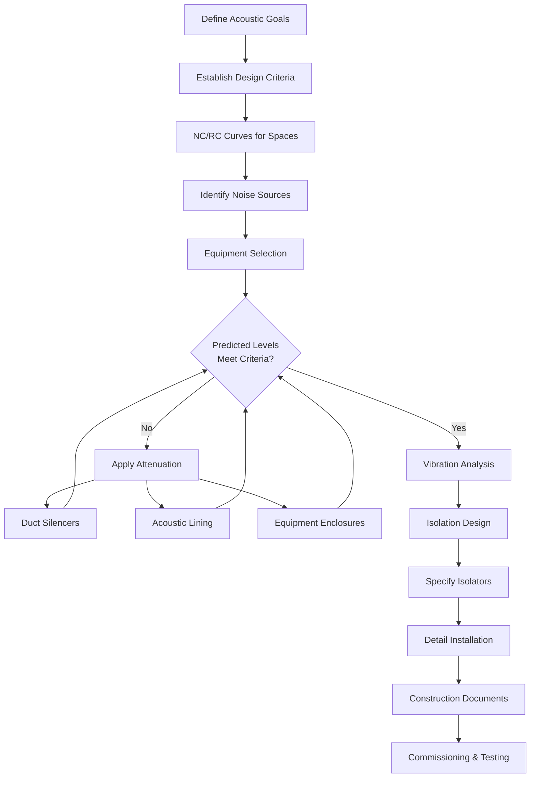
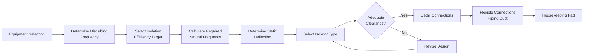

# HVAC Acoustic, Noise & Vibration Control

Acoustic performance is a critical but often overlooked aspect of HVAC system design. Occupant comfort depends not only on thermal conditions but also on acceptable noise levels and minimal vibration transmission. This section provides engineering guidance for predicting, measuring, and controlling sound and vibration in HVAC systems.

## Fundamentals of HVAC Acoustics

### Sound Power vs. Sound Pressure

Understanding the distinction between sound power and sound pressure is essential for acoustic analysis:

**Sound Power Level** represents the total acoustic energy radiated by a source:

$$L_W = 10 \log_{10} \left( \frac{W}{W_0} \right) \text{ dB re } 10^{-12} \text{ W}$$

where:
- $L_W$ = sound power level (dB)
- $W$ = sound power of source (W)
- $W_0$ = reference sound power = $10^{-12}$ W

**Sound Pressure Level** represents the acoustic intensity at a specific location:

$$L_p = 20 \log_{10} \left( \frac{p}{p_0} \right) \text{ dB re } 20 \text{ μPa}$$

where:
- $L_p$ = sound pressure level (dB)
- $p$ = root-mean-square sound pressure (Pa)
- $p_0$ = reference sound pressure = 20 μPa

### Relationship Between Power and Pressure

In a free field with spherical wave propagation, sound pressure level relates to sound power level:

$$L_p = L_W - 20 \log_{10}(r) - 11 \text{ dB}$$

where $r$ is the distance from the source in meters. This equation assumes no reflections and applies to outdoor conditions or anechoic environments.

In typical rooms with reflective surfaces:

$$L_p = L_W + 10 \log_{10} \left( \frac{Q}{4\pi r^2} + \frac{4}{R} \right) \text{ dB}$$

where:
- $Q$ = directivity factor (dimensionless)
- $R$ = room constant = $\frac{S\alpha}{1-\alpha}$ (m²)
- $S$ = total room surface area (m²)
- $\alpha$ = average absorption coefficient

## HVAC Noise Sources

### Equipment Sound Generation

| Equipment Type | Typical Sound Power Level (dB) | Dominant Frequency |
|----------------|--------------------------------|-------------------|
| Centrifugal fans | 85-105 | Blade pass frequency |
| Axial fans | 90-110 | Broadband |
| Air-cooled chillers | 90-100 | 125-500 Hz |
| Cooling towers | 85-95 | Broadband |
| Compressors (screw) | 95-110 | Tonal + broadband |
| Terminal units (VAV) | 55-75 | 500-2000 Hz |

Equipment sound power data should be obtained from manufacturers per AHRI Standard 370 or ASHRAE Standard 130.

### Duct-Generated Noise

Airflow through ductwork generates noise through multiple mechanisms:

**Turbulent flow noise**:
$$L_W = K + 50 \log_{10}(V) + 10 \log_{10}(A)$$

where:
- $K$ = constant (depends on duct configuration)
- $V$ = air velocity (m/s)
- $A$ = duct cross-sectional area (m²)

Critical velocity limits to prevent excessive regenerated noise:

| Duct Section | Maximum Velocity |
|--------------|------------------|
| Main ducts | 8-10 m/s |
| Branch ducts | 5-7 m/s |
| Terminal runs | 3-5 m/s |

## Acoustic Design Process

## Design Criteria and Standards

### Noise Criteria (NC) and Room Criteria (RC)

NC and RC curves define maximum acceptable sound pressure levels across octave bands. The NC system (ANSI S12.2) has been largely superseded by RC curves (ASHRAE), which provide better assessment of HVAC system sound quality.

**Recommended Maximum NC/RC Levels**:

| Space Type | NC/RC Level |
|------------|-------------|
| Private offices | 30-35 |
| Conference rooms | 25-30 |
| Open offices | 35-40 |
| Libraries | 30-35 |
| Classrooms | 30-35 |
| Hospital patient rooms | 30-35 |
| Theaters/auditoriums | 20-25 |
| Recording studios | 15-20 |

### Applicable Standards

- **ASHRAE Handbook—HVAC Applications, Chapter 49**: Comprehensive guidance on sound and vibration control
- **ANSI/ASA S12.60**: Acoustical performance criteria for classrooms
- **AHRI Standard 370**: Sound rating of outdoor unitary equipment
- **ASHRAE Standard 130**: Sound rating of non-ducted indoor air-conditioning equipment

## Sound Attenuation Strategies

### Duct Silencers

Dissipative silencers use sound-absorbing materials (fiberglass, mineral wool) in aerodynamic baffles. Performance depends on:

- Silencer length (longer = more attenuation)
- Baffle configuration (parallel baffles vs. pod design)
- Face velocity (higher velocity reduces performance)
- Frequency (more effective at mid-high frequencies)

Typical insertion loss ranges from 10-30 dB in octave bands 250-2000 Hz.

### Acoustic Duct Lining

Duct lining provides:
- Internal absorption (3-10 dB per 3m of lined duct)
- Breakout noise reduction
- Reduced regenerated noise

Maximum recommended velocity for lined ducts: 10-12 m/s to prevent erosion and material detachment.

### Equipment Sound Enclosures

When equipment noise cannot be sufficiently attenuated through path treatment:

$$TL = L_{W,in} - L_{W,out}$$

where $TL$ is transmission loss of the enclosure. Design considerations include ventilation for heat rejection, access for maintenance, and isolation of structure-borne vibration.

## Vibration Isolation and Control

### Vibration Fundamentals

Equipment vibration transmits to building structure through:
- Direct mounting connections
- Piping and duct connections (structurally transmitted vibration)
- Airborne regeneration

Natural frequency of isolated systems:

$$f_n = \frac{1}{2\pi} \sqrt{\frac{k}{m}}$$

where:
- $f_n$ = natural frequency (Hz)
- $k$ = spring stiffness (N/m)
- $m$ = supported mass (kg)

**Isolation efficiency**:

$$\eta = \left( 1 - \frac{1}{f_r^2 - 1} \right) \times 100\%$$

where $f_r$ = $f_{disturbing}/f_n$ is the frequency ratio. Effective isolation requires $f_r > \sqrt{2}$ (typically $f_r$ ≥ 3-4 for HVAC applications).

### Vibration Isolation Design

### Isolator Selection

| Equipment Type | Recommended Static Deflection | Isolator Type |
|----------------|------------------------------|---------------|
| Fans (floor-mounted) | 25-40 mm | Steel springs |
| Chillers | 40-50 mm | Steel springs + inertia base |
| Pumps | 25-40 mm | Steel springs or neoprene |
| Cooling towers | 25-40 mm | Springs with restrained hangers |
| Roof-mounted units | 25-40 mm | Curb-mounted springs |

## Testing and Verification

Acoustic commissioning should include:

1. **Background noise measurements** before equipment operation
2. **Sound pressure level measurements** at occupied locations with equipment operating
3. **Octave band analysis** to verify compliance with NC/RC criteria
4. **Vibration measurements** on equipment and at sensitive locations

Measurements should follow ASTM E1573 (sound transmission class of partitions) and ISO 10052 (field measurements of sound insulation).

## Conclusion

Successful acoustic design requires integrated consideration of equipment selection, path attenuation, and vibration isolation. Early coordination between HVAC engineers, architects, and acoustic consultants prevents costly remediation and ensures occupant comfort. Adherence to ASHRAE guidelines and applicable standards provides a framework for achieving acceptable acoustic performance in all building types.
