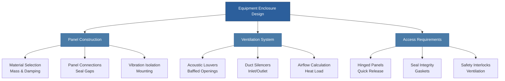

# Acoustic Barriers and Equipment Enclosures

Acoustic barriers and equipment enclosures provide critical noise control solutions for HVAC systems where source treatment or path modification alone cannot achieve required sound levels. Understanding transmission loss mechanisms and proper enclosure design enables effective noise reduction while maintaining equipment accessibility and thermal management.

## Transmission Loss Fundamentals

Sound transmission through barriers follows physical principles governed by mass, stiffness, and damping characteristics. The mass law represents the fundamental relationship between barrier surface density and sound attenuation.

### Mass Law Equation

The theoretical transmission loss (TL) for a limp, homogeneous partition at normal incidence:

$$TL = 20 \log_{10}(m \cdot f) - 47 \text{ dB}$$

Where:
- $TL$ = transmission loss (dB)
- $m$ = surface mass density (kg/m²)
- $f$ = frequency (Hz)

This relationship demonstrates that transmission loss increases 6 dB per doubling of mass or frequency. Real-world performance deviates from mass law due to stiffness effects, coincidence phenomena, and structural coupling.

### Coincidence Effect

At the critical frequency, bending waves in the barrier travel at the speed of sound in air, creating a transmission loss minimum:

$$f_c = \frac{c^2}{1.8 \pi} \sqrt{\frac{m}{B}}$$

Where:
- $f_c$ = critical frequency (Hz)
- $c$ = speed of sound in air (343 m/s at 20°C)
- $B$ = bending stiffness per unit width (N·m)

Below the critical frequency, stiffness-controlled transmission dominates. Above it, mass law behavior resumes with damping becoming increasingly important.

## Sound Transmission Class (STC)

STC provides a single-number rating of partition performance based on ASTM E90 laboratory testing and ASTM E413 classification procedures. The STC contour method compares measured transmission loss values across 16 one-third octave bands (125-4000 Hz) to a standardized reference curve.

### STC Calculation Criteria

1. Reference contour shifted to highest position where:
   - No single deficiency exceeds 8 dB
   - Sum of deficiencies does not exceed 32 dB
2. STC rating equals the reference contour value at 500 Hz

Common HVAC applications require:
- Mechanical rooms adjacent to offices: STC 50-55
- Chiller enclosures near residential: STC 55-60
- Rooftop equipment barriers: STC 40-50

## Composite Wall Performance

Multi-layer constructions and walls with penetrations exhibit transmission loss degradation compared to homogeneous barriers. The composite transmission coefficient:

$$\tau_{composite} = \frac{\sum A_i \tau_i}{\sum A_i}$$

Where:
- $\tau_i$ = transmission coefficient of element $i$ (dimensionless, where $\tau = 10^{-TL/10}$)
- $A_i$ = area of element $i$ (m²)

A small area with high transmission (low TL) significantly degrades overall performance. A 1% opening area with TL = 0 dB reduces a STC 50 wall to approximately STC 30.

### Double-Wall Construction

Double-leaf barriers separated by an air gap or absorptive material achieve superior transmission loss:

$$TL_{double} \approx TL_{leaf1} + TL_{leaf2} + 20 \log_{10}(f \cdot d) - K$$

Where:
- $d$ = cavity depth (m)
- $K$ = correction factor (typically 29-35 dB)

Cavity absorption and structural isolation between leaves maximize performance. Resilient channels and staggered studs prevent acoustic bridging.

## Equipment Enclosure Design

Complete equipment enclosures must balance acoustic performance with ventilation, access, and maintenance requirements.

### Enclosure Transmission Loss Requirements

Determine required enclosure TL from source sound power level and target receiver level:

$$TL_{req} = SPL_{source} + 10 \log_{10}(S) - 10 \log_{10}(A_{room}) - SPL_{target}$$

Where:
- $SPL_{source}$ = sound pressure level at enclosure surface (dB)
- $S$ = enclosure surface area (m²)
- $A_{room}$ = receiving room absorption (m² sabins)
- $SPL_{target}$ = design sound level (dB)

Add 5-10 dB safety margin for uncertainty and future equipment modifications.

### Enclosure Ventilation Design

Heat-generating equipment requires ventilation airflow sized to maintain acceptable internal temperatures:

$$Q = \frac{H}{\rho \cdot c_p \cdot \Delta T}$$

Where:
- $Q$ = required airflow (m³/s)
- $H$ = equipment heat output (W)
- $\rho$ = air density (1.2 kg/m³ at sea level)
- $c_p$ = specific heat of air (1005 J/kg·K)
- $\Delta T$ = allowable temperature rise (K)

Ventilation openings must incorporate acoustic treatment to prevent performance degradation:

Acoustic louvers and baffled openings provide 10-25 dB insertion loss depending on depth and internal absorption. Combined with duct silencers, enclosure ventilation systems maintain overall TL performance.

## Material Selection Criteria

Barrier and enclosure materials must satisfy acoustic, structural, and environmental requirements:

| Material | Surface Density | TL at 500 Hz | Applications |
|----------|----------------|--------------|--------------|
| 16 ga steel panel | 8 kg/m² | 25 dB | Light-duty enclosures |
| 12 ga steel panel | 13 kg/m² | 29 dB | Standard equipment enclosures |
| Loaded vinyl barrier | 5-10 kg/m² | 20-26 dB | Flexible wrapping, composite |
| Concrete block (8") | 95 kg/m² | 48 dB | Permanent mechanical rooms |
| Double-wall steel/insulation | 20 kg/m² | 40-45 dB | High-performance enclosures |

Damping treatments applied to resonant panels (steel, aluminum) reduce radiation efficiency and control coincidence dip effects. Constrained-layer damping provides 5-10 dB improvement in the coincidence frequency range.

## Design Implementation Standards

ASHRAE Handbook - HVAC Applications Chapter 49 provides comprehensive guidance on sound control including barrier and enclosure design procedures. ASTM E90 establishes laboratory measurement methods for airborne sound transmission loss, while ASTM E413 defines STC classification. Field performance verification follows ASTM E336 procedures.

Proper sealing of all penetrations, joints, and access panels remains critical. A 3 mm gap around panel perimeter can reduce STC 50 performance to STC 25. Neoprene gaskets, acoustic caulk, and compression seals ensure design transmission loss achievement in field installations.

## Conclusion

Acoustic barriers and equipment enclosures deliver measurable noise reduction when designed according to transmission loss principles. Mass law fundamentals, composite wall effects, and proper ventilation integration enable effective solutions meeting project acoustic criteria while maintaining equipment operation and accessibility requirements.
