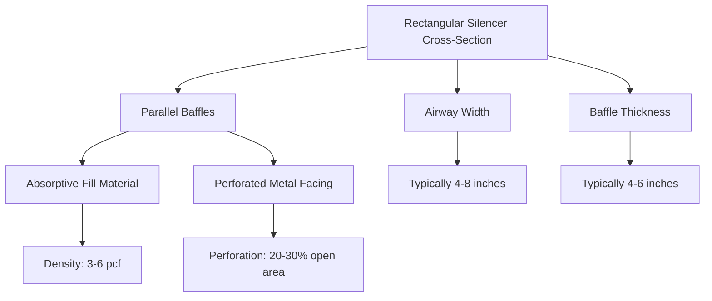
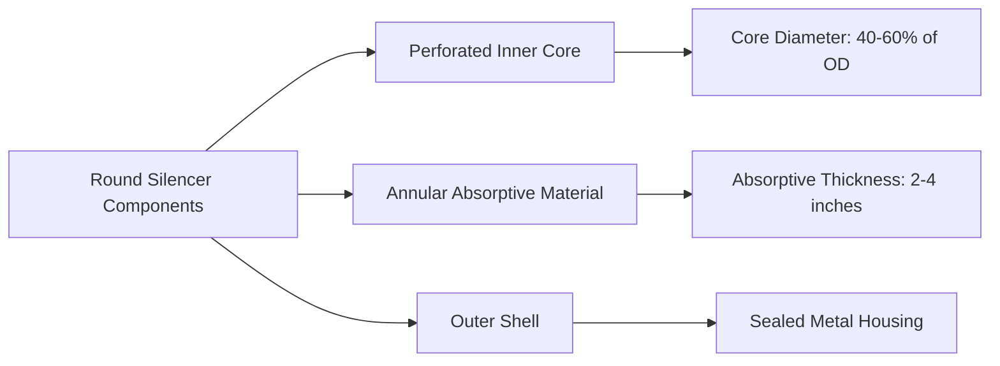
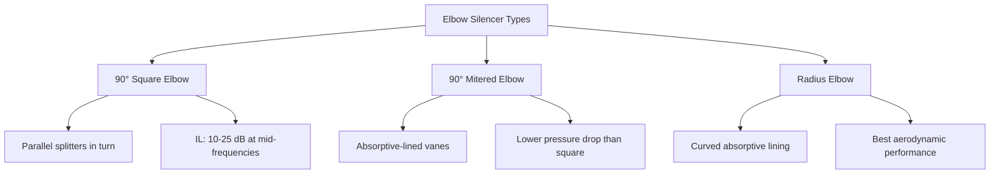

# HVAC Duct Silencers: Selection and Performance

Duct silencers are engineered acoustic devices installed in HVAC air distribution systems to reduce noise transmission along ductwork. These passive attenuators use sound-absorptive materials and geometric configurations to dissipate acoustic energy across specific frequency ranges without significantly impeding airflow.

## Fundamental Acoustic Parameters

### Insertion Loss

Insertion loss (IL) quantifies the sound power level reduction achieved by installing a silencer in a duct system. It represents the difference between sound power levels measured at a point downstream with and without the silencer present:

$$IL = L_{w1} - L_{w2} = 10 \log_{10} \left( \frac{W_1}{W_2} \right) \text{ dB}$$

Where:
- $L_{w1}$ = sound power level without silencer (dB)
- $L_{w2}$ = sound power level with silencer (dB)
- $W_1$ = acoustic power without silencer (W)
- $W_2$ = acoustic power with silencer (W)

Insertion loss varies with frequency, typically ranging from 5-10 dB at low frequencies (63-125 Hz) to 30-50 dB at mid-to-high frequencies (500-4000 Hz) for well-designed units.

### Dynamic Insertion Loss

Dynamic insertion loss (DIL) accounts for self-generated noise from airflow through the silencer, providing a more realistic performance metric under operating conditions:

$$DIL = IL - NR_{regen}$$

$$NR_{regen} = L_{w,regen} - L_{w,inlet}$$

Where:
- $NR_{regen}$ = regenerated noise ratio (dB)
- $L_{w,regen}$ = regenerated noise sound power level (dB)
- $L_{w,inlet}$ = inlet sound power level (dB)

At low velocities (<2000 fpm), regenerated noise is negligible and DIL ≈ IL. Above 3000 fpm, flow-generated noise can significantly reduce effective attenuation, particularly at high frequencies.

## Silencer Configuration Types

### Rectangular Dissipative Silencers

Rectangular silencers consist of parallel baffles filled with sound-absorptive material (typically fiberglass or mineral wool) wrapped in perforated metal facings. The open airway width between baffles directly affects acoustic performance.

**Performance characteristics:**
- Effective length determines low-frequency attenuation (minimum 4-5 feet for 125 Hz)
- Airway width affects high-frequency performance (narrower = better attenuation)
- Standard face velocities: 1000-2500 fpm for minimal pressure drop

### Round Dissipative Silencers

Cylindrical silencers feature a central perforated core surrounded by annular absorptive material. The ratio of core diameter to outer diameter influences acoustic efficiency.

**Design considerations:**
- More compact than rectangular for equivalent free area
- Better suited for high-velocity applications (up to 4000 fpm)
- Less effective at low frequencies due to limited absorptive path length

### Elbow Silencers

Elbow silencers integrate acoustic treatment into directional changes, combining sound attenuation with airflow redirection. These space-efficient devices utilize the extended path length through the turn.

**Application notes:**
- Provide 5-15 dB additional attenuation beyond standard lined elbows
- Effective when space constraints prevent straight silencer installation
- Regenerated noise typically lower than straight silencers due to reduced velocity through turn

## Selection Criteria

### Acoustic Requirements

Silencer selection begins with octave-band sound power level analysis of the noise source (fan, terminal unit, etc.) and target NC or RC criteria for the occupied space. Required insertion loss by frequency band determines silencer type and dimensions.

**Key selection factors:**
1. **Frequency range of concern** - Low-frequency dominance requires longer units or active treatments
2. **Required IL spectrum** - Match silencer performance curves to needed attenuation
3. **Space availability** - Length and cross-sectional constraints
4. **Discharge location** - Proximity to occupied spaces affects required DIL

### Pressure Drop Considerations

Static pressure loss through silencers directly impacts fan energy consumption and system capacity. Pressure drop follows standard flow resistance equations:

$$\Delta P = \frac{\rho V^2}{2} \left( K_{entrance} + K_{friction} + K_{exit} \right)$$

Where:
- $\Delta P$ = pressure drop (in. w.g.)
- $\rho$ = air density (lbm/ft³)
- $V$ = face velocity (fpm)
- $K$ = loss coefficients (dimensionless)

**Typical pressure drops:**
- Rectangular dissipative: 0.08-0.25 in. w.g. at 2000 fpm
- Round dissipative: 0.15-0.40 in. w.g. at 2500 fpm
- Elbow silencers: 0.10-0.35 in. w.g. depending on configuration

Maximum recommended face velocity balances acoustic performance (avoiding regenerated noise) with pressure drop penalties. Standard practice limits velocities to 2000-2500 fpm for supply systems and 1500-2000 fpm for low-noise applications.

## Testing Standards and Performance Verification

### ASTM E477

ASTM E477 "Standard Test Method for Laboratory Measurement of Acoustical and Airflow Performance of Duct Liner Materials and Prefabricated Silencers" establishes standardized procedures for measuring insertion loss and pressure drop under controlled conditions.

**Test requirements:**
- Octave-band measurements from 63 Hz to 8000 Hz
- Minimum duct length upstream and downstream to establish plane wave conditions
- Multiple airflow velocities to characterize dynamic performance
- Background noise at least 10 dB below measurement levels

### ASHRAE Handbook References

ASHRAE Handbook—HVAC Applications, Chapter 49 "Noise and Vibration Control" provides:
- Typical insertion loss data for various silencer configurations
- Pressure drop coefficients and velocity limits
- System design guidance for achieving target noise levels
- End reflection loss corrections for duct terminations

### Field Performance Considerations

Laboratory insertion loss represents ideal performance. Field installations experience reduced effectiveness due to:
- **Flanking paths** - Sound transmission through duct walls and structural connections
- **Break-in/break-out** - Acoustic energy bypassing silencer through thin-gauge ductwork
- **Installation effects** - Turbulence from nearby fittings generating additional noise
- **Aging** - Degradation of absorptive materials reducing high-frequency performance

Conservative design practice applies a 3-5 dB reduction factor to laboratory IL values for field predictions, particularly at frequencies above 1000 Hz where flanking becomes significant.

## Application Guidelines

### Supply Air Systems

Silencers installed downstream of supply fans address primary noise sources. Locate silencers at least 5 duct diameters from fan discharge to allow airflow stabilization and accurate acoustic performance.

### Return Air Systems

Return air silencers control noise transmission from fans back through return grilles. Lower velocities (1000-1500 fpm) and potential contamination from building air may influence material selection.

### Critical Spaces

Healthcare facilities, recording studios, and educational environments require enhanced acoustic control. Series silencer configurations (two units separated by 10-20 feet of lined duct) provide 3-5 dB additional attenuation over single-unit installations through reduced flanking and minimized break-in/break-out effects.

---

**References:**
- ASHRAE Handbook—HVAC Applications (2023), Chapter 49
- ASTM E477-13, Standard Test Method for Laboratory Measurement of Acoustical and Airflow Performance
- ASHRAE Handbook—Fundamentals (2021), Chapter 8 "Sound and Vibration"
