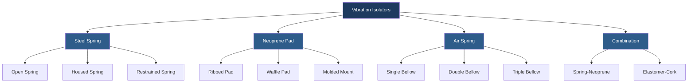

Vibration isolation prevents the transmission of mechanical vibrations from HVAC equipment to building structures. Proper isolation protects structural integrity, reduces noise transmission, and improves occupant comfort by attenuating low-frequency vibrations that would otherwise propagate through floors, walls, and ceilings.

## Fundamental Principles

Vibration isolation operates on the principle of inserting a resilient element between the vibration source and the receiving structure. The isolator creates a mechanical filter that reduces force transmission at frequencies above the system's natural frequency.

### Natural Frequency

The natural frequency of an isolation system determines its performance characteristics. For effective isolation, the natural frequency must be significantly lower than the disturbing frequency.

$$f_n = \frac{1}{2\pi} \sqrt{\frac{k}{m}}$$

Where:
- $f_n$ = natural frequency (Hz)
- $k$ = spring constant (N/m)
- $m$ = supported mass (kg)

The natural frequency can also be expressed in terms of static deflection:

$$f_n = \frac{15.76}{\sqrt{\delta}}$$

Where $\delta$ = static deflection (mm). This relationship shows that greater deflection produces lower natural frequency and better isolation at low frequencies.

### Transmissibility

Transmissibility quantifies the ratio of transmitted force to applied force. For an undamped isolation system:

$$T = \frac{F_t}{F_0} = \frac{1}{\left|\left(1 - \frac{f^2}{f_n^2}\right)\right|}$$

Where:
- $T$ = transmissibility ratio
- $F_t$ = transmitted force
- $F_0$ = applied force
- $f$ = disturbing frequency (Hz)
- $f_n$ = natural frequency (Hz)

For damped systems, transmissibility becomes:

$$T = \frac{1}{\sqrt{\left(1 - \frac{f^2}{f_n^2}\right)^2 + \left(2\zeta\frac{f}{f_n}\right)^2}}$$

Where $\zeta$ = damping ratio. Isolation efficiency improves when $f/f_n > \sqrt{2}$ (frequency ratio greater than 1.414).

### Isolation Efficiency

Isolation efficiency expresses the percentage reduction in transmitted force:

$$\eta = \left(1 - T\right) \times 100\%$$

Achieving 90% efficiency requires $f/f_n \approx 3.3$, while 95% efficiency demands $f/f_n \approx 4.5$. ASHRAE recommends minimum frequency ratios of 3.5 to 4.0 for most HVAC applications.

## Isolator Types

### Steel Spring Isolators

Steel springs provide the lowest natural frequencies (1.5-8 Hz) and highest isolation efficiency for mechanical equipment. They exhibit minimal stiffness variation with load and temperature.

**Selection criteria:**
- Deflection range: 25-100 mm typical
- Load capacity: 50-50,000 kg per isolator
- Operating temperature: -40°C to 150°C
- Applications: chillers, cooling towers, air handlers, fans

Spring isolators require horizontal restraint to prevent lateral motion during startup, shutdown, or seismic events. Housed springs incorporate neoprene acoustic pads to attenuate high-frequency vibrations that springs alone cannot isolate.

### Neoprene Isolators

Neoprene (polychloroprene) elastomeric isolators provide moderate isolation with inherent damping. Natural frequencies typically range from 8-20 Hz depending on pad thickness and hardness.

**Static deflection calculation:**

$$\delta = \frac{W}{A \times k_e}$$

Where:
- $\delta$ = deflection (mm)
- $W$ = load per isolator (N)
- $A$ = pad area (mm²)
- $k_e$ = elastic modulus (N/mm²)

Neoprene isolators work best for smaller equipment with moderate vibration levels. Durometer hardness ranges from 40-70 Shore A, with softer compounds providing greater deflection and lower natural frequency.

**Limitations:**
- Stiffness increases at low temperatures
- Degradation from oil, ozone, and UV exposure
- Load capacity limited to approximately 350 kPa bearing stress
- Performance deteriorates below 5°C

### Air Spring Isolators

Air springs (pneumatic isolators) utilize compressed air in flexible bellows to achieve natural frequencies as low as 1-3 Hz. They provide superior low-frequency isolation for sensitive applications.

**Pressure-deflection relationship:**

$$\delta = \frac{W}{P \times A_e}$$

Where:
- $P$ = air pressure (kPa)
- $A_e$ = effective piston area (mm²)

Air springs maintain constant natural frequency regardless of load by automatically adjusting pressure. They excel in applications requiring precise leveling or variable loads.

**Requirements:**
- Compressed air supply (typically 550-700 kPa)
- Height control valves for leveling
- Maintenance of air system components
- Higher initial cost than passive isolators

## Selection Methodology

```mermaid
flowchart TD
    A[Identify Equipment Parameters] --> B{Operating Speed<br/><600 RPM?}
    B -->|Yes| C[Consider Neoprene]
    B -->|No| D[Require Spring or Air]

    C --> E{Load per Point<br/><2000 kg?}
    E -->|Yes| F[Neoprene Pad]
    E -->|No| G[Spring Isolator]

    D --> H{Precision Leveling<br/>Required?}
    H -->|Yes| I[Air Spring]
    H -->|No| J{Natural Frequency<br/><5 Hz Required?}

    J -->|Yes| K[Spring or Air Spring]
    J -->|No| L[Spring Isolator]

    F --> M[Verify Deflection:<br/>3-6 mm typical]
    G --> N[Verify Deflection:<br/>25-50 mm typical]
    I --> O[Design Air System]
    K --> P[Calculate Required Deflection]
    L --> N

    style A fill:#1e3a5f,color:#fff
    style B fill:#2e5c8a,color:#fff
    style H fill:#2e5c8a,color:#fff
    style J fill:#2e5c8a,color:#fff
    style E fill:#2e5c8a,color:#fff
```

Selection criteria in order of priority:

1. **Disturbing frequency**: Equipment operating speed determines minimum required frequency ratio
2. **Load magnitude**: Total weight distributed across isolation points (typically 4-6 points)
3. **Environmental conditions**: Temperature, chemical exposure, outdoor installation
4. **Space constraints**: Available deflection clearance below equipment
5. **Budget**: Initial cost versus long-term performance requirements
6. **Maintenance access**: Accessibility for inspection and replacement

ASHRAE Handbook—HVAC Applications, Chapter 49, provides comprehensive guidance on isolator selection, installation details, and performance verification procedures. Proper installation requires rigid inertia bases for unbalanced equipment, anchor bolts isolated from the structure with neoprene grommets, and flexible connections for all piping and ductwork.

## Installation Considerations

Isolation effectiveness depends critically on proper installation:

- **Inertia bases**: Required for equipment with reciprocating or unbalanced rotating components
- **Flexible connectors**: All rigid connections bypass isolation and must use flexible hoses, expansion joints, or flex duct
- **Seismic restraint**: Snubbers or restraining cables limit motion during seismic events without compromising isolation
- **Alignment**: Isolators must be level within ±2° and carry equal loads for optimal performance

The center of gravity must align vertically through the geometric center of the isolator pattern to prevent rocking modes. Unequal loading reduces isolation efficiency and causes premature isolator failure.
