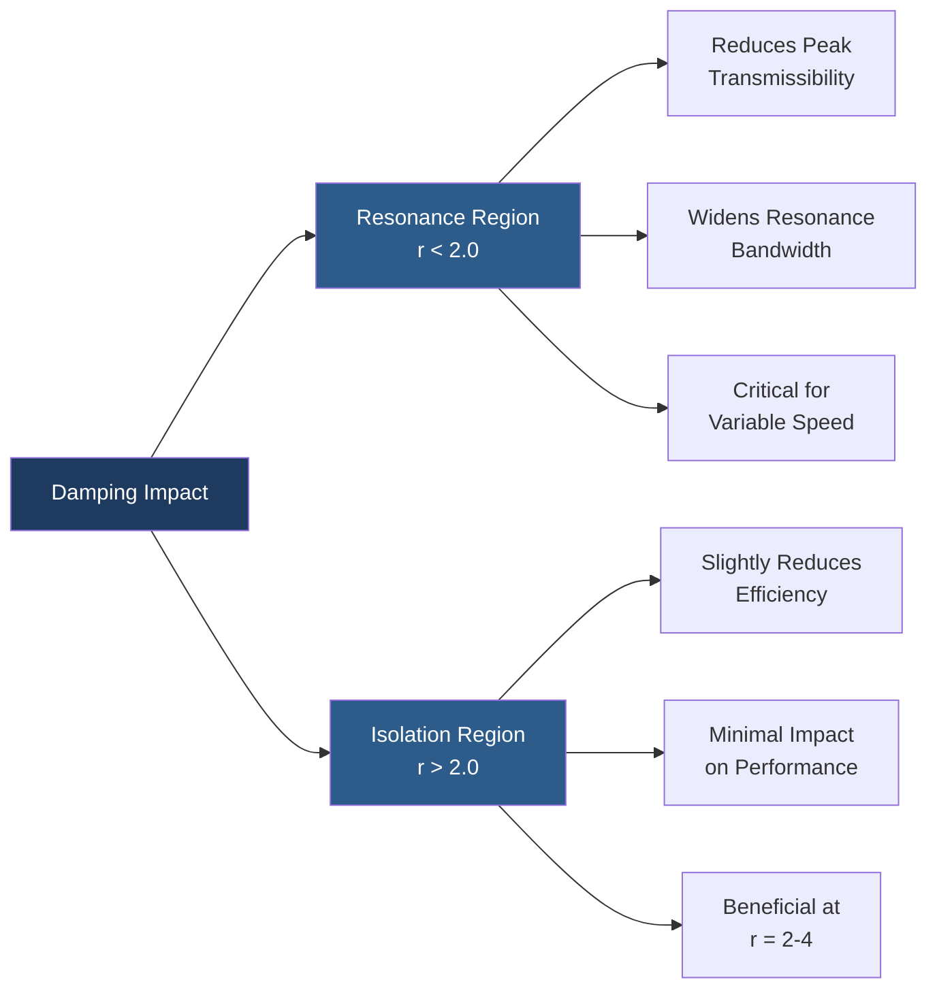
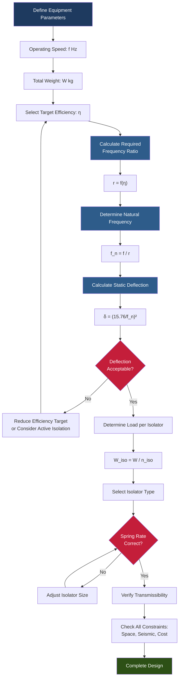

Vibration isolation design requires systematic engineering analysis to achieve specified performance targets while ensuring structural compatibility and operational reliability. The design process balances competing requirements including isolation efficiency, space constraints, load distribution, and cost to create effective solutions for HVAC equipment installations.

## Design Methodology

The fundamental design sequence follows a physics-based approach grounded in the dynamic behavior of mass-spring-damper systems. Design begins with equipment characterization, proceeds through frequency analysis, and concludes with isolator specification and verification.

### Design Process Steps

1. **Equipment characterization**: Operating speed, unbalanced forces, weight distribution, mounting points
2. **Performance requirements**: Target isolation efficiency, frequency range, environmental conditions
3. **Frequency analysis**: Natural frequency calculation, frequency ratio determination, resonance evaluation
4. **Isolator selection**: Type, deflection, load capacity, damping characteristics
5. **System verification**: Transmissibility calculation, efficiency check, installation constraints

## Frequency Ratio Analysis

The frequency ratio $r$ represents the relationship between disturbing frequency and system natural frequency. This dimensionless parameter determines isolation performance.

$$r = \frac{f}{f_n}$$

Where:
- $r$ = frequency ratio (dimensionless)
- $f$ = disturbing frequency (Hz)
- $f_n$ = natural frequency of isolation system (Hz)

### Critical Frequency Regions

| Frequency Ratio | Isolation Condition | System Response |
|-----------------|---------------------|-----------------|
| $r < 1.0$ | Below resonance | Amplification, poor isolation |
| $r = 1.0$ | At resonance | Maximum amplification |
| $1.0 < r < \sqrt{2}$ | Near resonance | Amplification continues |
| $r = \sqrt{2}$ | Isolation threshold | Transmissibility = 1.0 |
| $r > \sqrt{2}$ | Isolation region | Force attenuation occurs |

Effective isolation requires $r \geq 3.5$ for most HVAC applications. Higher ratios provide greater isolation but demand larger static deflections and increased space below equipment.

## Transmissibility Calculation

Transmissibility quantifies force transmission through the isolation system. The complete expression includes damping effects that influence system behavior near resonance.

### Undamped Transmissibility

For ideal systems without damping:

$$T = \frac{1}{\left|1 - r^2\right|}$$

This simplified form applies when $r > 2.0$ where damping has minimal influence. Below this ratio, resonance effects dominate and damping becomes critical.

### Damped Transmissibility

Real isolation systems include damping from material hysteresis, friction, and fluid resistance:

$$T = \frac{\sqrt{1 + (2\zeta r)^2}}{\sqrt{(1 - r^2)^2 + (2\zeta r)^2}}$$

Where $\zeta$ = damping ratio (dimensionless). This expression captures the complete dynamic response including resonance peak reduction and high-frequency behavior modification.

#### Damping Effects

Typical damping ratios for HVAC isolators:
- Steel springs: $\zeta = 0.01 - 0.05$ (minimal damping)
- Neoprene pads: $\zeta = 0.05 - 0.10$ (moderate damping)
- Cork composites: $\zeta = 0.10 - 0.15$ (high damping)
- Air springs: $\zeta = 0.02 - 0.08$ (variable damping)

## Isolation Efficiency

Isolation efficiency expresses performance as percentage force reduction:

$$\eta = \left(1 - T\right) \times 100\%$$

Expanding with the frequency ratio:

$$\eta = \left(1 - \frac{1}{\left|1 - r^2\right|}\right) \times 100\%$$

For undamped systems in the isolation region ($r > \sqrt{2}$):

$$\eta = \frac{r^2 - 1}{r^2} \times 100\%$$

### Target Efficiency Values

| Application | Required Efficiency | Frequency Ratio | Static Deflection* |
|-------------|---------------------|-----------------|-------------------|
| Light commercial | 85% | 2.5 - 3.0 | 10 - 16 mm |
| Standard HVAC | 90% | 3.3 - 3.5 | 18 - 22 mm |
| Critical facilities | 95% | 4.5 - 5.0 | 32 - 40 mm |
| Precision equipment | 98% | 7.0 - 8.0 | 77 - 100 mm |

*For 1800 RPM (30 Hz) equipment

## Natural Frequency Determination

The isolation system natural frequency derives from the relationship between stiffness and mass:

$$f_n = \frac{1}{2\pi} \sqrt{\frac{k}{m}}$$

For practical design, the static deflection approach proves more convenient:

$$f_n = \frac{1}{2\pi} \sqrt{\frac{g}{\delta}}$$

Where:
- $g$ = gravitational acceleration (9.81 m/s²)
- $\delta$ = static deflection under load (m)

This simplifies to the engineering form:

$$f_n = \frac{15.76}{\sqrt{\delta_{mm}}}$$

Where $\delta_{mm}$ = static deflection in millimeters.

### Required Deflection Calculation

Rearranging for design purposes:

$$\delta_{mm} = \left(\frac{15.76}{f_n}\right)^2$$

Given a target frequency ratio and known disturbing frequency:

$$\delta_{mm} = \left(\frac{15.76 \times r}{f}\right)^2$$

## Design Workflow

## Resonance Avoidance

Equipment passing through resonance during startup or shutdown experiences high vibration amplitudes and potentially damaging forces. Design must address three resonance scenarios:

### Startup Transients

Variable frequency drives (VFDs) sweep through the natural frequency region during acceleration. The resonance dwell time determines vibration magnitude:

- Fast acceleration (>5 Hz/s): Minimal resonance amplification
- Moderate acceleration (2-5 Hz/s): Acceptable for most equipment
- Slow acceleration (<2 Hz/s): May require damping enhancement

### Operating Speed Harmonics

Rotating equipment generates vibration at integer multiples of operating frequency. Design must consider:

$$f_{harmonic} = n \times f_{operating}$$

Where $n$ = 1, 2, 3, 4... The second and third harmonics (2× and 3× running speed) often contain significant energy, particularly for reciprocating compressors and unbalanced fans.

### Beat Frequencies

Multiple machines operating at similar speeds create beat frequencies:

$$f_{beat} = |f_1 - f_2|$$

These low-frequency beats may approach system natural frequency even when individual machine frequencies provide adequate separation.

## Design Constraints

### Space Limitations

Static deflection determines minimum clearance below equipment. Total required height includes:

- Isolator compressed height
- Full deflection travel
- Additional clearance for dynamic motion (typically 1.5× static deflection)
- Seismic restraint clearance

### Load Distribution

Equal load distribution across isolators maximizes efficiency and isolator life:

$$\frac{W_{max} - W_{min}}{W_{avg}} < 0.10$$

This 10% tolerance maintains uniform natural frequency across all isolation points. Unequal loading shifts individual isolator frequencies, creating multiple resonance peaks and reducing overall performance.

### Spring Rate Matching

When using multiple isolators, spring rate variation must remain within tolerance:

$$\frac{k_{max} - k_{min}}{k_{avg}} < 0.15$$

Exceeding 15% variation causes differential deflection, equipment tilting, and stress concentration at stiffer mounting points.

## Reference Standards

ASHRAE Handbook—HVAC Applications, Chapter 49 "Sound and Vibration Control" provides comprehensive design guidance including:

- Recommended frequency ratios for equipment types
- Isolation efficiency requirements by application
- Inertia base design criteria
- Flexible connection specifications

Manufacturer technical data supplies:

- Isolator load-deflection curves
- Spring rate specifications with tolerances
- Temperature and environmental limitations
- Installation torque requirements

Design verification requires calculation documentation demonstrating compliance with frequency ratio targets, load distribution limits, and space constraints. Field verification through vibration measurement confirms predicted isolation performance.
