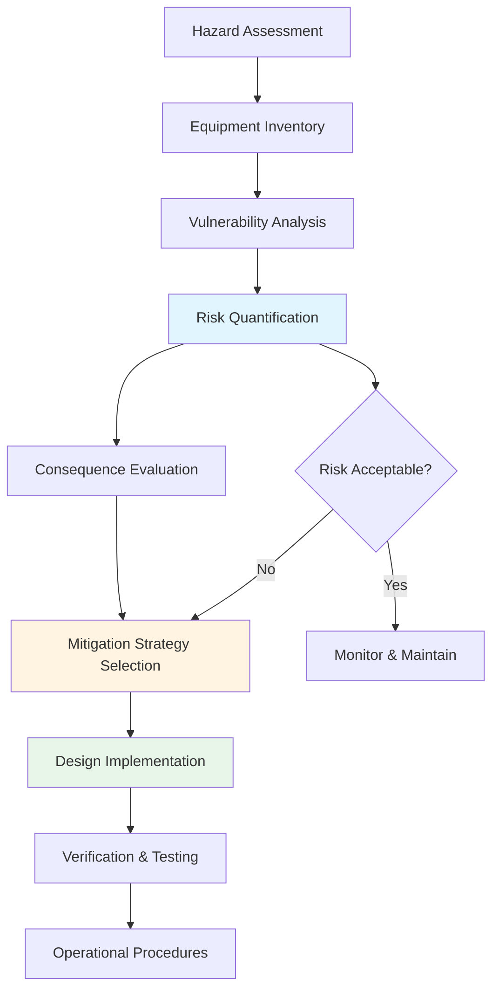
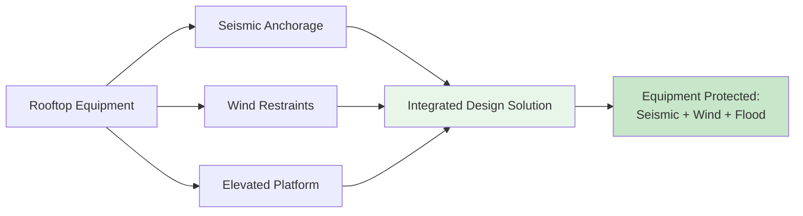

# Seismic, Wind, and Flood-Resistant Design for HVAC Systems

HVAC equipment represents critical building infrastructure that must remain operational during and after natural hazard events. Resilient design protects life safety, maintains building functionality, and minimizes economic losses from equipment damage and service interruptions.

## Overview of Natural Hazards for HVAC Systems

HVAC equipment faces distinct threats from seismic activity, wind events, and flooding. Each hazard requires specific design considerations:

**Seismic Events:** Horizontal and vertical accelerations generate inertial forces that can dislodge equipment, rupture piping connections, damage ductwork, and compromise structural supports.

**Wind Loads:** High-velocity winds create direct pressure on equipment surfaces, uplift forces on rooftop units, and aerodynamic effects that can overturn or displace components.

**Flooding:** Water intrusion damages electrical components, corrodes metal surfaces, contaminates refrigeration systems, and can float or displace equipment.

## Risk-Based Design Framework

Resilient HVAC design follows a structured risk assessment and mitigation approach:

### Risk Assessment Process

1. **Hazard Characterization:** Determine site-specific seismic parameters (ground acceleration, spectral response), design wind speeds (3-second gust, exposure category), and flood hazard zones (base flood elevation, wave action).

2. **Equipment Criticality:** Classify systems by importance factor (life safety, mission critical, standard occupancy).

3. **Vulnerability Evaluation:** Assess equipment anchorage, structural support capacity, and component fragility.

4. **Consequence Analysis:** Quantify potential losses from equipment failure (repair costs, business interruption, life safety risk).

## Seismic Design Principles

Seismic forces on HVAC equipment derive from ground motion amplification through the building structure. The fundamental horizontal seismic force on nonstructural components follows ASCE 7-22:

$$F_p = \frac{0.4 a_p S_{DS} W_p}{R_p / I_p} \left(1 + 2\frac{z}{h}\right)$$

Where:
- $F_p$ = horizontal seismic design force (lbf)
- $a_p$ = component amplification factor (1.0 to 2.5)
- $S_{DS}$ = design spectral response acceleration (g)
- $W_p$ = component operating weight (lbf)
- $R_p$ = component response modification factor (1.5 to 6.0)
- $I_p$ = component importance factor (1.0 or 1.5)
- $z$ = height of component attachment above base (ft)
- $h$ = average roof height of structure (ft)

Maximum and minimum force limits apply:

$$F_{p,max} = 1.6 S_{DS} I_p W_p$$

$$F_{p,min} = 0.3 S_{DS} I_p W_p$$

### Key Seismic Design Parameters

**Equipment Anchorage:** Connections must resist both horizontal forces and overturning moments. Typical mechanical equipment uses $R_p = 2.5$ and $a_p = 1.0$ for rigidly attached components or $a_p = 2.5$ for flexibly attached equipment.

**Piping Systems:** Refrigerant and hydronic piping requires seismic restraints at specific intervals based on pipe diameter and seismic design category. Critical considerations include differential movement at equipment connections and building expansion joints.

**Ductwork Bracing:** Large rectangular ducts and all ducts in high seismic zones require lateral bracing and longitudinal restraints to prevent collapse or connection separation.

## Wind Load Design Considerations

Wind loads on HVAC equipment follow ASCE 7 Main Wind Force Resisting System (MWFRS) or Components and Cladding (C&C) procedures depending on equipment size and mounting configuration.

For rooftop equipment, design wind pressure:

$$p = q_z G C_p - q_h (GC_{pi})$$

Where:
- $p$ = design wind pressure (psf)
- $q_z$ = velocity pressure at height z (psf)
- $G$ = gust effect factor (typically 0.85)
- $C_p$ = external pressure coefficient
- $q_h$ = velocity pressure at mean roof height (psf)
- $GC_{pi}$ = internal pressure coefficient

**Critical Wind Design Issues:**

- Rooftop equipment in edge and corner zones experiences pressure coefficients 2-3 times higher than interior zones
- Uplift forces often exceed downward forces, requiring positive anchorage
- Aerodynamic screening and architectural penthouses significantly reduce wind loads
- Hurricane-prone regions require enhanced anchorage and impact-resistant construction

## Flood Protection Strategies

Flood-resistant design employs elevation, barriers, or equipment relocation:

**Elevation Methods:**
- Mount mechanical equipment on structural platforms above base flood elevation (BFE)
- Install rooftop equipment for critical systems
- Design structural supports for buoyancy forces when submerged

**Barrier Systems:**
- Deployable flood barriers for mechanical rooms
- Permanent flood walls with sealed penetrations
- Backflow preventers on all drainage connections

**Equipment Selection:**
- Specify flood-resistant electrical components for areas below BFE
- Use corrosion-resistant materials in potential flood zones
- Install quick-disconnect couplings for rapid equipment removal

## Multi-Hazard Integration

Resilient design addresses multiple hazards simultaneously:

Combined loading scenarios require analysis of load factors and combinations per ASCE 7 Chapter 2. Anchorage and bracing systems must satisfy the most restrictive requirements from all applicable hazards.

## Code and Standard References

**ASCE 7:** Minimum Design Loads and Associated Criteria for Buildings and Other Structures (Chapter 13 for seismic, Chapters 26-31 for wind, Chapter 5 for flood)

**International Building Code (IBC):** Structural design requirements and equipment installation standards (Chapters 16, 18, 23)

**ASHRAE Applications Handbook:** Chapter 56 provides comprehensive guidance on seismic restraint, wind resistance, and flood protection specific to HVAC systems

**SMACNA Guidelines:** Seismic Restraint Manual and HVAC Systems Duct Design provide detailed installation practices

## Implementation Considerations

Successful resilient design requires coordination between mechanical engineers, structural engineers, and equipment manufacturers. Key implementation steps include:

- Conduct site-specific hazard analysis early in design process
- Specify equipment with adequate structural strength and anchorage provisions
- Develop detailed anchorage and bracing drawings
- Require shop drawings showing compliance with design requirements
- Verify installation through field inspection and testing
- Establish maintenance procedures to preserve restraint effectiveness

Equipment resilience extends beyond initial construction through proper commissioning, periodic inspection, and post-event assessment protocols.

---

**Related Topics:**
- [Seismic Design Criteria](seismic-design-criteria/)
- [Seismic Bracing for Equipment](seismic-bracing-equipment/)
- [Wind Load Design](wind-load-design/)
- [Flood-Resistant Equipment](flood-resistant-equipment/)
- [Hurricane-Resistant Design](hurricane-resistant-design/)
- [Resilient Design Strategies](resilient-design-strategies/)
