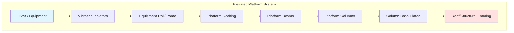
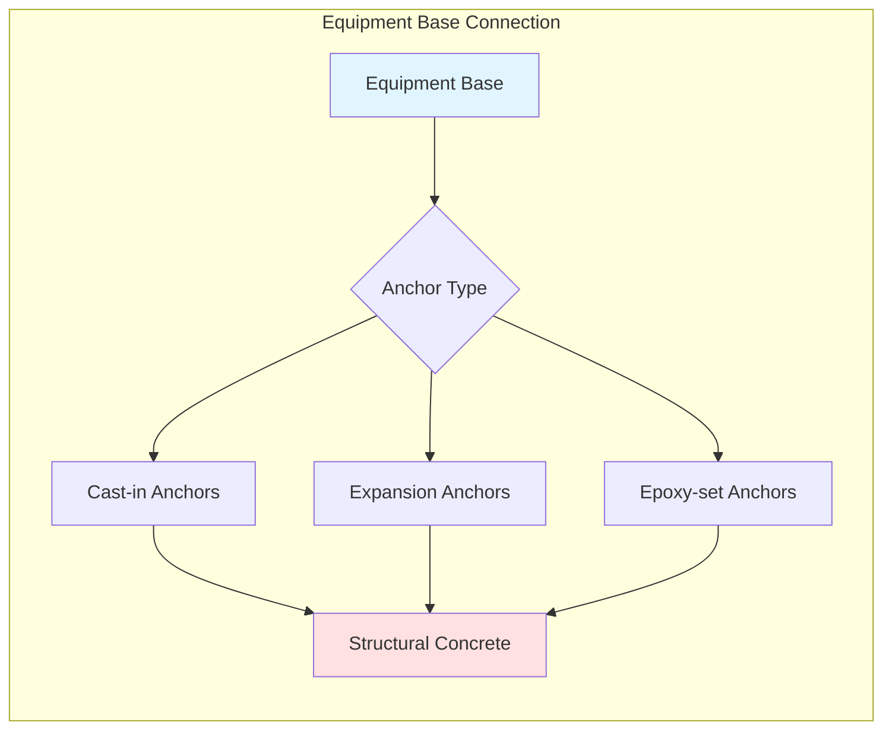
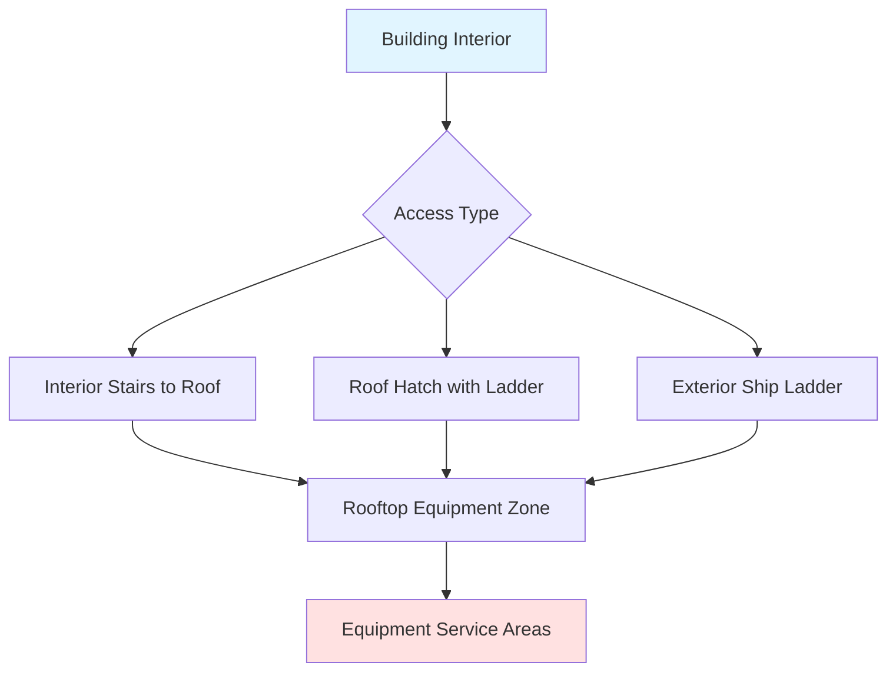

Elevated HVAC equipment installations require comprehensive structural coordination to ensure adequate support, code compliance, and long-term system performance. Rooftop and platform-mounted equipment presents unique challenges for structural loading, access, vibration control, and weatherproofing.

## Structural Load Considerations

### Dead Load Calculations

The total dead load consists of equipment weight, support structures, piping, and accessories:

$$W_{total} = W_{equip} + W_{curb} + W_{platform} + W_{piping} + W_{misc}$$

where each component must be verified against manufacturer data and field measurements.

### Live Load Requirements

IBC Section 1607.11.2.2 specifies equipment live loads:

$$L_{equip} = \max(15 \text{ psf}, \frac{W_{equip}}{A_{footprint}})$$

Maintenance access areas require minimum 40 psf live load rating per IBC Table 1607.1.

### Combined Load Analysis

Total design load for structural verification:

$$P_{design} = 1.2D + 1.6L + 0.5(L_r \text{ or } S)$$

where $D$ = dead load, $L$ = live load, $L_r$ = roof live load, and $S$ = snow load per ASCE 7.

## Equipment Support Systems

### Rooftop Curbs

Prefabricated curbs provide the primary interface between equipment and roof structure:

**Minimum curb height:** 8 inches above finished roof surface to prevent water infiltration

**Curb construction:** 14-gauge galvanized steel or aluminum with structural reinforcement

**Flashing integration:** Factory-installed cant strips and reglets for membrane attachment

### Support Platforms

When roof structure cannot support concentrated equipment loads, platforms distribute forces:

### Structural Steel Framing

Platform beam sizing based on tributary load:

$$M_{max} = \frac{wL^2}{8}$$

Required section modulus:

$$S_{req} = \frac{M_{max}}{F_b}$$

where $w$ = distributed load, $L$ = span length, and $F_b$ = allowable bending stress.

## Mounting and Anchoring

### Base Anchor Design

Equipment anchorage must resist both vertical and lateral forces:

Anchor embedment depth per ACI 318:

$$l_{emb} = \max(12d_b, 8 \text{ in})$$

where $d_b$ = anchor bolt diameter.

### Vibration Isolation

Rooftop equipment requires isolation to prevent structural transmission:

**Spring isolators:** Deflection 1-2 inches for equipment over 600 rpm

**Neoprene pads:** 0.5-1.0 inch deflection for equipment under 600 rpm

Isolation efficiency:

$$\eta = \left(1 - \frac{1}{(f/f_n)^2 - 1}\right) \times 100\%$$

where $f$ = operating frequency and $f_n$ = natural frequency of isolated system.

## Access and Clearance Requirements

### Code-Required Clearances

IMC Section 306 specifies minimum working space:

| Equipment Side | Width | Depth | Height |
|----------------|-------|-------|--------|
| Service side | 30 in minimum | 30 in minimum | 78 in minimum |
| Control side | 30 in minimum | 36 in minimum | 78 in minimum |
| Non-service side | 6-12 in | 0 in | N/A |

### Roof Access

Permanent roof access required per IBC Section 1011.12.1:

**Ship ladder:** Minimum 30-degree angle, 16-24 inch width

**Stairs:** Preferred for frequent access, 7-inch max rise, 11-inch min tread

**Safety rails:** Required when walking surface exceeds 30 inches above adjacent surface

### Service Clearances

Manufacturer installation manuals specify additional requirements:

**Coil access:** Clearance equal to coil depth plus 24 inches minimum

**Filter access:** 36-inch clearance for filter banks requiring routine service

**Compressor service:** 48-inch clearance for refrigerant line connections

## Coordination Requirements

### Structural Engineering

Engage structural engineer for:

1. Load path verification from equipment to foundation
2. Existing structure capacity evaluation for retrofit installations
3. Platform and support design calculations
4. Connection detail development
5. Construction document stamping

### Roof Membrane Protection

Coordinate with roofing contractor:

**Walkway pads:** Required for access routes to reduce membrane wear

**Cant strips:** Minimum 4-inch height at curb perimeter

**Pitch pockets:** Avoided in favor of flashed curbs for penetrations

**Equipment placement:** Minimum 10 feet from roof edge, 4 feet from parapet

### Utility Coordination

Route services to minimize roof penetrations:

**Condensate drains:** Slope 1/4 inch per foot minimum to roof drains

**Refrigerant lines:** Support every 10 feet, isolation at equipment connection

**Electrical conduit:** Weatherproof fittings, minimize horizontal runs on roof

**Gas piping:** Seismic loop at equipment connection per NFPA 54

## Wind and Seismic Considerations

Equipment must resist lateral forces per ASCE 7:

**Wind pressure:**

$$p = q_z G C_p$$

where $q_z$ = velocity pressure, $G$ = gust factor, $C_p$ = pressure coefficient.

**Seismic force:**

$$F_p = \frac{0.4 a_p S_{DS} W_p}{R_p/I_p}\left(1 + 2\frac{z}{h}\right)$$

where $S_{DS}$ = design spectral acceleration, $W_p$ = equipment weight, $z$ = equipment height, $h$ = building height.

See [Seismic Design Criteria](../seismic-design-criteria/) and [Wind Load Design](../wind-load-design/) for detailed analysis procedures.

## Installation Best Practices

### Pre-Installation Verification

1. Verify roof structural capacity with as-built drawings
2. Confirm curb dimensions match equipment base
3. Inspect roof membrane condition at installation area
4. Verify crane access and rigging point capacity

### Installation Sequence

1. Install and flash equipment curb
2. Complete membrane curing period (typically 48 hours)
3. Position and level vibration isolators
4. Rig and set equipment using manufacturer lifting points
5. Install anchor bolts with proper torque
6. Connect and support utility services
7. Install equipment covers and weatherproofing

### Quality Assurance

Document installation compliance:

- Anchor bolt torque verification
- Vibration isolator compression measurements
- Service clearance verification photographs
- Manufacturer startup checklist completion

## Flood Considerations

For installations in flood-prone areas per IBC Section 1612:

**Elevation requirement:** Equipment 1 foot above base flood elevation (BFE)

**Platform materials:** Corrosion-resistant steel or concrete

**Anchor protection:** Stainless steel hardware in flood zones

See [Flood Resistant Equipment](../flood-resistant-equipment/) for detailed flood protection strategies.

---

**References:**
- ASCE 7: Minimum Design Loads for Buildings and Other Structures
- IBC Chapter 16: Structural Design
- IMC Chapter 3: General Regulations
- SMACNA Seismic Restraint Manual
- Manufacturer installation instructions and submittal data
