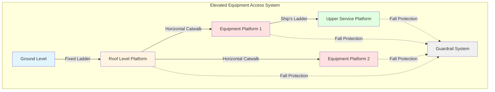
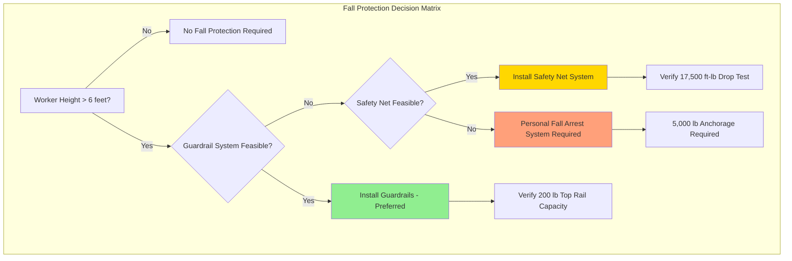
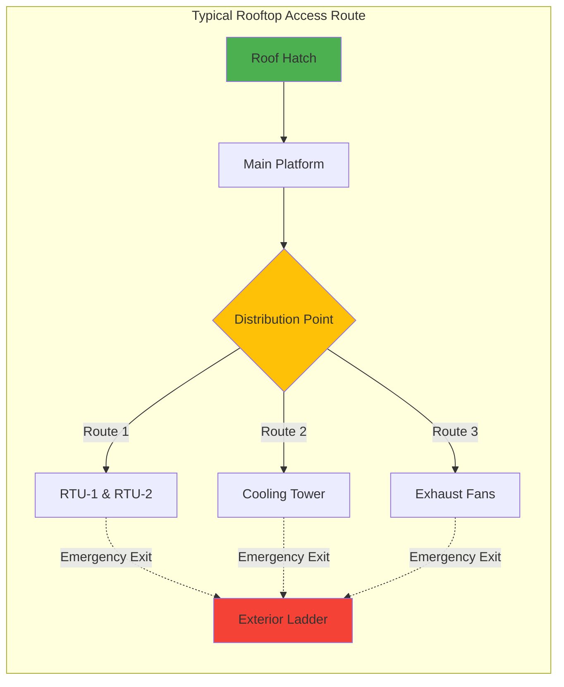

## Overview

Safe and efficient access to elevated HVAC equipment is essential for routine maintenance, emergency repairs, and regulatory compliance. Proper access design reduces service time, minimizes safety risks, and ensures equipment operates at peak efficiency throughout its service life.

## Access System Components

### Fixed Ladders

Fixed ladders provide vertical access to elevated equipment and must comply with OSHA 1910.27 standards:

**Design Requirements:**
- Minimum rung width: 16 inches (406 mm)
- Maximum rung spacing: 12 inches (305 mm) on center
- Clearance behind ladder: 7 inches (178 mm) minimum from obstruction
- Toe clearance: 4.5 inches (114 mm) minimum depth
- Rung load capacity: 250 lbs (113 kg) minimum per rung
- Side rail extension: 42 inches (1067 mm) above landing surface

**Fall Protection Requirements:**
- Ladders exceeding 24 feet (7.3 m) require ladder safety systems or personal fall arrest systems
- Cage systems prohibited on new installations per 2018 OSHA regulations
- Rail systems must provide continuous protection during ascent and descent

### Platforms and Catwalks

Work platforms provide safe standing areas for equipment service and must accommodate worker movement with tools:

**Platform Design Criteria:**

| Parameter | Minimum Requirement | Notes |
|-----------|-------------------|-------|
| Width | 30 inches (762 mm) | 36 inches (914 mm) preferred for two-way traffic |
| Load capacity | 50 psf (2.4 kPa) | Uniform live load minimum |
| Guardrail height | 42 inches (1067 mm) | ±3 inches tolerance |
| Midrail height | 21 inches (533 mm) | Midpoint between top rail and platform |
| Toe board height | 4 inches (102 mm) | Required when tools or materials present |
| Surface | Slip-resistant | Grated or textured surfaces required |

**Catwalk Configuration:**
- Maximum slope: 1:8 (12.5%) without cleats or steps
- Slopes exceeding 1:8 require stair treads or rung-type steps
- Overhead clearance: 80 inches (2032 mm) minimum
- Handrail continuity maintained at direction changes

### Service Clearances

Equipment placement must provide adequate clearances for maintenance activities:

**Minimum Service Clearances:**
- Front service access: 36 inches (914 mm) from control panels and serviceable components
- Side clearance: 30 inches (762 mm) where no service required
- Overhead clearance: 78 inches (1981 mm) minimum for worker headroom
- Equipment-to-equipment spacing: 48 inches (1219 mm) for major components
- Removable panel clearance: 1.5 × panel dimension perpendicular to removal direction

**Special Considerations:**
- Heat exchanger tube bundle removal requires clearance equal to bundle length plus 24 inches
- Fan scroll removal needs clearance equal to wheel diameter plus 36 inches
- Compressor replacement access requires rigging equipment clearance
- Filter bank service requires pull-out space plus technician working area

## Fall Protection Systems

### Personal Fall Arrest Systems (PFAS)

Required when working at heights exceeding 6 feet (1.8 m) without guardrails:

**System Components:**
- Full-body harness (Class III) with D-ring attachment between shoulder blades
- Shock-absorbing lanyard or self-retracting lifeline
- Anchorage point rated for 5,000 lbs (22.2 kN) per attached worker
- Total fall distance calculation: lanyard length + deceleration distance + worker height + safety factor

**Anchorage Design:**
- Permanent roof anchors at equipment locations
- Horizontal lifeline systems for extended work areas
- Mobile anchor carts for variable equipment positions
- Certification and annual inspection required

### Guardrail Systems

Preferred fall protection method providing passive protection:

**Top Rail Requirements:**
- Height: 42 inches (1067 mm) ±3 inches from walking surface
- Load capacity: 200 lbs (890 N) applied downward or outward
- Deflection: Maximum 3 inches (76 mm) under 200 lb load

**Intermediate Rails:**
- Midrail or equivalent screening to prevent passage of 19-inch (483 mm) sphere
- Midrail height: 21 inches (533 mm) nominal

**Material Selection:**
- Steel pipe or structural sections for permanent installations
- Aluminum or stainless steel in corrosive environments
- Yellow powder coat finish for visibility (optional but recommended)

## Access Route Planning

### Path of Travel

Efficient access routing reduces service time and improves safety:

**Design Principles:**
- Minimize elevation changes between equipment requiring frequent service
- Provide continuous fall protection along entire route
- Avoid crossing active roof drainage paths
- Separate access routes from refrigerant piping runs where possible
- Illuminate pathways for night service (minimum 5 foot-candles)

**Emergency Egress:**
- Two means of egress required for roofs exceeding 3,000 sf (279 m²)
- Maximum travel distance to egress: 200 feet (61 m)
- Exit route marked with photoluminescent signage

## Maintenance Equipment Storage

### Tool Lockers and Material Staging

Rooftop storage reduces equipment transport time:

**Weatherproof Lockers:**
- Secure storage for frequently used hand tools
- Corrosion-resistant construction (aluminum or composite)
- Ventilation to prevent moisture accumulation
- Minimum size: 2 feet × 2 feet × 4 feet high (0.6 m × 0.6 m × 1.2 m)

**Material Staging Areas:**
- Designated filter storage near air handling units
- Rigging equipment anchor points for heavy component removal
- Refrigerant cylinder restraint systems
- Waste material collection points

## Regulatory Compliance

### Code References

**OSHA Standards:**
- 1910.27: Fixed Ladders
- 1910.28: Duty to Have Fall Protection
- 1910.29: Fall Protection Systems and Falling Object Protection Criteria
- 1910.140: Personal Fall Protection Systems

**Industry Standards:**
- ANSI A14.3: Fixed Ladders - Safety Requirements
- ANSI Z359: Fall Protection Code
- ASHRAE Standard 15: Safety Standard for Refrigeration Systems (access for relief valve inspection)

### Inspection and Documentation

**Regular Inspections:**
- Fall protection systems: Annual competent person inspection
- Ladder systems: Visual inspection before each use, detailed annual inspection
- Platforms and catwalks: Quarterly structural inspection
- Anchorage points: Load testing every 5 years or after any fall arrest event

**Documentation Requirements:**
- Inspection logs maintained for equipment service life
- Load capacity placards permanently affixed to platforms
- Fall protection system certification records
- Worker training records (fall protection training every 2 years minimum)

## Best Practices

1. **Design Phase Integration**: Coordinate access systems during equipment layout to optimize service efficiency
2. **Redundant Protection**: Provide both guardrails and anchorage points where feasible
3. **Winter Considerations**: Specify slip-resistant surfaces effective in ice and snow conditions
4. **Lighting**: Provide task lighting at equipment service points independent of building lighting
5. **Communication**: Install emergency communication systems at remote equipment locations
6. **Ergonomics**: Position frequently serviced components at 30-60 inch (762-1524 mm) height above platform
7. **Standardization**: Use consistent access hardware and fall protection systems across facility

Proper access and fall protection systems are not optional—they are essential infrastructure that enables safe, efficient HVAC system operation throughout the equipment lifecycle.
