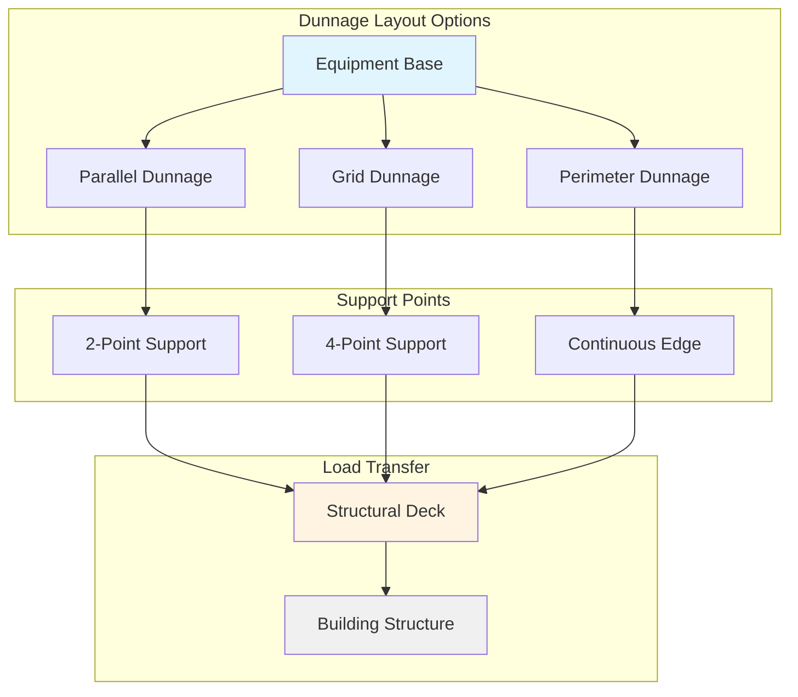
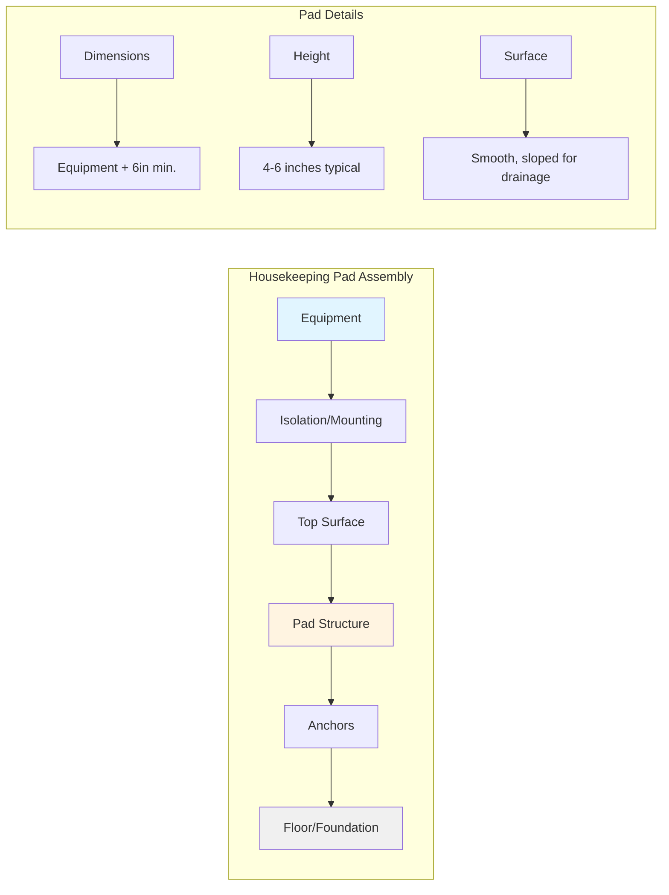
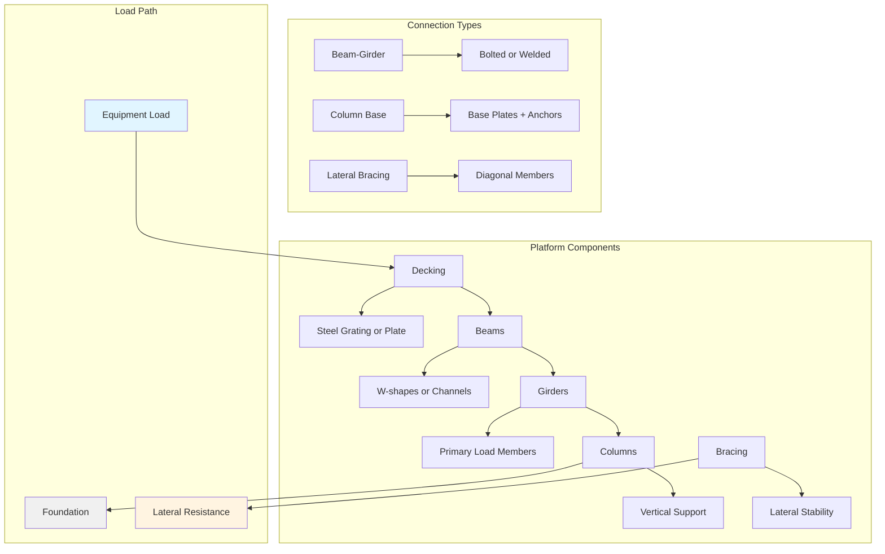

Platform supports provide the critical structural interface between HVAC equipment and building structures, ensuring proper load distribution, equipment alignment, and compliance with seismic and wind design requirements. These support systems include dunnage, housekeeping pads, and structural steel frames.

## Dunnage Systems

Dunnage consists of structural members placed between equipment and the supporting surface to distribute loads, provide clearance for connections, and facilitate leveling.

### Material Selection

**Steel Dunnage:**
- Structural steel channels (C-shapes)
- Wide-flange beams (W-shapes)
- Hollow structural sections (HSS)
- Hot-dipped galvanized or painted finish

**Wood Dunnage:**
- Treated lumber for temporary installations
- Not recommended for permanent HVAC equipment
- Limited application in seismic or flood zones

### Load Distribution Calculation

The required dunnage cross-section depends on equipment weight and support spacing:

$$\sigma_{b} = \frac{M}{S} \leq F_b$$

Where:
- $\sigma_b$ = Bending stress (psi)
- $M$ = Maximum bending moment (lb-in)
- $S$ = Section modulus (in³)
- $F_b$ = Allowable bending stress (psi)

For uniform equipment load:

$$M = \frac{wL^2}{8}$$

Where:
- $w$ = Distributed load per unit length (lb/in)
- $L$ = Span between supports (in)

### Dunnage Configuration

**Typical Dunnage Heights:**
- Minimum: 2 inches (pipe clearance)
- Standard: 4-6 inches (service access)
- Extended: 8-12 inches (major piping/drainage)

## Housekeeping Pads

Housekeeping pads are concrete or steel platforms that elevate equipment above floor level for drainage, cleaning access, and protection from floor moisture.

### Concrete Housekeeping Pads

**Design Requirements:**

Minimum concrete thickness:

$$t = \sqrt{\frac{3P(1-\mu^2)}{2\pi E h}}$$

Where:
- $t$ = Slab thickness (in)
- $P$ = Concentrated load (lb)
- $\mu$ = Poisson's ratio (0.15 for concrete)
- $E$ = Modulus of elasticity (psi)
- $h$ = Allowable bearing stress (psi)

**Standard Specifications:**
- Concrete strength: 3,000-4,000 psi minimum
- Thickness: 4-6 inches for light equipment
- Thickness: 6-12 inches for heavy equipment
- Reinforcement: #4 bars at 12 inches on center, both ways
- Edge distance: 3 inches minimum from anchors

### Steel Housekeeping Pads

Fabricated steel platforms using:
- Structural steel frame (angles, channels, beams)
- Steel plate or grating deck
- Welded or bolted construction
- Corrosion protection required

### Height Requirements

Minimum housekeeping pad heights:
- Dry locations: 2-4 inches
- Wet locations: 4-6 inches
- Flood-prone areas: Per FEMA guidelines (above BFE)
- Equipment rooms with floor drains: 4 inches minimum

## Structural Frame Platforms

Structural platforms support multiple equipment items or provide elevated mechanical rooms, requiring comprehensive structural design.

### Platform Load Analysis

**Dead Load Calculation:**

$$DL = W_{eq} + W_{platform} + W_{piping} + W_{misc}$$

Where:
- $W_{eq}$ = Equipment weight (lb)
- $W_{platform}$ = Platform structural weight (lb)
- $W_{piping}$ = Piping, conduit, and accessories (lb)
- $W_{misc}$ = Miscellaneous loads (lb)

**Live Load:**
- Maintenance access: 125 psf minimum
- Equipment replacement paths: 250 psf
- Per IBC Chapter 16 requirements

**Seismic Load:**

$$F_p = \frac{0.4 a_p S_{DS} W_p}{R_p/I_p}\left(1 + 2\frac{z}{h}\right)$$

Where:
- $F_p$ = Seismic force on equipment (lb)
- $a_p$ = Component amplification factor
- $S_{DS}$ = Design spectral acceleration
- $W_p$ = Component weight (lb)
- $R_p$ = Component response modification factor
- $I_p$ = Component importance factor
- $z$ = Height of attachment point
- $h$ = Building height

### Frame Design Configuration

### Structural Steel Requirements

**Member Design:**
- AISC 360: Specification for Structural Steel Buildings
- ASCE 7: Minimum Design Loads
- IBC: Structural requirements

**Deflection Limits:**
- Live load deflection: L/360 maximum
- Total load deflection: L/240 maximum
- Equipment-specific limits may be more restrictive

**Connection Design:**
- Bolted connections: AISC 360 Chapter J
- Welded connections: AWS D1.1
- Base plates: Minimum thickness per AISC Design Guide 1

### Concrete Platform Supports

For platforms supported on concrete:

**Bearing Stress:**

$$f_p = \frac{P}{A} \leq \phi(0.85f'_c)$$

Where:
- $f_p$ = Bearing pressure (psi)
- $P$ = Applied load (lb)
- $A$ = Bearing area (in²)
- $\phi$ = Strength reduction factor (0.65)
- $f'_c$ = Concrete compressive strength (psi)

**Anchor Design:**
- ACI 318 Chapter 17: Anchoring to Concrete
- Minimum embedment depth per anchor manufacturer
- Edge distance: 6 inches minimum for platform supports
- Spacing: 4 anchor diameters minimum

## Installation and Inspection Requirements

### Platform Leveling
- Maximum slope: 1/4 inch per 10 feet
- Use precision shims or leveling screws
- Verify with digital level before equipment placement

### Anchor Installation
- Drill depth verification
- Hole cleaning procedures
- Torque specifications per manufacturer
- Special inspection required for seismic applications

### Quality Assurance
- Verify structural calculations and shop drawings
- Inspect welds per AWS D1.1
- Confirm material certifications
- Document as-built conditions

### Access and Safety
- Platforms over 30 inches require guardrails
- Stairs or ladders per OSHA requirements
- Adequate space for maintenance (36 inches minimum)
- Load capacity signage required

## Design Coordination

Platform support design requires coordination between:
- Structural engineer (platform capacity)
- Mechanical engineer (equipment loads and clearances)
- Architect (space allocation and aesthetics)
- Geotechnical engineer (foundation requirements for grade-level platforms)

Proper platform support design ensures equipment operates within manufacturer alignment tolerances, distributes loads safely to the building structure, and provides required access for installation and maintenance while meeting all code requirements for seismic, wind, and flood resistance.
