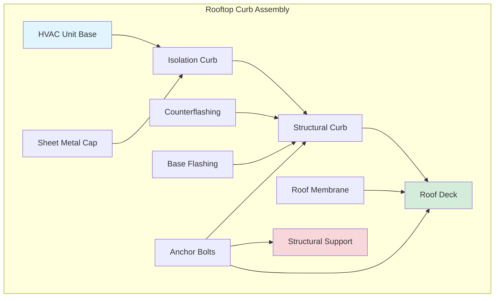
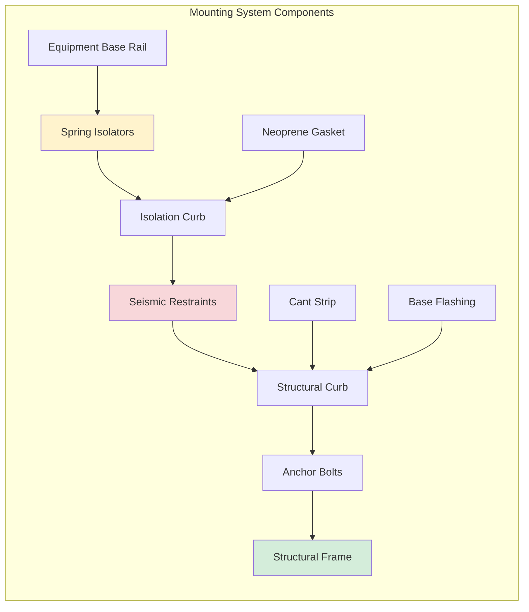

## Overview

Rooftop equipment installation represents one of the most challenging HVAC applications, requiring coordination of structural capacity, wind resistance, seismic restraint, vibration isolation, and waterproofing. Equipment ranging from small packaged units to large chillers and cooling towers must be properly anchored to resist environmental loads while maintaining roof integrity.

ASCE 7 provisions for wind uplift and seismic forces govern rooftop installation design, with specific amplification factors for elevated equipment.

## Wind Load Design for Rooftop Equipment

### Wind Uplift Calculations

Rooftop equipment experiences significantly higher wind pressures than ground-level installations due to exposure and corner/edge effects.

**Design wind pressure on rooftop equipment:**

$$
p = q_h \cdot G \cdot C_p
$$

Where:
- $p$ = design wind pressure (psf)
- $q_h$ = velocity pressure at mean roof height (psf)
- $G$ = gust effect factor (typically 0.85)
- $C_p$ = external pressure coefficient

**Velocity pressure calculation:**

$$
q_h = 0.00256 \cdot K_z \cdot K_{zt} \cdot K_d \cdot V^2
$$

Where:
- $K_z$ = velocity pressure exposure coefficient
- $K_{zt}$ = topographic factor
- $K_d$ = wind directionality factor
- $V$ = basic wind speed (mph)

### Zone-Specific Pressure Coefficients

ASCE 7 defines increased pressures for equipment located in roof corner and edge zones:

| Location | $C_p$ Range | Uplift Factor |
|----------|-------------|---------------|
| Interior zone | -0.9 to -1.3 | 1.0 |
| Edge zone | -1.5 to -2.2 | 1.7 |
| Corner zone | -2.0 to -3.0 | 2.3 |

Equipment should be positioned in interior zones when possible to minimize wind loads and anchorage requirements.

## Seismic Design for Elevated Equipment

### Seismic Force Amplification

Rooftop equipment experiences amplified seismic forces due to elevation and building dynamic response.

**Seismic design force:**

$$
F_p = \frac{0.4 \cdot a_p \cdot S_{DS} \cdot W_p}{R_p / I_p} \cdot \left(1 + 2 \cdot \frac{z}{h}\right)
$$

Where:
- $F_p$ = seismic design force
- $a_p$ = component amplification factor (2.5 for HVAC)
- $S_{DS}$ = design spectral response acceleration
- $W_p$ = component operating weight
- $R_p$ = component response modification factor (2.5 for HVAC)
- $I_p$ = component importance factor
- $z$ = height of attachment point
- $h$ = building height

**Maximum and minimum force limits:**

$$
F_{p,max} = 1.6 \cdot S_{DS} \cdot I_p \cdot W_p
$$

$$
F_{p,min} = 0.3 \cdot S_{DS} \cdot I_p \cdot W_p
$$

For rooftop equipment where $z = h$, the amplification factor $(1 + 2z/h)$ equals 3.0, tripling the base seismic force.

## Rooftop Curb and Mounting Systems

### Curb Construction Requirements

Rooftop curbs provide the structural interface between equipment and roof structure while maintaining waterproof integrity.

**Curb height requirements:**
- Minimum 8 inches above finished roof surface
- 12 inches recommended for snow-prone regions
- Additional height for anticipated roof membrane buildup

### Equipment Mounting Configuration

## Structural Coordination

### Load Transfer Path

The complete load path from equipment to primary structure must be verified:

1. **Equipment base:** Distributes loads to mounting rails
2. **Isolation system:** Transfers static loads while isolating vibration
3. **Curb assembly:** Distributes loads across roof deck
4. **Roof deck:** Spans between structural members
5. **Structural framing:** Transfers loads to building columns/walls

### Structural Analysis Requirements

**Dead load components:**
- Equipment operating weight
- Curb and mounting assembly
- Maintenance access platform (if applicable)

**Live load considerations:**
- Personnel access: 300 lb concentrated load
- Maintenance equipment loads
- Snow accumulation (drifting around equipment)

**Concentrated load distribution:**

$$
P_{distributed} = \frac{P_{equipment}}{A_{effective}}
$$

Where effective area depends on curb dimensions and structural deck spanning capability.

## Vibration Isolation at Roof Level

### Isolation System Selection

Rooftop installations require careful vibration isolation to prevent structural transmission:

**Spring isolator deflection:**

$$
\delta = \frac{W}{k \cdot n}
$$

Where:
- $\delta$ = static deflection (inches)
- $W$ = equipment weight (lb)
- $k$ = spring constant (lb/in)
- $n$ = number of isolators

**Isolation efficiency:**

$$
T = \frac{f_n}{f_d}
$$

Where:
- $T$ = transmissibility ratio
- $f_n$ = natural frequency of isolation system
- $f_d$ = disturbing frequency

Target transmissibility ratio: $T < 0.1$ (requires $f_n < 0.3 \cdot f_d$)

### Restrained Spring Isolators

Rooftop applications require seismically restrained isolators that provide:
- Vertical load support with vibration isolation
- Horizontal restraint for seismic and wind forces
- Limited vertical movement during seismic events
- All-directional snubbing capability

## Weatherproofing and Roof Penetrations

### Flashing System Design

Critical waterproofing layers for rooftop equipment:

1. **Base flashing:** Connects roof membrane to curb, minimum 8-inch height
2. **Counterflashing:** Overlaps base flashing, mechanically fastened to curb
3. **Cap flashing:** Protects top of curb from water infiltration
4. **Pitch pockets:** Avoided when possible; use compression flashing boots instead

### Penetration Sealing

All roof penetrations require multiple layers of protection:

**Electrical conduit penetrations:**
- Pitch pans with pourable sealant (least preferred)
- Compression pipe boots (preferred)
- Curb-mounted junction boxes (most reliable)

**Refrigerant line penetrations:**
- Factory-sealed line sets through curb sidewall
- Foam closure strips at line set entry points
- Sealant at metal-to-metal interfaces

**Condensate drain routing:**
- Interior routing preferred (through building interior)
- Exterior routing requires trapped connections
- Winterization for freeze protection

## Installation Sequence and Coordination

### Pre-Installation Verification

1. **Structural capacity confirmation:** Engineer's approval of roof framing adequacy
2. **Curb placement coordination:** Alignment with structural members
3. **Penetration locations:** Coordination with roofing contractor
4. **Access pathway:** Crane access, rigging points, roof protection

### Installation Procedure

1. Install structural curb base, anchor to structural deck/framing
2. Complete base flashing integration with roof membrane
3. Install counterflashing and cap flashing
4. Mount isolation curb with seismic restraints
5. Set equipment on isolation curb
6. Connect and seal all penetrations
7. Verify anchorage torque values
8. Test seismic restraint engagement
9. Commission and verify operation

## Load Testing and Verification

### Pull Test Requirements

Anchor bolt pull testing verifies installation capacity:

**Required test load:**

$$
T_{test} = 1.5 \cdot T_{design}
$$

Sample size: Minimum 4 anchors or 10% of total, whichever is greater.

### Deflection Monitoring

Long-term monitoring of roof deflection under equipment load:
- Initial survey immediately after installation
- 30-day follow-up survey
- Annual verification for critical equipment

Excessive deflection (>L/240) indicates inadequate structural support requiring remediation.

## Code Compliance and Documentation

### Required Calculations

1. Wind uplift resistance per ASCE 7 Chapter 29
2. Seismic anchorage per ASCE 7 Chapter 13
3. Structural load distribution analysis
4. Vibration isolation system design
5. Anchor bolt capacity verification

### As-Built Documentation

- Equipment location plan with dimensions to structural grid
- Anchor bolt layout and specifications
- Seismic restraint details and settings
- Vibration isolator specifications and deflections
- Roof penetration details and flashing configurations
- Structural calculations and engineer's approval

---

**Related Topics:**
- [Seismic Bracing Equipment](/specialty-applications-testing/seismic-wind-flood-resistant-design/seismic-bracing-equipment/)
- [Wind Load Design](/specialty-applications-testing/seismic-wind-flood-resistant-design/wind-load-design/)
- [Vibration Control](/specialty-applications-testing/acoustic-noise-vibration/vibration-control/)
