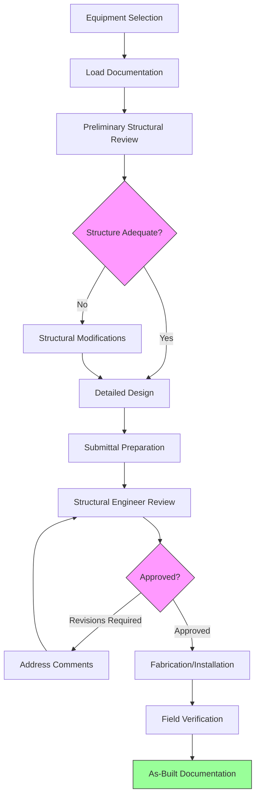
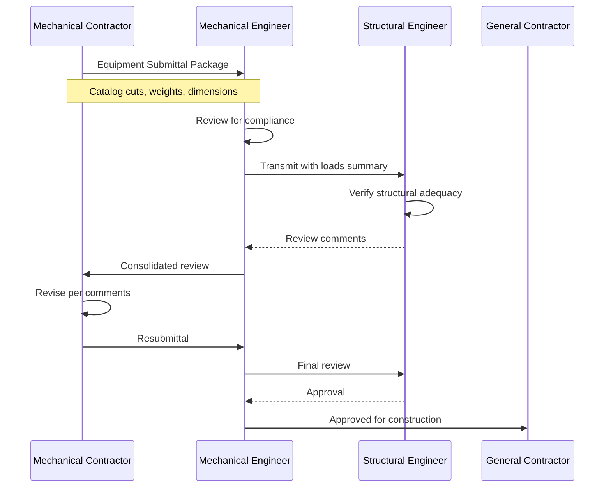

Structural coordination between HVAC designers and structural engineers is critical for elevated equipment installations. Proper coordination ensures that building structures can safely support mechanical equipment loads while maintaining code compliance and system performance.

## Engineer-of-Record Responsibilities

The structural engineer-of-record holds ultimate responsibility for verifying that building structures can accommodate HVAC equipment loads. This includes:

**Structural Design Authority:**
- Review and approve all equipment loads and support configurations
- Verify structural adequacy of mounting locations
- Calculate required reinforcement or modifications
- Seal structural drawings and calculations
- Ensure code compliance for all structural elements

**Load Path Verification:**
- Trace equipment loads through primary structural members
- Verify lateral load transfer mechanisms
- Confirm diaphragm capacity for seismic forces
- Evaluate foundation adequacy for accumulated loads
- Check for load concentration points requiring reinforcement

**Connection Design:**
- Specify anchorage requirements and attachment details
- Design structural supports, curbs, and equipment pads
- Determine required embedment depths and edge distances
- Specify reinforcement at penetrations and openings
- Review vibration isolation attachment methods

The structural engineer must receive complete and accurate load information early in the design process to properly size structural members and connections.

## Load Documentation Requirements

Comprehensive load documentation forms the foundation of structural coordination. Equipment loads must be clearly communicated and properly formatted for structural analysis.

**Equipment Data Sheets:**

Include the following information for each piece of equipment:

| Parameter | Required Information |
|-----------|---------------------|
| Operating Weight | Total weight including refrigerant, water, controls |
| Shipping Weight | Weight during rigging and installation |
| Footprint | Equipment base dimensions and support point locations |
| Center of Gravity | Distance from base in X, Y, Z directions |
| Service Access | Required clearances and maintenance loads |
| Seismic Category | IBC seismic design category and importance factor |

**Load Types and Combinations:**

Document all applicable loads per ASCE 7:

- **Dead Loads:** Equipment weight, supports, piping, conduit, controls
- **Live Loads:** Service personnel, maintenance equipment, snow/ice
- **Seismic Loads:** Horizontal forces based on Fp calculations
- **Wind Loads:** Uplift and overturning forces on exposed equipment
- **Operating Loads:** Fan thrust, compressor vibration, water hammer
- **Thermal Loads:** Expansion forces in piping and supports

Provide load combinations per ASCE 7 Chapter 2 for strength design:

- 1.2D + 1.6L + 0.5(Lr or S)
- 1.2D + 1.0E + L + 0.2S
- 0.9D + 1.0W

## Coordination Workflow Process

Effective structural coordination follows a systematic workflow throughout project phases.

**Design Development Phase:**

1. Mechanical engineer provides preliminary equipment schedules with estimated weights and locations
2. Structural engineer reviews existing structure capacity
3. Identify areas requiring reinforcement or relocation
4. Establish coordination points and schedule for detailed submittals
5. Document assumptions and design criteria

**Construction Documents Phase:**

Prepare detailed equipment support drawings showing:

- Equipment outline with support point locations
- Seismic and wind force calculations
- Required anchorage and reinforcement
- Coordination with roof drainage and waterproofing
- Clearance requirements for installation and service

Include general notes specifying that contractor shall verify field conditions and obtain structural engineer approval before installation.

## Submittal and Review Process

The submittal process ensures that installed equipment matches design assumptions and structural capacity.

**Required Submittal Information:**

- Manufacturer equipment data with certified weights
- Dimensional drawings showing support point locations
- Center of gravity location for seismic force calculation
- Seismic certification or test reports (if required)
- Anchorage details and installation instructions
- Vibration isolation specifications and details
- Service clearance requirements

**Structural Review Checklist:**

The structural engineer verifies:

- Equipment weight matches design assumptions (±10% tolerance typical)
- Support point locations align with structural members
- Seismic forces are within design parameters
- Anchorage details are adequate and constructible
- Reinforcement requirements are satisfied
- Roof penetrations do not compromise structural integrity
- Installation sequence will not overstress structural members

## Interface Documentation

Maintain clear documentation of the mechanical-structural interface throughout the project:

**Coordination Drawings:**

Prepare composite drawings showing:

- Structural framing plan with beam and joist locations
- Equipment footprints overlaid on structural grid
- Load transfer paths highlighted
- Conflict resolution details
- Reinforcement locations

**Load Summary Tables:**

Create summary tables for each roof level or equipment platform:

| Equipment ID | Weight (lb) | Seismic Force (lb) | Support Type | Structural Review Status |
|--------------|-------------|-------------------|--------------|-------------------------|
| AHU-1 | 3,200 | 1,920 | Steel curb | Approved 03/15/25 |
| CU-1 through 4 | 850 ea. | 510 ea. | Concrete pad | Approved 03/18/25 |
| ERV-1 | 1,450 | 870 | Roof curb | Pending review |

**Change Order Documentation:**

When equipment changes occur:

1. Notify structural engineer immediately
2. Submit revised load documentation
3. Obtain structural review and approval
4. Document impact on construction schedule
5. Update as-built drawings

## Field Verification and As-Built Requirements

Final coordination extends through installation and closeout:

**Pre-Installation Verification:**

- Confirm structural support locations in field
- Verify anchor bolt embedment and spacing
- Check structural reinforcement installation
- Document any field modifications required

**Installation Inspection:**

Structural engineer should observe:

- Critical anchor installations
- Equipment setting and alignment
- Load distribution verification
- Penetration reinforcement

**As-Built Documentation:**

Update drawings to reflect:

- Final equipment locations and weights
- Actual anchor locations and details
- Field modifications to structural supports
- Penetration locations and reinforcement

Proper structural coordination protects building integrity, ensures code compliance, and prevents costly field modifications. Early engagement, complete documentation, and systematic review processes are essential for successful elevated equipment installations.
