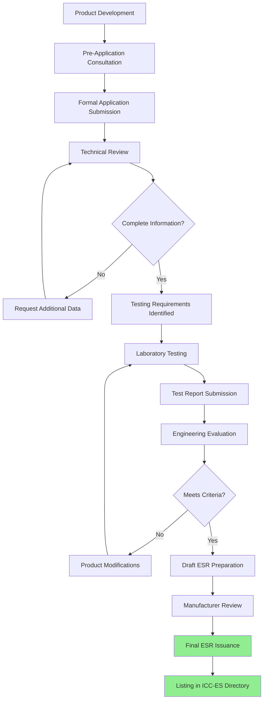
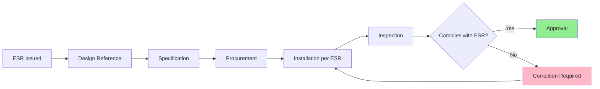

The International Code Council Evaluation Service (ICC-ES) provides critical third-party validation for HVAC equipment and support systems through comprehensive evaluation reports. These reports demonstrate compliance with building codes and enable manufacturers to document that their products meet stringent performance requirements for seismic, wind, and structural applications.

## ICC-ES Evaluation Service Overview

ICC-ES operates as an independent evaluation service that assesses building products, components, methods, and materials for compliance with the International Building Code (IBC), International Residential Code (IRC), and other applicable standards. For HVAC applications, ICC-ES evaluation reports (ESRs) provide code officials, designers, and contractors with documented evidence that equipment and support systems meet code requirements without requiring individual project-specific approvals.

The evaluation service bridges the gap between innovative products and prescriptive code requirements, particularly valuable when:

- Products utilize new materials or designs not explicitly covered in building codes
- Equipment incorporates proprietary seismic restraint systems
- Manufacturers seek broad market acceptance across multiple jurisdictions
- Projects require documented evidence of code compliance for permitting

## Evaluation Report (ESR) Structure

ICC-ES evaluation reports follow a standardized format that provides comprehensive product information:

**Report Header Information:**
- ESR number and issue date
- Product manufacturer and contact information
- Product description and intended use
- Applicable code sections and standards

**Technical Specifications:**
- Material properties and component descriptions
- Load capacities and performance limits
- Installation requirements and limitations
- Quality control and manufacturing oversight

**Conditions of Use:**
- Building code sections addressed
- Limitations on application
- Required installation practices
- Inspection and testing requirements

ESRs remain valid as long as the product, manufacturing process, and applicable codes remain unchanged. Reports undergo periodic review and reissuance to maintain currency with code cycles.

## AC156 Acceptance Criteria

AC156 (Acceptance Criteria for Seismic Certification by Shake-Table Testing of Nonstructural Components) represents the primary standard for HVAC equipment seismic qualification. This acceptance criteria document establishes:

**Testing Requirements:**
- Shake table test protocols simulating seismic motion
- Required Performance Levels (RPL) based on equipment importance
- Input motion parameters matching code-specified ground accelerations
- Multi-axis testing requirements for realistic seismic simulation

**Performance Levels:**

| Level | Description | Operational Requirement |
|-------|-------------|------------------------|
| RPL 1 | Life Safety | Position retention, no falling hazards |
| RPL 2 | Damage Control | Limited damage, serviceable after inspection |
| RPL 3 | Immediate Operability | Continuous operation during and after event |
| RPL 4 | Critical Facilities | Enhanced performance for essential systems |

**Equipment Categories:**
AC156 addresses various HVAC components including air handlers, chillers, boilers, rooftop units, ductwork, piping systems, and support structures. Each category has specific mounting, bracing, and anchorage requirements.

## ICC-ES Approval Process Workflow

The path from product development to ICC-ES approval follows a structured sequence:

## Testing and Documentation Requirements

Products seeking ICC-ES approval must undergo comprehensive testing at accredited laboratories. For seismic applications, this typically involves:

**Shake Table Testing:**
- Biaxial or triaxial seismic simulation
- Equipment mounted in representative configurations
- Instrumentation monitoring accelerations and displacements
- Post-test functional verification

**Structural Testing:**
- Static load testing of support systems
- Cyclic loading for connection evaluation
- Material property verification
- Anchorage capacity testing

**Quality Assurance Documentation:**
- Manufacturing process controls
- Material certifications
- Ongoing inspection procedures
- Manufacturer quality management system

## Application to HVAC Systems

ICC-ES evaluation reports directly impact HVAC system design and installation:

**Equipment Selection:**
ESR reports enable designers to specify products with documented seismic qualifications, eliminating the need for project-specific testing or special approvals. Reports specify maximum operating weights, required anchorage, and installation constraints.

**Support System Design:**
ESRs for seismic bracing systems, vibration isolators with seismic restraints, and duct/pipe support assemblies provide pre-engineered solutions with known capacities. Designers reference ESR-listed products to streamline structural calculations and code compliance documentation.

**Installation Requirements:**
ESRs establish specific installation procedures including fastener types, torque requirements, clearances, and inspection criteria. Contractors must follow ESR conditions of use to maintain code compliance.

**Code Official Acceptance:**
Building officials recognize ICC-ES reports as credible evidence of code compliance. ESR documentation facilitates permit approval and reduces project delays associated with product approvals.

## ESR Maintenance and Updates

Manufacturers holding ICC-ES evaluation reports must maintain product consistency and update reports as codes evolve:

- Annual surveillance audits verify manufacturing conformance
- Code cycle updates align ESRs with new IBC editions
- Product modifications trigger report amendments
- Technical updates address field performance data

## Integration with Other Approvals

ICC-ES approval often complements other certifications:

- OSHPD approval for California healthcare facilities
- Florida Product Approval for high-velocity hurricane zones
- UL listing for electrical and fire safety
- AHRI certification for performance ratings

The combination of ICC-ES evaluation reports with other approvals provides comprehensive documentation for complex projects requiring multiple compliance pathways.

## Verification and Compliance

Field verification ensures installed HVAC equipment matches ESR conditions:

- Product labeling matches ESR number
- Installation follows ESR requirements
- Anchorage meets specified criteria
- Documentation available for inspection

ICC-ES approval provides the foundation for code-compliant HVAC installations in seismically active regions and high-wind zones, offering manufacturers, designers, and contractors a streamlined pathway to meet increasingly stringent building performance requirements.
