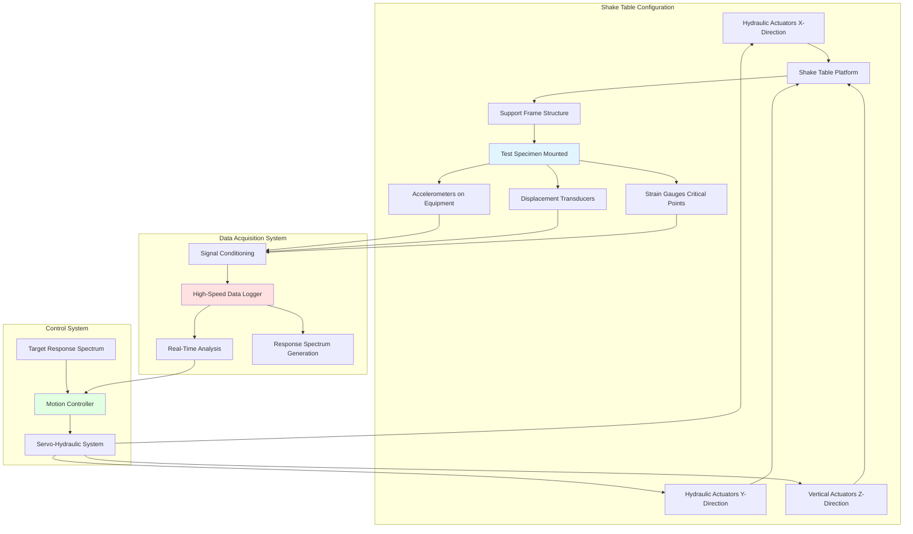
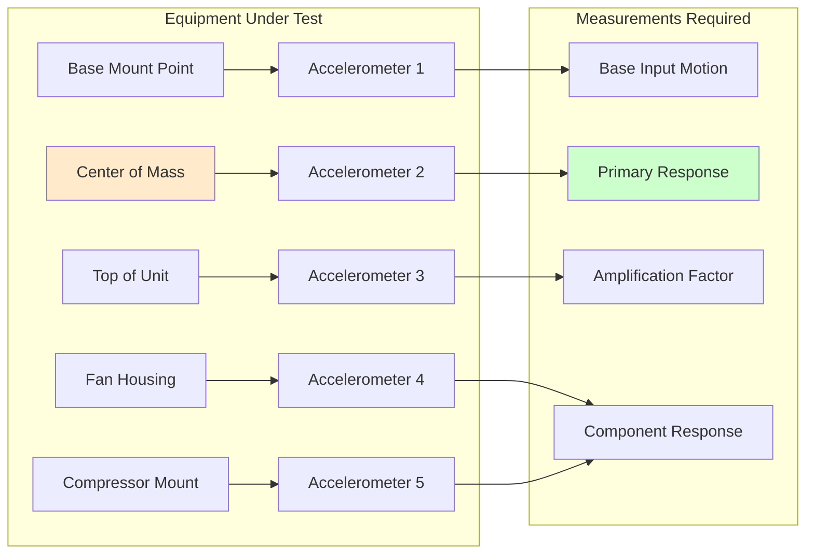

## Overview

Shake table testing provides the most rigorous and realistic method for seismically qualifying HVAC equipment. This dynamic testing method subjects equipment to simulated earthquake motions on a programmable platform, demonstrating performance during and after seismic events.

## Test Standards and Protocols

### AC156 Requirements

ICC-ES Acceptance Criteria 156 establishes shake table testing protocols for nonstructural components. Key requirements include:

- **Biaxial or Triaxial Testing**: Equipment must be tested with simultaneous motion in two or three orthogonal directions
- **Test Specimen Mounting**: Representative of actual installation conditions, including support structure flexibility
- **Input Motion**: Required Response Spectrum (RRS) enveloping the target spectrum across all frequencies
- **Amplification Factors**: Component amplification factors (ap) from 1.0 to 2.5 applied based on mounting height

### IEEE 693 Standard

IEEE 693 applies primarily to electrical substation equipment but provides relevant guidance for HVAC electrical components:

- Performance levels: High, Moderate, and Low qualification
- Time history generation matching target response spectra
- Fragility testing to determine ultimate capacity
- Post-test functional verification requirements

## Required Response Spectrum

The target response spectrum for shake table testing must envelope the design requirements. The 5% damped spectral acceleration is calculated as:

$$S_a(T) = \frac{S_{DS}}{T} \cdot \frac{a_p}{R_p} \cdot \left(1 + 2\frac{z}{h}\right)$$

Where:
- $S_a(T)$ = spectral acceleration at period T (g)
- $S_{DS}$ = design spectral response acceleration at short periods
- $T$ = natural period of component (seconds)
- $a_p$ = component amplification factor (1.0 to 2.5)
- $R_p$ = component response modification factor (typically 2.5 for mechanical equipment)
- $z$ = height of component attachment point above grade
- $h$ = average roof height of structure

The test response spectrum (TRS) must meet:

$$TRS(f) \geq 0.9 \cdot RRS(f) \text{ for all frequencies}$$

$$\frac{1}{n}\sum_{i=1}^{n}\frac{TRS(f_i)}{RRS(f_i)} \geq 1.0$$

Where the average ratio across all frequency points must equal or exceed unity.

## Shake Table Test Setup

## Test Procedures

### Pre-Test Requirements

1. **Functional Testing**: Verify equipment operates correctly before testing
2. **Instrumentation**: Install accelerometers at critical locations (base, center of mass, extremities)
3. **Documentation**: Photograph installation, record equipment condition
4. **Resonant Frequency Search**: Low-level sine sweep to identify natural frequencies

### Test Sequence

**Step 1: Exploratory Tests**

Low-amplitude motion (0.25 × RRS) to verify:
- Data acquisition system functionality
- Absence of installation problems
- Initial resonant frequency confirmation

**Step 2: Simulated Design Basis Earthquake (DBE)**

Full-amplitude test matching required response spectrum:
- Duration: Minimum 20 seconds of strong motion
- Three complete runs in principal directions
- Monitor for functional issues during shaking

**Step 3: Maximum Considered Earthquake (MCE)**

Enhanced testing at 1.5 × DBE level (optional):
- Demonstrates margin of safety
- Identifies ultimate capacity
- Documents failure modes if equipment fails

**Step 4: Post-Test Verification**

- Visual inspection for damage (cracks, loose components, deformation)
- Functional testing to verify operational capability
- Resonant frequency comparison to detect structural changes

## Acceptance Criteria

Equipment passes shake table testing if:

1. **Structural Integrity**: No structural failure, fracture, or detachment of major components
2. **Functional Performance**: Equipment operates within specifications after testing
3. **Anchorage Performance**: Mounting system remains intact and secure
4. **Deformation Limits**: Permanent deformation does not impair function or create safety hazard
5. **Frequency Shift**: Natural frequency change less than 10% indicates no significant damage

Minor cosmetic damage (paint cracking, small dents) is acceptable provided function is maintained.

## Instrumentation Requirements

### Accelerometer Placement

Minimum three triaxial accelerometers required:
- One at mounting interface (input motion)
- One at equipment center of mass (primary response)
- One at highest point (amplification verification)

## Documentation Requirements

### Test Report Contents

1. **Equipment Description**: Model, capacity, dimensions, weight, mounting configuration
2. **Test Setup**: Photographs, drawings, support structure details
3. **Input Motions**: Time histories, response spectra, peak accelerations
4. **Response Data**: Accelerations, displacements, strains at all measurement points
5. **Acceptance Verification**: Comparison to criteria, functional test results
6. **Certification Statement**: Declaration of compliance with applicable standards

### Quality Assurance

- Independent third-party testing laboratory accredited per ISO/IEC 17025
- Calibration certificates for all instrumentation within 1 year
- Witnessing by engineer licensed in jurisdiction of equipment installation
- Video documentation of all test runs

## Cost and Schedule Considerations

Shake table testing represents significant investment:

- **Testing Costs**: $25,000 to $150,000 depending on equipment size and complexity
- **Schedule**: 2 to 6 weeks from equipment delivery to final report
- **Specimen Requirements**: At least one production unit, sometimes two for repeatability

For equipment produced in high volume, shake table certification amortizes cost across many installations in seismic regions.

## Alternatives to Full Shake Table Testing

When shake table testing is impractical:

- **Experience-Based Certification**: Demonstrated seismic performance in past earthquakes
- **Analysis with Limited Testing**: Computer simulation validated by component tests
- **Similarity Certification**: Testing of representative unit extended to similar models

These alternatives require substantial engineering justification and may not be accepted in high-seismicity jurisdictions.

## Conclusion

Shake table testing provides definitive proof of seismic capability but requires substantial investment in specialized facilities, instrumentation, and expertise. Compliance with AC156 and IEEE 693 protocols ensures equipment can withstand design-level earthquakes while maintaining critical function. Proper documentation and third-party certification enable broad acceptance of test results across jurisdictions, making this approach cost-effective for equipment deployed in seismic zones.
