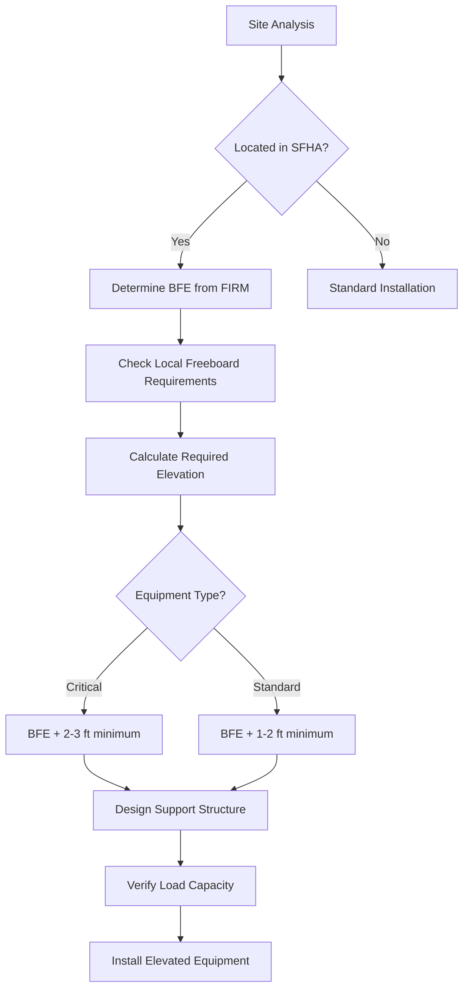
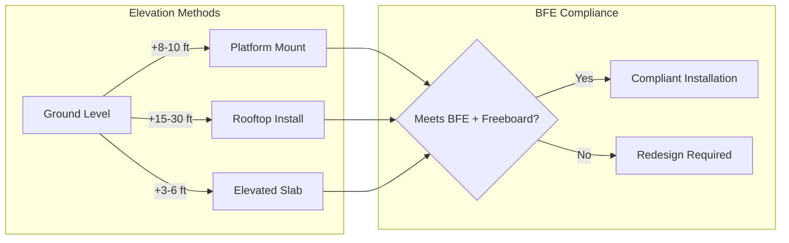
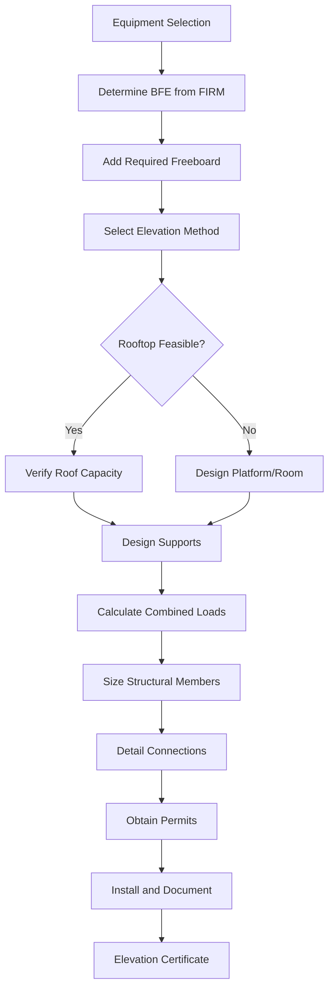

## Base Flood Elevation Fundamentals

Base Flood Elevation (BFE) represents the computed elevation to which floodwater is anticipated to rise during the base flood, defined as a flood having a 1% chance of being equaled or exceeded in any given year (100-year flood). Elevating HVAC equipment above BFE is the primary strategy for protecting mechanical systems in Special Flood Hazard Areas (SFHA).

The BFE is established by FEMA through Flood Insurance Rate Maps (FIRM) and serves as the regulatory benchmark for construction and equipment placement in flood-prone areas. Equipment installed below BFE faces substantial risk of water damage, electrical hazards, and system failure during flood events.

## Freeboard Requirements

Freeboard is the additional height above BFE required by most building codes and insurance programs. This safety margin accounts for:

**Standard Freeboard Provisions:**

- **Minimum freeboard:** Typically 1-2 feet above BFE for residential applications
- **Commercial/critical facilities:** Often require 2-3 feet freeboard
- **Local amendments:** Many jurisdictions mandate freeboard exceeding FEMA minimums
- **Insurance considerations:** Additional freeboard may reduce premium costs

The International Building Code (IBC) and International Residential Code (IRC) incorporate ASCE 24 flood-resistant design requirements, which specify freeboard based on building occupancy classification and local flood risk. Critical facilities including hospitals, fire stations, and emergency operations centers typically require the highest freeboard margins.

## Elevation Strategies

### Rooftop Installation

Placing equipment on building roofs provides inherent elevation above flood levels. This approach requires:

**Structural Considerations:**

- Verify roof load capacity for equipment weight plus maintenance personnel
- Account for snow loads, wind uplift, and seismic forces
- Design curbs or platforms to distribute concentrated loads
- Ensure roof membrane protection beneath equipment supports

**Access Requirements:**

- Permanent ladder or stairway access per OSHA standards
- Fall protection anchors for maintenance activities
- Adequate clearance for equipment removal and replacement
- Service crane access or rigging points

### Platform Mounting

Elevated platforms support equipment above grade while maintaining ground-level installation. Platform design must address:

**Foundation Design:**

- Concrete piers extending below frost depth and scour potential
- Pile foundations in areas with high velocity flow
- Resistance to hydrostatic and hydrodynamic loads
- Breakaway wall provisions below BFE per ASCE 24

**Structural Framework:**

- Steel or treated lumber framing rated for corrosive environments
- Hot-dip galvanized fasteners and connections
- Open grating or mesh decking to minimize flow obstruction
- Tie-down provisions for seismic and wind resistance

### Elevated Equipment Rooms

Purpose-built equipment rooms with elevated floors provide protected enclosures:

- First floor elevation at or above BFE plus freeboard
- Flood vents in foundation walls below elevated floor
- Wet floodproofing for foundation and structural elements
- Utilities entering from above to prevent backflow

## Code Compliance and Documentation

### FEMA Requirements

FEMA mandates specific documentation for elevated equipment in SFHAs:

**Required Documentation:**

- Elevation Certificate completed by licensed surveyor
- Equipment installation height referenced to NAVD88 datum
- Lowest mechanical equipment elevation clearly identified
- Photos documenting as-built conditions
- Design professional certification for platforms and supports

### Local Floodplain Management

Local floodplain administrators enforce regulations that often exceed FEMA minimums:

- Community Rating System (CRS) participation may require additional freeboard
- Coastal High Hazard Areas (V zones) mandate pile/column foundations
- Substantial improvement triggers may require elevation of existing equipment
- Permit requirements for all work within mapped floodplains

## Utility Connections for Elevated Equipment

Electrical, refrigerant, and condensate connections to elevated equipment require special considerations:

**Electrical Service:**

- Weatherhead and service disconnect above BFE plus freeboard
- Flexible conduit connections to accommodate thermal expansion
- GFCI protection for all outdoor receptacles
- Disconnect location accessible during flood conditions

**Refrigerant Lines:**

- Vibration isolation at platform connection points
- UV-resistant insulation on exposed line sets
- Proper pitch for oil return in long vertical runs
- Expansion loops to accommodate building movement

**Condensate Drainage:**

- Gravity drainage terminating above BFE
- Backflow prevention on lines below BFE
- Freeze protection in cold climates
- Air gap separation from storm drainage systems

## Design Load Combinations

Elevated equipment platforms must resist combined environmental loads per ASCE 7:

**Critical Load Cases:**

1. Dead load + flood load + wind load
2. Dead load + flood load + seismic load
3. Dead load + live load + snow load + wind load
4. Dead load + debris impact loads (V zones)

Hydrodynamic loads from flowing water can exceed hydrostatic pressure by factors of 2-3 in high-velocity flood zones. Debris impact forces must be considered in areas with floating debris potential.

## Cost-Benefit Analysis

Elevating equipment above BFE involves significant initial costs but provides long-term benefits:

**Initial Costs:**

- Structural platform: $5,000-$25,000 depending on height and capacity
- Rooftop installation premium: 15-30% over ground mount
- Extended utility runs: $50-$150 per linear foot
- Engineering and surveying: $2,000-$8,000

**Long-Term Benefits:**

- Flood insurance premium reduction: 30-70%
- Avoided equipment replacement costs during flood events
- Reduced business interruption and downtime
- Compliance with financing and insurance requirements

National Flood Insurance Program (NFIP) actuarial data demonstrates that properly elevated equipment significantly reduces claim frequency and severity, making elevation economically justified in most SFHA locations.

## Maintenance Considerations

Elevated equipment presents unique maintenance challenges:

- Safe access provisions per OSHA fall protection standards
- Equipment sizing to permit component replacement through roof hatches
- Rigging and lifting plans for major component removal
- Increased refrigerant line lengths affecting system performance
- Condensate pump reliability becomes critical

Regular inspection of structural supports, corrosion protection, and anchorage systems ensures continued flood resistance and structural integrity throughout the equipment service life.
