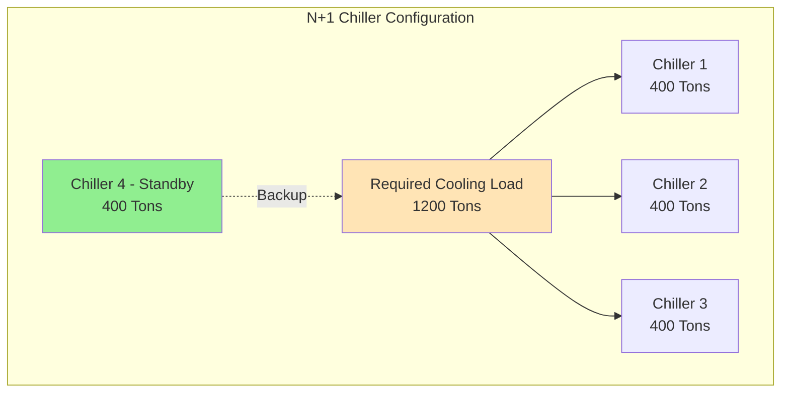
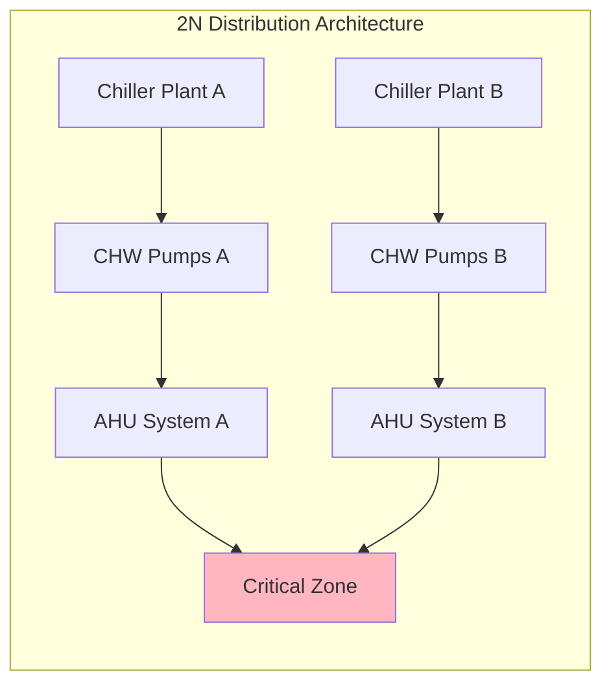
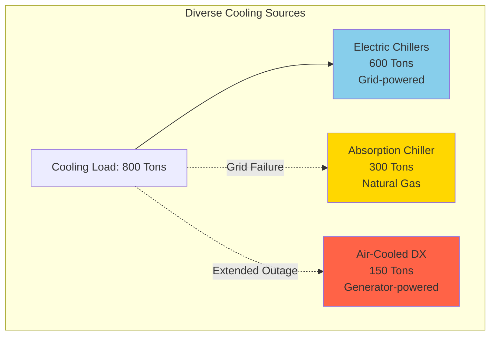

Resilient HVAC design ensures continuous or rapidly restorable climate control in critical facilities during and after disruptive events. This approach integrates redundancy, diversity, hardening, and recovery planning to maintain operations when conventional systems would fail.

## Fundamental Resilience Principles

Resilient design differs from standard reliability engineering by addressing low-probability, high-consequence events including natural disasters, extended utility outages, and cascading infrastructure failures.

**Core resilience strategies:**

- **Redundancy**: Multiple pathways to achieve required performance
- **Diversity**: Different technologies or methods to avoid common-mode failures
- **Hardening**: Physical protection against identified hazards
- **Rapid recovery**: Pre-planned procedures and resources for expedited restoration
- **Passive survivability**: Minimal functionality without active mechanical systems

## Redundancy Configurations

Redundancy provides alternative equipment or pathways when primary systems fail. The level of redundancy matches facility criticality and allowable downtime.

### Standard Redundancy Levels

| Configuration | Description | Availability | Application |
|---------------|-------------|--------------|-------------|
| N | Minimum capacity, no redundancy | 95-98% | Non-critical facilities |
| N+1 | One additional unit beyond minimum | 99-99.5% | Standard data centers, hospitals |
| N+2 | Two additional units beyond minimum | 99.5-99.9% | Tier III data centers, critical research |
| 2N | Fully duplicated systems | 99.95%+ | Tier IV data centers, command centers |
| 2(N+1) | Dual systems each with N+1 | 99.99%+ | Mission-critical national facilities |

### Redundancy Implementation

**N+1 design considerations:**

- Size units for partial load efficiency during normal operation
- Ensure any single unit failure maintains required capacity
- Verify that controls automatically activate standby equipment
- Consider lead-lag rotation to equalize runtime across all units
- Account for degraded capacity at extreme ambient conditions

### Distribution Redundancy

Critical facilities require redundant distribution pathways in addition to equipment redundancy.

**Distribution design principles:**

- Physically separate distribution paths reduce common-mode failure risk
- Install isolation valves to allow maintenance without system shutdown
- Cross-connect systems with normally-closed isolation for emergency backup
- Size each distribution path for full load independent operation

## Diversity Strategies

Diversity employs different technologies or energy sources to prevent simultaneous failure from a single cause.

**Diversity approaches:**

1. **Energy source diversity**: Electric chillers backed by absorption chillers using natural gas or steam
2. **Technology diversity**: Air-cooled equipment supplementing water-cooled systems (eliminates cooling tower dependency)
3. **Location diversity**: Rooftop equipment combined with basement mechanical rooms (flood vs. wind protection)
4. **Control diversity**: Pneumatic or manual backup for digital control systems

### Energy Diversity Example

This configuration maintains cooling capacity through:
- **Normal operation**: Electric chillers on utility power
- **Grid failure**: Natural gas absorption chiller (if gas service maintained)
- **Extended outage**: Air-cooled DX on emergency generator (reduced capacity for critical loads only)

## Backup Power Integration

Emergency power systems must be properly sized and integrated to support HVAC loads based on facility mission requirements.

**Generator sizing considerations:**

- **Critical load identification**: Determine minimum HVAC equipment required for mission continuity
- **Starting current**: Account for motor starting inrush (5-7× running current for large motors)
- **Load sequencing**: Stagger equipment startup to avoid exceeding generator capacity
- **Sustained operation**: Size fuel storage for required runtime (typically 48-96 hours for critical facilities)

**Reduced capacity strategies:**

When generator capacity limits prevent full HVAC operation:

- Operate chillers at reduced capacity using VFD control
- Implement zone prioritization (critical spaces only)
- Increase setpoint temperatures to reduce load
- Utilize free cooling when ambient conditions permit
- Pre-cool thermal mass before anticipated outages

## Equipment Hardening

Physical protection prevents damage from identified hazards specific to facility location.

**Hardening measures by hazard:**

| Hazard | Protection Strategy |
|--------|---------------------|
| Seismic | Base isolation, flexible connections, anchorage per ASCE 7 |
| Wind | Aerodynamic equipment design, enhanced anchoring, impact-resistant enclosures |
| Flood | Elevated installation, waterproof enclosures, backflow preventers |
| Fire | Fire-rated enclosures, separation barriers, early suppression systems |
| Physical security | Fencing, bollards, blast-resistant construction, remote equipment location |

**Elevation strategy for flood protection:**

- Install mechanical equipment above 500-year flood elevation plus 2 ft freeboard
- Locate critical equipment on upper floors or penthouse levels
- Protect below-grade equipment with flood barriers and sump pump systems
- Use marine-grade electrical components in flood-prone areas

## Rapid Recovery Planning

Pre-planning enables faster restoration when systems are damaged or disabled.

**Recovery plan elements:**

1. **Damage assessment protocols**: Checklists for post-event inspection by severity
2. **Repair prioritization**: Critical path analysis identifying equipment dependencies
3. **Spare parts inventory**: Stock critical components with long lead times (compressors, motors, controls)
4. **Vendor agreements**: Pre-negotiated contracts for emergency service and rental equipment
5. **Temporary system procedures**: Instructions for portable cooling/heating deployment
6. **Staff training**: Regular drills on emergency operation and recovery procedures

### Recovery Timeline Framework

```mermaid
gantt
    title HVAC Recovery Timeline
    dateFormat HH:mm
    axisFormat %H:%M

    section Assessment
    Initial safety check: done, assess1, 00:00, 1h
    Detailed equipment inspection: done, assess2, 01:00, 3h

    section Emergency Measures
    Deploy portable cooling: active, temp1, 02:00, 6h
    Establish generator power: active, temp2, 01:00, 4h

    section Repair
    Replace damaged components: repair1, 05:00, 12h
    System testing: repair2, 17:00, 4h

    section Restoration
    Return to normal operation: restore, 21:00, 2h
```

## RELi Certification Framework

The RELi (Resilient Design) rating system provides a structured approach to resilience planning. For HVAC systems, relevant credits include:

**Applicable RELi credits:**

- **Passive Survivability**: Maintain habitable conditions without mechanical systems for defined period
- **Diverse and Redundant Systems**: Document redundancy levels and diversity strategies
- **Enhanced Commissioning**: Verify emergency operation modes and automatic failover
- **Materials Selection**: Specify durable materials for extended service life in harsh conditions
- **Backup Power and Energy Storage**: Size emergency power for defined resilience period

**Passive survivability targets:**

Critical facilities should maintain temperatures between 55-85°F for 7+ days without mechanical cooling or heating through:

- High-performance building envelope (insulation, air sealing, thermal mass)
- Optimized solar orientation and shading
- Natural ventilation pathways with operable windows
- Evaporative cooling where climate permits

## Design Implementation Checklist

- [ ] Conduct hazard assessment for facility location (seismic, wind, flood, extended outages)
- [ ] Define mission-critical spaces and acceptable downtime limits
- [ ] Establish redundancy level (N+1, 2N, etc.) based on criticality
- [ ] Incorporate diversity in energy sources or technologies
- [ ] Size emergency generator for essential HVAC loads with load shedding plan
- [ ] Design equipment hardening appropriate to identified hazards
- [ ] Physically separate redundant systems to prevent common-mode failures
- [ ] Develop rapid recovery procedures with spare parts inventory
- [ ] Commission all emergency operation modes and automatic transfer systems
- [ ] Train facility staff on emergency procedures and manual overrides

## Conclusion

Resilient HVAC design transforms climate control systems from potential single points of failure into robust infrastructure capable of maintaining operations through disruptions. The investment in redundancy, diversity, and hardening is justified by the critical missions these facilities support. Proper implementation requires coordinating mechanical design with architectural protection, electrical backup systems, and operational recovery planning to achieve true resilience.
