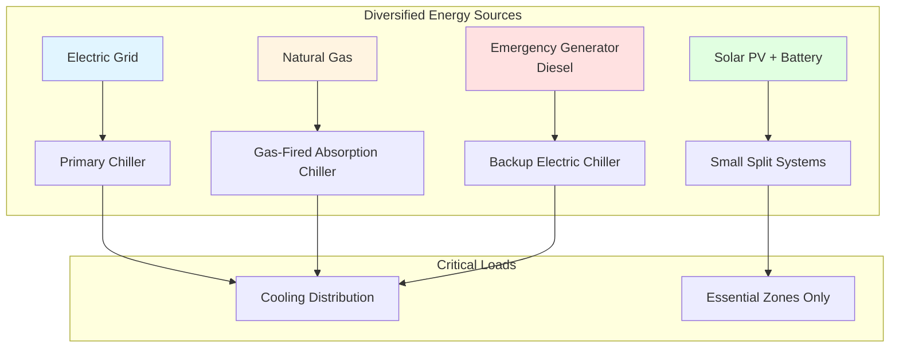
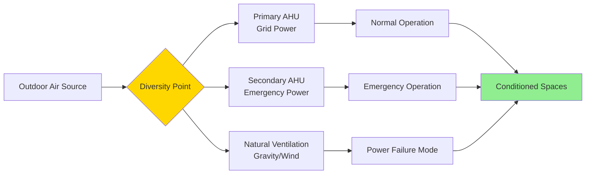
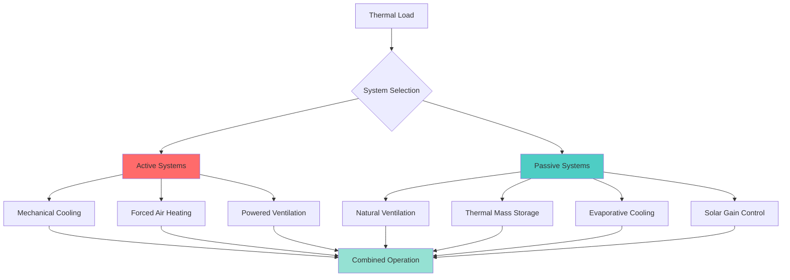

## Overview

Diversity in resilient HVAC design refers to the strategic implementation of multiple energy sources, equipment types, and system configurations to prevent single points of failure. This approach ensures that critical facilities maintain climate control capabilities during infrastructure disruptions, natural disasters, or prolonged utility outages.

The principle of diversity differs from redundancy. While redundancy provides backup capacity using similar equipment, diversity employs fundamentally different technologies or fuel sources to protect against systemic failures affecting a single type of system.

## Fuel Diversity Strategies

### Dual-Fuel Heating Systems

Dual-fuel capability allows heating equipment to operate on two different fuel sources, typically natural gas with fuel oil backup:

**Key Implementation Points:**
- Burner systems capable of automatic fuel switching
- On-site fuel oil storage sized for 48-96 hours of operation
- Separate fuel supply infrastructure with isolation valves
- Control systems that monitor fuel availability and switch automatically
- Regular testing protocols to verify fuel switching functionality

**Capacity Considerations:**
Equipment must maintain design capacity on both fuels. Fuel oil typically provides 138,500 BTU/gallon (HHV), while natural gas delivers approximately 1,030 BTU/ft³. Burner nozzles and combustion air settings require adjustment for the different fuel characteristics.

### Multiple Energy Source Integration

This diversified approach ensures that failure of any single energy source does not eliminate all cooling capacity.

## Technology Diversity Applications

### Heating System Diversification

Combining different heating technologies provides protection against technology-specific failures:

| Primary System | Backup System | Application |
|----------------|---------------|-------------|
| Central hot water boilers | Electric resistance unit heaters | Prevents complete loss during boiler failure |
| Heat pumps | Gas-fired unit heaters | Protects against refrigerant system failures |
| Steam system | Hydronic radiant panels | Maintains heating if steam distribution fails |
| VRF heat pumps | Packaged rooftop units | Provides alternative if VRF controls fail |

### Cooling System Diversification

**Centralized + Decentralized Strategy:**
Large central chillers provide efficient operation under normal conditions, while distributed equipment (split systems, packaged units) maintains essential cooling if the central plant fails due to:
- Chilled water pipe rupture
- Primary pump failure
- Cooling tower damage
- Central control system malfunction

### Ventilation Diversity

**Multi-Path Ventilation Design:**
- Mechanical outdoor air units with motorized dampers
- Natural ventilation provisions (operable windows, relief dampers)
- Dedicated exhaust fans on separate power circuits
- Emergency battery-powered ventilation for critical spaces

## Emergency Power Integration

### Selective Load Connection

Not all HVAC equipment requires emergency power. Prioritize connections based on criticality:

**Tier 1 - Essential (Generator + UPS):**
- Server room precision cooling
- Operating room HVAC
- Pharmacy refrigeration
- Critical exhaust systems

**Tier 2 - Important (Generator Only):**
- Primary air handling units
- Chilled water pumps for essential areas
- Heating hot water circulation
- Control systems and building automation

**Tier 3 - Deferrable (Normal Power):**
- Comfort cooling for administrative areas
- Non-critical ventilation
- Energy recovery equipment
- Optimization controls

### Generator Sizing Considerations

Generator capacity must account for HVAC motor starting currents. Use soft-starters or variable frequency drives to reduce inrush current by 65-75%, allowing smaller generator sizing.

**Load Sequencing:**
Implement automatic load sequencing to prevent generator overload:
1. Start critical exhaust fans (0-10 seconds)
2. Energize control systems and sensors (10-30 seconds)
3. Start primary pumps (30-60 seconds)
4. Start chillers or air handlers (60-120 seconds)
5. Add comfort HVAC as capacity permits (120+ seconds)

## Geographic Distribution

For multi-building campuses, distribute HVAC equipment geographically to prevent single-event catastrophic loss:

- Central plants in separate buildings with different flood elevations
- Rooftop equipment on different structures
- Emergency generators at opposite ends of campus
- Fuel storage in diverse locations above flood levels

## Control System Diversity

**Layered Control Architecture:**
- Primary BAS with cloud connectivity for remote monitoring
- Standalone programmable controllers for critical equipment
- Hardwired safety controls independent of network
- Manual override capabilities for essential functions

This layered approach ensures that network failures, cyber attacks, or software glitches do not eliminate all control capability.

## Manufacturer and Equipment Type Diversity

### Risk Mitigation Through Varied Sources

Using equipment from multiple manufacturers protects against:
- Product-specific design flaws affecting entire equipment classes
- Supply chain disruptions for replacement parts
- Single-vendor dependency during service requirements
- Firmware vulnerabilities in identical control systems

**Implementation Example:**
For a hospital with four chillers, specify two from Manufacturer A and two from Manufacturer B. This ensures that a product recall or widespread failure mode affecting one brand does not eliminate all cooling capacity.

### Passive and Active System Combination

Passive systems require no energy input and continue functioning during complete power loss. Examples include:
- Stack effect ventilation through vertical shafts
- Wind-driven natural ventilation
- Thermal chimneys for hot air exhaust
- Night sky radiative cooling
- Earth-coupled thermal storage

## Design Standards and Guidelines

**ASHRAE Guideline 29-2021** provides methodology for evaluating HVAC system resilience, including diversity assessment criteria.

**FEMA P-1019** outlines emergency power system requirements for critical facilities, including fuel diversity provisions.

**UFC 3-600-01** (DoD facilities) mandates minimum diversity requirements for mission-critical military installations.

**NFPA 110** establishes standards for emergency power systems, including fuel storage and automatic transfer requirements.

## Economic Justification

Diversity increases first cost by 15-35% compared to single-source designs. Justification methods:

- **Risk Analysis:** Calculate probability of extended outages × cost of operational disruption
- **Life-Cycle Cost:** Include avoided losses from maintained operations
- **Insurance Premium Reduction:** Many carriers offer 5-15% discounts for fuel-diverse systems
- **Regulatory Compliance:** Healthcare, data centers, and emergency services often require diversity

## Implementation Checklist

**Planning Phase:**
- [ ] Identify critical functions requiring continuous operation
- [ ] Assess local utility reliability and fuel availability
- [ ] Evaluate site-specific hazards (flood zones, seismic activity)
- [ ] Determine acceptable downtime for each space type

**Design Phase:**
- [ ] Select complementary technologies with different failure modes
- [ ] Size on-site fuel storage for design storm duration
- [ ] Design automatic switchover controls with manual override
- [ ] Coordinate electrical distribution with diverse power sources
- [ ] Specify equipment from multiple manufacturers for redundant systems

**Commissioning Phase:**
- [ ] Test fuel switching under load conditions
- [ ] Verify automatic transfer sequences
- [ ] Confirm capacity on all fuel sources
- [ ] Document operating procedures for emergency scenarios

**Operations Phase:**
- [ ] Exercise alternate systems quarterly
- [ ] Maintain fuel quality in storage tanks
- [ ] Train operators on manual switchover procedures
- [ ] Update emergency response plans annually

---

**Related Topics:**
- [Redundancy Strategies](../redundancy/)
- [Emergency Power Systems](../emergency-power/)
- [Flood-Resistant Equipment](../../flood-resistant-equipment/)
- [Seismic Design Criteria](../../seismic-design-criteria/)
