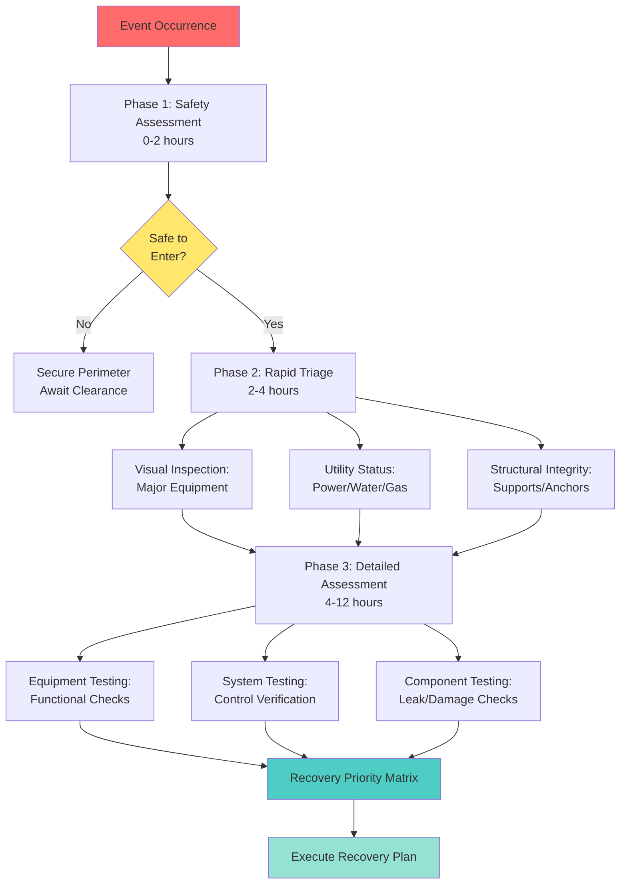
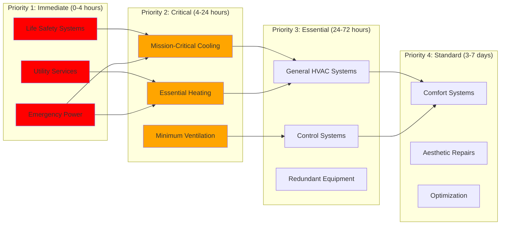

# Rapid Recovery Strategies for HVAC Systems

Rapid recovery planning enables expedited restoration of HVAC systems following disruptive events through pre-positioned resources, standardized procedures, and engineered quick-deployment solutions. Recovery time objectives (RTO) drive design decisions that balance capital investment against downtime risk for mission-critical facilities.

## Recovery Time Objectives

RTO defines the maximum acceptable duration between system failure and restoration of minimum required functionality. Establishing RTOs requires coordinating facility mission requirements with technical recovery capabilities and available resources.

### RTO Classification Framework

| RTO Category | Target Duration | Application | Design Strategy |
|--------------|----------------|-------------|-----------------|
| Immediate | 0-4 hours | Data centers, hospitals (critical zones) | Full redundancy (2N), instant failover |
| Rapid | 4-24 hours | Emergency operations centers, manufacturing | N+1 redundancy, pre-staged spares |
| Accelerated | 24-72 hours | Commercial high-rise, research facilities | Quick-connect provisions, vendor agreements |
| Standard | 72 hours-1 week | Office buildings, retail | Standard repair procedures, rental equipment |
| Extended | 1-4 weeks | Non-critical facilities | Conventional procurement and repair |

**RTO determination factors:**

- **Mission criticality**: Revenue loss, safety impact, regulatory requirements
- **Occupant vulnerability**: Healthcare patients, temperature-sensitive processes
- **Seasonal considerations**: Winter heating failure vs. summer cooling in moderate climates
- **Alternative facilities**: Ability to relocate operations during recovery
- **Insurance requirements**: Business interruption coverage stipulations

## Damage Assessment Protocols

Systematic post-event assessment identifies damaged components and prioritizes recovery actions. Pre-developed checklists accelerate the assessment process and ensure critical systems receive immediate attention.

### Tiered Assessment Procedure



**Phase 1: Safety assessment (0-2 hours)**

- Verify structural stability of equipment rooms and mechanical spaces
- Check for gas leaks, electrical hazards, or water main breaks
- Inspect refrigerant systems for catastrophic leaks
- Confirm safe working conditions before entering mechanical spaces
- Establish security perimeter around damaged areas

**Phase 2: Rapid triage (2-4 hours)**

Systematic walkthrough prioritizing life-safety and mission-critical systems:

- **Smoke control systems**: Verify fan operation, damper functionality, control response
- **Emergency generators**: Check fuel supply, cooling systems, exhaust pathways
- **Critical cooling**: Data center CRAC/CRAH units, medical equipment cooling
- **Backup heating**: Redundant boilers, emergency heat sources for cold climates
- **Fire protection**: HVAC fire dampers, smoke detectors, integration with fire alarm

**Phase 3: Detailed assessment (4-12 hours)**

Component-level inspection documenting specific damage:

- **Mechanical equipment**: Alignment shifts, broken mounts, internal damage, bearing failures
- **Distribution systems**: Duct separation, pipe ruptures, hanger failures, insulation damage
- **Controls**: BAS network connectivity, sensor displacement, actuator binding
- **Electrical**: Motor winding integrity, VFD functionality, circuit breaker status
- **Refrigeration**: Compressor condition, refrigerant charge, oil contamination

### Assessment Documentation

Pre-printed field inspection forms accelerate data collection and ensure consistency:

**Equipment inspection checklist items:**

- Equipment tag number and location
- Visual damage description with photographs
- Operational status (functional/degraded/failed)
- Safety concerns or hazards present
- Estimated repair time and parts required
- Priority ranking (critical/high/medium/low)

## Recovery Priority Matrix

The priority matrix sequences repair activities based on system criticality and interdependencies. This structured approach prevents wasted effort on systems that cannot function due to upstream failures.

### Priority Ranking System



**Dependency analysis** identifies prerequisite repairs:

- Chilled water system cannot operate until electrical service and control network restored
- Air handlers require both power and chilled/hot water availability
- DDC controls depend on network infrastructure and power
- Cooling towers need water supply, power, and basin integrity

## Modular Design Principles

Modular HVAC design facilitates rapid component replacement by standardizing interfaces and minimizing field fabrication. This approach reduces recovery time from days to hours for critical equipment.

### Standardization Strategies

**Equipment modularity:**

- **Skid-mounted assemblies**: Pre-piped pump sets, chiller modules with integral starters
- **Factory-fabricated assemblies**: Packaged air handlers with pre-wired controls
- **Standardized capacities**: Multiple identical units rather than single custom equipment
- **Common components**: Motors, actuators, valves from single manufacturer line
- **Pre-tested modules**: Factory run-testing eliminates field commissioning time

**Interface standardization:**

- **Piping connections**: Flanged or grooved connections at equipment, standard spacing
- **Electrical**: Plug-and-play connections, standard cable lengths, labeled circuits
- **Controls**: Wireless BAS nodes, plug-in controller modules, standardized I/O mapping
- **Structural**: Pre-designed mounting frames, standard anchor bolt patterns
- **Clearances**: Consistent service access dimensions for replacement equipment

### Plug-and-Play Equipment Rooms

```mermaid
graph TB
    subgraph "Modular Mechanical Room Design"

        subgraph "Utility Stub-Outs"
            CHW[Chilled Water<br/>Flanged Connections<br/>6" 150# RF]
            HW[Hot Water<br/>Grooved Connections<br/>4" Schedule 40]
            ELEC[Electrical<br/>200A Disconnect<br/>480V 3-Phase]
            CTRL[Controls<br/>BACnet MS/TP<br/>Stub Panel]
        end

        subgraph "Standardized Equipment Pad"
            PAD[Concrete Pad<br/>Standard Anchor Pattern<br/>Vibration Isolation Inserts]
        end

        subgraph "Quick-Connect Equipment"
            AHU[Air Handler Module<br/>Pre-piped/Pre-wired<br/>Factory Tested]
        end

        CHW --> AHU
        HW --> AHU
        ELEC --> AHU
        CTRL --> AHU
        PAD --> AHU

    end

    style AHU fill:#90EE90
    style PAD fill:#D3D3D3
```

**Design requirements for modular rooms:**

- Equipment access doors sized for largest module (minimum 6 ft × 7 ft)
- Floor loading capacity for heaviest anticipated replacement (150% of installed equipment)
- Rigging points and clear vertical path for crane/hoist operations
- Utility stub-outs extend 3 ft beyond equipment footprint with capped connections
- Electrical disconnects accessible independent of equipment position
- Control network home-runs terminate in accessible junction boxes

## Quick-Connect Systems

Quick-connect technologies eliminate time-consuming field fabrication and specialized labor requirements during emergency restoration.

### Piping Quick-Connect Methods

**Grooved mechanical couplings:**

- Installation time: 5-10 minutes per joint (vs. 30-45 minutes for welding)
- Allows ±0.5° angular deflection accommodating minor misalignment
- Visual inspection confirms proper installation (no NDT required)
- Disassembly for maintenance without pipe cutting
- Pressure rating up to 300 PSI for HVAC applications

**Flanged connections:**

- Pre-drilled bolt holes ensure alignment repeatability
- Gasket material selection based on fluid type and temperature
- Standard bolt torque specifications (ASME B16.5)
- Suitable for large diameter mains (6" and larger)
- Facilitates equipment removal without system modifications

**Push-to-connect fittings:**

- Tool-free installation for copper and PEX tubing (up to 1" typical)
- Immediate pressure testing capability (no cure time)
- Applications: Instrument lines, small heating loops, domestic water
- Limitations: Maximum temperature 200°F, not for refrigeration

### Electrical Quick-Connect

**Plug-and-receptacle connections:**

- Pin-and-sleeve connectors rated for HVAC motor loads (up to 100A)
- Weatherproof and explosion-proof configurations available
- Prevents reverse-phasing through mechanical keying
- Lockout/tagout capability integral to connector design
- Color-coded voltage identification (IEC 60309 standard)

**Pre-fabricated cable assemblies:**

- Factory-installed terminations eliminate field wiring errors
- Labeled conductors match equipment connection diagrams
- Length standardization allows spare inventory
- Molded boots provide strain relief and environmental protection

### Control System Quick-Connect

**Wireless BAS integration:**

- Eliminates physical network cabling for standalone equipment
- Mesh network topology provides redundant communication paths
- Battery backup maintains communication during power interruptions
- Sensor replacement without rewiring (self-identifying nodes)
- Commissioning through smartphone application interface

**Plug-in controller modules:**

- Standardized I/O configurations (8 input/4 output typical)
- Pre-programmed control sequences uploaded from template library
- Hot-swappable replacement without system shutdown
- Automatic configuration download from network on installation
- LED diagnostics indicate operational status without specialized tools

## Emergency Equipment Staging

Pre-positioned emergency equipment and rental contracts enable immediate deployment when permanent systems are inoperable. Strategic staging locations balance access speed against equipment protection.

### Critical Spare Parts Inventory

**High-value, long-lead components:**

- Chiller compressors and control boards (8-16 week lead time typical)
- Large motor assemblies (25 HP and larger, 4-8 week lead time)
- Specialized pumps (non-standard sizes, 6-12 week lead time)
- DDC controllers and I/O modules (4-8 week lead time, supply chain dependent)
- Refrigerant in system charge quantity (regulatory procurement delays)

**Inventory management strategies:**

- Rotate stocked motors through scheduled equipment replacements
- Vendor-managed inventory agreements for controllers (just-in-time delivery)
- Compressor insurance programs (manufacturer-supplied emergency replacement)
- Multi-facility inventory sharing for large portfolios
- Climate-controlled storage prevents deterioration (motors, electronics)

### Portable/Rental Equipment Provisions

Pre-engineered connection points allow rapid temporary system deployment:

**Temporary chiller connections:**

- Exterior wall penetrations with removable covers (flanged inserts)
- Grooved connections sized for standard rental unit capacities (100-500 ton typical)
- Isolation valves and drains for connection without system shutdown
- Electrical receptacles or cable landing provisions (480V, 200-600A)
- Concrete pads or reinforced areas for equipment placement

**Portable heating provisions:**

- Duct collars for temporary heating unit connections (24" diameter typical)
- Outdoor air intake and exhaust penetrations with dampered caps
- Fuel supply quick-connects (natural gas or propane)
- Power distribution panels with spare breaker capacity
- Thermostat override provisions for temporary control

**Generator connection provisions:**

- Cam-lock receptacles or manual transfer switches sized for emergency loads
- Load calculation documentation identifying priority circuits
- Sequencing procedures preventing generator overload on startup
- Fuel type compatibility verification (diesel vs. natural gas)
- Sound attenuation requirements and neighbor notification protocols

## Business Continuity Planning for MEP

HVAC recovery integrates into facility-wide business continuity management systems (BCMS) per ISO 22301. MEP-specific planning addresses technical dependencies and resource requirements.

### Recovery Procedure Documentation

Standard operating procedures (SOPs) provide step-by-step instructions executable by available personnel during emergency conditions when specialized staff may be unavailable.

**SOP essential elements:**

1. **Activation criteria**: Specific conditions triggering procedure implementation
2. **Safety precautions**: PPE requirements, lockout/tagout, confined space protocols
3. **Required tools and materials**: Complete inventory with storage locations
4. **Step-by-step instructions**: Numbered tasks with decision points clearly marked
5. **Verification tests**: Functional checks confirming successful completion
6. **Troubleshooting guide**: Common problems and solutions
7. **Escalation contacts**: 24/7 emergency contact information for technical support

**Example: Emergency Chiller Replacement SOP**

```mermaid
gantt
    title Emergency Chiller Replacement Timeline
    dateFormat HH:mm
    axisFormat %H:%M

    section Preparation
    Mobilize response team: done, prep1, 00:00, 1h
    Isolate failed chiller: done, prep2, 01:00, 2h
    Position rental unit: done, prep3, 02:00, 3h

    section Connection
    Connect chilled water piping: active, conn1, 05:00, 4h
    Connect electrical service: active, conn2, 06:00, 3h
    Connect controls (temp): active, conn3, 08:00, 2h

    section Commissioning
    Fill and purge system: comm1, 10:00, 2h
    Functional testing: comm2, 12:00, 3h
    Load transfer: comm3, 15:00, 1h

    section Operation
    Monitor performance: oper1, 16:00, 8h
    Optimize setpoints: oper2, 20:00, 4h
```



**Timeline assumptions:**

- Pre-engineered connection points available
- Rental equipment on-site within 3 hours of event
- Two-person crew with basic mechanical skills
- Chilled water system pre-isolated (valves functional)
- Temporary controls adequate (permanent BAS integration deferred)

### Staff Training and Drills

Recovery plan effectiveness depends on personnel familiarity with emergency procedures. Regular training and drills identify procedure gaps and build staff confidence.

**Training program components:**

- **Annual classroom training**: Review recovery procedures, equipment locations, contact lists
- **Hands-on component training**: Practice quick-connect installations on non-critical systems
- **Tabletop exercises**: Walk through scenarios identifying decision points and resource needs
- **Full-scale drills**: Execute complete recovery procedure under simulated emergency conditions
- **After-action reviews**: Document lessons learned and update procedures

**Drill scenarios by facility type:**

- **Hospitals**: Chiller failure during heat wave, backup on emergency power
- **Data centers**: CRAH unit failure, deploy portable cooling within 2-hour RTO
- **Laboratories**: Exhaust fan failure with chemical fume hazard, temporary ventilation
- **Manufacturing**: Process cooling loss, rental chiller deployment and integration

### Vendor and Contractor Agreements

Pre-negotiated emergency service agreements eliminate procurement delays during crisis response. Contracts specify response times, labor rates, and equipment availability.

**Agreement essential terms:**

- **Guaranteed response time**: 2-4 hour mobilization typical for emergency contracts
- **Priority service level**: Customer rank for resource allocation during widespread events
- **Pre-approved labor rates**: Overtime and emergency multipliers established (typically 1.5-2.0×)
- **Equipment availability**: Dedicated or priority access to rental inventory
- **Technical support**: 24/7 phone consultation included in retainer fee
- **Annual retainer**: Fixed cost for maintaining agreement (typical 5-10% of estimated annual emergency spend)

**Vendor categories:**

- **Service contractors**: Emergency repair for primary equipment (chillers, boilers, controls)
- **Rental suppliers**: Temporary HVAC equipment (chillers, boilers, air handlers, generators)
- **Parts distributors**: Expedited delivery of replacement components
- **Engineering consultants**: Emergency design services for temporary systems
- **Commissioning agents**: Rapid testing and verification of restored systems

## Performance Metrics and Testing

Recovery capability requires validation through metrics tracking and periodic testing. These measurements identify degradation in recovery readiness before actual emergencies occur.

### Key Performance Indicators

| Metric | Target | Measurement Method |
|--------|--------|-------------------|
| Mean time to assess (MTTA) | < 4 hours | Timed drills, incident logs |
| Mean time to restore (MTTR) critical systems | < 24 hours | Actual event tracking, simulations |
| Spare parts availability | 95%+ | Inventory audits quarterly |
| Staff training completion | 100% annually | Training records database |
| Vendor contract currency | 100% active | Contract management system |
| Emergency procedure updates | Within 30 days of system changes | Document control audit |
| Quick-connect functionality | 100% operational | Annual physical testing |

**Annual recovery capability assessment:**

- Physical verification of emergency connection points (not obstructed, hardware present)
- Spare parts inventory audit (confirm stock levels, check expiration dates)
- Vendor contact list validation (phone numbers current, 24/7 access confirmed)
- Equipment access pathway verification (doors unlocked, rigging points accessible)
- Emergency power testing (generator load bank test including HVAC loads)

## Conclusion

Rapid recovery strategies transform HVAC system resilience from passive redundancy to active restoration capability. The combination of modular design, quick-connect provisions, pre-positioned resources, and documented procedures reduces recovery time objectives from weeks to hours for mission-critical facilities.

Effective implementation requires upfront investment in standardized interfaces, emergency equipment provisions, and vendor agreements—costs justified by avoided downtime in critical facilities where hours of HVAC failure generate millions in losses or compromise life safety. Regular testing and staff training ensure recovery capabilities remain operational when needed, preventing plan obsolescence that renders theoretical recovery timeframes unachievable in actual emergencies.
