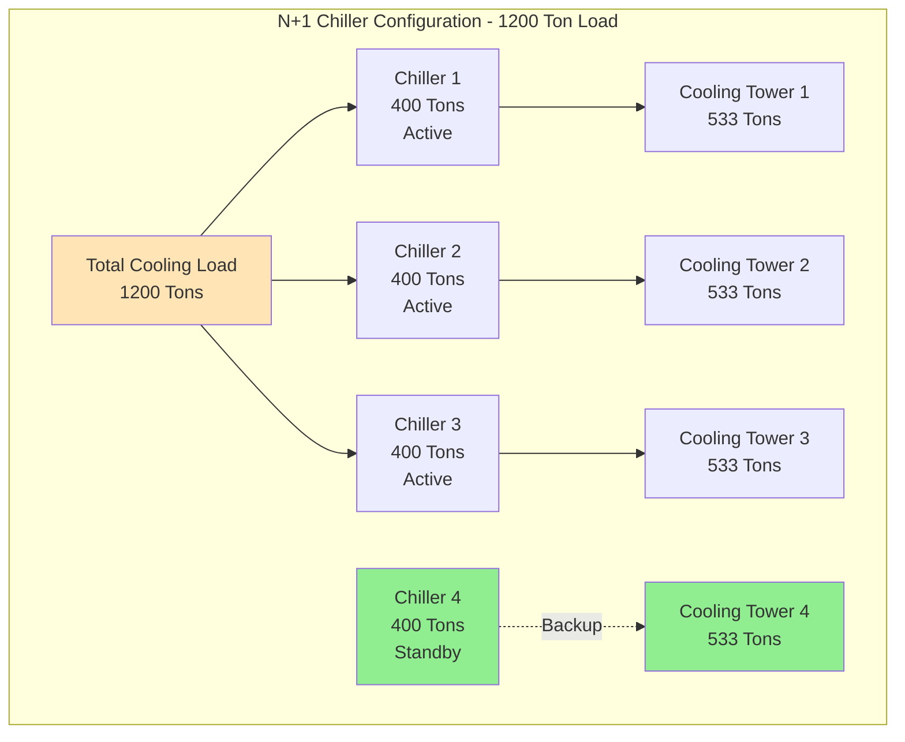
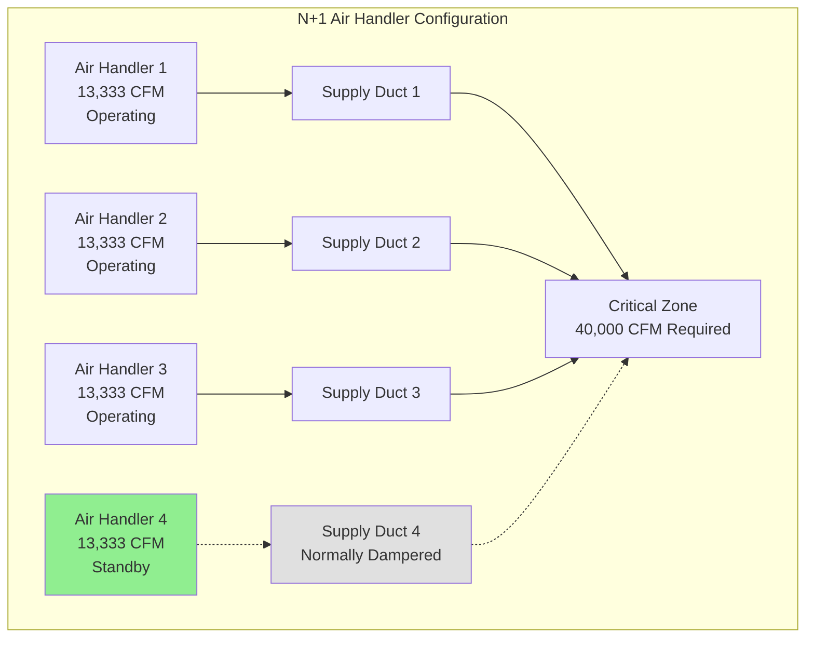
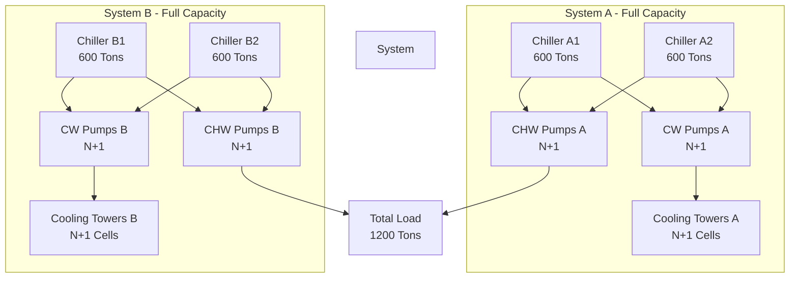
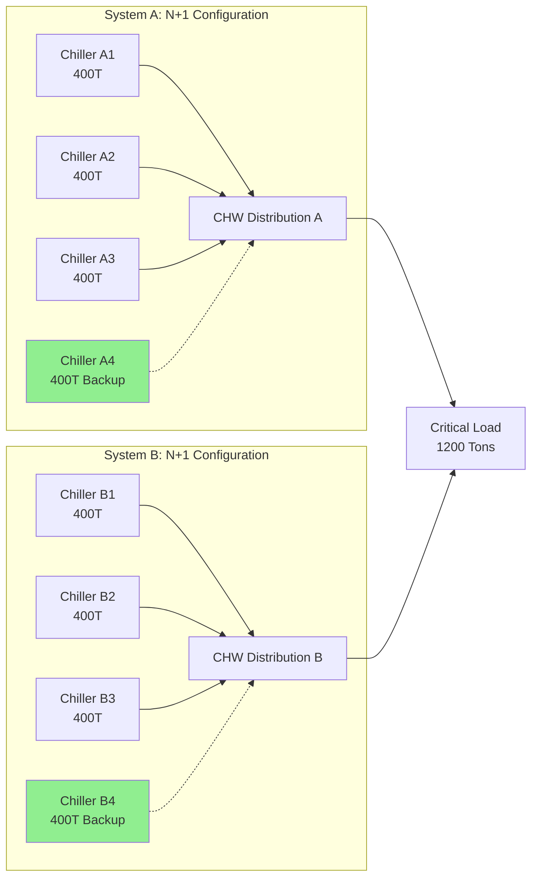
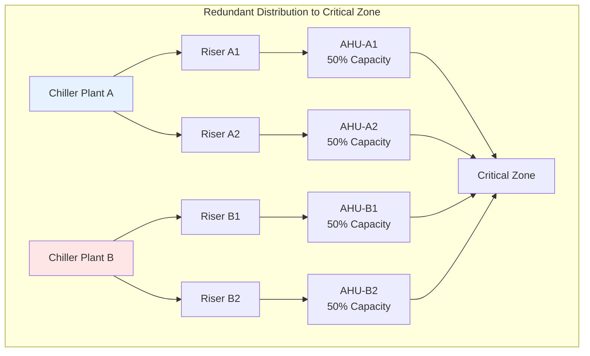

Redundancy provides multiple parallel pathways or equipment to maintain HVAC system operation when individual components fail. The redundancy level determines system availability and directly correlates with facility uptime requirements. This approach is fundamental to critical facilities including data centers, hospitals, emergency operations centers, and telecommunications hubs.

## Redundancy Level Selection

The appropriate redundancy configuration depends on facility criticality, downtime cost, and availability targets. Each level represents a distinct architecture with specific availability characteristics.

### Redundancy Configuration Comparison

| Configuration | Capacity Provision | Typical Availability | Concurrent Maintainability | Application Examples |
|---------------|-------------------|---------------------|---------------------------|---------------------|
| N | Minimum required | 95-98% | No | Office buildings, retail |
| N+1 | N + 1 backup unit | 99.0-99.5% | Limited | Standard hospitals, Tier II data centers |
| N+2 | N + 2 backup units | 99.5-99.9% | Partial | Research facilities, Tier III data centers |
| 2N | Fully duplicated | 99.95-99.99% | Yes | Tier IV data centers, financial trading |
| 2(N+1) | Dual N+1 systems | 99.99%+ | Yes | Mission-critical government, command centers |

**Availability calculation:**

Redundant system availability exceeds individual component availability through parallel configuration:

**Series components:** A_total = A₁ × A₂ × A₃

**Parallel components:** A_total = 1 - [(1 - A₁) × (1 - A₂)]

For N+1 with 95% component reliability:
- Single component: 95% availability
- N+1 configuration: 99.75% availability
- Three parallel components: 99.99% availability

## N+1 Redundancy Configuration

N+1 provides one additional unit beyond the minimum required to serve the load. This represents the most common redundancy approach for critical facilities balancing cost and reliability.

### N+1 Chiller Plant Architecture

**N+1 sizing methodology:**

1. **Determine design load:** 1200 tons peak cooling demand
2. **Select unit quantity:** N = 3 units for load distribution
3. **Calculate unit capacity:** 1200 tons ÷ 3 = 400 tons per unit
4. **Add redundant unit:** +1 unit at 400 tons
5. **Total installed capacity:** 4 × 400 = 1600 tons (133% of load)

**Supporting equipment redundancy:**

All components in the refrigeration circuit require N+1 configuration to eliminate single points of failure:

- **Condenser water pumps:** N+1 pumps sized for individual chiller flow
- **Chilled water pumps:** N+1 primary pumps or variable-speed headered configuration
- **Cooling towers:** N+1 cells with isolation valves for maintenance
- **VFDs:** Bypass contactors or redundant VFD with transfer switch

### N+1 Air-Side Equipment

**Air-side considerations:**

- **Duct isolation:** Motorized dampers close failed unit discharge to prevent backflow
- **Filter redundancy:** Dual filter banks allow change-out under operation
- **Fan arrays:** Multiple smaller fans provide better redundancy than single large fans
- **Control redundancy:** Standalone controllers for each unit prevent common-mode control failures

## 2N Redundancy Configuration

2N architecture provides fully duplicated independent systems, each capable of supporting the entire facility load. This configuration allows concurrent maintenance of one complete system while the other maintains full capacity.

### 2N Chiller Plant with Separate Distribution

**2N design requirements:**

- Each system independently sized for 100% of facility load
- Physically separate equipment locations reduce common-mode failure risk
- Separate electrical services from different utility feeds or generator buses
- Independent control systems with no shared components
- Cross-connection valves normally closed, used only for emergency backup

**Distribution pathway separation:**

Physical and electrical isolation between redundant systems:

- **Vertical separation:** System A in basement, System B on roof
- **Horizontal separation:** Systems in opposite wings with fire-rated separation
- **Utility separation:** Different electrical switchgear, separate water services
- **Control separation:** Independent BAS networks, separate head-end systems

## 2N+1 Redundancy Configuration

2N+1 represents the highest standard redundancy level, combining dual complete systems with additional backup capacity in each system. This configuration supports concurrent maintenance, single fault tolerance, and redundant system failures.

### 2N+1 Architecture for Tier IV Data Centers

**2N+1 fault tolerance:**

This configuration maintains full capacity through:

1. **Planned maintenance:** Entire System A offline, System B operates at N capacity (3 of 4 chillers)
2. **Component failure during maintenance:** System A offline, System B operates with one failed unit using remaining N+1 (2 of 4 chillers at 67% capacity)
3. **Multiple simultaneous failures:** Both systems partially degraded but combined capacity exceeds load

**Uptime Institute Tier IV requirements:**

2N+1 redundancy is mandatory for Tier IV data center certification:

- 99.995% availability target (26.3 minutes downtime annually)
- Fault tolerance to any single failure without impact
- Concurrent maintainability of all systems
- Compartmentalization with fire-rated separation
- Dual utility services from separate substations

## Single Point of Failure Elimination

Comprehensive redundancy requires identifying and eliminating all single points of failure throughout the HVAC system and supporting infrastructure.

### Common Single Point of Failure Analysis

| System Component | Single Point of Failure | Redundancy Solution |
|------------------|------------------------|---------------------|
| Chilled water supply | Single chiller plant | 2N chiller systems, separate locations |
| Electrical service | Single utility feed | Dual utility services, on-site generation |
| Cooling towers | Shared basin | Separate basins per cell, cross-connections |
| Control system | Single BAS head-end | Redundant controllers, standalone unit controls |
| Chilled water piping | Single supply main | Looped distribution, isolation valves |
| Fuel supply | Single fuel tank | Dual tanks, separate fill connections |
| Water supply | Single utility connection | On-site storage tank, secondary utility feed |

### Distribution Redundancy

**Distribution design principles:**

- **Loop configuration:** Supply and return mains form continuous loops with multiple feed points
- **Isolation capability:** Motorized valves isolate failed sections automatically
- **Pressure independence:** Pressure-independent control valves maintain flow during system reconfiguration
- **Velocity limits:** Size piping to prevent erosion and noise during partial system operation

## Control System Redundancy

Control failures represent a leading cause of HVAC system downtime. Redundant control architecture maintains operation during controller, network, or software failures.

### Redundant Control Architecture

**Controller redundancy levels:**

1. **Level 1 - Standalone controllers:** Each equipment unit operates independently if BAS network fails
2. **Level 2 - Redundant network:** Dual communication networks with automatic switchover
3. **Level 3 - Redundant head-end:** Dual BAS servers with synchronized databases
4. **Level 4 - Hardwired safeties:** Critical interlocks use hardwired relays independent of digital controls

**Control failure modes:**

- **Network failure:** Units continue operation at last commanded setpoints
- **Controller failure:** Redundant controller assumes control via heartbeat monitoring
- **Sensor failure:** System uses alternate sensors or calculated values
- **Software failure:** Manual override allows local operation

## Critical Facility Standards

### ASHRAE Technical Committee 9.9

TC 9.9 establishes design standards for mission-critical facilities including data centers and healthcare:

**Key recommendations:**

- Define facility tier level before design (Tier I through IV)
- Match HVAC redundancy to tier requirements
- Provide independent systems for different functional zones
- Test all failure modes and automatic transfer systems
- Document all single points of failure with mitigation strategies

### Data Center Tier Classifications

**Tier I - Basic Capacity:**
- N configuration
- Single distribution path
- 99.671% availability
- 28.8 hours annual downtime

**Tier II - Redundant Components:**
- N+1 configuration
- Single distribution path
- 99.741% availability
- 22.0 hours annual downtime

**Tier III - Concurrently Maintainable:**
- N+1 configuration
- Multiple distribution paths
- 99.982% availability
- 1.6 hours annual downtime

**Tier IV - Fault Tolerant:**
- 2N or 2(N+1) configuration
- Multiple independent distribution paths
- 99.995% availability
- 0.4 hours annual downtime

## Redundancy Implementation Checklist

- [ ] Define facility availability target and corresponding tier level
- [ ] Calculate required redundancy level from availability and downtime cost analysis
- [ ] Size all equipment for selected configuration (N+1, 2N, or 2N+1)
- [ ] Identify and eliminate all single points of failure in design
- [ ] Physically separate redundant systems to prevent common-mode failures
- [ ] Provide dual utility services or on-site generation for electrical redundancy
- [ ] Design automatic failover controls with manual override capability
- [ ] Install isolation valves to allow maintenance without system shutdown
- [ ] Implement equipment rotation schedules to equalize runtime and wear
- [ ] Commission all failure modes including loss of individual components and entire systems
- [ ] Document recovery procedures for all credible failure scenarios
- [ ] Train operations staff on redundancy operation and failure response

## Conclusion

Proper redundancy implementation transforms HVAC systems from potential vulnerability into reliable infrastructure supporting critical operations. The redundancy level selection requires balancing initial cost against downtime risk and facility mission requirements. N+1 configuration suits most critical facilities, while 2N and 2N+1 architectures serve the highest-criticality applications. Successful implementation demands attention to eliminating single points of failure throughout all system components, comprehensive testing of failure modes, and trained operators capable of managing degraded operation scenarios.
