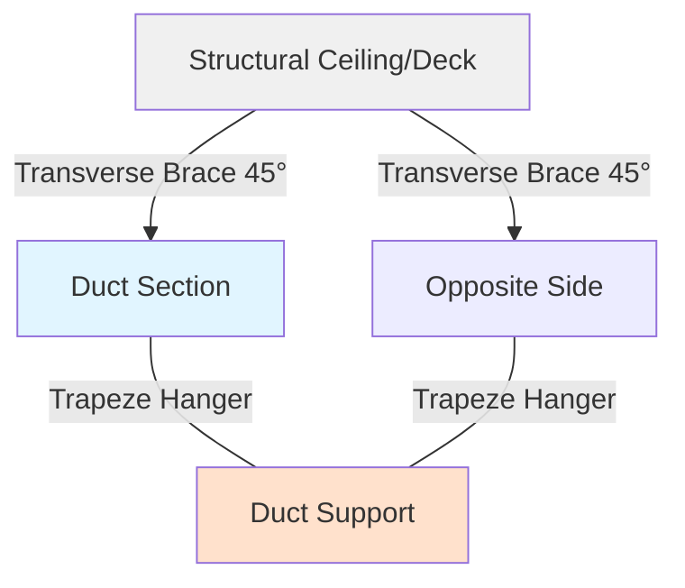
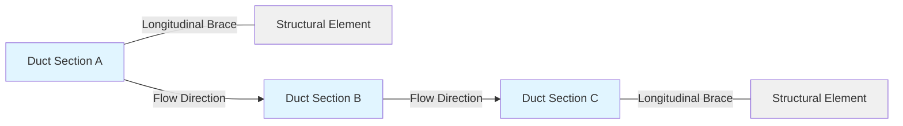

# Seismic Bracing for HVAC Ductwork Systems

Seismic bracing of HVAC ductwork is essential for maintaining system integrity and life safety during seismic events. Proper restraint prevents duct failure, maintains fire and smoke barrier integrity, and ensures continued operation of critical ventilation systems following earthquakes.

## Regulatory Framework

### Code Requirements

Seismic bracing for ductwork must comply with:

- **ASCE 7**: Minimum Design Loads and Associated Criteria for Buildings and Other Structures
- **International Building Code (IBC)**: Chapter 16, Structural Design
- **SMACNA Seismic Restraint Manual**: Industry standard for duct bracing design
- **NFPA 90A**: Installation of Air-Conditioning and Ventilating Systems

The IBC requires seismic restraints for all ductwork in Seismic Design Categories (SDC) C, D, E, and F. Some jurisdictions require bracing in SDC B for ducts exceeding specified sizes.

### Applicability Thresholds

Seismic bracing is typically required for:

- Ducts with dimensions greater than 6 inches (152 mm)
- Ducts with sheet metal thickness 26 gauge or heavier
- All ducts in essential facilities (hospitals, fire stations, emergency operations centers)
- Ducts serving fire/smoke dampers and life safety systems

## Seismic Force Calculations

The seismic design force for ductwork components is calculated using the following equation from ASCE 7:

$$F_p = \frac{0.4 a_p S_{DS} W_p}{R_p / I_p} \left(1 + 2\frac{z}{h}\right)$$

Where:

- $F_p$ = seismic design force (lb or N)
- $a_p$ = component amplification factor (2.5 for ductwork)
- $S_{DS}$ = design spectral response acceleration at short periods
- $W_p$ = component operating weight (lb or N)
- $R_p$ = component response modification factor (6.0 for ductwork)
- $I_p$ = component importance factor (1.0 or 1.5)
- $z$ = height of attachment point above grade
- $h$ = average roof height of structure

The design force is subject to maximum and minimum limits:

$$F_{p,max} = 1.6 S_{DS} I_p W_p$$

$$F_{p,min} = 0.3 S_{DS} I_p W_p$$

For rectangular duct, the weight per linear foot is:

$$W_d = \frac{t \cdot \rho \cdot P}{12}$$

Where:

- $t$ = sheet metal thickness (inches)
- $\rho$ = material density (490 lb/ft³ for galvanized steel)
- $P$ = duct perimeter (inches)

## Bracing Configurations

Seismic bracing for ductwork consists of two orthogonal components that work together to resist multi-directional seismic forces.

### Lateral Bracing

Lateral braces resist horizontal forces perpendicular to the duct longitudinal axis. These braces prevent side-to-side movement during ground motion.

**Lateral Bracing Requirements:**

- Minimum angle: 45° from horizontal (30° acceptable with engineering justification)
- Maximum spacing: See table below
- Braces must attach to structural elements capable of resisting design forces
- Four-way bracing (two opposing pairs) required for large ducts

### Longitudinal Bracing

Longitudinal braces resist forces parallel to the duct axis, preventing telescoping and end-to-end movement.

**Longitudinal Bracing Requirements:**

- Required at changes in direction (elbows, tees)
- Required at a maximum spacing along straight runs
- Must resist sliding forces and prevent accordion-type failure
- Braces typically positioned at 45° to duct axis

## Maximum Brace Spacing

SMACNA establishes maximum spacing based on duct size, seismic zone, and support configuration. The following table provides typical requirements:

| Duct Size (inches) | Weight (lb/ft) | Lateral Spacing (ft) | Longitudinal Spacing (ft) |
|-------------------|----------------|---------------------|--------------------------|
| 6 - 12 | < 10 | 40 | 80 |
| 13 - 24 | 10 - 20 | 30 | 60 |
| 25 - 36 | 20 - 35 | 24 | 48 |
| 37 - 60 | 35 - 75 | 20 | 40 |
| 61 - 96 | 75 - 150 | 15 | 30 |
| > 96 | > 150 | 12 | 24 |

**Notes:**
- Spacing measured along duct centerline
- Reduce spacing by 50% for Seismic Design Category E and F
- First brace within 4 feet of fan, elbow, or equipment connection
- Flexible connections required at equipment

## Brace Component Design

### Brace Member Sizing

The required cross-sectional area of brace members is:

$$A_{req} = \frac{F_p}{F_a \cos\theta}$$

Where:

- $A_{req}$ = required cross-sectional area (in²)
- $F_p$ = seismic design force (lb)
- $F_a$ = allowable stress for brace material (psi)
- $\theta$ = angle of brace from horizontal

For steel strut with $F_a = 20,000$ psi and typical 45° bracing:

$$A_{req} = \frac{F_p}{20,000 \times 0.707} = \frac{F_p}{14,140}$$

### Connection Design

All connections must develop the full strength of the brace member. Critical connection points include:

- **Duct attachment**: Use standoff brackets, not sheet metal screws
- **Structural attachment**: Drilled and tapped inserts, welded plates, or through-bolted connections
- **Brace-to-bracket connection**: Bolted with minimum 3/8-inch diameter bolts

## Installation Requirements

### Attachment to Structure

Braces must attach to structural elements capable of resisting seismic loads:

- **Concrete**: Drilled-in expansion anchors, adhesive anchors, or cast-in-place inserts
- **Steel**: Welded or bolted to beams, not to corrugated roof deck
- **Wood**: Through-bolted to framing members, not toe-nailed

**Prohibited attachments:**
- Suspended ceiling grid systems
- Non-structural partitions
- Roof deck without structural bracing
- Powder-actuated fasteners in tension applications

### Clearances and Flexibility

Maintain adequate clearance between ducts and structural elements:

- Minimum 1-inch clearance from rigid obstructions
- 2-inch minimum for ducts subject to thermal expansion
- Flexible connections at equipment to allow differential movement
- Seismic separation joints at building expansion joints

## Special Considerations

### Vibration Isolation Systems

Vibration-isolated ductwork requires special seismic restraints:

- Restraints installed outside isolation zone
- Snubbers limit displacement to 0.25 inches
- Restrained clearance of 0.5 inches for operational deflection

### Riser Ductwork

Vertical ducts require supplemental bracing:

- Lateral support every floor level
- Accommodation for inter-story drift
- Slide connections to allow vertical movement
- Bracing independent of fire/smoke dampers

### Pre-Engineered Systems

Several manufacturers offer pre-engineered seismic bracing systems with published load tables. These systems provide:

- Simplified design through load tables
- Factory-fabricated components
- Installation instructions
- Compliance documentation for inspection

When using proprietary systems, verify:
- ICC-ES evaluation report validity
- Load tables match project seismic parameters
- Installation follows manufacturer requirements
- Installers receive proper training

## Documentation and Inspection

Submittal documentation must include:

- Seismic design calculations with parameters ($S_{DS}$, $I_p$, etc.)
- Brace spacing schedule by duct section
- Connection details for typical and special conditions
- Product specifications for braces and attachments

Field inspection verifies:

- Brace spacing conforms to approved drawings
- Brace angles meet minimum requirements
- Connections develop full member capacity
- Structural attachments properly installed and torqued

---

**References:**
- SMACNA, *Seismic Restraint Manual: Guidelines for Mechanical Systems*, 3rd Edition
- ASCE 7-22, *Minimum Design Loads and Associated Criteria for Buildings and Other Structures*
- International Code Council, *International Building Code*
- Sheet Metal and Air Conditioning Contractors' National Association, *HVAC Systems Duct Design*, 4th Edition
