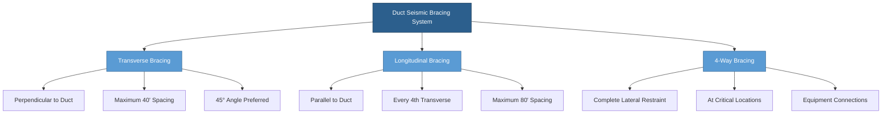
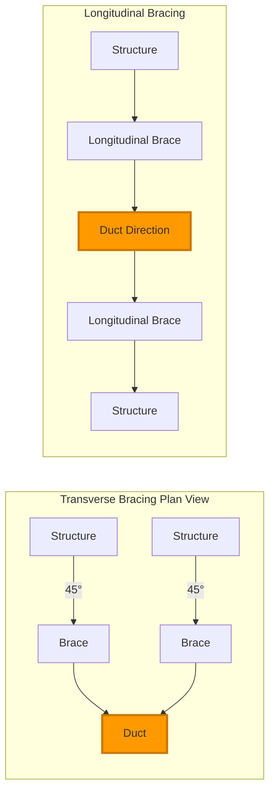

## Fundamental Bracing Orientations

Seismic bracing for ductwork requires restraint in two perpendicular horizontal directions to resist lateral forces during seismic events. **Transverse braces** resist forces perpendicular to the duct longitudinal axis, while **longitudinal braces** resist forces parallel to the duct run. SMACNA and ASCE 7 require both orientations for complete seismic protection.

### Transverse Bracing Requirements

Transverse braces prevent lateral movement perpendicular to the duct axis. These braces typically attach to the duct at 90° to the longitudinal centerline and transfer seismic loads to the building structure.

**Key design parameters:**
- Maximum spacing: 40 feet for ducts up to 8 square feet cross-section
- Maximum spacing: 30 feet for ducts 8-20 square feet
- Maximum spacing: 25 feet for ducts over 20 square feet
- Attachment within 6 feet of duct direction changes
- Braces at 45° angle (maximum 60°) to horizontal

### Longitudinal Bracing Requirements

Longitudinal braces resist axial movement along the duct run. These restraints prevent telescoping or accordion-like compression during seismic events.

**Spacing criteria:**
- Required at every fourth transverse brace location
- Maximum 80 feet spacing for ducts up to 8 square feet
- Maximum 60 feet spacing for ducts over 8 square feet
- Mandatory at changes in duct elevation
- Required near heavy equipment connections

## Seismic Force Calculations

The lateral seismic force for ductwork bracing design follows ASCE 7 provisions:

$$F_p = \frac{0.4 a_p S_{DS} W_p}{(R_p / I_p)} \left(1 + 2\frac{z}{h}\right)$$

Where:
- $F_p$ = seismic design force (lb)
- $a_p$ = component amplification factor (2.5 for ductwork)
- $S_{DS}$ = design spectral response acceleration
- $W_p$ = component operating weight (lb)
- $R_p$ = component response modification factor (6.0 for ductwork)
- $I_p$ = component importance factor (1.0 to 1.5)
- $z$ = height of attachment point above grade (ft)
- $h$ = average roof height of structure (ft)

**Force limits:**

$$F_{p,max} = 1.6 S_{DS} I_p W_p$$

$$F_{p,min} = 0.3 S_{DS} I_p W_p$$

The distributed load per linear foot of duct:

$$w_d = \frac{F_p}{L}$$

Where $L$ = spacing between braces (ft).

### Brace Load Distribution

Each transverse brace pair resists the tributary seismic load:

$$F_{brace} = \frac{w_d \cdot L}{2 \sin(\theta)}$$

Where $\theta$ = brace angle from horizontal (typically 45°).

For longitudinal braces carrying cumulative forces:

$$F_{long} = F_p \cdot n$$

Where $n$ = number of transverse brace intervals between longitudinal braces.

## Bracing Configuration Diagrams

## Combination Bracing Systems

Four-way bracing combines transverse and longitudinal restraint at single attachment points for optimal seismic performance.

### 4-Way Brace Locations

Install combination bracing at:
- Duct rises and drops
- Heavy equipment connections (fans, coils)
- Branch takeoffs from main trunks
- Locations where duct size changes
- Within 6 feet of seismic joints
- Both sides of building expansion joints

### Design Advantages

Combination bracing provides:
- Complete lateral restraint in all horizontal directions
- Reduced installation complexity
- Fewer ceiling penetrations
- Better load distribution
- Compliance with both transverse and longitudinal requirements

## Attachment and Connection Details

### Duct Attachment Methods

**Sheet metal ducts:**
- Welded or bolted steel angles
- Minimum 12-gauge steel straps
- Full perimeter of rectangular duct
- 180° wrap for round ducts over 28 inches

**Structural attachments:**
- Welded to steel structure
- Through-bolted to concrete (embedments or post-installed anchors)
- Minimum 3/8-inch diameter threaded rod
- Locking nuts or tack welds required

### Load Path Verification

The complete load path must transfer seismic forces:

1. Duct wall → duct attachment
2. Duct attachment → brace rod/cable
3. Brace rod → structural connection
4. Structural connection → building frame
5. Building frame → foundation

Each element must satisfy:

$$\text{Capacity} \geq 1.4 F_{brace}$$

The 1.4 factor accounts for material overstrength requirements per SMACNA.

## SMACNA Standard Compliance

SMACNA Guidelines for Seismic Restraint of Mechanical Systems establish minimum requirements:

**Brace sizing:**
- Minimum 1-1/4 inch diameter rod for braces under 30 feet
- Minimum 1-1/2 inch diameter rod for braces 30-40 feet
- Steel cables minimum 1/4 inch diameter (7×19 construction)
- Cable turnbuckles required for tensioning

**Quality requirements:**
- All-thread rod meeting ASTM A36 or better
- Grade 5 or better fasteners
- Factory-fabricated brace assemblies preferred
- Field welding by certified welders

**Documentation:**
- Shop drawings showing all brace locations
- Calculations stamped by licensed engineer
- Inspection and testing records
- Material certifications

## Installation Best Practices

### Field Verification

Before installation:
- Verify structural capacity at attachment points
- Confirm duct gauge meets design requirements
- Ensure adequate clearance for brace angles
- Identify conflicts with other systems
- Verify seismic joint locations

### Common Installation Errors

Avoid these deficiencies:
- Braces attached to non-structural elements
- Excessive brace angles (over 60° from horizontal)
- Missing or inadequate duct attachments
- Improperly sized rods or cables
- Loose connections without locking devices
- Bracing attached to sprinkler pipes or conduit

### Testing and Inspection

Post-installation verification:
- Visual inspection of all connections
- Torque verification on bolted connections
- Cable tension measurement
- Clearance verification at full seismic displacement
- Documentation photography

Seismic bracing represents critical life-safety infrastructure. Proper design and installation of transverse and longitudinal supports ensures ductwork remains functional after seismic events, maintaining building pressurization, smoke control, and critical ventilation systems.
